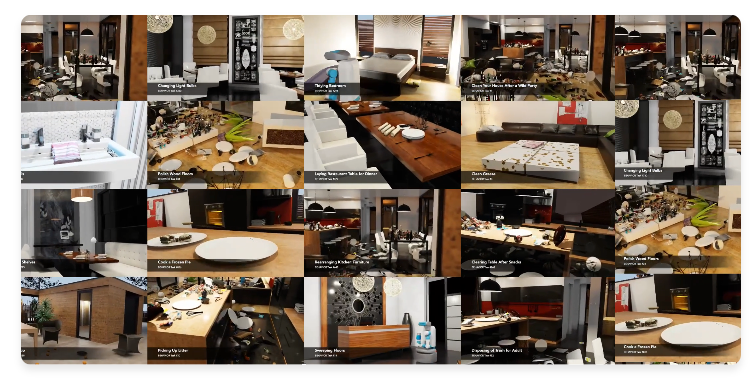

# 12.1 概览与评测协议

## 目标

本节先从整体上理解 BEHAVIOR-1K：它是什么、为什么比普通桌面操作 benchmark 更难，以及它通常如何评测 embodied agent 的能力。

读完本节后，你应该能够回答下面几个问题：

```text
BEHAVIOR-1K 是什么？
它和 RLBench、RoboTwin 这类操作 benchmark 有什么区别？
为什么 BEHAVIOR-1K 更强调长程任务和物体状态变化？
BDDL、OmniGibson、object states 分别在 benchmark 中起什么作用？
BEHAVIOR-1K 的 success 和 progress 应该怎么理解？
```

简单来说，BEHAVIOR-1K 是一个面向日常家务任务的 embodied AI benchmark。它主要关注 agent 能否在复杂家庭、餐厅、办公室等场景中，完成清理、整理、烹饪、摆放、打开容器、移动物体等长程活动。

这一节只建立总体框架；更具体的环境安装、BDDL 任务文件、场景物体状态和实际运行方式，会在后续小节中展开。


## BEHAVIOR-1K 是什么

BEHAVIOR-1K 可以理解为一个面向真实日常活动的机器人任务 benchmark。它的目标不是构造少量简单任务，而是尽量覆盖人们希望机器人帮助完成的日常家务活动。

它的整体结构可以概括为：

```text
BEHAVIOR-1K activities
-> BDDL task definitions
-> OmniGibson simulation
-> interactive scenes and objects
-> embodied agent execution
-> success / progress evaluation
```

其中：

| 组成 | 作用 |
| --- | --- |
| BEHAVIOR-1K activities | 定义 1000 个日常家务活动 |
| BDDL | 用逻辑条件描述任务初始状态和目标状态 |
| OmniGibson | 提供高真实度交互仿真环境 |
| Scenes | 提供房屋、餐厅、办公室等复杂场景 |
| Objects | 提供大量可交互物体 |
| Object states | 描述物体是否打开、装满、加热、清洁等状态 |
| Evaluation | 根据目标条件完成情况评估 agent 表现 |

可以把 BEHAVIOR-1K 看成一个更接近日常生活的 embodied AI 任务集合。它的核心不只是“控制机器人运动”，还包括理解场景、识别目标、改变物体状态，并完成多个步骤组成的任务。




图中展示了 BEHAVIOR-1K 中的多种日常室内场景和任务实例。可以看到，BEHAVIOR-1K 不只是简单的桌面抓取任务，而是覆盖卧室、餐厅、厨房、客厅等复杂环境，强调 agent 在真实日常活动中的长程执行、物体交互和状态变化能力。


## 为什么 BEHAVIOR-1K 更难

和一些桌面机械臂 benchmark 相比，BEHAVIOR-1K 的难点主要来自四个方面。

### 1. 任务更长程

很多 benchmark 的任务可以概括为：

```text
抓取一个物体
-> 放到目标位置
```

但 BEHAVIOR-1K 中的日常活动通常包含多个子目标。例如整理、清洁、烹饪这类任务，可能需要：

```text
找到目标物体
-> 打开容器
-> 移动物体
-> 改变物体状态
-> 检查目标条件是否满足
```

这意味着 agent 不能只学一个局部动作，还需要有任务规划能力和长程执行能力。

### 2. 场景更复杂

BEHAVIOR-1K 不只是在桌面上放几个物体，而是在完整室内场景中运行。场景中可能包含：

```text
房间
家具
容器
工具
食物
液体
可变形物体
大量可交互对象
```

因此，agent 需要在更大的空间中搜索目标，并处理遮挡、距离、导航和操作顺序等问题。

### 3. 物体状态更重要

在很多 manipulation benchmark 中，物体主要通过位置和姿态来描述。但在 BEHAVIOR-1K 中，物体状态本身就是任务目标的一部分。

例如：

```text
门是否打开
杯子是否装满
食物是否被加热
物体是否被清洁
表面是否被覆盖
布料是否被折叠或抓起
```

这类状态变化使任务更接近日常生活，也更难评测。

### 4. 评测不只是到达某个位置

在简单任务中，只要物体到达目标区域就算成功。但 BEHAVIOR-1K 需要判断多个目标条件是否满足。

例如一个任务可能要求：

```text
所有目标物体都在正确位置
某个容器处于打开状态
某些物体被清理干净
某个表面没有残留物
```

因此，BEHAVIOR-1K 的评测更依赖目标条件和任务进度，而不是单一的距离指标。


## Benchmark 的基本组成

BEHAVIOR-1K 的一个任务通常可以拆成下面几个层次：

```text
Activity
-> Task definition
-> Initial conditions
-> Goal conditions
-> Scene and objects
-> Agent actions
-> Task progress / success
```

对应关系如下：

| 概念 | 含义 |
| --- | --- |
| Activity | 一个日常活动，例如清理桌面、准备食物、整理物品 |
| Task definition | 任务定义文件，描述初始条件和目标条件 |
| Initial conditions | 任务开始时场景和物体应满足的条件 |
| Goal conditions | 任务完成时需要满足的目标条件 |
| Scene | 任务发生的环境，例如厨房、卧室、餐厅 |
| Object | 场景中的可交互物体 |
| Object state | 物体的语义或物理状态 |
| Agent | 在环境中执行动作的机器人或 embodied agent |
| Progress | 目标条件的完成程度 |
| Success | 任务是否完全完成 |

这样设计的好处是：任务不再只是“固定轨迹”，而是由状态条件定义。只要 agent 能把环境从初始状态变成目标状态，就可以认为它完成了任务。


## BDDL 的作用

BDDL 可以理解为 BEHAVIOR-1K 中的任务描述语言。它不是自然语言指令，而是一种更结构化的任务定义方式。

一个 BDDL 任务通常会描述：

```text
有哪些物体
任务开始时这些物体处于什么状态
任务完成时需要满足哪些目标条件
```

例如，一个整理任务可能不直接规定机器人每一步怎么走，而是规定：

```text
初始条件：物体散落在桌面上
目标条件：指定物体位于指定容器或区域中
```

这样做的好处是，benchmark 评测的是 agent 是否达成目标状态，而不是是否模仿某一条固定动作序列。

更详细的 BDDL 文件结构、predicate 和条件写法，会在第 12.3 节中展开。


## OmniGibson 的作用

OmniGibson 是 BEHAVIOR-1K 的底层仿真环境。它负责把 BDDL 定义的任务真正实例化成一个可交互的 3D 场景。

可以简单理解为：

```text
BDDL 负责定义任务
OmniGibson 负责运行任务
BEHAVIOR-1K 负责提供任务集合和评测协议
```

OmniGibson 需要支持更复杂的物理和视觉交互，例如：

```text
刚体物体
可变形物体
液体
透明物体
热状态
表面覆盖
容器开合
物体清洁程度
```

这些能力让 BEHAVIOR-1K 可以描述更接近真实家务活动的任务，而不是只停留在简单的抓取和放置。


## 评测协议：Success 和 Progress

BEHAVIOR-1K 的评测核心是判断 agent 是否完成任务目标。最直观的指标是 success，也就是任务是否成功完成。

可以简单写成：

```text
success = 1  所有目标条件满足
success = 0  任务没有完全完成
```

但是 BEHAVIOR-1K 中的任务往往比较长，可能包含多个目标条件。如果只看 success，很多中间进展会被忽略。因此还需要关注 progress。

可以这样理解：

```text
success 看最终是否完全完成
progress 看目标条件完成了多少
```

例如一个任务有 5 个目标条件：

```text
目标条件 1 已完成
目标条件 2 已完成
目标条件 3 未完成
目标条件 4 未完成
目标条件 5 未完成
```

那么这个 episode 虽然没有完全成功，但已经完成了一部分目标。progress 就能反映这种中间表现。

这对于长程 embodied AI 很重要，因为一个 agent 即使没有完成全部任务，也可能已经表现出一定的规划、导航或操作能力。


## 常见实验设置

BEHAVIOR-1K 中常见的实验设置可以分成三类。

### 1. 单任务评测

只选择一个 activity 进行测试，例如整理某类物体或完成某个厨房任务。

```text
一个任务
-> 多个 episode
-> 统计 success 和 progress
```

这种设置适合入门，因为任务范围小，debug 更容易。

### 2. 多任务评测

同时评测多个 activity，观察 agent 在不同任务类型上的泛化能力。

```text
多个任务
-> 每个任务分别评测
-> 汇总平均 success / progress
```

这种设置更接近 benchmark 的目标，但也更难，因为不同任务涉及的场景、物体和目标条件差异很大。

### 3. Challenge 设置

Challenge 设置通常会固定任务列表、评测规则、运行环境和提交格式。参赛者需要让 policy 在标准协议下完成任务，再根据官方指标比较结果。

这种设置强调可复现和公平比较，适合评估不同 embodied AI 方法在统一 benchmark 上的能力。


## 和其他 benchmark 的区别

为了避免混淆，可以把 BEHAVIOR-1K 和前面几个 benchmark 放在一起对比。

| Benchmark | 重点 | 适合理解什么 |
| --- | --- | --- |
| RLBench | 桌面机械臂操作、多视角 observation、expert demos | 机器人 manipulation benchmark 的基础接口 |
| RoboTwin 2.0 | 双臂操作、复杂资产、domain randomization | 现代双臂 VLA / policy 评测 |
| LIBERO | 语言条件操作、lifelong learning、任务泛化 | VLA / continual learning / language-conditioned manipulation |
| SimplerEnv | 面向真实机器人策略的 real-to-sim 评测 | 已有 VLA policy 的仿真测试 |
| BEHAVIOR-1K | 日常家务长程任务、复杂物体状态、BDDL 任务定义 | 长程 embodied AI、任务规划、状态推理和复杂评测协议 |


## 本节小结

BEHAVIOR-1K 是一个面向日常家务活动的 embodied AI benchmark。它的核心难点不只是机器人能否移动到某个位置，而是 agent 能否在复杂场景中理解任务目标、处理多种物体状态，并完成长程、多步骤的活动。

可以用一句话概括：

```text
BEHAVIOR-1K 用 BDDL 定义任务目标，用 OmniGibson 实例化可交互场景，并通过 success 和 progress 评估 agent 完成日常家务任务的能力。
```
