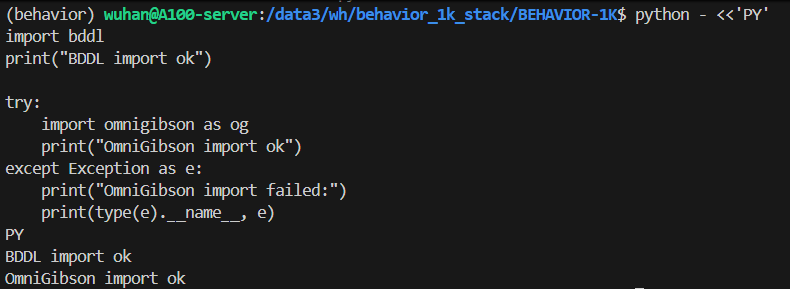

# 12.2 环境配置

## 目标

这一节介绍如何配置 BEHAVIOR-1K / OmniGibson 的运行环境。

可以把环境分成几层：

```text
NVIDIA Driver / GPU
-> Isaac Sim / Omniverse 相关依赖
-> OmniGibson
-> BDDL
-> BEHAVIOR-1K assets and tasks
-> policy / evaluation scripts
```

简单来说：

```text
OmniGibson 负责仿真
BDDL 负责任务定义
BEHAVIOR-1K 提供任务集合、资产和评测协议
```

本节目标是先完成最小可用环境配置，并跑通一个 smoke test。

## 官方安装方式

BEHAVIOR-1K 官方推荐使用仓库自带的 `setup.sh` 脚本安装。这个脚本会帮助安装 OmniGibson、BDDL、数据集和评测相关组件。

克隆仓库：

```bash
git clone https://github.com/StanfordVL/BEHAVIOR-1K.git
cd BEHAVIOR-1K
```

如果需要固定版本，可以在官方安装页面或 GitHub release 中选择对应 tag，再使用类似下面的方式克隆：

```bash
git clone -b <version_tag> https://github.com/StanfordVL/BEHAVIOR-1K.git
cd BEHAVIOR-1K
```

对于初学和复现来说，建议优先使用官方文档推荐的稳定版本，而不是随意使用最新开发分支。

下面给出一个例子:
```bash
git clone -b v3.7.2 https://github.com/StanfordVL/BEHAVIOR-1K.git
```

## 推荐目录结构

建议把 BEHAVIOR-1K 单独放在一个工作目录下，避免和其他机器人项目混在一起。

例如：

```bash
mkdir -p $HOME/behavior_1k_stack
cd $HOME/behavior_1k_stack

export BEHAVIOR_ROOT=$HOME/behavior_1k_stack
```

最终目录可以组织成：

```text
behavior_1k_stack/
├── BEHAVIOR-1K/
├── assets/
├── outputs/
└── notes/
```

其中：

| 目录 | 作用 |
| --- | --- |
| `BEHAVIOR-1K/` | 官方源码仓库 |
| `assets/` | 后续保存数据、资产或本地整理文件 |
| `outputs/` | 保存运行截图、日志、评测结果 |
| `notes/` | 保存个人实验记录 |

后续命令都默认在这个工作目录下执行。

## 系统要求

BEHAVIOR-1K / OmniGibson 对机器配置要求比普通 Python 项目高。运行前建议先确认 GPU 和驱动是否正常：

```bash
nvidia-smi
```

重点看：

```text
GPU 型号
显存大小
驱动是否正常
当前是否有其他进程占用
```

如果有多张 GPU，后续可以通过环境变量指定使用哪张卡：

```bash
export OMNIGIBSON_GPU_ID=0
```

如果 0 号 GPU 被占用，可以换成其他空闲编号。

## 克隆 BEHAVIOR-1K 仓库

进入工作目录：

```bash
cd $BEHAVIOR_ROOT
```

克隆仓库：

```bash
git clone https://github.com/StanfordVL/BEHAVIOR-1K.git
cd BEHAVIOR-1K
```

## 安装核心组件

BEHAVIOR-1K 官方提供统一安装脚本。对于入门学习，建议先安装核心组件：

```bash
./setup.sh --new-env --omnigibson --bddl --dataset
```

这条命令会创建新的 conda 环境，并安装：

```text
OmniGibson
BDDL
BEHAVIOR dataset / assets
```

安装完成后，激活环境：

```bash
conda activate behavior
```

如果只想在当前已有环境中安装，也可以省略 `--new-env`，但一般不建议初学者这么做。单独创建环境更容易排查依赖问题。

## 服务器无人值守安装

如果在远程机器上安装，脚本可能会要求确认 Conda TOS、NVIDIA Isaac Sim EULA 和 BEHAVIOR Dataset License。官方安装脚本提供了自动确认参数：

```bash
./setup.sh --new-env --omnigibson --bddl --dataset \
  --accept-conda-tos \
  --accept-nvidia-eula \
  --accept-dataset-tos
```

这些参数表示你已经接受对应协议。正式使用前应先阅读相关许可说明。

## 可选：安装完整组件

如果后续要使用 teleoperation、evaluation、action primitives 等功能，可以安装完整组件：

```bash
./setup.sh --new-env --omnigibson --bddl --joylo --dataset --eval --primitives
```

不过对于入门学习，建议先不要一开始安装全部组件。完整安装更耗时，也更容易遇到 CUDA、CuRobo 或依赖冲突问题。

推荐顺序是：

```text
先安装核心组件：omnigibson + bddl + dataset
-> 跑通 smoke test
-> 再按需要安装 eval / primitives / joylo
```

## 检查 Python 包是否可导入

激活环境后，先检查核心包：

```bash
conda activate behavior

python - <<'PY'
import omnigibson as og
import bddl

print("OmniGibson import ok")
print("BDDL import ok")
PY
```

第一次导入 OmniGibson 可能比较慢，因为 Isaac Sim / Omniverse 相关组件需要初始化。只要没有明确报错，可以等待一段时间。



图中展示了 `bddl` 和 `omnigibson` 成功导入的结果，说明 BEHAVIOR-1K 的核心 Python 组件已经安装完成。需要注意的是，import 成功只能说明代码层可用，后续还需要继续检查 robot assets、scene assets 和仿真 demo 是否能够正常加载。

## Smoke test：运行官方 quickstart demo

官方示例中提供了机器人控制 demo，可以作为最小 smoke test：

```bash
python -m omnigibson.examples.robots.robot_control_example --quickstart
```

这个 demo 用于验证 OmniGibson 能否正常启动、加载场景和机器人，并进行基本交互。

如果是在有图形界面的机器上，通常会看到仿真窗口。  
如果是在远程服务器上，可能还需要远程桌面、Omniverse Streaming 或其他图形显示方式。

## Smoke test：场景选择 demo

也可以运行场景浏览示例：

```bash
python -m omnigibson.examples.scenes.scene_selector
```

这个示例用于检查场景和资产是否能被正确加载。

如果它能够打开场景并显示物体，说明：

```text
OmniGibson 可以启动
场景资产可以被找到
渲染和交互基本正常
```

## 常见问题 1：第一次启动很慢

第一次运行 OmniGibson 时，可能会卡住一段时间。这通常是 Isaac Sim / Omniverse 相关组件在初始化。

如果终端没有明确报错，可以先等待几分钟。后续再次运行通常会快一些。

## 常见问题 2：GPU 选择错误

如果机器上有多张 GPU，而 OmniGibson 默认使用的 GPU 不合适，可能出现渲染器创建失败、显存不足等问题。

可以先查看 GPU：

```bash
nvidia-smi
```

然后指定 GPU：

```bash
export OMNIGIBSON_GPU_ID=0
```

如果 0 号 GPU 被占用，可以换成其他空闲编号：

```bash
export OMNIGIBSON_GPU_ID=1
```

再重新运行：

```bash
python -m omnigibson.examples.robots.robot_control_example --quickstart
```

## 常见问题 3：CuRobo / primitives 安装失败

如果安装 `--primitives` 时出现 CuRobo 或 CUDA 编译相关问题，可以先跳过 primitives，只安装核心组件：

```bash
./setup.sh --new-env --omnigibson --bddl --dataset
```

等核心环境跑通后，再单独处理 primitives：

```bash
conda activate behavior
./setup.sh --omnigibson --bddl --primitives
```

如果后续确实需要 CuRobo，可能还需要配置 CUDA Toolkit 和相关环境变量。对于初学阶段，不建议一开始就把这部分作为必须项。

## 常见问题 4：远程运行的图形显示问题

BEHAVIOR-1K / OmniGibson 依赖 Isaac Sim 和 GPU 渲染。它不像普通命令行程序那样轻量，因此远程机器上可能遇到图形显示或渲染问题。

如果只是学习代码结构，可以先完成：

```text
仓库 clone
setup.sh 安装
Python import 检查
查看 BDDL 文件
查看 examples
```

如果要真正运行可视化仿真，则可能需要：

```text
远程桌面
Omniverse Streaming
可用的 GPU 渲染环境
正确的 NVIDIA Driver
```


## 本节小结

BEHAVIOR-1K 的环境配置可以概括为：

```text
准备 GPU 和系统环境
-> clone BEHAVIOR-1K 仓库
-> 使用 setup.sh 安装 OmniGibson、BDDL 和 dataset
-> 激活 behavior 环境
-> 检查 import
-> 运行官方 quickstart demo
```
