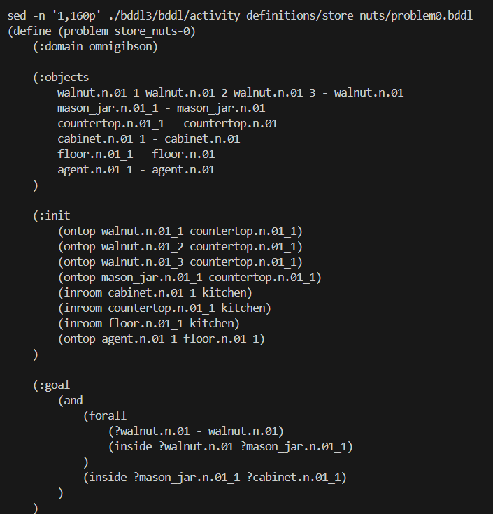

# 12.3 BDDL 任务定义

## 目标

前面已经从整体上了解了 BEHAVIOR-1K，也知道它依赖 OmniGibson 来运行复杂家务任务。接下来要理解一个很关键的问题：这些任务到底是怎么被定义出来的？

在 BEHAVIOR-1K 中，任务不是简单写成一句自然语言，例如：

```text
clean the table
put the objects into the basket
prepare a meal
```

而是会进一步用 BDDL 描述任务需要哪些物体、开始时是什么状态、完成时应该满足什么目标条件。

读完本节后，你应该能够回答下面几个问题：

```text
BDDL 是什么？
为什么 BEHAVIOR-1K 需要 BDDL？
一个 BDDL 任务一般由哪些部分组成？
initial conditions 和 goal conditions 分别是什么意思？
为什么 BDDL 不直接告诉机器人每一步怎么做？
```

## BDDL 是什么

BDDL 全称是 Behavior Domain Definition Language，可以理解为 BEHAVIOR-1K 中用来描述任务的语言。

它的作用不是控制机器人动作，而是定义任务目标。

更直观地说，BDDL 不会写：

```text
先走到桌子旁边
再抓起杯子
再移动到水槽
再放下杯子
```

它更像是在写：

```text
任务开始时，哪些物体在哪里
任务完成时，哪些条件必须满足
```

也就是说，BDDL 关心的是：

```text
环境开始是什么样
环境结束应该变成什么样
```

机器人或者 embodied agent 要自己想办法从初始状态走到目标状态。

## 为什么需要 BDDL

BEHAVIOR-1K 面向的是日常家务任务。很多任务不是一步动作就能完成，而是由多个子目标组成。

比如“把蜡烛放进篮子”这种任务，如果只用自然语言描述，计算机很难直接判断任务是否完成。BDDL 会把它转成更明确的目标条件，例如：

```text
目标物体：candle
目标容器：basket
目标关系：candle inside basket
```

这样仿真环境就可以检查：

```text
蜡烛是否真的在篮子里面？
如果是，任务完成
如果不是，任务还没完成
```

所以 BDDL 的核心作用是把模糊的自然语言任务，变成机器可以检查的逻辑条件。

## 一个任务通常包含什么

一个 BEHAVIOR-1K 任务一般可以拆成三部分：

| 部分 | 含义 |
| --- | --- |
| Object list | 这个任务涉及哪些物体 |
| Initial conditions | 任务开始时环境需要满足什么状态 |
| Goal conditions | 任务完成时环境需要满足什么状态 |

可以简单理解成：

```text
Object list：任务里有什么
Initial conditions：一开始是什么样
Goal conditions：最后要变成什么样
```

例如一个简单任务可以这样理解：

```text
任务：把蜡烛放进篮子

Object list:
  - candle
  - wicker basket

Initial conditions:
  - candle 在桌子上
  - basket 在房间里

Goal conditions:
  - candle 在 basket 里面
```

这里最关键的是 goal conditions，因为评测时要判断 agent 是否完成任务，主要就是看这些目标条件有没有被满足。

## Initial conditions：初始条件

Initial conditions 表示任务开始时，场景和物体应该满足的状态。

例如：

```text
杯子在桌子上
抽屉是关闭的
苹果在盘子旁边
篮子是空的
机器人手里没有抓东西
```

这些条件决定了任务开始时的环境布局。

它的作用是让同一个任务可以有比较稳定的起点。如果初始状态完全随机，任务可能变得不可控；如果初始状态太固定，又会让 agent 只记住一种情况。

所以 initial conditions 可以理解为：

```text
给任务设置一个合理的起点
```

## Goal conditions：目标条件

Goal conditions 表示任务完成时必须满足的条件。

例如：

```text
杯子在水槽里
蜡烛在篮子里
抽屉处于打开状态
桌面上的垃圾被清理掉
目标物体被放到指定区域
```

这些条件用于判断任务是否成功。

可以这样理解：

```text
initial conditions 决定任务从哪里开始
goal conditions 决定任务什么时候算完成
```

对于 BEHAVIOR-1K 来说，一个任务可能有多个 goal conditions。只有这些目标条件都满足时，任务才算完全成功。

## Predicate：条件的基本表达方式

BDDL 中经常会出现 predicate，可以把它理解成“判断某个关系或状态是否成立”。

例如：

```text
inside(candle, basket)
```

意思是：

```text
蜡烛是否在篮子里面
```

再比如：

```text
ontop(cup, table)
```

意思是：

```text
杯子是否在桌子上
```

对于初学者来说，不需要一开始记住所有 predicate，只需要知道：

```text
predicate 是 BDDL 用来描述物体关系和物体状态的基本单位
```

常见 predicate 可以大致分成两类：

| 类型 | 例子 | 含义 |
| --- | --- | --- |
| 空间关系 | `inside`、`ontop`、`nextto` | 描述物体之间的位置关系 |
| 状态关系 | `open`、`cooked`、`filled`、`covered` | 描述物体自身或物体表面的状态 |

后面讲 object states 时，会继续解释这些状态为什么重要。

## BDDL 不是什么

为了避免误解，需要特别说明：BDDL 不是 policy，也不是动作脚本。

BDDL 不会告诉机器人：

```text
第一步怎么走
第二步抓哪个点
第三步用多大力
第四步怎么避障
```

它只告诉环境：

```text
任务开始时应该满足什么
任务结束时应该满足什么
```

所以 BDDL 更像是“任务说明书”，而不是“机器人控制程序”。

可以用下面这张表区分：

| 内容 | 是否由 BDDL 负责 |
| --- | --- |
| 定义任务涉及哪些物体 | 是 |
| 定义任务初始状态 | 是 |
| 定义任务目标状态 | 是 |
| 判断任务是否完成 | 是 |
| 控制机器人每一步动作 | 否 |
| 训练 policy | 否 |
| 输出动作 action | 否 |

这也是 BEHAVIOR-1K 和普通机器人控制代码的区别：任务目标由 BDDL 定义，但完成任务的过程要交给 agent 或 policy。

## 如何查看一个 BDDL 文件

安装好 BEHAVIOR-1K 后，可以在仓库中查找 `.bddl` 文件：

```bash
cd $BEHAVIOR_ROOT/BEHAVIOR-1K

find . -name "*.bddl" | head
```

找到文件后，可以用 `sed` 或编辑器打开：

```bash
sed -n '1,120p' path/to/task_file.bddl
```

也可以用 VS Code 打开对应文件，观察它大致包含哪些部分。

初学时不用急着完全看懂每一行，建议先找下面几个关键词：

```text
objects
init
goal
```

它们通常对应：

```text
任务物体
初始条件
目标条件
```



图中展示了一个真实的 `.bddl` 任务文件。阅读这类文件时，可以先关注对象列表、初始条件和目标条件：对象列表说明任务涉及哪些物体，初始条件说明任务开始时环境是什么状态，目标条件说明任务完成时需要满足什么条件。

## 阅读 BDDL 文件的顺序

第一次看 BDDL 文件时，可以按下面顺序读：

```text
先看任务名
-> 再看涉及哪些物体
-> 再看初始条件
-> 最后看目标条件
```

不要一开始就逐行分析所有 predicate。先回答几个简单问题就够了：

```text
这个任务让 agent 做什么？
任务里有哪些关键物体？
一开始这些物体在哪里？
最后这些物体应该变成什么状态？
```

例如看到一个任务文件时，可以用这种方式理解：

| 问题 | 你要看的内容 |
| --- | --- |
| 任务目标是什么 | 文件名和 goal conditions |
| 涉及哪些物体 | object list |
| 任务从哪里开始 | initial conditions |
| 怎么判断完成 | goal conditions |
| 是否涉及复杂状态 | 是否出现 open、filled、cooked、covered 等 predicate |

## BDDL 和自然语言任务的关系

BEHAVIOR-1K 的任务通常来源于人类日常活动，但自然语言描述太模糊，不适合直接评测。

例如自然语言可以说：

```text
整理桌面
```

但对仿真器来说，这句话不够精确。什么叫“整理好”？哪些物体要移动？移动到哪里才算完成？

BDDL 会把它变得更具体：

```text
哪些物体需要被移动
这些物体最后应该在哪里
哪些状态需要改变
所有目标条件是否满足
```

因此，自然语言更适合给人理解任务，而 BDDL 更适合让仿真环境判断任务是否完成。

可以这样理解：

```text
自然语言：给人看的任务描述
BDDL：给仿真器和评测程序看的任务定义
```

## 一个简化例子

下面用一个非常简化的例子帮助理解。真实 BDDL 文件会更复杂，但核心思想类似。

```text
任务：把蜡烛放进篮子

objects:
  candle
  wicker_basket
  table

initial conditions:
  candle ontop table
  wicker_basket on floor

goal conditions:
  candle inside wicker_basket
```

这个任务没有规定机器人怎么移动，也没有规定抓取路径。它只定义了：

```text
一开始：蜡烛在桌子上
最后：蜡烛在篮子里
```

至于机器人如何完成这个变化，就属于 policy、planner 或 agent 的工作。

## BDDL 为什么适合长程任务

BEHAVIOR-1K 的任务往往不是一个动作，而是一串动作。比如：

```text
打开柜门
取出物体
移动到桌面
放到指定位置
关闭柜门
```

如果用固定轨迹描述，这类任务会非常死板，也很难泛化。

BDDL 的好处是：它只关心最终目标状态，不强制规定中间路径。

也就是说，同一个任务可以有多种完成方式：

```text
路径 A：先拿杯子，再拿盘子
路径 B：先拿盘子，再拿杯子
路径 C：先整理桌面，再放目标物体
```

只要最后 goal conditions 满足，就可以认为任务完成。

这使得 BEHAVIOR-1K 更适合研究：

```text
任务规划
长程决策
物体状态推理
多步骤操作
embodied agent 评测
```

## 常见误区

### 1. 以为 BDDL 是自然语言指令

BDDL 不是给大模型直接读的自然语言指令，而是更结构化的任务定义。它的主要作用是让环境知道任务目标和评测条件。

### 2. 以为 BDDL 会告诉机器人怎么做

BDDL 不包含动作步骤。它只定义初始状态和目标状态，不负责控制机器人。

### 3. 只看任务名字，不看 goal conditions

任务名字可能很简短，但真正决定任务是否完成的是 goal conditions。阅读任务时一定要看目标条件。

### 4. 忽略 object states

BEHAVIOR-1K 的很多任务不只是移动物体，还涉及物体状态变化。例如打开、关闭、装满、清洁、覆盖、加热等。这些状态通常会出现在目标条件中。

## 本节小结

BDDL 是 BEHAVIOR-1K 中定义任务的关键工具。它把日常家务活动转成机器可以检查的逻辑条件。

可以用一句话概括：

```text
BDDL 不告诉机器人怎么做，而是告诉环境任务从什么状态开始，以及最后应该满足什么目标状态。
```

理解 BDDL 后，下一节就可以继续看 BEHAVIOR-1K 中的场景、物体和 object states。因为 BDDL 中的很多目标条件，最终都要通过物体位置、物体关系和物体状态来判断是否成立。