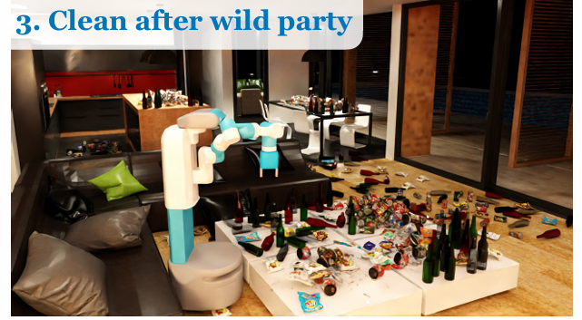
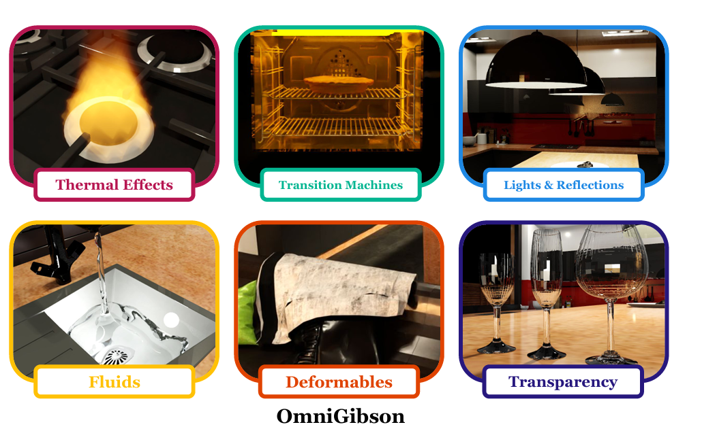
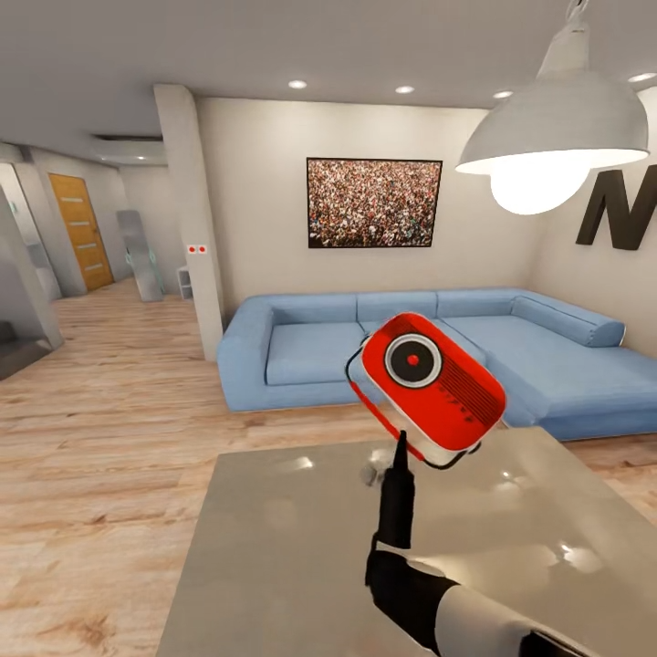

# 12.4 场景、物体与状态

## 目标

前面一节介绍了 BDDL 如何定义任务。接下来要理解的是：BDDL 中提到的物体和状态，最终会在 OmniGibson 中变成什么。

在 BEHAVIOR-1K 中，一个任务不是发生在空白环境里，而是发生在具体的室内场景中。场景里有家具、容器、工具、食物、可交互物体，物体之间还会有位置关系和状态变化。

读完本节后，你应该能够回答下面几个问题：

```text
Scene 是什么？
Object 是什么？
Object state 是什么？
为什么 BEHAVIOR-1K 比普通抓取任务更强调物体状态？
物体的 open、inside、filled、cooked 等状态和任务完成有什么关系？
```

## Scene：任务发生的地方

`Scene` 可以理解为任务发生的 3D 环境。

在普通桌面操作 benchmark 中，场景可能只是一个桌面加几个物体。但在 BEHAVIOR-1K 中，场景更接近日常生活空间，例如：

```text
厨房
客厅
卧室
浴室
餐厅
办公室
花园
```

这些场景中会包含大量物体，例如桌子、柜子、抽屉、杯子、盘子、食物、清洁工具等。Agent 需要在这些复杂环境中找到目标物体，并完成任务。

可以简单理解为：

```text
Scene = 任务发生的房间或环境
```




图中展示了一个典型的 BEHAVIOR-1K 日常家务任务场景。场景中不仅包含机器人和家具，还包含大量散落的瓶子、包装袋、杂物等可交互物体。这样的任务不只是简单的抓取放置，而是要求 agent 在复杂环境中识别目标物体、理解物体关系，并逐步改变场景状态。

## Object：场景中的可交互物体

`Object` 表示场景中的物体。它们是 agent 需要观察、移动、打开、关闭、放置或改变状态的对象。

常见物体包括：

```text
cup
plate
bowl
basket
drawer
cabinet
sink
table
apple
knife
towel
```

在 BEHAVIOR-1K 中，物体不是只作为背景存在，而是任务的核心组成部分。很多任务都要求 agent 对物体进行操作，例如：

```text
把杯子放进水槽
打开抽屉
把毛巾放到桌子上
把水果放进篮子
清理桌面上的物体
```

可以简单理解为：

```text
Object = agent 可以观察或操作的实体
```

## 物体关系：物体在哪里

很多任务需要判断物体之间的位置关系。例如：

```text
杯子在桌子上
苹果在盘子里
毛巾在篮子里
书在柜子旁边
```

这些关系通常会出现在任务目标中。

常见的空间关系可以这样理解：

| 关系 | 直观含义 |
| --- | --- |
| `ontop` | 一个物体在另一个物体上面 |
| `inside` | 一个物体在另一个容器里面 |
| `under` | 一个物体在另一个物体下面 |
| `nextto` | 一个物体在另一个物体旁边 |

例如：

```text
inside(apple, basket)
```

表示：

```text
苹果在篮子里面
```

这类关系很重要，因为很多家务任务本质上就是改变物体之间的位置关系：

```text
原来：apple 在 table 上
目标：apple 在 basket 里
```

Agent 完成任务的过程，就是让场景从初始关系变成目标关系。

## Object State：物体状态

除了位置关系，BEHAVIOR-1K 还强调物体状态。

物体状态描述的是：

```text
物体现在处于什么状态
```

例如：

```text
抽屉是否打开
杯子是否装满
食物是否被加热
物体是否干净
表面是否被覆盖
毛巾是否湿了
```

这些状态在普通抓取任务中不一定重要，但在日常家务任务中非常关键。

例如下面两个任务看起来都和杯子有关，但目标完全不同：

```text
把杯子放到桌子上
把杯子装满水
```

第一个任务主要改变位置关系；第二个任务主要改变物体状态。

所以在 BEHAVIOR-1K 中，agent 不仅要知道“物体在哪里”，还要知道“物体变成了什么状态”。

## 常见 Object States

入门阶段可以先理解下面几类状态。

| 状态类型 | 例子 | 含义 |
| --- | --- | --- |
| 开合状态 | `open`、`closed` | 门、抽屉、柜子是否打开 |
| 容纳状态 | `filled`、`empty` | 杯子、碗、容器是否装有东西 |
| 温度状态 | `hot`、`cooked` | 食物或物体是否被加热、烹饪 |
| 清洁状态 | `clean`、`dirty` | 物体是否干净 |
| 覆盖状态 | `covered` | 某个表面是否被东西覆盖 |
| 湿润状态 | `wet`、`soaked` | 物体是否被液体弄湿 |
| 空间关系 | `inside`、`ontop` | 一个物体和另一个物体的位置关系 |

这些状态让 BEHAVIOR-1K 能够描述更接近日常生活的任务。

例如：

```text
打开柜子
装满杯子
清洁桌面
加热食物
把物体放进容器
```

都不只是简单的移动物体，而是涉及状态变化。



图中展示了 OmniGibson 对复杂物理和视觉现象的支持，包括热效应、液体、可变形物体、透明物体、光照反射和状态转移等。这些能力使 BEHAVIOR-1K 能够描述更接近日常生活的任务，而不仅仅是简单的抓取和放置。

## 为什么物体状态很重要

在桌面机械臂任务中，常见目标是：

```text
把物体移动到某个位置
```

但在日常家务任务中，很多目标不能只用位置描述。例如：

```text
清洗杯子
煮熟食物
装满水壶
打开抽屉
擦干桌子
```

这些任务真正关心的是状态是否改变。

比如“打开抽屉”这个任务，判断成功的关键不是机械臂移动到了哪里，而是：

```text
抽屉是否处于打开状态
```


因此，object state 是 BEHAVIOR-1K 区别于简单抓取 benchmark 的关键。

## Scene、Object 和 State 的关系

可以把三者关系理解成：

```text
Scene 里面有很多 Object
Object 有位置、姿态和状态
Task 通过改变 Object 的关系和状态来完成
```

例如一个厨房场景中可能有：

```text
Scene: kitchen
Objects: cup, sink, cabinet, table
States:
  cup inside sink
  cabinet open
  cup filled
```

任务执行前后，场景状态会发生变化：

```text
任务开始：
  cup ontop table
  cabinet closed
  cup empty

任务完成：
  cup inside sink
  cabinet open
  cup filled
```

Agent 的目标就是通过行动改变这些关系和状态。

## 和 BDDL 的关系

上一节讲过，BDDL 用来描述任务初始条件和目标条件。

这些条件最终往往会落到：

```text
物体关系
物体状态
场景约束
```

例如 BDDL 中可能会表达：

```text
cup ontop table
apple inside basket
drawer open
```

这些条件不是抽象文字，而是需要 OmniGibson 在场景中真实检查的状态。

可以这样理解：

```text
BDDL 写任务条件
OmniGibson 检查场景里的物体关系和状态
Agent 通过动作改变这些状态
```

所以理解 object states，有助于理解 BEHAVIOR-1K 为什么可以评测复杂家务任务。

## 一个简单例子

以“把苹果放进篮子”为例。

任务开始时：

```text
apple ontop table
basket on floor
```

任务目标是：

```text
apple inside basket
```

这个任务主要考察空间关系变化。

再看一个稍微复杂的任务：“把杯子装满水”。

任务开始时：

```text
cup empty
cup ontop table
```

任务目标可能是：

```text
cup filled
```

这个任务考察的不只是杯子的位置，还包括杯子的状态是否变成了 filled。

所以 BEHAVIOR-1K 的任务可以分为两类：

| 类型 | 例子 | 主要考察 |
| --- | --- | --- |
| 位置关系任务 | 把苹果放进篮子 | 物体移动和放置 |
| 状态变化任务 | 把杯子装满水、打开抽屉 | 物体状态改变 |
| 混合任务 | 打开柜子并把物体放进去 | 位置关系 + 状态变化 |

很多真实家务任务都是混合任务。

## 如何在代码里查看场景和物体

安装好 BEHAVIOR-1K 后，可以先查看仓库中的示例和数据目录。

进入仓库：

```bash
cd $BEHAVIOR_ROOT/BEHAVIOR-1K
```

查看 OmniGibson 示例：

```bash
find omnigibson/examples -maxdepth 2 -type f | head -30
```

查看和 object states 相关的示例：

```bash
find omnigibson/examples -type f | grep -i state | head
```

查看和 scenes 相关的示例：

```bash
find omnigibson/examples -type f | grep -i scene | head
```

这些示例可以帮助你理解：

```text
如何加载场景
如何添加物体
如何读取物体状态
如何运行仿真
```

入门时不需要马上改代码，先看示例文件名和目录结构即可。

## 任务场景示例


这是 BEHAVIOR-1K 中的一个任务场景示例。可以看到，agent 处在一个具有完整室内布局的日常环境中，场景中包含家具、灯具、墙面、桌面以及可交互物体。和简单桌面操作任务不同，BEHAVIOR-1K 更强调 agent 在真实生活场景中的感知、导航和连续交互能力。

## 常见误区

### 1. 以为物体只是视觉背景

在 BEHAVIOR-1K 中，物体不是背景，而是任务目标的一部分。Agent 需要移动物体、打开物体、改变物体状态。

### 2. 只关注机器人动作，不关注状态变化

很多任务不是看机器人移动得是否像人，而是看最终状态是否满足目标条件。

例如“打开抽屉”真正关心的是抽屉是否打开，而不是机械臂具体走了哪条轨迹。

### 3. 把位置关系和物体状态混在一起

`inside`、`ontop` 更像是物体之间的空间关系；`open`、`filled`、`cooked` 更像是物体自身或物体内容的状态。两者都重要，但含义不同。

### 4. 以为所有任务都只是抓取放置

BEHAVIOR-1K 的任务范围更广，很多任务涉及清洁、整理、烹饪、开合、容器、液体和柔性物体等复杂交互。

## 本节小结

BEHAVIOR-1K 中的任务发生在具体场景里，场景由大量可交互物体组成，而物体不仅有位置和姿态，还有各种状态。

可以用一句话概括：

```text
Scene 提供任务环境，
Object 是可交互实体，
Object State 描述物体关系和状态变化；
BEHAVIOR-1K 通过这些状态来定义和评测复杂家务任务。
```

理解场景、物体和状态之后，下一节就可以继续看如何真正运行一个任务，以及 agent 能从环境中读到哪些 observation。