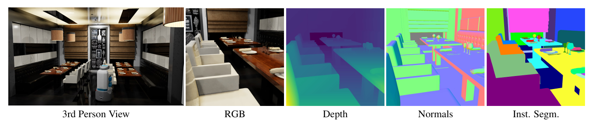

# 12.5 运行任务与观测空间

## 目标

前面几节已经介绍了 BEHAVIOR-1K 的整体概念、BDDL 任务定义，以及场景、物体和物体状态。接下来要看的是：一个任务真正运行起来以后，agent 和环境之间是怎样交互的。

读完本节后，你应该能够回答下面几个问题：

```text
Environment 是什么？
reset() 做了什么？
observation 里通常包含什么？
agent 的 action 是怎么送进环境的？
step(action) 之后环境会返回什么？
为什么具身智能任务一定要做闭环交互？
```

这一节不讨论复杂 policy 训练，也不要求你马上写一个完整智能体。重点是先看懂最基本的运行流程：

```text
创建环境
-> reset 任务
-> 得到 observation
-> agent 输出 action
-> step 推进环境
-> 得到新的 observation 和任务反馈
```

## Environment：任务运行的入口

在 OmniGibson / BEHAVIOR-1K 中，`Environment` 可以理解为整个任务运行的入口。

它通常包含几类东西：

| 组成 | 作用 |
| --- | --- |
| Scene | 任务发生的场景，例如厨房、房间、餐厅 |
| Robot | 在环境中执行动作的机器人 |
| Task | 当前要完成的任务 |
| Objects | 场景中的可交互物体 |
| Sensors | 机器人或环境中的观测传感器 |
| Simulator | 底层物理仿真和渲染系统 |

可以把 `Environment` 理解成：

```text
Environment = 场景 + 机器人 + 任务 + 物体 + 传感器 + 仿真器
```

对于学习具身智能来说，`Environment` 很重要，因为 agent 不是在静态图片上做分类，而是在一个会变化的环境中不断行动。

## 基本交互流程

一个最基本的环境交互流程是：

```text
env.reset()
-> agent 看到 observation
-> agent 选择 action
-> env.step(action)
-> 环境更新
-> 返回新的 observation、reward、done、info
```

可以写成伪代码：

```python
obs, info = env.reset()

for t in range(max_steps):
    action = policy(obs)
    obs, reward, terminated, truncated, info = env.step(action)

    if terminated or truncated:
        break
```

这条流程是理解具身智能最基础的一步。

它和普通图像分类任务最大的区别是：

```text
图像分类：输入一张图片，输出一个类别
具身智能：输入当前观测，输出动作，动作会改变下一步看到的世界
```

所以具身智能任务必须考虑“行动之后环境会发生什么”。

## reset：任务从哪里开始

`reset()` 表示重新开始一个 episode。

它通常会做几件事：

```text
加载或重置场景
放置机器人
放置任务相关物体
设置物体初始状态
初始化任务目标
返回第一步 observation
```

在 BEHAVIOR-1K 中，`reset()` 不只是把机器人位置清零。它还和 BDDL 中的 initial conditions 有关系：任务开始时，场景和物体需要满足某些初始条件。

例如一个整理任务，reset 后可能需要满足：

```text
目标物体散落在桌面上
容器在指定区域
机器人处于初始位置
任务目标已经加载
```

所以 `reset()` 可以理解为：

```text
把环境恢复到一次任务开始时的状态
```

## observation：agent 能看到什么

`observation` 是环境返回给 agent 的信息。Agent 只能根据 observation 来判断当前情况，并决定下一步动作。

在 BEHAVIOR-1K / OmniGibson 中，observation 可能包含：

| 类型 | 例子 | 含义 |
| --- | --- | --- |
| RGB 图像 | camera rgb | 机器人或环境相机看到的彩色图像 |
| 深度图 | depth | 每个像素到相机的距离 |
| 分割图 | segmentation | 哪些像素属于哪个物体或区域 |
| 点云 | point cloud | 三维空间中的观测点 |
| 机器人状态 | proprioception | 机器人关节、底盘、夹爪等自身状态 |
| 任务状态 | task low_dim | 和当前任务目标相关的低维信息 |

对于入门来说，可以先把 observation 分成两大类：

```text
视觉观测：图像、深度、分割、点云
自身状态：机器人关节、夹爪、底盘位置等
```

前者告诉 agent “外面的世界是什么样”，后者告诉 agent “自己现在是什么状态”。



图中展示了 OmniGibson 提供的多种视觉观测形式，包括第三人称视角、机器人视角 RGB 图像、深度图、法向图和实例分割图。这些视觉模态可以帮助 agent 理解场景结构、物体位置和可交互区域，是 BEHAVIOR-1K 中 policy 感知输入的重要组成部分。


## 机器人自身状态

除了看外部世界，agent 还需要知道自己当前的状态。

例如：

```text
机械臂关节角度
夹爪是否打开
底盘位置
末端执行器位置
机器人是否正在抓取物体
```

这些信息通常称为 proprioception，也就是机器人自己的“本体感知”。

可以类比人类：

```text
眼睛看到外部世界
身体感觉告诉你手在哪里、有没有握住东西
```

机器人也是类似的。视觉告诉它外界情况，本体状态告诉它自己当前姿态。

## action：agent 能做什么

`action` 是 agent 发送给环境的控制指令。

不同机器人和控制器的 action 含义不同。例如：

```text
移动底盘
控制机械臂关节
移动末端执行器
打开或关闭夹爪
执行一个高层动作 primitive
```

在入门阶段，不需要马上纠结每个 action 维度代表什么。先记住一句话：

```text
action 是 agent 用来改变环境的手段
```

如果 observation 是“看见什么”，那么 action 就是“做什么”。

## step(action)：环境如何前进

当 agent 给出一个 action 后，环境会调用：

```python
obs, reward, terminated, truncated, info = env.step(action)
```

这一步通常包含：

```text
机器人执行动作
仿真器推进物理状态
物体位置或状态发生变化
传感器重新采集 observation
任务模块检查目标完成情况
返回新的观测和反馈
```

可以把 `step(action)` 理解成：

```text
让机器人执行一步，并看看世界变成了什么样
```

它返回的几个值可以这样理解：

| 返回值 | 含义 |
| --- | --- |
| `obs` | 执行动作后的新观测 |
| `reward` | 当前动作带来的奖励或任务反馈 |
| `terminated` | 任务是否因为成功或失败而结束 |
| `truncated` | episode 是否因为超时等原因被截断 |
| `info` | 额外调试信息，例如任务进度、诊断信息 |

在长程任务中，`terminated` 和 `truncated` 都很重要。一个 episode 可能因为任务完成结束，也可能因为超过最大步数而停止。

## 为什么叫闭环交互

具身智能任务和离线数据任务最大的区别是“闭环”。

所谓闭环，就是：

```text
agent 的动作会改变环境
环境变化后又会影响 agent 下一步看到的 observation
agent 再根据新的 observation 继续行动
```

可以画成：

```text
observation
    ↓
agent / policy
    ↓
action
    ↓
environment
    ↓
new observation
```

如果 policy 一步做错，后面看到的环境就会偏离正常轨迹。这也是为什么具身智能任务通常比静态视觉任务更难。


## 查看 observation 的基本方法

不同配置下，observation 的结构可能不完全一样。入门时，可以先通过打印 key 的方式观察它包含什么。

可以写一个简单的检查脚本：

```bash
cat > inspect_behavior_obs.py <<'PY'
import os
import yaml
import omnigibson as og
from omnigibson.macros import gm

# 入门调试时先打开 object states，方便任务状态更新
gm.ENABLE_OBJECT_STATES = True

config_filename = os.path.join(og.example_config_path, "r1pro_behavior.yaml")
cfg = yaml.load(open(config_filename, "r"), Loader=yaml.FullLoader)

env = og.Environment(configs=cfg)

obs, info = env.reset()

print("Observation type:", type(obs))
print("Top-level observation keys:")

if isinstance(obs, dict):
    for key, value in obs.items():
        print(" ", key, type(value))

print("Info type:", type(info))

og.shutdown()
PY
```

运行：

```bash
python inspect_behavior_obs.py
```

如果环境成功启动，你会看到 observation 的顶层结构。后续可以继续展开其中的机器人观测、相机观测或任务相关信息。

## 一个最小随机动作循环

下面这个例子展示最基础的 `reset -> action -> step` 流程。

```bash
cat > run_behavior_random_loop.py <<'PY'
import os
import yaml
import omnigibson as og
from omnigibson.macros import gm

gm.ENABLE_OBJECT_STATES = True

config_filename = os.path.join(og.example_config_path, "r1pro_behavior.yaml")
cfg = yaml.load(open(config_filename, "r"), Loader=yaml.FullLoader)

env = og.Environment(configs=cfg)

obs, info = env.reset()
print("Reset ok")

for step in range(20):
    action = env.robots[0].action_space.sample()
    obs, reward, terminated, truncated, info = env.step(action * 0.1)

    print(
        f"step={step}, reward={reward}, "
        f"terminated={terminated}, truncated={truncated}"
    )

    if terminated or truncated:
        break

og.shutdown()
PY
```

运行：

```bash
python run_behavior_random_loop.py
```

这里使用的是随机动作，所以不应该期待它完成任务。这个脚本的意义是验证：

```text
环境能 reset
机器人能产生 action
env.step(action) 能推进仿真
环境能返回 reward、terminated、truncated 和 info
```

## observation 和 task progress 的关系

在 BEHAVIOR-1K 中，agent 观察环境并执行动作，最终目标是让任务条件逐步被满足。

可以这样理解：

```text
observation 告诉 agent 当前世界是什么样
action 改变世界
task progress 衡量目标完成了多少
success 判断是否完全完成
```

例如一个任务目标有多个条件：

```text
物体 A 放进篮子
物体 B 放进篮子
抽屉关闭
桌面清理干净
```

如果 agent 只完成了其中两个条件，那么任务可能没有完全 success，但 progress 会反映它完成了一部分。

所以在长程任务里，除了最终成功率，中间进度也很重要。

## 什么时候看图像，什么时候看状态

入门阶段可以先这样理解：

| 任务阶段 | 更关注什么 |
| --- | --- |
| 理解环境结构 | observation keys、robot state、task info |
| 调试仿真是否运行 | reset / step 输出 |
| 训练视觉策略 | RGB、depth、segmentation |
| 训练低维策略 | robot proprioception、task low_dim |
| 分析任务是否完成 | task progress、success、goal conditions |

如果只是学习环境接口，先打印 observation key 就可以。等后续真的训练 policy，再决定使用哪些图像和状态字段。

## 常见误区

### 1. 以为 reset 只是重置机器人

在 BEHAVIOR-1K 中，reset 通常还涉及场景、物体、任务条件和机器人初始状态。它不是简单把机器人归零。

### 2. 以为 observation 只有图像

Observation 可能包含图像、深度、分割、点云、机器人本体状态和任务相关信息。视觉只是其中一部分。

### 3. 以为随机动作应该能完成任务

随机动作只是用来测试环境能否正常 step，不是有效 policy。BEHAVIOR-1K 的长程任务通常需要规划和目标理解，随机动作很难成功。

### 4. 只看单步动作，不看闭环结果

一个动作本身看起来合理，不代表整个任务会成功。具身智能需要看连续动作如何一步步改变环境。

### 5. 忽略 terminated 和 truncated 的区别

`terminated` 通常表示任务自然结束，例如成功或失败；`truncated` 通常表示因为时间限制等原因被截断。分析结果时最好区分这两种情况。

## 本节小结

运行 BEHAVIOR-1K 任务时，最基础的链路是：

```text
创建 Environment
-> reset 得到初始 observation
-> agent 根据 observation 输出 action
-> env.step(action) 推进仿真
-> 返回新 observation 和任务反馈
-> 重复直到任务结束
```

可以用一句话概括：

```text
BEHAVIOR-1K 的任务不是静态数据集，而是一个闭环交互过程；agent 必须不断观察环境、执行动作，并根据环境变化继续调整后续行为。
```

理解这条运行链路后，下一节就可以继续看 policy 如何接入 BEHAVIOR-1K，以及评测结果和 Challenge baseline 应该怎么理解。