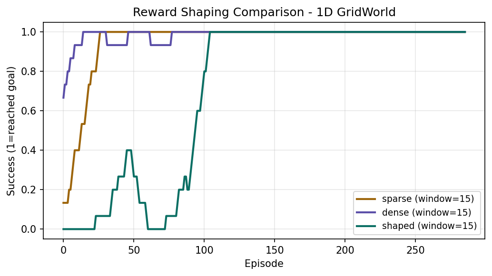

# 10.1.2 奖励

很多 RL 失败最后都不是“算法不会”，而是“奖励写歪了”。奖励设计决定了 agent 被鼓励去做什么，也决定了它会钻什么空子。对机器人和 VLA 来说，这一节尤其关键，因为一旦 reward 与真实目标脱节，系统可能学会投机行为，甚至在真机上产生危险动作。

## 学习目标

读完本页后，你应该能：

- 区分 sparse reward、dense reward、reward shaping、success signal。
- 解释为什么“reward 是代理目标，不是真实目标”。
- 理解 potential-based shaping 的基本直觉，以及它为什么常被认为更安全。
- 给一个机器人任务拆出任务奖励、辅助 shaping 和安全惩罚。
- 用本仓库的 reward shaping demo 阅读“学习速度变化”和“最优策略是否改变”这两个不同问题。

## 为什么这对机器人 / VLA 很重要

机器人任务几乎总要面对奖励设计：

- 抓取成功很稀疏，单靠终局成功信号可能学得太慢。
- 加距离奖励可以更快学，但也可能鼓励只接近不抓取。
- 加速度惩罚、碰撞惩罚和越界惩罚与任务成功同样重要，因为真实系统有安全边界。

VLA 强化学习也一样。就算高层输入是语言和视觉，训练信号仍然要回答：

- 什么叫“执行成功”？
- 哪些中间行为值得鼓励？
- 哪些行为虽然提高了表面分数，但其实违背任务意图或安全要求？

## 核心概念

### 1. Sparse Reward：最直接，但可能太难学

稀疏奖励通常只在成功时给分，例如：

- 抓到物体并抬起后给 `+1`
- 其余时间给 `0`

优点：

- 目标最直接，不容易偏题。

缺点：

- 如果成功事件很少，训练前期几乎没有学习信号。
- 探索难度高，尤其在长时序机器人任务里更明显。

### 2. Dense Reward：信号更丰富，但更容易带偏

稠密奖励会在中间过程持续给反馈，例如：

- 距离目标越近奖励越高。
- 姿态越平稳惩罚越小。
- 夹爪接近预抓取位姿时给正向 shaping。

优点：

- 更容易提供梯度式学习信号。
- 训练早期往往更快起步。

缺点：

- 代理目标可能和最终目标不一致。
- agent 可能学会“刷分”而不是真做成任务。

例如抓取任务里，如果只奖励“末端离物体越来越近”，策略可能学会在物体附近来回晃动，而不是闭合夹爪完成抓取。

### 3. Reward Shaping：不是乱加项，而是结构化加信息

reward shaping 的本质是：在不丢失最终任务目标的前提下，额外提供中间引导。

常见 shaping 项：

- 到目标的距离。
- 朝向误差。
- 抬升高度。
- 动作平滑度。
- 接触稳定性。

但要记住，shaping 不是“加得越多越好”。每多一项，就多一条可能被 agent 利用的捷径。

### 4. Potential-Based Shaping：相对更稳妥的做法

本仓库 `labs/08-rl/reward_shaping_demo.py` 演示了一个经典思路：

```text
r' = r + γ · Φ(s') − Φ(s)
```

其中 `Φ(s)` 是一个势函数（potential function），例如”离目标的距离”。这个形式的一个重要性质是：在满足条件时，它不会改变原任务的最优策略，只会改变学习过程中的中间反馈。

你不必在这一节推完整证明，先抓住直觉即可：

- 普通 dense reward 可能偷偷改了任务。
- potential-based shaping 更像给 agent 一种“往对方向前进就先鼓励一点”的势能提示。

这也是为什么它在很多教材和实验里比随意加距离分更值得优先考虑。

### 5. 安全惩罚不是附属品

机器人奖励设计里，安全项不该被当成“最后再补的细节”。常见安全相关项包括：

- 碰撞惩罚。
- 关节越界惩罚。
- 过大速度 / 加速度惩罚。
- 掉落物体惩罚。
- 离开工作空间惩罚。

这些项的作用不只是让曲线更好看，而是让训练目标贴近真实可执行约束。

不过也要避免一个极端：惩罚写得过强，agent 会学成“什么都不做最安全”。奖励设计始终是在任务推进和安全约束之间找平衡。

## 一个心智模型：奖励像导航，不像法律全文

可以把 reward 想成导航系统，而不是对任务的完整法律定义：

- 它告诉 agent 哪个方向通常更对。
- 但它并不能自动表达你全部真实意图。

因此一个好的奖励函数，至少要同时回答三件事：

- 最终成功是什么。
- 训练前期怎样得到足够信号。
- 哪些行为即使表面得分高，也必须被压制。

## 代码实操：三种奖励函数的写法

下面用 Python 展示 `reward_shaping_demo.py` 中三种奖励的核心实现，帮助你理解从公式到代码的映射：

```python
# ---- 环境参数 ----
N_CELLS = 21   # 一维网格宽度
GOAL = 18      # 目标位置
GAMMA = 0.95   # 折扣因子
POT_SCALE = 0.2

def phi(s: int) -> float:
    """势函数：离目标越近势能越高（绝对值越小）"""
    return -abs(s - GOAL) * POT_SCALE

def reward(kind: str, s: int, s_next: int, done: bool) -> float:
    if kind == "sparse":
        # 只有到达目标时给 +1，其余全是 0
        return 1.0 if done else 0.0

    if kind == "dense":
        # 每一步都给信号：离目标越近分越高（负值越接近 0）
        return -abs(s_next - GOAL) / N_CELLS

    if kind == "shaped":
        # Ng-Harada-Russell potential-based shaping
        # r' = r_sparse + gamma * phi(s') - phi(s)
        # 关键性质：不改变最优策略，只改变学习速度
        r = 1.0 if done else 0.0
        return r + GAMMA * phi(s_next) - phi(s)
```

这段代码的关键在于 `shaped` 分支：它在 sparse reward 基础上加了势函数差，往目标方向移动就能获得正向补偿，远离则受负向惩罚，但**累积下来不改变最优策略**。

## 奖励拆分的工程写法

真正写实验时，建议把各项**单独**记录到日志里，而不是只保留一个 `total_reward`。否则你看到总回报上升时，很难知道到底是哪一项在起作用。

```python
def compute_reward(obs, action, next_obs, done, info):
    """机器人抓取任务的奖励函数（示意）"""
    # 1. 主任务奖励
    task_reward = 10.0 if info["grasp_success"] else 0.0
    progress = -np.linalg.norm(next_obs["ee_pos"] - next_obs["target_pos"])

    # 2. 安全惩罚
    collision_penalty = -5.0 if info["collision"] else 0.0
    limit_penalty = -1.0 if info["joint_limit_violated"] else 0.0

    # 3. 控制惩罚（鼓励平滑动作）
    action_penalty = -0.01 * np.sum(action ** 2)

    total = task_reward + 0.1 * progress + collision_penalty + limit_penalty + action_penalty

    # 把每一项都记到 info 里，方便后续分析
    info["reward/task"] = task_reward
    info["reward/progress"] = progress
    info["reward/collision"] = collision_penalty
    info["reward/action"] = action_penalty
    return total
```

## 和本仓库实验的对应关系

`labs/08-rl/reward_shaping_demo.py` 不是深度 RL，而是一个非常适合入门奖励设计的表格 Q-learning 小实验。它在同一个一维网格环境里比较三种奖励：

- `sparse`：只有到达目标时给 `+1`
- `dense`：每步按到目标的距离给负奖励
- `shaped`：`sparse + potential-based shaping`

结果文件：

- `runs/08-rl/reward_shaping.json`
- `runs/08-rl/reward_shaping.txt`

下面这张训练曲线对比了三种奖励在同一环境下的学习进度（运行 `labs/08-rl/plot_training_curves.py` 生成）：



当前仓库结果显示：

- `sparse` 在前 50 回合平均成功率约 `44.0%`
- `dense` 在前 50 回合平均成功率约 `86.7%`
- `shaped` 在前 50 回合平均成功率约 `61.3%`
- 三者在最后 20 回合平均成功率都达到 `100.0%`

这个结果说明了两个层面的事情：

1. 奖励定义会显著改变学习速度。
2. 更快学到，不等于最终最优策略一定被改变。

这里尤其要小心不要过度解读：

- 当前 demo 是一维 toy 环境，不是高维机器人抓取。
- 这个具体结果里，`dense` 前期成功率甚至高于 `shaped`，说明“理论上更稳妥”的 shaping 也不保证在所有小实验里都跑出最漂亮的早期曲线。

真正该学到的是：奖励设计需要看任务目标、学习速度和策略偏移风险三者之间的关系，而不是迷信某个公式。

## 如何映射到机器人任务

以“机械臂抓起方块”为例，可以这样拆：

- 成功奖励：方块离开桌面并稳定保持若干步。
- 稀疏主目标：成功时给大的终局奖励。
- 中间 shaping：末端接近预抓取位姿、夹爪与物体相对姿态更合理。
- 安全惩罚：碰撞桌面、速度过大、关节接近极限。
- 控制惩罚：过猛动作、抖动。

VLA 后训练时也类似，只是 reward 可能来自：

- 成功 / 失败二值标签。
- 程序化检查器。
- 多步任务完成度。
- 人类偏好或规则打分。

无论形式如何，核心问题都没变：奖励是否真的对应你要的行为。

## 常见坑

- 只加 dense reward，不保留明确 success signal，最后学成“接近但不完成”。
- 奖励项太多，彼此量级差异巨大，训练器主要在优化错误的项。
- 把安全惩罚写进说明文档，却没有真正加进 reward 或终止条件。
- 只看总回报，不拆分子项，导致根本不知道 agent 在利用哪条捷径。
- 把仿真里可见的隐藏真值直接写进 reward，但真机无法获得，产生信息泄漏。
- 因为一个 shaping 曲线好看，就误以为它一定保留了原任务最优策略。

## 一个实用写法：先写主任务，再补 shaping

对初学者最稳妥的顺序通常是：

1. 先定义清楚 success / failure / timeout。
2. 先写一个最小可用的稀疏主任务奖励。
3. 再只添加少量最必要的 shaping。
4. 单独记录每个 reward 分量。
5. 用视频、成功率和失败案例验证有没有“刷分不做事”。

这比一开始写出一个十几项混合奖励更容易调试。

## 练习任务

任选一个机器人任务，例如“把末端移动到指定位姿”或“抓起一个方块”，写出：

- 一条稀疏成功奖励。
- 两条以内的中间 shaping。
- 两条安全惩罚。
- 一条你担心会被钻空子的奖励项，并说明为什么。

然后问自己：如果 agent 只想把分数刷高，它最可能利用哪条漏洞？

## 自测问题

- sparse reward 和 dense reward 的主要权衡是什么？
- 为什么 reward 不等于真实任务目标？
- potential-based shaping 想解决什么问题？
- `runs/08-rl/reward_shaping.txt` 告诉你“学习速度”和“最终表现”之间是什么关系？
- 机器人任务里为什么必须把安全约束纳入奖励或终止设计？
- 如果一个策略总回报很高，但视频里动作明显危险，你会先怀疑什么？
