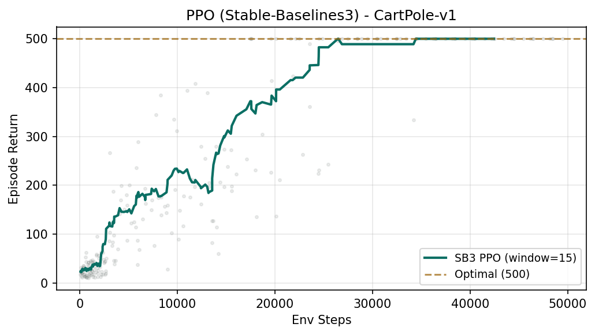
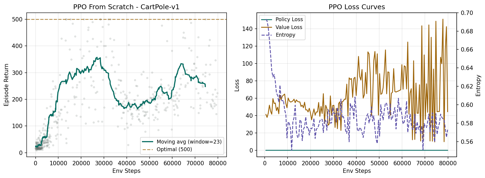

# 近端策略优化（PPO）

PPO（Proximal Policy Optimization）是很多人接触强化学习时的第一条强 baseline，因为它实现相对简单、训练行为通常比“原始策略梯度”稳定，而且对离散控制和中等规模连续控制都比较常见。本节的重点不是背论文公式，而是理解 PPO 为什么要“先采样，再更新”，以及它在机器人里什么时候好用、什么时候会慢。

## 学习目标

读完本页后，你应该能：

- 解释 PPO 属于 on-policy 策略梯度方法。
- 说明 rollout、advantage、clipped objective、value loss、entropy bonus 各自的作用。
- 看懂一个最小 PPO 训练循环的数据流。
- 用本仓库的 CartPole 实验理解“稳定”与“样本效率”的取舍。
- 判断 PPO 为什么经常被拿来做机器人 RL 的第一个可解释 baseline。

## 为什么这对机器人 / VLA 很重要

PPO 在机器人里常被当作“先让系统跑起来”的起点，原因很现实：

- 实现广泛，参考代码多。
- rollout buffer 的数据流直观，调试成本相对低。
- 在仿真里配合并行环境，训练吞吐可以做得不错。
- 适合先验证 observation、reward、termination 是否合理。

但它也有明显代价：因为是 on-policy，它主要依赖当前策略刚收集到的新数据，旧数据很快过期，所以对真实机器人这种“每一步都贵”的场景，样本效率未必理想。这也是后面需要理解 SAC 和 offline RL 的原因。

## PPO 在做什么

最简化地说，PPO 做三件事：

1. 用当前策略和环境交互，采一批新轨迹。
2. 估计每个动作的 advantage，判断它比“正常水平”好多少。
3. 只允许策略朝“更好动作”的方向更新，但不能一下子改太猛。

这里的“不能改太猛”就是 PPO 名字里 `proximal` 的含义。它不是禁止更新，而是限制每次更新离旧策略太远。

## 核心概念

### 1. On-policy：为什么必须采新数据

PPO 依赖当前策略生成的数据来更新当前策略。直觉上，它像是在说：

> 我先按现在的行为方式跑一批轨迹，再根据这批轨迹总结哪些动作表现比预期更好，然后小步修正自己。

因为策略一更新，数据分布也会跟着变，所以旧数据不适合被长期反复复用。这和 SAC 的 replay buffer 逻辑不同。

### 2. Advantage：更新方向来自“超预期程度”

PPO 不只是看 reward 大小，而是更关心 advantage：

- `A > 0`：这个动作比基线更好，应该更常做。
- `A < 0`：这个动作比基线更差，应该少做。

在实践里，advantage 常通过 GAE（Generalized Advantage Estimation）估计，用参数 `γ`（折扣因子）和 `λ`（GAE 平滑系数）控制偏差-方差权衡。

### 3. Clipped Objective：限制一步走太远

PPO 的标志性设计是 clipped objective。你可以先记住它的工程含义：

- 如果一个动作被判断为好动作，策略可以增加它的概率。
- 但增加到一定程度就先别再冲，否则容易训练发散。
- 如果一个动作被判断为坏动作，策略可以降低它的概率。
- 但也别一下子砍太狠。

这相当于在更新时给策略变化量装了“护栏”。

### 4. Value Loss 与 Entropy Bonus

PPO 往往不是只训一个策略头，还会同时训一个 value function：

- `policy loss`：推动策略偏向高 advantage 动作。
- `value loss`：让价值估计更准。
- `entropy bonus`：鼓励一定探索，防止策略太早塌缩成单一行为。

一个常见现象是：

- entropy 很快掉到接近 0，说明策略变得过于确定，探索可能不够。
- value loss 很高，说明 critic 估计不稳，advantage 质量也会受影响。

## 一个心智模型：PPO 像“按批复盘”

可以把 PPO 想成机器人教练的批量复盘流程：

- 先让机器人连续做若干次尝试。
- 把这一批视频和记录放到桌上。
- 判断哪些动作片段比平均表现更好。
- 调整策略，但只做小步修正。
- 再出去收集下一批新数据。

这就是为什么 PPO 通常：

- 更新稳定。
- 易于理解。
- 但对数据利用不算极致。

## 代码实操 A：用 Stable-Baselines3 五行跑通 PPO

先看最快速的方式——用现成库把 PPO 跑起来，确保你理解完整的实验闭环：

```python
from stable_baselines3 import PPO
from stable_baselines3.common.env_util import make_vec_env
from stable_baselines3.common.evaluation import evaluate_policy

# 1. 创建 4 个并行 CartPole 环境
train_env = make_vec_env("CartPole-v1", n_envs=4, seed=0)
eval_env  = make_vec_env("CartPole-v1", n_envs=1, seed=100)

# 2. 初始化 PPO（MlpPolicy = 两层 64 节点全连接网络）
model = PPO(
    "MlpPolicy", train_env,
    learning_rate=3e-4,   # Adam 学习率
    n_steps=128,          # 每个 env 每次采 128 步，共 128*4=512 步/更新
    batch_size=64,        # mini-batch 大小
    gamma=0.99,           # 折扣因子
    gae_lambda=0.95,      # GAE lambda，控制 advantage 估计的偏差-方差
    clip_range=0.2,       # PPO clip 参数 epsilon
    ent_coef=0.0,         # entropy bonus 系数
    verbose=0, seed=0,
)

# 3. 训练 50k 步（CPU 上约 10 秒）
model.learn(total_timesteps=50_000)

# 4. 评测：20 回合确定性策略
mean_ret, std_ret = evaluate_policy(model, eval_env, n_eval_episodes=20, deterministic=True)
print(f"PPO eval: {mean_ret:.1f} ± {std_ret:.1f}")
# → PPO eval: 500.0 ± 0.0  （满分）
```

完整脚本见 `labs/08-rl/ppo_cartpole.py`，训练曲线如下：



## 代码实操 B：从零手搓 PPO（< 200 行 PyTorch）

下面是不依赖任何 RL 库、只用 PyTorch + Gymnasium 的 PPO 核心实现。完整可运行脚本在 `labs/08-rl/ppo_from_scratch.py`。

### 第一步：Actor-Critic 网络

```python
import torch
import torch.nn as nn
import numpy as np
from torch.distributions import Categorical

def layer_init(layer, std=np.sqrt(2), bias=0.0):
    """正交初始化——对策略梯度方法很重要，能让训练起步更稳"""
    nn.init.orthogonal_(layer.weight, std)
    nn.init.constant_(layer.bias, bias)
    return layer

class ActorCritic(nn.Module):
    def __init__(self, obs_dim, act_dim):
        super().__init__()
        # Actor 和 Critic 用独立网络（不共享参数）
        # SB3 默认也是这样做的
        self.actor = nn.Sequential(
            layer_init(nn.Linear(obs_dim, 64)), nn.Tanh(),
            layer_init(nn.Linear(64, 64)),      nn.Tanh(),
            layer_init(nn.Linear(64, act_dim), std=0.01),  # 小 std → 初始策略接近均匀
        )
        self.critic = nn.Sequential(
            layer_init(nn.Linear(obs_dim, 64)), nn.Tanh(),
            layer_init(nn.Linear(64, 64)),      nn.Tanh(),
            layer_init(nn.Linear(64, 1), std=1.0),
        )

    def get_action_and_value(self, obs):
        """采样阶段用：给出动作、log概率、entropy、value"""
        logits = self.actor(obs)
        value  = self.critic(obs).squeeze(-1)
        dist   = Categorical(logits=logits)       # 离散动作的分类分布
        action = dist.sample()
        return action, dist.log_prob(action), dist.entropy(), value

    def evaluate(self, obs, actions):
        """更新阶段用：对已有 (obs, action) 对重新计算 log概率 和 value"""
        logits = self.actor(obs)
        value  = self.critic(obs).squeeze(-1)
        dist   = Categorical(logits=logits)
        return dist.log_prob(actions), dist.entropy(), value
```

### 第二步：GAE（Generalized Advantage Estimation）

```python
def compute_gae(rewards, values, dones, last_value,
                gamma=0.99, gae_lambda=0.95):
    """
    逆序遍历 rollout，用 TD 残差的指数加权和估计 advantage。
    - δ_t = r_t + γ · V(s_{t+1}) − V(s_t)
    - A_t = δ_t + γ · λ · A_{t+1}
    """
    n_steps, n_envs = rewards.shape
    advantages = np.zeros_like(rewards)
    last_gae = np.zeros(n_envs)

    for t in reversed(range(n_steps)):
        next_val = last_value if t == n_steps - 1 else values[t + 1]
        next_non_terminal = 1.0 - dones[t]
        delta = rewards[t] + gamma * next_val * next_non_terminal - values[t]
        last_gae = delta + gamma * gae_lambda * next_non_terminal * last_gae
        advantages[t] = last_gae

    returns = advantages + values   # V_target = A + V
    return advantages, returns
```

### 第三步：PPO 更新（clipped surrogate loss）

```python
# 假设已有 rollout 数据：flat_obs, flat_act, flat_logp, flat_adv, flat_ret
# 以下是一个 epoch 中的 mini-batch 更新

CLIP_EPS = 0.2

for start in range(0, total_samples, batch_size):
    idx = indices[start : start + batch_size]

    # 用当前网络重新评估旧的 (obs, action) 对
    new_logp, entropy, new_val = agent.evaluate(flat_obs[idx], flat_act[idx])

    # ---- Clipped Surrogate Loss ----
    # ratio = π_new(a|s) / π_old(a|s)
    ratio = (new_logp - flat_logp[idx]).exp()

    # 两个目标取 max（因为 advantage 可能为负，max 等价于"更保守的那个"）
    pg_loss1 = -flat_adv[idx] * ratio
    pg_loss2 = -flat_adv[idx] * torch.clamp(ratio, 1 - CLIP_EPS, 1 + CLIP_EPS)
    pg_loss  = torch.max(pg_loss1, pg_loss2).mean()

    # ---- Value Loss ----
    v_loss = 0.5 * ((new_val - flat_ret[idx]) ** 2).mean()

    # ---- 合并 ----
    loss = pg_loss + 0.5 * v_loss  # 可选：- ent_coef * entropy.mean()

    optimizer.zero_grad()
    loss.backward()
    nn.utils.clip_grad_norm_(agent.parameters(), 0.5)  # 梯度裁剪
    optimizer.step()
```

### From Scratch 训练结果

运行 `python labs/08-rl/ppo_from_scratch.py`（80k 步，~20 秒），训练曲线如下：



从零实现的 PPO 在 80k 步内从 ~20 分提升到 ~290 分（左图），Policy Loss 和 Value Loss 均持续下降（右图）。对比 SB3 的 50k 步满分结果，差距来自：

- SB3 使用了更成熟的 rollout buffer 实现和 advantage normalization。
- 正交初始化参数和学习率 schedule 的细节差异。
- 这恰恰说明了”RL 实现细节很重要”——同样的算法，工程质量不同，收敛速度可以差很多。

你不需要一眼把每个变量记牢，但要看懂两点：

- 先采样，再计算 advantage，再做多轮更新。
- 更新依赖的是这一批 rollout 中保存下来的”旧策略概率”和”旧价值估计”。

## 和本仓库实验的对应关系

本仓库的 `labs/08-rl/ppo_cartpole.py` 用 Stable-Baselines3 的 PPO 在 `CartPole-v1` 上训练：

- 训练步数：`50_000`
- 并行环境数：`4`
- 评测回合数：`20`
- 关键超参：`n_steps=128`、`batch_size=64`、`γ=0.99`、`λ_GAE=0.95`、`ε_clip=0.2`

对应结果在：

- `runs/08-rl/ppo_cartpole_metrics.json`
- `runs/08-rl/ppo_cartpole.txt`
- `runs/08-rl/random_baseline.txt`
- `runs/08-rl/cleanrl_ppo_metrics.json`
- `runs/08-rl/cleanrl_ppo.txt`

从现有结果可以读到：

- 随机基线约为 `24.9 ± 13.8 / 500`。
- PPO 评测回报达到 `500.0 ± 0.0 / 500`。

这说明在一个小型离散控制任务上，PPO 可以非常稳定地达到满分。但不要把这个现象直接外推到所有机器人任务，因为 CartPole：

- observation 很小。
- 动作离散。
- 动力学简单。
- 奖励和成功定义高度一致。

现实机器人任务通常噪声更大、部分可观测更明显、奖励也更难写。

如果你继续看后面的 CleanRL 阅读小节，还可以把这份 SB3 结果和 `cleanrl_ppo` 输出对照着读：前者更适合理解“把实验跑通”，后者更适合理解“PPO 训练循环内部到底记录了哪些指标”。

## PPO 适合什么场景

PPO 常见适用场景：

- 想快速验证环境和奖励是否基本正确。
- 有并行仿真环境，采样成本不算高。
- 任务需要一个稳定、容易复现实验的 baseline。
- 你想先理解策略梯度数据流，再进入更复杂算法。

PPO 不一定是最优选择的场景：

- 真机采样非常昂贵。
- 连续动作维度较高且需要强样本效率。
- 你已经有大量离线数据，想尽量复用历史经验。

## 常见坑

- 只盯最终回报，不看 rollout 质量。采样阶段如果 done / timeout 定义错了，PPO 也会学偏。
- 忽略 advantage 质量。value function 不稳时，策略更新方向会变差。
- clip range 以为越大越好。太大时更新约束变弱，稳定性下降。
- entropy 系数设成 0 后又抱怨没探索。在复杂任务里可能过早收敛。
- 用 PPO 做真机高成本采样却不评估数据效率，最后训练预算失控。
- 看到训练曲线好看就默认策略可靠，但没有做跨 seed 或独立评测。

## 一个面向机器人的直觉判断

如果你现在要做一个新的机器人 RL 小实验，PPO 的价值通常不是“它一定最强”，而是：

- 它能帮你检查任务建模是否站得住。
- 它的失败模式相对容易解释。
- 它适合作为后续 SAC、offline RL 或 VLA RL 的比较基线。

换句话说，PPO 很像“任务定义体检器”。先把最基础的闭环做通，比一开始就上更复杂框架更重要。
