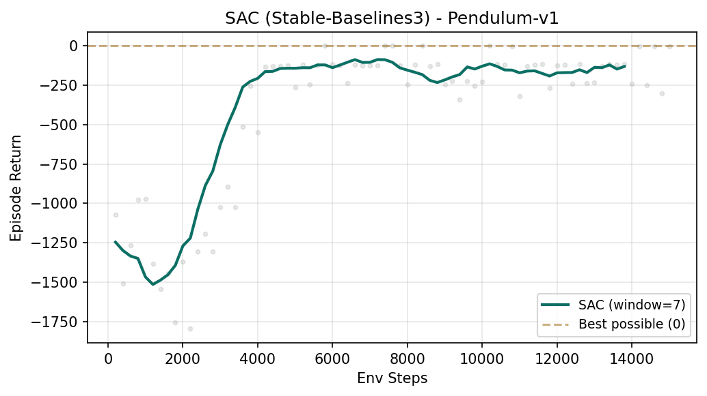

# 软演员-评论家（SAC）

SAC（Soft Actor-Critic）是机器人连续控制里非常常见的一类 baseline。它把 off-policy 经验复用、actor-critic 结构和 entropy 正则结合在一起，目标是在保持训练稳定性的同时提升样本效率。本节的重点是理解 SAC 为什么适合连续动作任务，以及它和 PPO 在数据流上的根本差别。

## 学习目标

读完本页后，你应该能：

- 解释 SAC 为什么属于 off-policy actor-critic。
- 说明 replay buffer、Q function、actor、temperature / entropy 在 SAC 中的角色。
- 理解“最大化回报”和“保持足够探索”为什么可以一起优化。
- 用本仓库的 Pendulum 实验连接连续动作、样本效率和结果波动。
- 判断 SAC 在机器人控制里常见的优势与调试难点。

## 为什么这对机器人 / VLA 很重要

机器人动作大多是连续的：

- 关节扭矩。
- 关节速度。
- 末端位姿增量。
- 夹爪力度。

这类动作空间里，离散化往往不自然，也会损失控制精度。SAC 之所以常见，是因为它直接服务这类连续控制问题，同时还能重复利用旧经验。对于仿真训练或昂贵采样场景，这种经验复用能力通常比 PPO 更省样本。

如果你把 PPO 想成“用最新一批数据做复盘”，那 SAC 更像“建立一座经验仓库，从里面反复抽样学习”。

## SAC 在做什么

SAC 的核心思想可以拆成三部分：

1. 用 actor 产生动作，与环境交互，积累转移数据。
2. 把数据存进 replay buffer，后续训练可反复抽样复用。
3. 用 Q function 评估动作好坏，同时用 entropy 奖励保持探索。

这里的 `soft` 指的就是它不是只追求高回报，还把策略熵也考虑进去。直觉上，它偏好“高回报且不过早僵化”的策略。

## 核心概念

### 1. Replay Buffer：旧经验不会立刻作废

off-policy 的关键在于：训练 actor / critic 时，不要求数据必须来自“当前这一秒”的最新策略。

这带来两个现实好处：

- 同一条经验可以被多次学习，提高样本效率。
- 采样和学习可以更松耦合，训练更像“边收集边回看历史”。

但副作用也要记住：

- 如果策略变化很大，旧数据分布和新策略差距也会变大。
- 如果环境定义改了，旧 buffer 里的数据可能变脏。

### 2. Actor-Critic：一个负责做动作，一个负责打分

SAC 里通常有：

- `actor`：给出动作分布或动作采样方式。
- `critic / Q network`：评估在某状态下某动作的价值。

可以把它想成：

- actor 负责“提方案”。
- critic 负责“给方案打分”。

actor 不是凭空学会做事的，它是靠 critic 提供的梯度信号，逐步偏向那些被认为更好的动作。

### 3. Entropy：探索不是副产品，而是目标的一部分

很多 RL 初学者把探索理解成“训练早期随机一点，后面自然收敛”。SAC 更明确：探索本身被放进优化目标里。

直觉上：

- 如果策略太确定，可能很早陷进局部最优。
- 如果策略保留一定熵，就更容易继续尝试其他动作。

因此 SAC 的目标不是单纯最大化 `Q`，而是最大化：

```text
expected return + α · entropy
```

其中 `α`（alpha）是温度系数，控制”探索激励”有多强。

### 4. Temperature：探索强度旋钮

`α` 大致可以理解为一个旋钮：

- 大一些：更鼓励探索，策略更分散。
- 小一些：更追求当前高回报动作，策略更集中。

如果 `α` 太大，策略可能长期发散在很多无效动作上。
如果 `α` 太小，策略可能太快失去探索能力。

很多实现会自动调节 temperature，目标是把策略熵维持在合理范围。

## 一个心智模型：SAC 像“边开车边回放经验”

想象一个机器人在练习摆杆或抓取：

- 每次尝试的状态、动作、奖励都被录下来。
- 训练器不只看刚刚这一次，还会随机抽历史片段回放。
- critic 学会判断什么动作长期更值钱。
- actor 根据 critic 的判断，逐渐偏向更优动作。
- 同时保留一定随机性，避免过早只会一种动作。

这就是 SAC 比 PPO 更像“持续经验回放”的原因。

## 代码实操：用 SB3 训练 SAC

```python
from stable_baselines3 import SAC
from stable_baselines3.common.env_util import make_vec_env
from stable_baselines3.common.evaluation import evaluate_policy

# Pendulum-v1：连续动作（扭矩 [-2, 2]），回报范围 [-16, 0]/步
train_env = make_vec_env("Pendulum-v1", n_envs=1, seed=0)
eval_env  = make_vec_env("Pendulum-v1", n_envs=1, seed=100)

model = SAC(
    "MlpPolicy", train_env,
    learning_rate=3e-4,
    buffer_size=20_000,      # Replay buffer 容量——存多少条转移数据
    learning_starts=1_000,   # 先随机采 1000 步再开始学习
    batch_size=256,          # 每次从 buffer 里抽 256 条训练
    tau=0.005,               # τ: target 网络软更新速率
    gamma=0.99,              # γ: 折扣因子
    train_freq=1,            # 每采 1 步就做 1 次梯度更新
    gradient_steps=1,
    seed=0, verbose=0,
)

model.learn(total_timesteps=15_000)   # CPU 上约 30 秒

mean_ret, std_ret = evaluate_policy(model, eval_env, n_eval_episodes=20, deterministic=True)
# Pendulum 回报越接近 0 越好；训练良好时约 -150 左右
print(f"SAC eval: {mean_ret:.1f} ± {std_ret:.1f}")
```

完整脚本见 `labs/08-rl/sac_pendulum.py`，训练曲线如下：



可以清晰看到：前 1000 步是纯随机采样（learning_starts），之后 critic 开始学习，回报快速上升。

## SAC vs PPO 核心数据流差异

```text
PPO:   env ──(rollout 512步)──> buffer ──(GAE)──> 多 epoch 更新 ──> 清空 buffer ──> 重新采样
SAC:   env ──(每步)──> replay buffer ──(随机抽样)──> 更新 critic/actor ──> 不清空，持续积累
```

和 PPO 的差别很明显：

- SAC 不需要先收完整一大批 rollout 才开始学。
- 数据一旦进 buffer，就可能在后续多次训练里被抽到。
- 学习和采样是更连续交织的。

## 和本仓库实验的对应关系

`labs/08-rl/sac_pendulum.py` 用 Stable-Baselines3 的 SAC 在 `Pendulum-v1` 上训练：

- 训练步数：`15_000`
- 动作空间：连续扭矩
- 关键超参：`buffer_size=20_000`、`learning_starts=1_000`、`batch_size=256`、`τ=0.005`、`γ=0.99`

结果文件：

- `runs/08-rl/sac_pendulum_metrics.json`
- `runs/08-rl/sac_pendulum.txt`

当前仓库已有结果显示：

- 20 回合评测平均回报约为 `-175.9`
- 标准差约为 `95.8`

这里有两个很重要的阅读方式：

- 第一，Pendulum 的回报“越接近 0 越好”，不是越大越接近 500 那种直觉。
- 第二，方差较大并不奇怪，因为连续控制策略和评测轨迹本身都更容易波动。

脚本头注里也明确写了一个经验判断：这个环境里表现不错的 SAC 在 `10k-20k` 步里可以达到大约 `-150` 量级，而当前仓库记录到的是 `-175.9`。这说明现有脚本已经学到了明显优于随机的控制，但还不能把它描述成“完全收敛”或“最佳结果”。

## SAC 为什么常见于机器人连续控制

SAC 常见的工程吸引力主要有四点：

- 直接适配连续动作，不需要勉强离散化。
- replay buffer 提高样本利用率。
- actor-critic 结构便于扩展到更复杂环境。
- entropy 目标让探索不只是靠手工加噪声。

对机械臂、移动机器人、双臂协同等任务来说，这些特性通常都很有价值。

## 和 PPO 的直观对比

可以先记住这一版简化对比：

| 维度 | PPO | SAC |
| --- | --- | --- |
| 数据流 | on-policy | off-policy |
| 经验复用 | 很弱 | 很强 |
| 常见动作空间 | 离散和中小型连续 | 尤其适合连续 |
| 探索机制 | 常靠策略熵项辅助 | 熵目标是核心组成部分 |
| 样本效率 | 通常较低 | 通常较高 |
| 调试直觉 | rollout 更直观 | buffer/Q/temperature 更复杂 |

当然，这只是工程直觉，不是绝对定律。真正效果仍取决于环境、奖励、观测和实现细节。

## 常见坑

- 忘记连续控制的动作尺度。动作边界和归一化不合理，会直接影响学习质量。
- replay buffer 很大，但里面装的是坏数据。经验可复用不等于经验有价值。
- `learning_starts` 太早，critic 还没见过足够多样的数据就开始过拟合。
- 只看平均回报，不看方差和评测稳定性。
- entropy / temperature 没管好，导致策略长期过随机，或者太快塌缩。
- 任务明明是稀疏成功信号，却把问题都归到 SAC 本身，忽略了奖励设计。

## 一个面向机器人的判断准则

如果你的任务同时满足下面几条，SAC 往往是很自然的首选 baseline：

- 动作空间连续。
- 采样成本不低，希望重复利用历史经验。
- 希望训练期间持续保留探索。
- 你愿意多花一些精力理解 critic、buffer 和温度调节。

反过来，如果你更看重“先把最简单的训练闭环看懂”，PPO 往往更适合做第一节入门实验。
