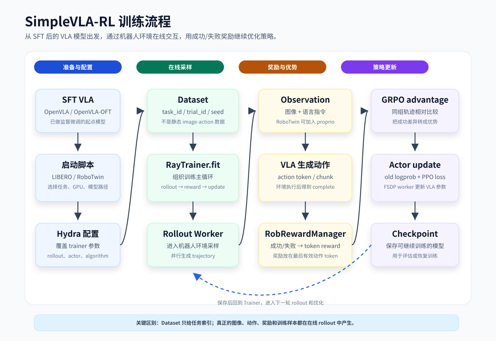

# SimpleVLA-RL

传统VLA训练主要靠SFT监督微调，也就是用人工/专家轨迹教模型模仿动作。但机器人轨迹数据很贵，而且 SFT 容易在新物体、新空间、新目标上泛化不好。SimpleVLA-RL的思路是：在SFT模型基础上继续做在线强化学习，让模型通过环境交互试错，用任务是否成功的0/1奖励来优化策略。

SimpleVLA-RL 是一个基于 veRL 改造的机器人 VLA 强化学习框架：它从一个 SFT 后的 OpenVLA/OpenVLA-OFT 模型出发，让模型在 LIBERO 或 RoboTwin 仿真环境中反复执行任务，用成功/失败作为奖励，通过 GRPO/PPO 更新模型，从而提升长程机器人任务表现和泛化能力。

## 章节结构

本节按 SimpleVLA-RL 的真实运行流程组织。建议先读导读和安装主仓库说明，再按启动脚本、数据库结构、模型代码流程和部署实战的顺序往下看。

| 文档 | 主要内容 |
| --- | --- |
| [导读与运行准备](04-simplevla-rl/README.md) | 本节结构、本地 `simplevla-rl_stack` 目录、仓库下载和阅读方式 |
| [架构与算法](04-simplevla-rl/01-architecture-and-algorithms.md) | SimpleVLA-RL 的整体架构、GRPO/PPO 算法要点和与 veRL 的关系 |
| [环境搭建与快速上手](04-simplevla-rl/02-setup-quickstart.md) | 硬件需求、显存估算、依赖安装和基准环境跑通 |
| [配置与数据](04-simplevla-rl/03-config-data.md) | 训练配置体系、`LIBERO_Dataset`、`Robotwin_Dataset`、`task_id/trial_id/seed` |
| [模型代码流程](04-simplevla-rl/04-model-code-flow.md) | 集中介绍 Trainer、Rollout、Actor 三个核心模块如何串成 SimpleVLA-RL 的训练闭环 |
| [Trainer 与 Reward](04-simplevla-rl/04-model-code-flow/01-trainer-reward.md) | `main_ppo.py`、`RobRewardManager`、`RayTrainer.fit()`，以及训练主循环如何组织 rollout、reward、advantage 和 update |
| [Rollout 与环境交互](04-simplevla-rl/04-model-code-flow/02-rollout-env.md) | LIBERO/RoboTwin 环境、Observation、VLA 输入、action 生成和 trajectory 收集 |
| [Actor 与策略优化](04-simplevla-rl/04-model-code-flow/03-actor-policy.md) | FSDP worker、OpenVLA/OpenVLA-OFT、old logprob、PPO loss 和 checkpoint 保存 |
| [Rollout 交互细节](04-simplevla-rl/05-rollout-interaction.md) | rollout 阶段 observation 到 action 的完整链路 |
| [训练优化](04-simplevla-rl/06-training-optimization.md) | 训练稳定性、超参数和性能优化 |
| [SFT 冷启动与 RL 训练](04-simplevla-rl/07-sft-rl-training.md) | 为什么从 SFT checkpoint 开始、两阶段训练流程 |
| [OpenArm 端到端实战](04-simplevla-rl/08-openarm-practice.md) | 把 SimpleVLA-RL 适配到新机器人本体的完整案例 |
| [故障排查与索引](04-simplevla-rl/09-troubleshooting-index.md) | 常见报错定位与逐文件索引的使用方式 |
| [SimpleVLA-RL 实战](04-simplevla-rl/hands-on/01-simplevla-rl.md) | 从论文、代码和实验角度补充理解整个项目（含训练曲线与评测视频） |

## 流程图

SimpleVLA-RL 的主线可以理解成：先从一个已经 SFT 的 VLA 模型出发，再让它进入机器人环境试错，最后用成功/失败奖励更新模型。

## 学习目标

读完本节后，你应该能做到：

- 说清楚 SimpleVLA-RL 和普通 VLA SFT 的区别：SFT 是模仿专家轨迹，SimpleVLA-RL 是让模型在环境中交互并根据任务成功率继续优化。
- 从启动脚本追到 `verl.trainer.main_ppo`，知道 shell 脚本、Hydra 配置和 Python trainer 之间的关系。
- 理解 `LIBERO_Dataset` 和 `Robotwin_Dataset` 为什么只保存任务索引，而不是保存静态 `(image, action)` 样本。
- 理解 rollout 阶段如何把 observation 转成 VLA 输入，再把模型输出转成机器人环境可以执行的 action。
- 理解 `complete`、`finish_step`、token reward、GRPO advantage、old logprob 和 PPO loss 在训练链路中的位置。
- 知道 checkpoint 保存的是什么，以及如何从训练日志、WandB 和 rollout 视频判断训练是否正常。

## 读完标准

如果你能独立回答下面这些问题，就说明这一节基本读懂了：

1. `run_openvla_oft_rl_libero.sh` 和 `run_openvla_oft_rl_twin2.sh` 最后启动的是哪个 Python 模块？它们主要通过什么方式修改训练配置？
2. 为什么 SimpleVLA-RL 的 dataset 不是普通监督学习里的 `(image, action)`？`task_id`、`trial_id`、`seed` 分别控制什么？
3. `RayTrainer.fit()` 一轮训练大致经历哪些步骤？rollout、reward、advantage、actor update 的顺序是什么？
4. VLA 在 rollout 里看到的输入包括什么？它输出的 action 如何进入 LIBERO 或 RoboTwin 环境？
5. 为什么奖励要放到最后一个有效 action token 上？`finish_step` 和 `response_mask` 对 PPO loss 有什么影响？
6. old logprob 为什么要先算一遍？PPO clipped loss 为什么要比较 old policy 和 current policy？

这几个问题能串起来，基本就能从脚本入口一路追到模型参数更新，不会只停留在“能跑命令”的层面。
