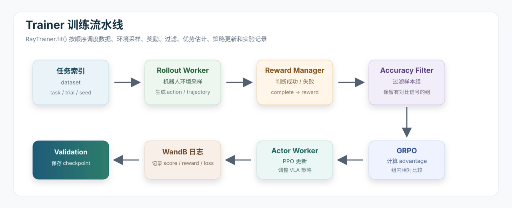

# 10.4.3.1 Trainer

前两节已经看过启动脚本和数据集结构。现在进入训练的中控层：Trainer。

在 SimpleVLA-RL 里，Trainer 是一个调度，它负责把下面这些模块串成一条训练流水线：



如果把整个 RL 训练比作一条流水线，Trainer 就是控制流水线顺序的人。在这一小节我们会学习整个训练的流水线在代码中是怎样构建起来的，同时也会了解 reward manager 的操作。后面 Rollout 与 Actor 两小节会详细讲解这个流水线中Rollout Worker和Actor Worker模块。

## 本节核心概念

在正式读代码前，先把这一节会反复出现的关键组件列出来。这些就是本节要学习的概念：它们共同解释了 SimpleVLA-RL 如何从“任务索引”出发，在线采集机器人轨迹，并把成功/失败信号变成一次 PPO 更新。

| 概念 / 组件 | 在代码中的位置 | 简单解释 |
| --- | --- | --- |
| Trainer | `RayTrainer` | 训练中控层。负责组织 rollout、reward、filter、advantage、actor update、validation 和 checkpoint |
| `main_ppo.py` | `verl/trainer/main_ppo.py` | Python 启动入口。读取 Hydra 配置，初始化 Ray，创建 worker 和 `RayTrainer` |
| `RayTrainer.fit()` | `verl/trainer/ppo/ray_trainer.py` | 真正的训练主循环。日志里的 `gen`、`update_actor`、`step:N` 都来自这里 |
| Hydra | `@hydra.main(...)` | 配置系统。启动脚本里的 `data.xxx=...`、`trainer.xxx=...` 都会覆盖默认 yaml 配置 |
| Ray | `ray.init(...)`、`ray.remote(...)` | 分布式执行框架。用来在多张 GPU 上启动 rollout / actor / ref 等 worker |
| Worker | `RobActorRolloutRefWorker` | 真正干活的进程。负责生成轨迹、计算 logprob、更新 actor、保存 checkpoint 等 |
| `DataProto` | `verl/protocol.py` | veRL 的 batch 容器。它把 tensor 数据和非 tensor 数据一起传给 rollout、reward 和 actor |
| Rollout | `generate_sequences(...)` | 让 VLA 进入 LIBERO/RoboTwin 环境，观察图像和指令，生成 action，收集 trajectory |
| `RobRewardManager` | `main_ppo.py` | 机器人任务的 reward 管理器。读取 `complete` 字段，把成功/失败变成 reward |
| outcome reward | `complete -> 0/1` | 只看最终任务是否成功的奖励。成功是 1，失败是 0 |
| accuracy filter | `RayTrainer.filter(...)` | 按同一任务的多条 rollout 成功率过滤样本。保留有成功也有失败的组 |
| GRPO | `compute_advantage(..., adv_estimator='grpo')` | 组内相对优势估计。不训练 critic，而是在同一 prompt 的多条采样之间比较好坏 |
| PPO update | `update_actor(batch)` | 用 advantage 更新 VLA actor，使成功轨迹的动作概率上升，失败轨迹的动作概率下降 |
| Validation | `_validate(...)` | 定期评估当前策略成功率，对应日志里的 `val/test_score/all` |
| Checkpoint | `save_checkpoint(...)` | 定期保存 actor/VLA 权重，方便中断恢复、后续评估或继续训练 |


## 本节要读的代码

这一节主要对应两个文件：

```text
SimpleVLA-RL/verl/trainer/main_ppo.py
SimpleVLA-RL/verl/trainer/ppo/ray_trainer.py
```

其中：

| 文件 | 作用 |
| --- | --- |
| `main_ppo.py` | Python 入口，负责初始化 Ray、创建 worker、创建 reward manager、实例化 `RayTrainer` |
| `ray_trainer.py` | 真正的训练主循环，`RayTrainer.fit()` 在这里 |

可以先记一句话：

```text
main_ppo.py 负责搭系统，ray_trainer.py 负责跑循环。
```

## 从脚本进入 main_ppo.py

启动脚本最后会运行：

```bash
python -u -m verl.trainer.main_ppo \
  data.task_suite_name=libero_10 \
  actor_rollout_ref.model.path=... \
  trainer.total_epochs=100 \
  ...
```

这里的 `-m verl.trainer.main_ppo` 会进入：

```text
verl/trainer/main_ppo.py
```

文件里最外层入口是：

```python
@hydra.main(config_path='config', config_name='ppo_trainer', version_base=None)
def main(config):
    ...
```

这里有两个专业名词：

| 名词 | 简单解释 |
| --- | --- |
| Hydra | 一个配置管理工具。启动脚本里 `xxx.yyy=value` 这种写法，就是在覆盖默认 yaml 配置 |
| Ray | 一个分布式执行框架。这里用它把 actor、rollout、ref policy 等 worker 放到多张 GPU 上运行 |

`main(config)` 做的第一件事是初始化 Ray：

```python
if not ray.is_initialized():
    if os.path.isfile(str(config.trainer.runtime_env)):
        with open(str(config.trainer.runtime_env), 'r') as f:
            runtime_env = json.load(f)
        ray.init(runtime_env=runtime_env)
    else:
        ray.init(runtime_env={'env_vars': {...}})
```

这里的 `trainer.runtime_env` 通常来自启动脚本：

```bash
trainer.runtime_env=$ALIGN_PATH
```

`align.json` 可以给 Ray worker 注入环境变量，比如 `PYTHONPATH`、`MUJOCO_GL`、`LIBERO_CONFIG_PATH`。这一步很重要，因为 rollout worker 不是普通单进程 Python，它们是 Ray 起的新进程，也需要知道 LIBERO、MuJoCo、项目代码在哪里。

初始化 Ray 后，代码调用：

```python
ray.get(main_task.remote(config))
```

这表示 `main_task` 也作为 Ray 远程任务运行。后面的 trainer 和 worker 都交给 Ray 管理。

## main_task：把训练系统组装起来

`main_task(config)` 是组装点。它不直接写训练循环，而是准备训练循环需要的部件。

核心流程可以概括为：

```text
打印配置
-> 定位 SFT checkpoint
-> 创建 tokenizer
-> 选择 worker 类型
-> 定义 Ray 角色和资源池
-> 创建 RobRewardManager
-> 创建 RayTrainer
-> trainer.init_workers()
-> trainer.fit()
```

对应代码里有：

```python
local_path = copy_local_path_from_hdfs(config.actor_rollout_ref.model.path)
tokenizer = hf_tokenizer(local_path)
```

这里的 `model.path` 就是启动脚本里的：

```bash
actor_rollout_ref.model.path=$SFT_MODEL_PATH
```

所以 Trainer 是从下载好的 SFT VLA checkpoint 开始训练的。

## Worker：为什么要分角色

`main_task` 里会定义 worker 角色：

```python
role_worker_mapping = {
    Role.ActorRollout: ray.remote(RobActorRolloutRefWorker),
    Role.Critic: ray.remote(CriticWorker),
    Role.RefPolicy: ray.remote(RobActorRolloutRefWorker)
}
```

可以这样理解：

| 角色 | 作用 |
| --- | --- |
| `ActorRollout` | 最重要的角色。既负责 rollout 采样，也负责 actor 策略更新 |
| `RefPolicy` | reference policy，用来计算参考策略 logprob，主要服务 KL 约束 |
| `Critic` | 价值函数模型。使用 GAE 时需要，当前 GRPO 主线不用 |
| `RewardModel` | 额外 reward model。当前机器人任务主线主要用环境成功/失败，不依赖它 |

当前 LIBERO 脚本通常配置：

```bash
algorithm.adv_estimator=grpo
algorithm.kl_ctrl.kl_coef=0.00
```

这意味着：

```text
不用 critic
KL 惩罚系数为 0
主要依赖 ActorRollout + RobRewardManager + GRPO
```


## RobRewardManager：机器人任务的 reward 从哪里来

语言模型 RL 里经常会有一个 reward model 给文本打分。但在机器人任务里，最直接的 reward 来自环境：任务是否完成。

`main_ppo.py` 里定义了：

```python
class RobRewardManager():
```

它的 `verify(data)` 会读取 rollout 结果里的：

```python
completes = data.batch['complete'].tolist()
score = [float(item) for item in completes]
```

这里的 `complete` 是环境执行后返回的任务完成标记：

```text
complete=True  -> 成功 -> reward 1.0
complete=False -> 失败 -> reward 0.0
```

这种 reward 叫 outcome reward。

| 名词 | 解释 |
| --- | --- |
| outcome reward | 只看最终结果的奖励，比如任务成功给 1，失败给 0 |
| dense reward | 每一步都有奖励，比如距离目标更近给一点分 |

SimpleVLA-RL 的 LIBERO 主线用的是比较稀疏的 outcome reward。

## reward 为什么放到最后一个 action token 上

`RobRewardManager.__call__(data)` 会创建一个和 `responses` 同形状的 reward tensor：

```python
reward_tensor = torch.zeros_like(data.batch['responses'], dtype=torch.float32)
verifier_reward = torch.zeros_like(data.batch['responses'], dtype=torch.float32)
```

然后计算有效 response 长度：

```python
valid_response_length = data.batch['finish_step'] * self.config.actor_rollout_ref.model.action_token_len
```

这里有两个字段：

| 字段 | 含义 |
| --- | --- |
| `finish_step` | 这条轨迹实际执行了多少个 action step |
| `action_token_len` | 每个 action 用多少个 token 表示。LIBERO 是 7 |

所以：

```text
finish_step * action_token_len = 这条轨迹有效 action token 的长度
```

然后 reward 被放到最后一个有效 token 上：

```python
verifier_reward[i, valid_response_length[i] - 1] += verifier_score[i]
```

为什么放最后？因为任务是否完成只有执行完轨迹后才知道。把最终成功/失败放到轨迹末尾，再交给 advantage 计算方法去做信用分配。

## RayTrainer：真正的中控类

`main_task` 最后创建：

```python
trainer = RayTrainer(
    config=config,
    tokenizer=tokenizer,
    role_worker_mapping=role_worker_mapping,
    resource_pool_manager=resource_pool_manager,
    ray_worker_group_cls=ray_worker_group_cls,
    reward_fn=reward_fn,
    val_reward_fn=val_reward_fn,
)
```

`RayTrainer.__init__` 会保存这些对象，然后调用：

```python
self._create_dataloader()
```

这一步会根据任务类型创建 dataset：

```python
if "libero" in self.config.data.task_suite_name:
    self.train_dataset = LIBERO_Dataset(...)
    self.val_dataset = LIBERO_Dataset(...)
elif "robotwin" in self.config.data.task_suite_name:
    self.train_dataset = Robotwin_Dataset(...)
    self.val_dataset = Robotwin_Dataset(...)
```

注意，这里的 dataset我们在数据与任务构建一节讲过了，不是 `(image, action)` 数据集，而是任务索引数据集。它主要告诉 Trainer：

```text
这次 rollout 要跑哪个 task_id
用哪个 trial_id / seed
属于哪个 task_suite_name
```

真正的图像、动作、成功失败，是 rollout 时进仿真环境在线生成的。

## init_workers：把 worker 真正启动起来

创建 `RayTrainer` 之后，`main_task` 调用：

```python
trainer.init_workers()
```

`init_workers()` 会根据前面定义的 `Role` 和资源池，真正创建 Ray worker group。

当前主线最重要的是：

```text
actor_rollout_wg
```

这个 worker group 后面会被反复调用：

```python
self.actor_rollout_wg.generate_sequences(...)
self.actor_rollout_wg.update_actor(...)
self.actor_rollout_wg.compute_entropy(...)
self.actor_rollout_wg.save_checkpoint(...)
```

也就是说，一个 `actor_rollout_wg` 同时承担了采样、训练更新、熵统计、保存 checkpoint 等工作。

## RayTrainer.fit()：一次训练 step 发生了什么

`RayTrainer.fit()` 是训练主循环。它的结构大致是：

```python
for epoch in range(self.config.trainer.total_epochs):
    ...
```

这里代码里叫 `epoch`，但日志里会显示成：

```text
step:0
step:1
step:2
...
```


一次 step 内部做下面这些事。

### 第一步：从 dataloader 取任务索引

代码会从 `train_dataloader` 取一个 batch：

```python
batch_dict = self.train_dataloader.get_next_batch()
newbatch = DataProto.from_single_dict(batch_dict)
```

`DataProto` 是 veRL 里封装 batch 的数据结构。可以把它理解成一个更强的字典，里面分两类数据：

| 类型 | 例子 | 说明 |
| --- | --- | --- |
| tensor batch | `task_id`、`trial_id`、`responses`、`old_log_probs` | 可以放到 GPU 上计算的张量 |
| non-tensor batch | `uid`、`task_suite_name` | 字符串、对象等非张量信息 |

### 第二步：给同一个任务复制 n_samples 份

GRPO 需要同一个 prompt 下有多条 rollout 做比较，所以代码会给每个样本生成一个 `uid`：

```python
newbatch.non_tensor_batch['uid'] = np.array([str(uuid.uuid4()) for _ in range(len(newbatch.batch))])
```

然后把每个任务复制 `n_samples` 次：

```python
batch_lst = sum([[newbatch[i:i + 1] for _ in range(n_samples)] for i in range(len(newbatch))], [])
```

如果脚本里是：

```bash
data.n_samples=8
```

就表示同一个任务会采 8 条轨迹。日志会有：

```text
each prompt has 8 responses
```

### 第三步：rollout 生成轨迹

Trainer 调用：

```python
gen_batch_output = self.actor_rollout_wg.generate_sequences(prompts=gen_batch)
```

这一步会进入 rollout worker。对于机器人任务来说，`generate_sequences` 不是简单生成文本，而是：

```text
创建 LIBERO / RoboTwin 环境
-> 读取 observation 图像和语言指令
-> VLA 生成 action token
-> action token 反归一化成连续机器人动作
-> 环境执行动作
-> 收集 trajectory、complete、finish_step 等字段
```

日志里的：

```text
gen: XXXX seconds
```

就是这一阶段的耗时。正式训练里这一段通常最慢，因为它真的在跑仿真环境。

### 第四步：verify 成功率

rollout 结束后，Trainer 调用：

```python
scores_tensor, reward_metrics, format_metrics, reward_format_metrics = self.reward_fn.verify(roll_batch)
```

这一步只判断成功失败，并记录平均成功率。日志里会出现：

```text
train_verify_score/all: XXXX
```

它大致可以理解为当前采样轨迹的平均成功率。

### 第五步：accuracy filter 过滤样本组

代码接着做：

```python
filtered_roll_batch = self.filter(roll_batch.batch['acc'].unsqueeze(1), roll_batch, n_samples)
```

`filter()` 会把同一个 prompt 的 `n_samples` 条结果放在一起，计算组内平均成功率：

```python
reward_matrix = reward_tensor.sum(-1).reshape(-1, n_samples)
acc_tensor = torch.mean(reward_matrix, dim=-1)
```

然后打印：

```python
print("Accuracy distribution:", ...)
print(f"Filtered batch size: {len(filtered_batch)} ...")
```

所以日志里会看到：

```text
Accuracy distribution: 0.00:15 0.12:13 0.25:11 ... 1.00:2
Filtered batch size: XXX (from original size: 512)
```

解释一下：

| 日志 | 含义 |
| --- | --- |
| `0.00:15` | 有 15 个 prompt 的 8 条 rollout 全失败 |
| `0.50:5` | 有 5 个 prompt 的 8 条 rollout 约一半成功 |
| `1.00:2` | 有 2 个 prompt 的 8 条 rollout 全成功 |

脚本里通常设置：

```bash
data.accuracy_lower_bound=0.1
data.accuracy_upper_bound=0.9
```

所以全失败和全成功都会被过滤掉。保留的是“有成功也有失败”的任务组，因为这种组最适合 GRPO 学习。

### 第六步：reward 和 advantage

收集到足够 batch 后，Trainer 会正式生成 token-level reward：

```python
reward_tensor_dict, reward_metrics = self.reward_fn(batch)
batch.batch['token_level_scores'] = reward_tensor_dict['all']
```

然后调用：

```python
batch = compute_advantage(..., adv_estimator=self.config.algorithm.adv_estimator, ...)
```

脚本里是：

```bash
algorithm.adv_estimator=grpo
```

GRPO 可以简单理解成“组内相对比较”：同一个任务采了 8 条轨迹，其中成功的比失败的好，成功轨迹会得到更高 advantage，失败轨迹会得到更低 advantage。

| 名词 | 简单解释 |
| --- | --- |
| reward | 环境给出的结果分数，成功/失败 |
| advantage | 这条轨迹比同组平均水平好多少，是 PPO 更新时真正用来放大或压低概率的信号 |
| GRPO | 不训练 critic，而是在同一个 prompt 的多条采样之间做相对比较来估计 advantage |

### 第七步：actor 更新

然后 Trainer 调用：

```python
actor_output = self.actor_rollout_wg.update_actor(batch)
entropy_output = self.actor_rollout_wg.compute_entropy(data=batch)
```

`update_actor` 会进入 FSDP worker，用 PPO loss 更新 VLA 策略。

日志里对应：

```text
update_actor: XXXX seconds
actor/pg_loss:0.000
actor/pg_clipfrac:0.000
actor/ppo_kl:0.000
actor/grad_norm:XXXX
```

这些字段可以这样读：

| 指标 | 含义 |
| --- | --- |
| `actor/pg_loss` | policy gradient loss，策略更新的主要 loss |
| `actor/pg_clipfrac` | PPO clipping 生效比例，太高说明更新过猛 |
| `actor/ppo_kl` | 新旧策略差异的估计 |
| `actor/grad_norm` | 梯度范数，过大可能说明训练不稳定 |

### 第八步：validation、日志和 checkpoint

如果到达验证频率：

```python
if (global_steps + 1) % self.config.trainer.test_freq == 0:
    val_metrics = self._validate(global_steps=global_steps+1)
```

脚本里：

```bash
trainer.test_freq=4
```

所以每 4 个 step 做一次 validation。日志里会看到：

```text
val/test_score/libero_10:XXXX
val/test_score/all:XXXX
```

如果到达保存频率：

```python
if (global_steps + 1) % self.config.trainer.save_freq == 0:
    self.actor_rollout_wg.save_checkpoint(actor_local_path, actor_remote_path)
```

脚本里如果是：

```bash
trainer.save_freq=25
```

那就是每 25 个 step 保存一次 checkpoint。保存路径来自：

```bash
trainer.default_local_dir=$CKPT_PATH/$PROJECT_NAME/$EXPERIMENT_NAME
```

例如：

```text
checkpoints/SimpleVLA-RL/libero10_trajall_rl_local/actor/global_step_24/
```

注意这里是 `global_step_24`，因为代码在 `global_steps` 从 0 开始时判断 `(global_steps + 1) % save_freq == 0`。


## 本节小结

`RayTrainer.fit()` 是 SimpleVLA-RL 的主循环。它每个 step 做的事情可以压缩成：

```text
取 task_id/trial_id
-> 复制 n_samples 份
-> rollout 生成轨迹
-> RobRewardManager 判断成功失败
-> accuracy filter 保留有对比信号的组
-> outcome reward 放到最后一个 action token
-> GRPO 计算 advantage
-> PPO 更新 actor
-> 记录 WandB 日志
-> 按频率 validation 和保存 checkpoint
```

理解这一层后，后面的 Rollout 和 Actor 章节就更容易读：Rollout 解释 `generate_sequences` 里面怎么和环境交互，Actor 解释 `update_actor` 里面怎么计算 logprob 和 PPO loss。
