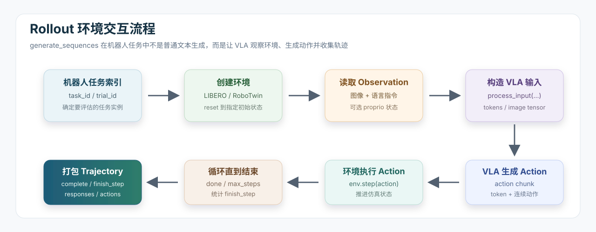

# 10.4.3.2 Rollout

上一节看的是 `RayTrainer.fit()`:其中 Trainer 从 dataset 取出 `task_id / trial_id`，然后调用：

```python
gen_batch_output = self.actor_rollout_wg.generate_sequences(prompts=gen_batch)
```

这一节就接着这行代码往下看：`generate_sequences` 到底做了什么？

在普通语言模型 RL 里，`generate_sequences` 通常表示“给一个 prompt，让模型生成一段文本”。但在 SimpleVLA-RL 里，它的含义变成了一条机器人环境交互流水线：



所以，Rollout 是 SimpleVLA-RL 最像机器人系统的部分。它把 VLA 从“模型文件”变成一个真的能在仿真环境里行动的策略。

## 本节核心概念

先把这一节要学习的组件列出来。它们和上一节的 Trainer 是连续的：Trainer 负责调度，Rollout 负责真正进入环境采样。

| 概念 / 组件 | 在代码中的位置 | 简单解释 |
| --- | --- | --- |
| Rollout | `RobHFRollout` | 让 VLA 在机器人环境中执行动作，并把轨迹打包成训练 batch |
| `generate_sequences` | `fsdp_workers.py` 和 `rob_rollout.py` | Trainer 调用的采样入口。名字像文本生成，但这里生成的是动作轨迹 |
| `RobActorRolloutRefWorker` | `verl/workers/fsdp_workers.py` | Ray worker。负责加载模型、调用 rollout、重算 old logprob、后续还会做 actor update |
| `RobHFRollout` | `verl/workers/rollout/rob_rollout.py` | 具体的机器人 rollout 实现，支持 LIBERO 和 RoboTwin |
| Observation | 环境返回的 `obs` | 机器人当前看到和感知到的信息，例如图像、末端位置、夹爪状态 |
| VLA 输入 | `process_input(...)` | 把 observation 和语言任务描述转成 `input_ids`、`attention_mask`、`pixel_values`、可选 `proprio` |
| Action token | `responses` | 模型生成的动作 token，后面要用来计算 old logprob 和 PPO loss |
| Continuous action | `actions` | 反归一化后的连续机器人动作，可以直接送给环境执行 |
| Action chunk | `action_chunks_len` | 一次模型调用生成多步动作。LIBERO 常用 8，RoboTwin 常用 25 |
| `complete` | rollout 输出字段 | 当前任务是否成功完成。后面 `RobRewardManager` 用它生成 reward |
| `finish_step` | rollout 输出字段 | 环境实际执行了多少步。后面用于判断哪些 action token 是有效的 |
| old logprob | `old_log_probs` | 采样时策略对这些 action token 的概率，PPO 更新时要用 |

这一节的主线是：

```text
Trainer 调 generate_sequences
-> Worker 准备模型和 batch
-> RobHFRollout 创建环境
-> process_input 构造 VLA 输入
-> VLA 生成 action chunk
-> 环境执行 action
-> 打包 responses / complete / finish_step
-> 回到 Trainer 做 reward 和 PPO
```

## 本节要读的代码

主要代码在两个文件里：

```text
SimpleVLA-RL/verl/workers/fsdp_workers.py
SimpleVLA-RL/verl/workers/rollout/rob_rollout.py
```

| 文件 | 作用 |
| --- | --- |
| `fsdp_workers.py` | Ray worker 层。负责把 batch 放到 GPU、调用 rollout、重算 old logprob，并完成资源清理 |
| `rob_rollout.py` | 机器人环境交互层。负责 LIBERO/RoboTwin 环境、VLA 输入处理、动作执行和输出打包 |

先记住两层关系：

```text
RayTrainer.fit()
-> actor_rollout_wg.generate_sequences(...)
-> RobActorRolloutRefWorker.generate_sequences(...)
-> RobHFRollout.generate_sequences(...)
```

## 第一层：Worker 接到 Trainer 的请求

上一节看到 Trainer 调用：

```python
self.actor_rollout_wg.generate_sequences(prompts=gen_batch)
```

这个调用会进入 `fsdp_workers.py` 中的 worker 方法：

```python
@register(dispatch_mode=Dispatch.DP_COMPUTE_PROTO)
def generate_sequences(self, prompts):
    prompts = prompts.to('cuda')
    recompute_log_prob = prompts.meta_info.get('recompute_log_prob', True)
    ...
    output = self.rollout.generate_sequences(prompts=prompts)
    ...
    if self._is_actor and recompute_log_prob:
        old_log_probs = self.actor.compute_log_prob(data=output)
        output.batch['old_log_probs'] = old_log_probs
```

这里发生了几件事：

| 步骤 | 含义 |
| --- | --- |
| `prompts.to('cuda')` | 把任务 batch 放到 GPU 上 |
| `self.rollout.generate_sequences(...)` | 真正进入机器人环境采样 |
| `compute_log_prob(data=output)` | 对刚采到的 action token 重算 old logprob |
| `output.to('cpu')` | 采样结果搬回 CPU，交给 Trainer 后续处理 |

这里的 old logprob 很重要。PPO 更新时要比较“采样时的策略概率”和“更新后的策略概率”。所以 rollout 不只要生成动作，还要保存当时策略对这些动作的概率。

## 第二层：RobHFRollout 接管机器人环境

Worker 里的 `self.rollout` 对应 `rob_rollout.py` 里的：

```python
class RobHFRollout(BaseRollout):
```

它的入口是：

```python
def generate_sequences(self, prompts):
    batch_size = prompts.batch.batch_size[0]
    ...
    batch_prompts = prompts.chunk(chunks=num_chunks)
    output = [self._generate_minibatch(p) for p in batch_prompts]
    output = DataProto.concat(output)
    return output
```

这一步会根据 micro batch 把 prompts 切小，然后逐个调用 `_generate_minibatch`。

```python
def _generate_minibatch(self, prompts):
    if "robotwin" in self.config.task_suite_name:
        return self._generate_minibatch_robotwin(prompts)
    else:
        return self._generate_minibatch_libero(prompts)
```

所以同一个 rollout 类支持两条环境路线：

| 路线 | 函数 | 并行方式 |
| --- | --- | --- |
| LIBERO | `_generate_minibatch_libero(...)` | `multiprocessing.Process`，每个环境一个子进程 |
| RoboTwin | `_generate_minibatch_robotwin(...)` | `ThreadPoolExecutor`，多线程初始化和 step |

为什么 LIBERO 用进程？因为 MuJoCo / robosuite / offscreen rendering 比较重，独立进程隔离更稳。RoboTwin 则用 wrapper 加线程池管理环境。

## LIBERO rollout：从 task_id 到环境

LIBERO 主循环在：

```python
def _generate_minibatch_libero(self, prompts):
```

它先从 prompt batch 里拿任务索引：

```python
task_id = prompts.batch['task_id'].repeat_interleave(n_samples, dim=0)
trial_id = prompts.batch['trial_id'].repeat_interleave(n_samples, dim=0)
task_suite_name = np.repeat(prompts.non_tensor_batch['task_suite_name'], n_samples)
```

这里也呼应数据与任务构建一节：dataset 里没有图像和动作，只有 `task_id / trial_id` 这样的索引。到了 rollout 才真正创建环境。

每个 LIBERO 环境会被放进一个子进程：

```python
p = Process(
    target=env_worker,
    args=(task_name, t_id, tr_id, self.config, input_q, output_q, is_valid, global_steps, max_steps)
)
```

子进程函数是：

```python
def env_worker(task_name, task_id, trial_id, config, input_queue, output_queue, is_valid, global_steps, max_steps):
```

它做这些事：

```text
根据 task_name 创建 benchmark
-> 根据 task_id 找到具体任务
-> 根据 trial_id 取初始状态
-> 创建 LIBERO env
-> reset 并 set_init_state
-> 用 dummy action 等待环境稳定
-> 把初始 obs 和 task_description 发回主进程
```

对应代码里有：

```python
task_suite = benchmark_dict[task_name]()
task = task_suite.get_task(task_id)
initial_states = task_suite.get_task_init_states(task_id)
initial_state = initial_states[trial_id]
...
env, task_description = get_libero_env(task, config.model_family, resolution=256)
obs = env.set_init_state(initial_state)
```

这里的 `task_description` 就是语言指令的来源之一，后面会变成 VLA prompt。

## Observation：环境到底给了什么

LIBERO 环境返回的原始 `obs` 会被 `_obs_to_input(...)` 整理：

```python
def _obs_to_input(self, obs, is_robotwin=False, robotwin_version="1.0"):
```

LIBERO 分支会构造：

```python
state = np.concatenate([
    obs["robot0_eef_pos"],
    quat2axisangle(obs["robot0_eef_quat"]),
    obs["robot0_gripper_qpos"]
])
```

然后根据图像数量返回：

```python
{
    "full_image": get_libero_image(obs, 224),
    "state": state
}
```

如果 `num_images_in_input > 1`，还会加入：

```python
"wrist_image": get_libero_wrist_image(obs, 224)
```

几个字段的含义：

| 字段 | 含义 |
| --- | --- |
| `full_image` | 主视角图像，通常来自 `agentview_image` |
| `wrist_image` | 腕部相机图像，来自 robot eye-in-hand camera |
| `state` | 机器人自身状态，包括末端位置、姿态、夹爪状态 |

在 LIBERO 默认脚本里通常是：

```bash
actor_rollout_ref.rollout.num_images_in_input=1
actor_rollout_ref.rollout.use_proprio=False
```

所以 VLA 主要看主视角图像和语言指令；`state` 会被整理出来，但默认不作为 proprio 输入给模型。

## process_input：把 observation 变成 VLA 输入

环境 observation 不能直接丢给 VLA。Rollout 会调用：

```python
vla_input = self.process_input(current_inputs, current_task_descriptions)
```

`process_input(...)` 会构造语言 prompt：

```python
prompt = f"In: What action should the robot take to {task_description.lower()}?\nOut:"
```

然后把 prompt 和图像交给 processor：

```python
batch_feature = self.processor(prompt, image)
```

最后得到模型输入 (vla_input)：

```text
input_ids
attention_mask
pixel_values
可选 proprio
```

这些字段的含义：

| 字段 | 含义 |
| --- | --- |
| `input_ids` | 语言 prompt 对应的 token id |
| `attention_mask` | 哪些 token 是有效 token，哪些是 padding |
| `pixel_values` | 图像经过 processor 后的张量 |
| `proprio` | 机器人自身状态，RoboTwin 常用，LIBERO 默认不用 |

OpenVLA-OFT 还会做 padding、排序和图像拼接：

```python
batchdata["input_ids"] = pad_sequence(...)
batchdata["attention_mask"] = pad_sequence(...)
batchdata["pixel_values"] = torch.cat(...)
```

这些处理是为了让在线 rollout 的输入格式和 SFT 训练时保持一致。

## vla_preprocess：检查动作反归一化 key

在 rollout 初始化时会调用：

```python
def vla_preprocess(self):
```

OpenVLA-OFT 路线会检查：

```python
assert self.config.unnorm_key in self.module.norm_stats
```

`unnorm_key` 来自启动脚本：

```bash
actor_rollout_ref.rollout.unnorm_key=$DATASET_NAME
```

对于 LIBERO，通常是：

```bash
unnorm_key=libero_10
```

但 OpenVLA-OFT 的统计里可能叫：

```text
libero_10_no_noops
```

所以代码里有一个兼容逻辑：

```python
if self.config.unnorm_key not in self.module.norm_stats and f"{self.config.unnorm_key}_no_noops" in self.module.norm_stats:
    self.config.unnorm_key = f"{self.config.unnorm_key}_no_noops"
```

这个 key 很重要。VLA 模型输出的动作通常是归一化空间里的值，必须根据训练数据统计还原成环境能执行的连续动作。`unnorm_key` 选错，动作尺度会和环境接口不匹配，策略表现会明显不稳定。

## 生成 action：OpenVLA-OFT 路线

真正让模型生成动作的是：

```python
vla_output = self._generate_one_step(vla_input)
```

它根据模型类型分流：

```python
if self.config.vla == "openvla-oft":
    return self._generate_one_step_oft(prompts)
elif self.config.vla == "openvla":
    return self._generate_one_step_openvla(prompts)
```

OpenVLA-OFT 主要调用：

```python
actions, response = self.module.generate_action_verl(
    input_ids=idx,
    pixel_values=pixel_values,
    proprio=proprio,
    attention_mask=attention_mask,
    unnorm_key=self.config.unnorm_key,
    temperature=temperature,
)
```

这里返回两个东西：

| 返回值 | 作用 |
| --- | --- |
| `actions` | 已经反归一化的连续动作，直接送进环境执行 |
| `response` | 动作 token，后面用于 old logprob 和 PPO loss |

这就是 VLA-RL 的关键点：环境执行需要连续动作，但 PPO 更新需要 token-level 的 `responses` 和 logprob。Rollout 必须同时保存这两种表示。

## action chunk

LIBERO 脚本里通常配置：

```bash
actor_rollout_ref.model.action_token_len=7
actor_rollout_ref.model.action_chunks_len=8
```

含义是：

| 配置 | 含义 |
| --- | --- |
| `action_token_len=7` | 一个 action 是 7 维，例如末端位姿增量和夹爪控制 |
| `action_chunks_len=8` | 一次模型调用生成 8 个连续 action |

也就是说，模型不是每执行一步都重新看图生成一次，而是一次预测一段短动作序列。主循环里：

```python
step += self.config.action_chunks_len
```

说明每轮 VLA 调用后，环境会向前推进一个 action chunk。

好处是减少模型调用次数，也符合 OpenVLA-OFT 的动作建模方式。代价是一个 chunk 内的动作会连续执行，因此动作尺度、采样温度和环境接口需要保持匹配。

## 环境执行 action：LIBERO 分支

LIBERO 的 action 执行发生在子进程 `env_worker` 中：

```python
for i in range(len(action)):
    a = action[i]
    normalized_action = normalize_gripper_action(a, binarize=True)
    inverted_action = invert_gripper_action(normalized_action)
    obs, reward, done, info = env.step(inverted_action.tolist())
```

这里有两个夹爪相关处理：

| 函数 | 作用 |
| --- | --- |
| `normalize_gripper_action` | 把夹爪动作归一到 LIBERO/robosuite 期望范围 |
| `invert_gripper_action` | 翻转夹爪符号，使模型输出和环境接口对齐 |

这是动作接口里最需要仔细对齐的部分。模型输出、`unnorm_key`、夹爪方向和环境动作约定需要一致，否则策略执行效果会明显下降。

每执行一步，`env_worker` 会更新：

```python
finish_step += 1
if done or finish_step >= max_steps:
    active = False
    complete = done
    break
```

然后把结果发回 rollout 主进程：

```python
output_data = {
    'type': 'step',
    'obs': obs,
    'active': active,
    'complete': complete,
    'finish_step': finish_step,
}
```

这两个字段会一路传回 Trainer：

| 字段 | 作用 |
| --- | --- |
| `complete` | 后面 `RobRewardManager` 用它判断 reward 是 1 还是 0 |
| `finish_step` | 后面用于确定有效 action token 长度，reward 放置和 advantage mask 都要用 |

## RoboTwin rollout

RoboTwin 分支是：

```python
def _generate_minibatch_robotwin(self, prompts):
```

它和 LIBERO 主线相似，但有几个差异：

| 项目 | LIBERO | RoboTwin |
| --- | --- | --- |
| 并行方式 | 多进程 `Process` | 线程池 `ThreadPoolExecutor` |
| 环境包装 | `env_worker` + LIBERO benchmark | `RobotwinEnvWrapper` |
| 任务索引 | `task_id`、`trial_id` | `task_id`、`trial_id`、`trial_seed` |
| proprio | 默认不用 | 常用 `use_proprio=True` |
| 图像 | 主视角，可选腕部相机 | head camera，可选左右 wrist camera |
| 动作维度 | 7 | 14 |
| action chunk | 8 | 25 |

RoboTwin 会用：

```python
wrapper = RobotwinEnvWrapper(task_name, tr_id, tr_seed, self.config, version=self.robotwin_version)
```

然后并行初始化：

```python
future = self.env_thread_pool.submit(wrapper.initialize)
```

执行动作时：

```python
future = self.env_thread_pool.submit(env_wrappers[idx].step, actions[idx])
```

RoboTwin 还会把 proprio 加进输入：

```python
if self.config.use_proprio and "robotwin" in self.config.task_suite_name:
    batchdata["proprio"] = []
```

proprio 可以理解为机器人自己的身体状态，比如关节、末端、夹爪等。双臂任务里，光看图像往往不够，所以 RoboTwin 更依赖 proprio。

## 打包输出：回到 Trainer 的 batch

一条 rollout 不只要知道成功失败，还要保留训练 PPO 所需的信息。最后 `_prepare_output_batch(...)` 会把每一步 VLA 调用记录起来：

```python
batch = {
    'responses': [],
    'input_ids': [],
    'attention_mask': [],
    'pixel_values': []
}
```

如果使用 proprio，还会加：

```python
batch["proprio"] = []
```

然后把每个 step 的记录 stack 起来：

```python
for k, v in batch.items():
    batch[k] = torch.stack(v, dim=1)
```

最后加上环境结果：

```python
batch["complete"] = torch.tensor([...])
batch["finish_step"] = torch.tensor([...])
```

并返回：

```python
return DataProto(batch=output_batch)
```

所以传回 Trainer 的 `DataProto` 至少包含：

| 字段 | 后续用途 |
| --- | --- |
| `responses` | 动作 token，计算 old logprob、PPO loss、reward mask |
| `input_ids` | prompt token，计算 logprob 时需要重新前向 |
| `attention_mask` | 标记有效 token 和 padding |
| `pixel_values` | 图像输入，重算 logprob 和 actor 更新时要用 |
| `proprio` | RoboTwin 等任务的本体状态输入 |
| `complete` | reward manager 判断成功失败 |
| `finish_step` | 判断有效 action token 长度 |
| `old_log_probs` | worker 层重算后加入，PPO 更新用 |

这就和 03 节连起来了：Trainer 拿到这些字段后，会调用 `RobRewardManager.verify(...)`、`filter(...)`、`reward_fn(batch)`、`compute_advantage(...)` 和 `update_actor(...)`。

## validation 视频保存

Rollout 在 validation 时还会保存视频：

```python
save_rollout_video(images, self.config.experiment_name, task_file, global_steps, complete)
```

视频不是训练信号，但对理解策略行为很重要。成功率只能说明是否完成任务，视频可以帮助观察失败发生在感知、动作尺度、夹爪控制还是任务初始化等环节。例如：

| 视频现象 | 可能原因 |
| --- | --- |
| 机械臂动作不稳定或幅度异常 | 模型能力不足、采样温度过高、动作反归一化 key 不匹配 |
| 接近目标但不夹 | 夹爪动作符号或尺度不匹配 |
| 动作幅度很小 | action 输出接近 0，或动作尺度配置不合适 |
| 看不到目标 | 相机输入、裁剪或任务初始化不匹配 |
| 偶尔成功 | SFT 模型有基础能力，RL 可以继续从部分成功样本学习 |


## 日志怎么对应 Rollout

训练日志里常见：

```text
gen: XXXX seconds
Accuracy distribution: 0.00:15 0.12:13 ... 1.00:2
Filtered batch size: XXX (from original size: 512)
collected XXX / 512 rollouts and each prompt has 8 responses
```

这些日志和 Rollout 的关系是：

| 日志 | 对应阶段 |
| --- | --- |
| `gen` | `generate_sequences` 完整耗时，包括环境 rollout 和 old logprob |
| `each prompt has 8 responses` | `data.n_samples=8`，同一个任务采 8 条轨迹 |
| `Accuracy distribution` | Trainer 根据 rollout 的 `complete` 统计组内成功率 |
| `Filtered batch size` | 过滤掉全失败和全成功后剩余样本数量 |
| `collected` | Trainer 已经收集了多少可训练 rollout |

`gen` 通常较慢，因为这里包含真实的仿真环境交互和模型前向。正式训练中，一个 `gen` 可能持续较长时间。


## 本节小结

Rollout 把 Trainer 一节给出的任务索引变成真正可训练的机器人轨迹：

```text
task_id / trial_id
-> 创建环境
-> observation + task description
-> process_input 构造 VLA 输入
-> generate_action_verl 生成 action token 和连续动作
-> env.step 执行动作 chunk
-> 记录 complete / finish_step
-> 打包 DataProto 返回 Trainer
```

理解 Rollout 后，就能看懂训练日志里的成功率、过滤数量和 rollout 耗时分别对应哪一段流程。下一节再看 Actor 与策略优化时，就可以专注在 `responses / old_log_probs / advantages` 如何进入 PPO loss。
