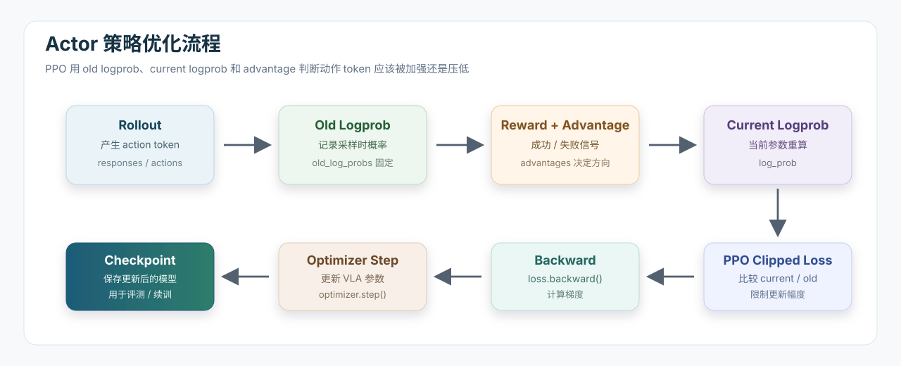

# 10.4.3.3 Actor 与策略优化

前面几节已经把训练流程走到了这里：

```text
启动脚本给出配置
-> Dataset 提供 task_id / trial_id / seed
-> Trainer 调度训练循环
-> Rollout 进入 LIBERO / RoboTwin 环境采样
-> RewardManager 把成功/失败变成 reward
-> Trainer 计算 advantage
```

这一节看最后一步：Actor 如何根据这些 rollout 结果更新 VLA 模型参数。

在 SimpleVLA-RL 里，Actor 可以理解为“当前正在学习的策略模型”。它接收上一节 rollout 产生的 `responses / input_ids / pixel_values / finish_step`，再加上 Trainer 算好的 `advantages`，最后通过 PPO loss 做反向传播。

如果说 Rollout 负责“让机器人去试一试”，那么 Actor 负责“根据试出来的结果调整模型”。这一节最重要的问题是：

```text
同一批轨迹已经采出来了，模型到底根据什么判断哪些动作该加强、哪些动作该压低？
```

答案就是：`old_log_probs` 记录采样时的动作概率，`advantages` 告诉这条轨迹好不好，`current logprob` 表示更新时当前模型重新给这些动作打的概率。PPO loss 把三者放在一起，控制模型朝更好的动作方向移动。

这一节的主线可以画成下面这条策略优化流水线：



这里要特别注意：在 `old_log_probs -> reward / advantages -> current logprob` 这几步之间，模型参数通常还没有真正改变。模型真正发生变化是在 `loss.backward()` 之后的 `optimizer.step()`。所谓 old/current，更多是在 PPO 里区分“采样时记录下来的概率”和“更新时当前参数重新算出来的概率”。

## 本节核心概念

先把这一节要学习的组件列出来。它们和前面的 Trainer、Rollout 是连在一起的：

| 概念 / 组件 | 在代码中的位置 | 简单解释 |
| --- | --- | --- |
| Actor | `RobDataParallelPPOActor` | 真正计算 logprob、PPO loss，并执行反向传播的策略模块 |
| Policy | VLA 模型本身 | 给定图像和语言指令，输出动作 token 或连续动作的模型 |
| `RobActorRolloutRefWorker` | `verl/workers/fsdp_workers.py` | Ray worker 外壳，负责模型加载、FSDP 包装、rollout、old logprob、actor update 和 checkpoint |
| FSDP | PyTorch Fully Sharded Data Parallel | 多 GPU 训练大模型的方式，把参数、梯度、优化器状态切到多张 GPU 上 |
| Hybrid engine | `actor_rollout_ref` role | 同一组 worker 同时承担 actor、rollout、reference policy 的部分职责 |
| old logprob | `old_log_probs` | rollout 采样时，采样策略对 action token 的 log probability |
| current logprob | `log_prob` | Actor 更新时，当前策略重新计算出来的 log probability |
| Advantage | `advantages` | 这条动作轨迹比平均水平好多少。正值鼓励，负值抑制 |
| response mask | `response_mask` / `eos_mask` | 标记哪些 action token 是真实执行过的，哪些不应该参与 loss |
| PPO clipped loss | `compute_policy_loss(...)` | 用 clipping 限制策略每次更新幅度，避免一步改得太猛 |
| Entropy | `compute_entropy(...)` | 衡量策略分布有多分散，主要用于观察探索程度 |
| Optimizer step | `_optimizer_step()` | 梯度裁剪后更新模型参数 |
| Checkpoint | `save_checkpoint(...)` | 把训练后的 VLA 模型保存下来，用于继续训练、评测或部署 |


## 本节要读的代码

主要代码在三个文件里：

```text
SimpleVLA-RL/verl/workers/fsdp_workers.py
SimpleVLA-RL/verl/workers/actor/dp_rob.py
SimpleVLA-RL/verl/trainer/ppo/core_algos.py
```

| 文件 | 作用 |
| --- | --- |
| `fsdp_workers.py` | Worker 层。负责加载模型、管理 FSDP、调用 rollout、调用 actor update、保存 checkpoint |
| `dp_rob.py` | Actor 数学层。负责 logprob、entropy、response mask、PPO loss 和 optimizer step |
| `core_algos.py` | PPO / GRPO 等算法函数。`compute_policy_loss(...)` 在这里 |

调用关系是：

```text
RayTrainer.fit()
-> self.actor_rollout_wg.update_actor(batch)
-> RobActorRolloutRefWorker.update_actor(data)
-> RobDataParallelPPOActor.update_policy(data)
-> core_algos.compute_policy_loss(...)
-> optimizer.step()
```

这也是本节的阅读路线。


## old logprob：PPO 的采样锚点

上一节讲 Rollout 时已经看到，worker 的 `generate_sequences(...)` 会做两件事：

```text
1. 调 rollout.generate_sequences(...) 生成轨迹
2. 对刚生成的 responses 重算 old_log_probs
```

对应代码是：

```python
output = self.rollout.generate_sequences(prompts=prompts)
...
if self._is_actor and recompute_log_prob:
    output.meta_info['micro_batch_size'] = self.config.rollout.log_prob_micro_batch_size
    output.meta_info['temperature'] = self.config.rollout.temperature
    output.meta_info['pad_token_id'] = self.tokenizer.pad_token_id
    old_log_probs = self.actor.compute_log_prob(data=output)
    output.batch['old_log_probs'] = old_log_probs
```

这里的 `old` 容易让人误解。它不是指“很久以前的 checkpoint”，而是指“本轮 rollout 采样时的策略”。

在一次训练 step 里，流程大致是：

```text
当前模型先进入环境采样
-> 采样结束后，把当时这些 action token 的概率记成 old_log_probs
-> 后面 PPO 更新时，old_log_probs 固定不变
```

为什么要保存 old logprob？因为 PPO 更新时不能只看“当前策略觉得这个动作概率多大”，还要知道“采样时策略觉得这个动作概率多大”。PPO 比较的是两者的比值：

```text
ratio = exp(current_logprob - old_logprob)
```

如果 ratio 太大，说明当前策略把这个动作概率抬得太高；如果 ratio 太小，说明当前策略把这个动作概率压得太低。PPO 的 clipping 就是为了限制这种变化幅度。

所以 old logprob 是 PPO 的锚点。没有它，就不知道当前策略相比采样时改变了多少。

可以先记住这张小表：

| 名称 | 什么时候算 | 会不会随着本次更新变化 | 作用 |
| --- | --- | --- | --- |
| `old_log_probs` | rollout 结束后 | 不变 | 记录“采样时策略”对动作 token 的概率 |
| `log_prob` | actor update 时 | 会变 | 记录“当前策略”对同一批动作 token 的概率 |

## compute_log_prob：如何给 action token 算概率

old logprob 是在 `dp_rob.py` 的 `compute_log_prob(...)` 里计算的：

```python
def compute_log_prob(self, data: DataProto) -> torch.Tensor:
    self.actor_module.eval()
    micro_batch_size = data.meta_info['micro_batch_size']
    temperature = data.meta_info['temperature']
    self.pad_token_id = data.meta_info['pad_token_id']

    select_keys = ['responses', 'input_ids', 'attention_mask', 'pixel_values', 'finish_step']
    if self.config.use_proprio:
        select_keys.append('proprio')
    batch = data.select(batch_keys=select_keys).batch
```

它会从 rollout 输出里取出：

| 字段 | 作用 |
| --- | --- |
| `responses` | 模型生成的 action token |
| `input_ids` | 语言 prompt 的 token |
| `attention_mask` | prompt 中哪些 token 有效 |
| `pixel_values` | 图像输入 |
| `finish_step` | 环境实际执行到第几步 |
| `proprio` | 可选，本体状态输入 |

然后按 micro batch 调 `_forward_micro_batch(...)`，避免一次前向太大。

对于 OpenVLA-OFT，模型输出 logits 后，代码只取动作 token 对应的那一段：

```python
assert self.actor_module.vocab_size == 32000
start_index = self.actor_module.vocab_size - 256
logits = logits[..., -256-64:-64]
responses = responses - start_index
```

这段代码说明：OpenVLA-OFT 把动作离散成 256 个 bin。Actor 计算 logprob 时，不是对整个语言词表算概率，而是只在动作 bin 上计算。

这也是 SimpleVLA-RL 和普通语言模型 RL 的一个重要区别：这里训练的是 action token，不是自然语言回答。

## finish_step 和 response mask

机器人环境里的轨迹长度不一定完全一样。有的任务可能提前完成，有的可能执行到最大步数才结束。因此 Actor 更新时不能把所有 token 都当成有效训练信号。

在 `update_policy(...)` 中，代码根据 `finish_step` 构造 mask：

```python
response_length = responses.size(1) * responses.size(2)
finish_step = data['finish_step'] * self.config.action_token_len
steps = torch.arange(response_length, device=data['responses'].device)
steps_expanded = steps.unsqueeze(0).expand(data['responses'].size(0), -1)
response_mask = steps_expanded < finish_step.unsqueeze(1)
```

可以这样理解：

```text
finish_step 告诉我们环境执行了多少个动作 step
每个动作 step 对应 action_token_len 个 token
所以有效 token 数 = finish_step * action_token_len
```

`response_mask` 的作用是：

| token 类型 | 是否参与 loss |
| --- | --- |
| 真实执行过的 action token | 参与 |
| 任务结束后的 padding token | 不参与 |
| 超出有效轨迹长度的 token | 不参与 |

这一步非常关键。机器人 RL 里的“有效 token”不只由文本 padding 决定，还由环境实际执行步数决定。

## update_actor：Worker 如何触发策略更新

Trainer 在 `RayTrainer.fit()` 中会调用：

```python
actor_output = self.actor_rollout_wg.update_actor(batch)
```

这个调用进入 `fsdp_workers.py`：

```python
@register(dispatch_mode=Dispatch.DP_COMPUTE_PROTO)
def update_actor(self, data: DataProto):
    assert self._is_actor
    ...
    metrics = self.actor.update_policy(data=data)
    self.actor_lr_scheduler.step()
    lr = self.actor_lr_scheduler.get_last_lr()[0]
    metrics['actor/lr(1e-4)'] = lr * 1e4
    ...
    return output
```

Worker 这一层主要做工程管理：

```text
必要时把 FSDP 参数加载回 GPU
-> 调用 actor.update_policy(...)
-> 更新学习率 scheduler
-> 收集 metrics
-> 必要时把参数/optimizer offload 回 CPU
-> 返回结果给 Trainer
```

真正的 PPO loss 不在 Worker 里，而在 `dp_rob.py` 的 `RobDataParallelPPOActor.update_policy(...)`。

## update_policy：Actor 真正做 PPO 更新

`update_policy(...)` 是策略优化的核心。它先取出训练需要的字段：

```python
select_keys = [
    'responses',
    'input_ids',
    'attention_mask',
    'pixel_values',
    'old_log_probs',
    'advantages',
    'finish_step'
]
if self.config.use_proprio:
    select_keys.append('proprio')
```

这些字段来自不同阶段：

| 字段 | 来自哪里 |
| --- | --- |
| `responses` | Rollout 中模型生成的 action token |
| `input_ids` / `attention_mask` / `pixel_values` | Rollout 构造的 VLA 输入 |
| `old_log_probs` | Rollout 后 Actor 重算的旧策略概率 |
| `advantages` | Trainer 根据 reward 和 GRPO 算出来 |
| `finish_step` | 环境 rollout 返回的实际执行步数 |
| `proprio` | 可选，机器人本体状态 |

接着它会切 mini batch 和 micro batch：

```python
dataloader = batch.split(self.config.ppo_mini_batch_size)
micro_batches = mini_batch.split(self.config.ppo_micro_batch_size)
```

这里两个 batch 的区别是：

| 名称 | 作用 |
| --- | --- |
| `ppo_mini_batch_size` | PPO 一次更新使用的一组样本 |
| `ppo_micro_batch_size` | 为了资源可控，把 mini batch 再切小做前向/反向 |

然后对每个 micro batch 重新计算当前策略的 logprob：

```python
entropy, log_prob = self._forward_micro_batch_update(
    input_ids=input_ids[...],
    attention_mask=attention_mask[...],
    pixel_values=pixel_values[...],
    responses=responses[...],
    temperature=temperature,
    proprio=proprio[...] if proprio is not None else None,
)
```

注意这里的 `log_prob` 已经不是 old logprob，而是当前策略在本次更新时重新算出来的 logprob。PPO loss 就是比较它和 `old_log_prob`。

在更新刚开始时，`current logprob` 和 `old_log_probs` 可能非常接近，因为模型还没来得及发生明显变化。随着 mini-batch / micro-batch 里的反向传播逐步执行，当前模型参数会被更新，后续重新算出来的 `log_prob` 就可能和固定下来的 `old_log_probs` 拉开差异。

## PPO clipped loss：核心直觉

`dp_rob.py` 最后会调用：

```python
pg_loss, pg_clipfrac, ppo_kl = core_algos.compute_policy_loss(
    old_log_prob=old_log_prob_tmp,
    log_prob=log_prob,
    advantages=advantages_tmp,
    eos_mask=response_mask_tmp,
    clip_ratio_high=clip_ratio_high,
    clip_ratio_low=clip_ratio_low,
)
```

`core_algos.py` 里的实现是：

```python
negative_approx_kl = log_prob - old_log_prob
ratio = torch.exp(negative_approx_kl)

pg_losses = -advantages * ratio
pg_losses2 = -advantages * torch.clamp(
    ratio,
    1.0 - clip_ratio_low,
    1.0 + clip_ratio_high,
)

pg_loss = masked_mean(torch.max(pg_losses, pg_losses2), eos_mask)
```

这段公式可以拆成三句话：

| 代码 | 直觉 |
| --- | --- |
| `ratio = exp(log_prob - old_log_prob)` | 当前策略相对旧策略，把这个动作概率放大或缩小了多少 |
| `advantages > 0` | 这条动作轨迹比平均好，应该提高概率 |
| `advantages < 0` | 这条动作轨迹比平均差，应该降低概率 |
| `torch.clamp(...)` | 不允许概率变化幅度太大 |
| `masked_mean(..., eos_mask)` | 只在有效 action token 上平均 loss |

PPO 的核心不是“只要成功就无限提高概率”，而是“朝更好的方向更新，但每一步不要偏离旧策略太远”。这就是 clipped loss 的意义。

## advantage：Actor 只使用，不负责计算

在 SimpleVLA-RL 里，Actor 不负责算 advantage。Advantage 是在 Trainer 中计算的：

```python
batch = compute_advantage(batch, ...)
```

然后 Actor 只从 batch 中读取：

```python
advantages = data['advantages']
```

这体现了职责分工：

```text
RewardManager：判断任务是否成功，生成 reward
Trainer：根据 reward 计算 advantages
Actor：使用 advantages 更新策略
```

可以把 advantage 理解成“这条轨迹该被鼓励还是压低”的权重。正 advantage 会推动模型更倾向于这些 action token；负 advantage 会推动模型减少这些 action token 的概率。

## action-token-aware：机器人动作 token 的特殊处理

前面已经从直觉上解释了 `finish_step` 和 mask。这里再从动作表示的角度看一遍：普通语言模型 PPO 主要面对文本 token，而 SimpleVLA-RL 面对机器人动作 token，所以多了几个必须处理的维度。

| 配置 / 字段 | 为什么重要 |
| --- | --- |
| `action_token_len` | 一个连续动作由多少个 token 表示。LIBERO 常见是 7 |
| `action_chunks_len` | 一次模型调用生成多少个连续动作 |
| `finish_step` | 环境实际执行到哪里，决定哪些 token 有效 |
| `responses` | 不是自然语言，而是动作 token |
| `unnorm_key` | rollout 执行动作时需要动作反归一化，虽然 PPO loss 本身主要看 token |

在 `dp_rob.py` 里，这种 action-token-aware 主要体现在：

```python
log_probs = log_probs.reshape((batch_size, traj_len * action_chunks_len, action_token_len))
mask = self.generate_traj_mask(micro_batch['finish_step'], traj_len * action_chunks_len)
log_probs, entropy = self.apply_mask_with_grad_control(log_probs, entropy, mask)
```

这里先把 logprob 还原成“轨迹步数 × 每步 action token”的结构，再按 `finish_step` 做 mask，最后再展平成 token 序列进入 PPO loss。

这就是 SimpleVLA-RL Actor 层相对普通 veRL 文本 Actor 的关键改造。

## entropy

`dp_rob.py` 里还有：

```python
def compute_entropy(self, bacth_data: DataProto):
```

源码里的参数名写作 `bacth_data`，含义就是 batch data。Entropy 可以理解为策略分布的“不确定性”：

| entropy 状态 | 含义 |
| --- | --- |
| 高 entropy | 策略比较分散，还在探索不同动作 |
| 低 entropy | 策略比较确定，动作分布更集中 |

代码会记录不同阶段的 entropy：

```python
actor_before/entropy_loss_train
actor_before/entropy_loss_eval
actor_after/entropy_loss_train
actor_after/entropy_loss_eval
```

这里的 entropy 主要用于观察策略变化，不一定作为主损失。示例脚本里通常设置：

```bash
actor_rollout_ref.actor.entropy_coeff=0.
```

也就是说，默认训练主要依赖 PPO policy loss，而不是显式加 entropy bonus。

## optimizer step：真正更新参数

PPO loss 计算完之后，Actor 会反向传播：

```python
loss.backward()
```

然后调用：

```python
grad_norm = self._optimizer_step()
```

`_optimizer_step()` 里做两件事：

```python
grad_norm = self.actor_module.clip_grad_norm_(max_norm=self.config.grad_clip)
self.actor_optimizer.step()
```

含义是：

| 步骤 | 作用 |
| --- | --- |
| gradient clipping | 限制梯度范数，避免一次更新过大 |
| optimizer step | 根据梯度更新 VLA 模型参数 |

更新完成后，Worker 还会调用 learning-rate scheduler：

```python
self.actor_lr_scheduler.step()
metrics['actor/lr(1e-4)'] = lr * 1e4
```

训练日志里的这些指标就来自这里：

```text
actor/pg_loss
actor/pg_clipfrac
actor/ppo_kl
actor/grad_norm
actor/lr(1e-4)
```

## checkpoint：保存的是什么

Trainer 会按 `save_freq` 定期调用：

```python
self.actor_rollout_wg.save_checkpoint(actor_local_path, actor_remote_path)
```

Worker 中的保存函数是：

```python
def save_checkpoint(self, local_path, hdfs_path=None):
```

它支持两种情况：

| 情况 | 保存方式 |
| --- | --- |
| LoRA 训练 | 保存 `lora_adapter`，并 merge 到 base VLA 后保存完整模型 |
| 非 LoRA 训练 | 用 FSDP full state dict 收集完整权重，再 `save_pretrained(...)` |

非 LoRA 情况下核心代码是：

```python
with FSDP.state_dict_type(self.actor.actor_module, StateDictType.FULL_STATE_DICT, cfg):
    state_dict = self.actor.actor_module.state_dict()

self.actor_module.save_pretrained(local_path, state_dict=state_dict)
self.tokenizer.save_pretrained(local_path)
```

所以 checkpoint 不是只保存一个 optimizer state。它会保存模型权重和 tokenizer，目标是让这个目录可以像 Hugging Face 模型一样被继续加载。

不过 VLA 模型还依赖 processor 配置和动作统计信息。继续训练或单独评测 checkpoint 时，需要确认目录里也有 `preprocessor_config.json`、`processor_config.json`、`dataset_statistics.json` 等文件，否则 `AutoProcessor.from_pretrained(...)` 或动作反归一化可能会出问题。

保存路径来自启动脚本中的：

```bash
trainer.default_local_dir=$CKPT_PATH/$PROJECT_NAME/$EXPERIMENT_NAME
trainer.save_freq=...
```

这使得训练中间结果可以用于：

- 继续训练。
- 单独评测。
- 和 SFT 初始模型比较。
- 后续部署或可视化分析。

## 训练日志怎么对应 Actor

Actor 更新后，日志里常见这些字段：

```text
update_actor: XXX seconds
actor/pg_loss: ...
actor/pg_clipfrac: ...
actor/ppo_kl: ...
actor/grad_norm: ...
actor/lr(1e-4): ...
actor_after/entropy_loss_eval: ...
```

它们和代码的对应关系是：

| 日志 | 来自哪里 | 含义 |
| --- | --- | --- |
| `timing/update_actor` | `RayTrainer.fit()` 计时 | Actor 更新耗时 |
| `actor/pg_loss` | `update_policy(...)` | PPO policy gradient loss |
| `actor/pg_clipfrac` | `compute_policy_loss(...)` | 有多少 token 的更新被 clipping 限制 |
| `actor/ppo_kl` | `compute_policy_loss(...)` | 当前策略和旧策略的近似差异 |
| `actor/grad_norm` | `_optimizer_step()` | 梯度范数 |
| `actor/lr(1e-4)` | `update_actor(...)` | 学习率，按 `1e-4` 做了缩放显示 |
| `actor_after/entropy_loss_eval` | `compute_entropy(...)` | 更新后策略分布的熵 |

这些指标不是孤立的。它们共同回答一个问题：Actor 是否在稳定地、不过度地改变策略。


## 本节小结

Actor 与策略优化可以概括成一条链：

```text
Rollout 输出 responses / input_ids / pixel_values / finish_step
-> Worker 计算并固定 old_log_probs
-> Trainer 计算 advantages
-> Actor 重算当前 log_prob
-> 用 response_mask 只保留有效 action token
-> PPO clipped loss 控制更新幅度
-> loss.backward()
-> FSDP optimizer step 更新 VLA 参数
-> save_checkpoint 保存模型
```

这一节最重要的理解是：SimpleVLA-RL 的 Actor 不是普通文本 PPO Actor 的简单复用。它必须理解机器人动作的 token 结构，也就是 `action_token_len`、`action_chunks_len`、`finish_step` 和 `responses` 的含义。

读完这一节后，可以把前面的启动配置、数据构建、Trainer、Rollout 和 Actor 串起来：

```text
脚本配置实验
-> Dataset 提供任务索引
-> Trainer 调度训练
-> Rollout 采样机器人轨迹
-> Actor 用 PPO 更新 VLA
```

这就是 SimpleVLA-RL 从一个 SFT VLA 模型出发，通过在线机器人交互继续强化学习的完整代码路径。
