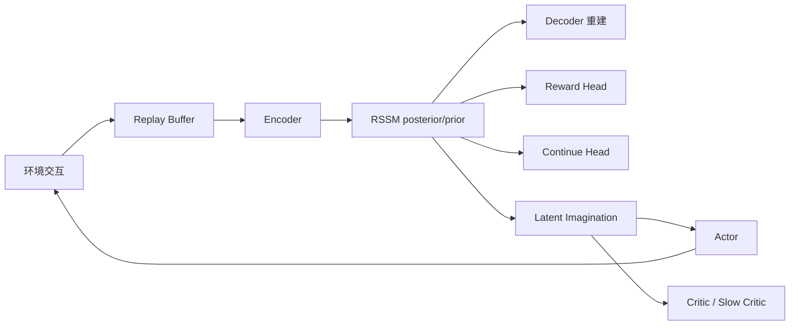
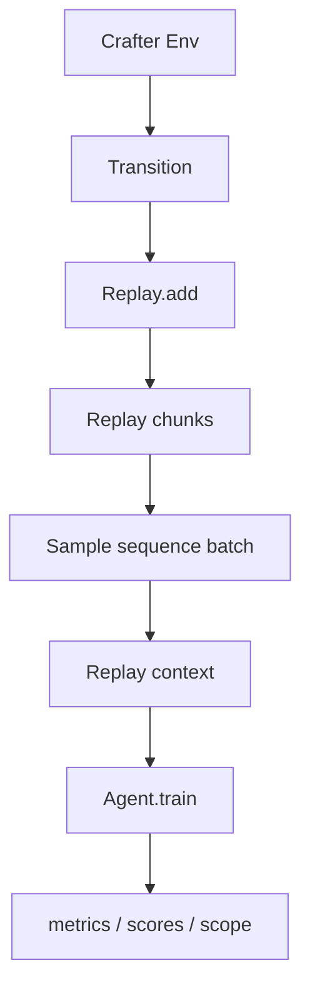
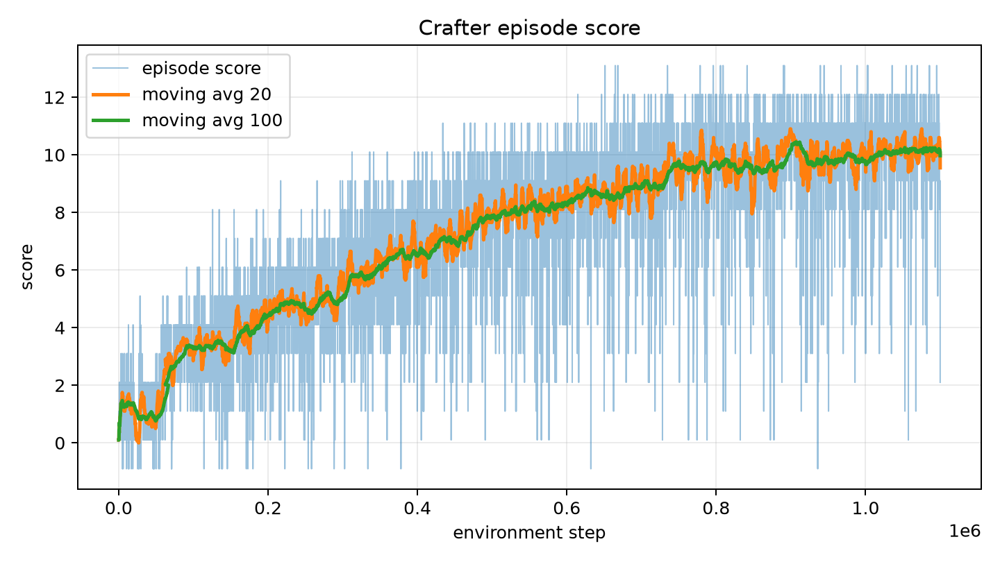
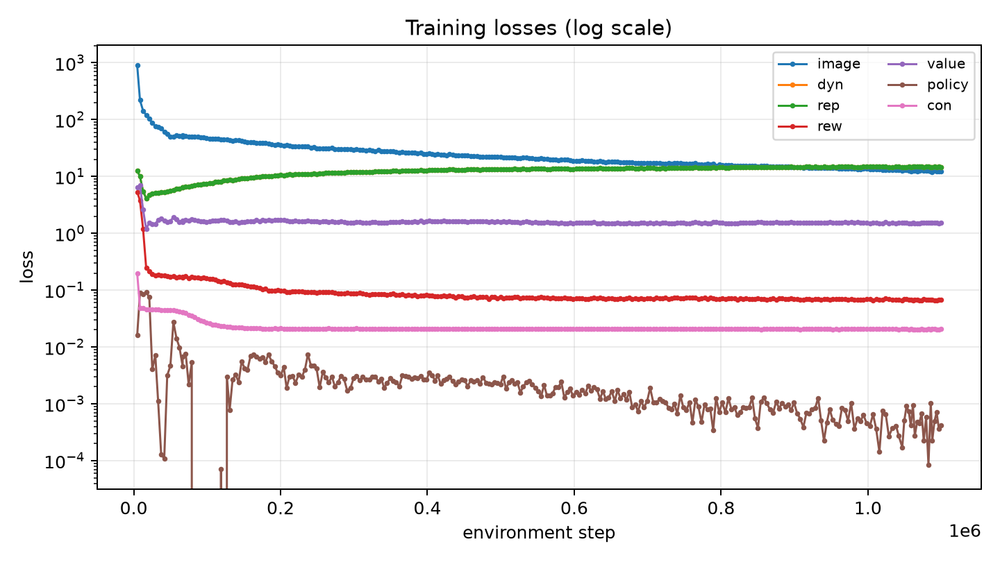
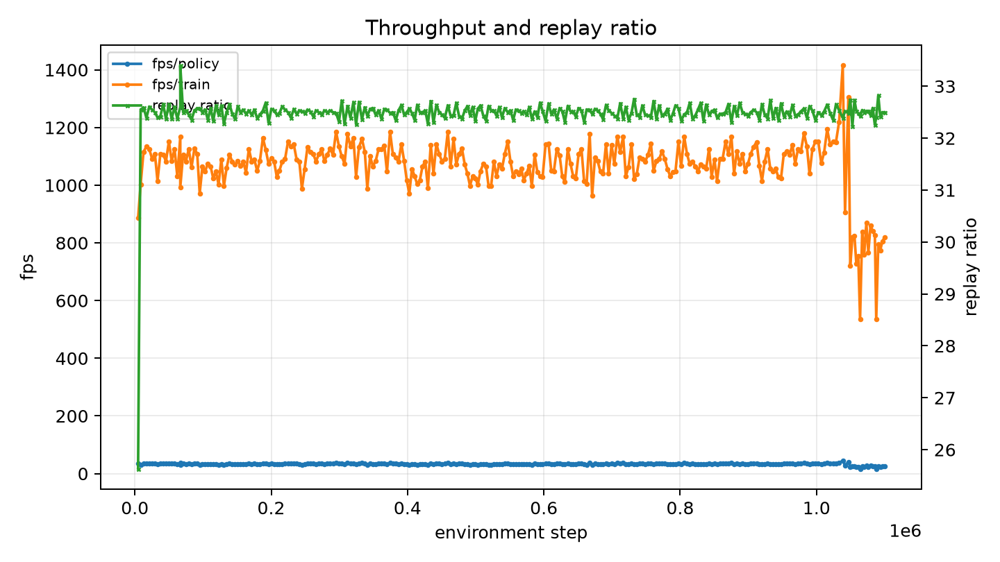

# DreamerV3

复现对象：DreamerV3，论文为 *Mastering Diverse Domains through World Models*。本报告基于官方实现和本机 Crafter 训练日志整理，目标是让读者按步骤能跑通环境、编译、训练和可视化。

主要来源：

- 论文：https://arxiv.org/abs/2301.04104
- 官方仓库：https://github.com/danijar/dreamerv3
- 官方 issues：https://github.com/danijar/dreamerv3/issues

配套材料：[DreamerV3 论文精读讲义](04-dreamerv3/01-paper-deep-dive.md)——面向刚入门读者的逐节公式与实验讲解，建议与本复现报告配合阅读。

本次实际跑通任务：Crafter。训练已按本次设置跑到 110 万环境步附近；结果用于说明复现链路和趋势，不等同于论文默认 Crafter 配置的最终分数。

命令约定：

- 默认项目目录为 `$HOME/dreamerv3`，可通过 `PROJECT_DIR=/path/to/dreamerv3` 覆盖。
- 默认日志目录为项目内 `logs`，可通过 `LOG_ROOT=$HOME/logdir` 查看已有训练。
- 文中统一使用 `.venv/bin/python`，避免系统没有 `python` 命令或忘记激活虚拟环境。
- 下载依赖的命令需要联网；训练和 viewer 命令会持续运行，看到正常输出后保持终端窗口打开即可。

---

## 1. 算法概览

DreamerV3 用世界模型学习环境动态，再在 latent 空间中展开 imagined trajectories 训练 actor-critic。整体流程是：



核心稳定化设计包括：categorical latent、symlog/symexp、free nats、1% unimix、RetNorm、block GRU、RMSNorm + SiLU、AGC 和 LaProp 风格优化器。

---

## 2. 张量符号

| 符号 | 含义 | Crafter 本次值 |
|---|---:|---:|
| `B` | batch size | 16 |
| `T` | sequence length | 64 |
| `H,W,C_img` | 图像尺寸 | 64,64,3 |
| `A` | 动作数 | 18 |
| `D` | deterministic state | 8192 |
| `S` | stochastic variables | 32 |
| `C` | categorical classes | 64 |
| `Z` | flattened stochastic dim | 2048 |
| `F` | feature dim | 10240 |
| `K` | twohot bins | 255 |

维度校验：

```text
stoch: [B,T,S,C] = [16,64,32,64]
flatten(stoch): [B,T,2048]
deter: [B,T,8192]
feat = concat(deter, flatten(stoch)) = [B,T,10240]
```

---

## 3. 模块级表格

| 模块 | 来源公式 / einsum 表达 | 输入 -> 输出 shape | 可学习参数 | 子操作顺序 | 复现风险 |
|---|---|---:|---:|---|---|
| Encoder CNN | `y=einsum('nhwk,ko->nhwo', patch(x), W)` | `[B,T,64,64,3] -> [B,T,4096]` | 3,492,864 | uint8 归一化、CNN、pooling、flatten | padding、resize、pooling 需按代码 |
| RSSM core | `y=einsum('...gi,gio->...go', x, W)` | deter/stoch/action -> deter | 95,495,168 | action 拼接、三路投影、block GRU | block GRU 不能简化 |
| Posterior | `reshape(einsum('...i,io->...o', [deter,tokens], W), S,C)` | `[B,T,D+I] -> [B,T,S,C]` | 归入 RSSM | observe path | token 维度依赖 encoder |
| Prior | `reshape(einsum('...i,io->...o', deter, W), S,C)` | `[B,T,D] -> [B,T,S,C]` | 归入 RSSM | imagination path | KL stop-gradient 容易写反 |
| KL losses | `einsum('...sc,...sc->...', q, log(q)-log(p))` | `[B,T,S,C] -> [B,T]` | 0 | dyn KL、rep KL、free nats | free nats 和 stopgrad 要对齐官方 |
| Decoder | `einsum` 线性投影 + upsample conv | `[B,T,10240] -> [B,T,64,64,3]` | 20,282,115 | spatial projection、upsample、CNN、sigmoid | 图像 loss 数值较大属正常 |
| Reward head | `-einsum('...k,...k->...', twohot(r), log_softmax(logits))` | `[B,T,F] -> [B,T,255]` | 10,749,183 | MLP、symexp twohot | reward 稀疏导致早期波动 |
| Continue head | binary CE | `[B,T,F] -> [B,T]` | 10,488,833 | MLP、binary head | `contdisc` 会修正 continuation |
| Actor | `einsum('...i,io->...o', h, W)` | `[B,T,F] -> [B,T,A]` | 12,606,481 | MLP、categorical、sample | entropy 与 return scale 强相关 |
| Critic | twohot CE | `[B,T,F] -> [B,T,255]` | 12,850,431 | MLP、symexp twohot | target 来自 imagined λ-return |
| Slow critic | EMA | 同 critic | 归入 critic | 每次训练后更新 | 代码 `rate=0.02` 等价保留 0.98 |
| Imagined rollout | `a_t~pi(s_t)`, `s_{t+1}~p(s,a)` | start -> `[B*K,H+1,F]` | 0 | replay state 起步、RSSM imagine | horizon 15 不是 episode 长度 |
| Optimizer | elementwise update | gradients -> params | 0 | AGC、RMS、momentum、warmup | JAX/CUDA 不合会编译崩溃 |

实际初始化参数：

```text
Optimizer opt has 165,965,075 params:
    95,495,168 dyn
    20,282,115 dec
    12,850,431 val
    12,606,481 pol
    10,749,183 rew
    10,488,833 con
     3,492,864 enc
```

---

## 4. 关键公式

### 4.1 线性层

```text
y[..., o] = einsum('...i,io->...o', x[..., i], W[i,o]) + b[o]
```

维度：

```text
x: [B,T,I]
W: [I,O]
y: [B,T,O]
```

### 4.2 Categorical RSSM

```text
q_logits = reshape(einsum('...i,io->...o', concat(deter,tokens), Wq), [B,T,S,C])
p_logits = reshape(einsum('...i,io->...o', deter, Wp), [B,T,S,C])
```

```text
q = 0.99 * softmax(q_logits) + 0.01 / C
p = 0.99 * softmax(p_logits) + 0.01 / C
```

```text
L_dyn = max(1, einsum('...sc,...sc->...', stopgrad(q), log(stopgrad(q))-log(p)))
L_rep = max(1, einsum('...sc,...sc->...', q, log(q)-log(stopgrad(p))))
```

### 4.3 图像重建

```text
err = pred_image - target_image
L_img = einsum('...hwc,...hwc->...', err, err)
```

### 4.4 Reward / Value twohot

```text
L_twohot = -einsum('...k,...k->...', twohot(target), log_softmax(logits))
```

### 4.5 Actor loss

```text
logpi = sum_action_heads(logp(a))
adv = (lambda_return - value) / return_scale
L_policy = einsum('...,...->...', weight, -(logpi * stopgrad(adv) + eta * entropy))
```

### 4.6 λ-return

```text
live_t = einsum('...,...->...', 1-terminal_t, discount)
cont_t = einsum('...,...->...', 1-last_t, lambda)
interm_t = reward_t + einsum('...,...,...->...', 1-cont_t, live_t, boot_t)
return_t = interm_t + einsum('...,...,...->...', live_t, cont_t, return_{t+1})
```

---

## 5. 超参数表

### 5.1 论文给出

| 类别 | 参数 | 值 |
|---|---|---:|
| General | replay capacity | `5e6` |
| General | batch size | `16` |
| General | batch length | `64` |
| General | learning rate | `4e-5` |
| General | AGC | `0.3` |
| General | optimizer eps | `1e-20` |
| World Model | reconstruction scale | `1.0` |
| World Model | dynamics scale | `1.0` |
| World Model | representation scale | `0.1` |
| World Model | latent unimix | `1%` |
| World Model | free nats | `1` |
| Actor-Critic | imagination horizon | `15` |
| Actor-Critic | discount horizon | `333` |
| Actor-Critic | lambda | `0.95` |
| Actor-Critic | actor entropy | `3e-4` |
| Actor-Critic | critic EMA decay | `0.98` |
| Actor-Critic | RetNorm percentiles | `5% ~ 95%` |

### 5.2 官方代码 / 本次采用

| 参数 | 官方默认 | 本次 |
|---|---:|---:|
| RSSM deter | `8192` | `8192` |
| stoch/classes | `32/64` | `32/64` |
| hidden units | `1024` | `1024` |
| image size | `64x64` | `64x64` |
| Crafter steps | `1.1e6` | `1.1e6` |
| Crafter train ratio | `512` | `32` |
| envs | `1` | `1` |
| train device | `[0]` | GPU0 |
| compute dtype | `bfloat16` | `bfloat16` |
| JAX | `0.4.33` in requirements | `0.5.0` |
| cuDNN | 未固定 | `9.5.1.17` |
| Scope | `>=0.4.4` | `0.6.3` |

### 5.3 需推断或实验确定

| 项目 | 状态 | 推荐默认值 |
|---|---|---|
| 单次复现 seed 数 | 本次先跑 1 seed | 正式报告跑 5 seeds |
| Crafter 满训分数 | 需完整训练后统计 | 跑满 `1.1e6` steps |
| JAX/CUDA 精确组合 | 论文不规定 | 本机使用 JAX 0.5.0 + CUDA 12.6 wheel |
| 多 GPU | 代码默认 GPU0 | 先单 GPU 复现 |
| DMLab/MineRL 依赖 | Dockerfile 单独列出 | 不纳入 Crafter 首轮复现 |

---

## 6. 数据管线



| 字段 | shape | 说明 |
|---|---:|---|
| image | `[B,T,64,64,3]` | uint8 图像 |
| reward | `[B,T]` | float reward |
| is_first | `[B,T]` | episode 起点 |
| is_last | `[B,T]` | episode 结束 |
| is_terminal | `[B,T]` | terminal |
| action | `[B,T]` | discrete action id |

实际 replay 摘要：

```text
replay/items: 29346
replay/chunks: 29
replay/replay_ratio: 32.5
replay/ram_gb: 1.47
```

---

## 7. 训练循环伪代码

```text
initialize agent, replay, logger
initialize env workers
load checkpoint if exists, otherwise save initial checkpoint

while step < target_steps:
    run policy in environment
    add transition to replay
    update episode statistics

    if replay has enough data:
        repeat ratio-controlled updates:
            batch = replay.sample(B, T)
            apply replay context
            compute world model losses
            imagine latent rollout
            compute actor and critic losses
            update parameters
            update replay latent context

    periodically:
        run report batch
        write metrics and scores
        save checkpoint
```

---

## 8. 评测协议

论文 benchmark 使用固定超参数。论文补充材料中的典型设置包括：

| Benchmark | Steps | Repeat | Env instances | Replay ratio | Model |
|---|---:|---:|---:|---:|---:|
| Minecraft | 100M | 1 | 64 | 32 | 200M |
| DMLab | 100M | 4 | 16 | 32 | 200M |
| ProcGen | 50M | 1 | 16 | 64 | 200M |
| Atari | 200M | 4 | 16 | 32 | 200M |
| Atari100K | 400K | 4 | 1 | 128 | 200M |
| Proprio Control | 500K | 2 | 16 | 512 | 12M |
| Visual Control | 1M | 2 | 16 | 512 | 12M |

本次跑通协议：

```text
task: crafter_reward
image: 64x64x3
target steps: 1.1M
train ratio: 32
device: single GPU
logger: jsonl + scope
```

验收标准：

```text
JAX devices 显示 GPU
参数初始化完成
Compiling train and report... Done compiling!
Start training loop
metrics.jsonl 持续增长
训练曲线可生成
```

---

## 9. 实际运行结果

### 9.1 训练完成情况

本次 Crafter run 已结束，最后日志接近配置目标 `1.1e6` environment steps。训练过程没有出现 `nan/inf`，checkpoint、JSONL、Scope 曲线和视频均正常写出。

| 项目 | 数值 |
|---|---:|
| 最后 score 日志 step | 1,099,823 |
| episode 数 | 5,413 |
| 最好单局分数 | 13.10 |
| 最好分数出现 step | 1,054,270 |
| 前 50 局平均分 | 1.30 |
| 最后 20 局平均分 | 9.55 |
| 最后 50 局平均分 | 9.96 |
| 最后 100 局平均分 | 9.97 |
| 最后 50 局中位数 | 10.10 |
| 最后 50 局范围 | 2.10 ~ 13.10 |
| 最终梯度更新次数 | 34,281 |
| 最终 replay ratio | 32.50 |
| 最终 policy FPS | 25.59 |
| 最终 train FPS | 818.84 |
| replay 内存 | 55.53 GB |
| 进程内存 | 66.04 GB |
| run 目录大小 | 21 GB |
| 从目录时间戳估计墙钟耗时 | 约 17.8 小时 |

需要注意：本次使用 `train_ratio=32`，而官方 Crafter 配置里更高。这里的结论是“复现链路跑通并学到明显策略”，不是严格论文分数复刻。

### 9.2 编译跑通证据

```text
JAX devices (8): [cuda:0, cuda:1, cuda:2, cuda:3, cuda:4, cuda:5, cuda:6, cuda:7]
Policy devices: cuda:0
Train devices:  cuda:0
Initializing parameters...
Optimizer opt has 165,965,075 params
Done initializing!
Compiling 1 checkpoint groups...
Largest checkpoint group: 2 GB
Compiling train and report...
Done compiling!
Start training loop
```

### 9.3 最终日志片段

```text
step: 1,099,570
train/loss/image: 12.27
train/loss/dyn: 14.69
train/loss/rep: 14.69
train/loss/rew: 0.067
train/loss/value: 1.52
train/loss/policy: 0.0004
train/rand/action: 0.151
replay/replay_ratio: 32.50
fps/policy: 25.59
fps/train: 818.84
```

最后几局分数示例：

```text
step 1,098,607 score 11.10
step 1,098,798 score 10.10
step 1,099,033 score  8.10
step 1,099,137 score  9.10
step 1,099,393 score  8.10
step 1,099,710 score  9.10
step 1,099,793 score  7.10
step 1,099,823 score  2.10
```

### 9.4 Loss 变化

| 指标 | 早期日志 | 最终日志 | 观察 |
|---|---:|---:|---|
| image loss | 893.86 | 12.27 | 明显下降，世界模型学到视觉结构 |
| reward loss | 5.32 | 0.067 | 明显下降，奖励预测更稳定 |
| value loss | 6.44 | 1.52 | 下降，critic 训练正常 |
| continuation loss | 0.197 | 0.021 | 下降，终止/继续预测正常 |
| replay value loss | 10.63 | 2.23 | 下降 |
| policy loss | 0.016 | 0.0004 | 趋近稳定 |
| dyn/rep KL | 12.67 | 14.69 | KL 项不要求单调下降，主要看无发散和 score 趋势 |

### 9.5 曲线







从曲线看，分数从开局低分随机探索，逐步进入最后约 10 分附近的平台；图像重建和奖励预测相关 loss 明显下降；replay ratio 长期贴近 32，说明训练节奏符合本次设置。

### 9.6 视频结果

真实探索视频：

[final_policy_image.mp4](../../repro_assets/final_policy_image.mp4)

这个视频来自 `epstats-policy_image.mp4`，展示 agent 按当前策略真实在 Crafter 里行动。汇报时优先放这个，说明策略已经能和环境持续交互，而不是随机初始化状态。

世界模型预测视频：

[final_openloop_image.mp4](../../repro_assets/final_openloop_image.mp4)

这个视频来自 `report-openloop-image.mp4`，展示世界模型的 open-loop 图像预测。它不等同于真实探索过程，适合用来解释 DreamerV3 “先学世界模型，再在模型里想象训练”的机制。

### 9.7 效果结论

本次 run 从前 50 局平均 1.30 分提升到最后 100 局平均 9.97 分，最好单局达到 13.10 分。结合视频、loss 和 replay ratio，可以判断复现训练有效：环境交互正常，世界模型在学习，actor 行为不再停留在纯随机探索阶段。

### 9.8 与论文/公开指标对比

Crafter 在 DreamerV3 原论文中主要用于模型规模和 replay ratio 的 scaling 分析，而不是像 Atari、DMLab、Minecraft 那样在主 benchmark 表中给出完整结果文件。因此，下面采用两个口径说明：

| 对比口径 | 指标 | 数值 | 说明 |
|---|---:|---:|---|
| 本次复现 | 最后 100 局平均分 | 9.97 | `train_ratio=32`，单 seed，约 1.1M 环境步 |
| 本次复现 | 最好单局分数 | 13.10 | 训练中出现的最高 episode score |
| 官方代码 Crafter 配置 | replay ratio | 512 | `configs.yaml` 中 Crafter 默认值，本次为 32 |
| 公开文献引用的 DreamerV3 uniform replay | mean score | 14.5 | Curious Replay 论文称其为此前 DreamerV3 uniform replay 高分 |
| Curious Replay | mean score | 19.4 | 后续方法，非原始 DreamerV3 |

粗略比例：本次最后 100 局均分约为 `14.5` 的 68.8%，最好单局约为 `14.5` 的 90.3%。但这个比较不能视为严格论文复刻，因为训练预算不同：本次大约 34k 次梯度更新；若按官方 Crafter 默认 `train_ratio=512`，同样 1.1M 环境步约为 550k 次梯度更新，训练更新量约为本次的 16 倍。

结论：本次结果已经能证明复现链路和学习趋势成立，但要和论文/公开榜单做正式对齐，需要用官方 Crafter 配置、恢复更高 replay ratio，并做多 seed 统计。

---

## 10. 实施步骤

### Step 1. 获取代码

```bash
export PROJECT_DIR="${PROJECT_DIR:-$HOME/dreamerv3}"
if [ -e "$PROJECT_DIR" ] && [ ! -d "$PROJECT_DIR/.git" ]; then
  echo "$PROJECT_DIR exists but is not a git checkout"
  exit 1
fi
if [ ! -d "$PROJECT_DIR/.git" ]; then
  git clone https://github.com/danijar/dreamerv3.git "$PROJECT_DIR"
fi
cd "$PROJECT_DIR"
git rev-parse --short HEAD
```

可验证产出：

```text
README.md
dreamerv3/
embodied/
requirements.txt
```

### Step 2. 创建环境

```bash
cd "${PROJECT_DIR:-$HOME/dreamerv3}"
if [ ! -x .venv/bin/python ]; then
  python3 -m venv --without-pip .venv
fi
if ! .venv/bin/python -m pip --version >/dev/null 2>&1; then
  curl -L https://bootstrap.pypa.io/get-pip.py -o /tmp/get-pip.py
  .venv/bin/python /tmp/get-pip.py
fi
```

可验证：

```bash
cd "${PROJECT_DIR:-$HOME/dreamerv3}"
.venv/bin/python --version
.venv/bin/python -m pip --version
```

### Step 3. 安装依赖

```bash
cd "${PROJECT_DIR:-$HOME/dreamerv3}"
.venv/bin/python -m pip install -U -r requirements.txt
.venv/bin/python -m pip install crafter
```

### Step 4. 修正 JAX/CUDA

```bash
cd "${PROJECT_DIR:-$HOME/dreamerv3}"
.venv/bin/python -m pip install "jax[cuda12]==0.5.0" "numpy<2"
.venv/bin/python -m pip install \
  "nvidia-cublas-cu12==12.6.4.1" \
  "nvidia-cuda-cupti-cu12==12.6.80" \
  "nvidia-cuda-nvcc-cu12==12.6.85" \
  "nvidia-cuda-nvrtc-cu12==12.6.85" \
  "nvidia-cuda-runtime-cu12==12.6.77" \
  "nvidia-cudnn-cu12==9.5.1.17" \
  "nvidia-cufft-cu12==11.3.3.83" \
  "nvidia-cusolver-cu12==11.6.4.69" \
  "nvidia-cusparse-cu12==12.5.4.2" \
  "nvidia-nccl-cu12==2.23.4" \
  "nvidia-nvjitlink-cu12==12.6.85"
```

可验证：

```text
jax 0.5.0
backend gpu
devices 8 cuda:0
```

### Step 5. JAX smoke test

```bash
cd "${PROJECT_DIR:-$HOME/dreamerv3}"
XLA_PYTHON_CLIENT_PREALLOCATE=false .venv/bin/python -c 'import jax, jax.numpy as jnp; print(jax.__version__, jax.default_backend(), jax.devices()); f = jax.jit(lambda x: jnp.tanh(x @ x)); x = jnp.ones((1024, 1024), dtype=jnp.float32); print(f(x).block_until_ready().shape)'
```

可验证：

```text
0.5.0 gpu [CudaDevice(...)]
(1024, 1024)
```

### Step 6. DreamerV3 debug test

```bash
cd "${PROJECT_DIR:-$HOME/dreamerv3}"
.venv/bin/python dreamerv3/main.py \
  --logdir "${LOG_ROOT:-logs}/debug/{timestamp}" \
  --configs crafter debug \
  --jax.platform cuda \
  --jax.prealloc False \
  --run.steps 4 \
  --run.envs 1 \
  --logger.outputs jsonl
```

可验证：

```text
Compiling train and report...
Done compiling!
Start training loop
Saved checkpoint.
```

### Step 7. Crafter 训练

```bash
cd "${PROJECT_DIR:-$HOME/dreamerv3}"
.venv/bin/python dreamerv3/main.py \
  --logdir "${LOG_ROOT:-logs}/dreamer/{timestamp}" \
  --configs crafter \
  --run.train_ratio 32
```

可验证：

```text
Optimizer opt has 165,965,075 params
Done compiling!
Start training loop
```

### Step 8. 查看日志

```bash
cd "${PROJECT_DIR:-$HOME/dreamerv3}"
RUN_DIR="$(ls -td "${LOG_ROOT:-logs}"/dreamer/* | head -n 1)"
tail -n 5 "$RUN_DIR/metrics.jsonl"
tail -n 5 "$RUN_DIR/scores.jsonl"
```

可验证：

```text
{"step": 33095, "episode/score": 1.099999986588955}
```

### Step 9. 打开可视化

```bash
cd "${PROJECT_DIR:-$HOME/dreamerv3}"
.venv/bin/python -m scope.viewer --basedir "${LOG_ROOT:-logs}" --port 8000
```

可验证产出：

```text
浏览器打开 http://<server>:8000
可见 metrics / scores / videos
```

---

## 11. 官方代码对比

| 项目 | 官方 repo | 本次复现 | 差异原因 |
|---|---|---|---|
| 代码来源 | `danijar/dreamerv3` | commit `e3f0224` | 无算法改动 |
| Python | 3.11+ | 3.12 | Crafter 可运行 |
| JAX | `0.4.33` | `0.5.0` | 修复 XLA segfault |
| CUDA wheel | pip 默认最新 | pin 到 12.6 | 避免不兼容组合 |
| Scope | `>=0.4.4` | `0.6.3` | 保留 viewer |
| Crafter | Dockerfile 额外安装 | 手动安装 | requirements 未包含 |
| train ratio | Crafter config 为 512 | 本次 32 | 先跑通链路 |
| 日志路径 | README 示例 | `logs/...` | 文档不写个人路径 |

---

## 12. 官方 issue 候选问题

| Issue | 症状 | 对复现影响 | 推荐处理 |
|---|---|---|---|
| #188 Segmentation fault on main.py | 编译时 core dumped | 本次遇到同类问题 | JAX 0.5.0 + CUDA 12.6 wheel |
| #203 training process killed | 训练进程被 kill | 可能是 OOM 或系统限制 | 监控 RAM/GPU |
| #210 Docker Build Failed | Docker 构建失败 | 容器复现受影响 | 先用 venv 跑通 |
| #212 World Model Open-Loop Predictions | open-loop 预测疑问 | 影响视频解读 | 不单独用视频判断结果 |
| #201 debug Agent.train | 训练函数调试困难 | 影响二次开发 | 用 debug config |
| #191 README paper link outdated | 文献链接问题 | 引用风险 | 同时引用 arXiv 和 BibTeX |
| #189 TF vs JAX / loss range | loss 数值疑问 | 影响解读 | 只看趋势 |
| #187 dyn loss change | dyn loss 变化 | 影响旧版本对齐 | 固定 commit |
| #186 Video reconstruction | 重建视频疑问 | 可视化风险 | 结合 score/loss |
| #181 λ-return | λ-return 疑问 | 影响 actor-critic | 以官方实现为准 |
| #180 aarch64 Docker support | 架构支持问题 | ARM 风险 | x86_64 + NVIDIA 优先 |

---

## 13. 风险登记表

| 严重度 | 风险 | 可能解释 | 推荐默认值 |
|---:|---|---|---|
| S1 | XLA 编译 segfault | JAX 与 CUDA/cuDNN 不匹配；驱动边界；GPU 架构差异 | JAX 0.5.0 + CUDA 12.6 |
| S1 | 训练被 kill | RAM/GPU OOM；作业限制；checkpoint 写入慢 | 单 GPU 先跑，必要时关 prealloc |
| S1 | 恢复旧 checkpoint 报错 | logdir 复用；配置不同；PyTree 结构变化 | 新实验新 logdir |
| S2 | 结果低于论文 | train ratio 改小；seed 少；未跑满 | 官方配置跑满，多 seed |
| S2 | loss 解读错误 | 图像 loss 量纲大；各 loss 不可横比 | 看同一指标趋势 |
| S2 | 环境包缺失 | requirements 不含全部环境 | 按 Dockerfile 补包 |
| S2 | viewer 不可用 | scope 版本变化 | 使用 scope 0.6.3 |
| S3 | TensorFlow profiler 日志 | JAX profiler hook 尝试导入 TF | 忽略，不安装 TF |
| S3 | GPU 利用率看似低 | 环境交互、日志窗口、训练交替 | 看 fps 和 replay ratio |
| S3 | 早期 score 波动 | 探索期、奖励稀疏 | 看移动平均 |

---

## 14. 缺失细节处理

| 缺失项 | 处理 |
|---|---|
| Crafter 最终官方分数 | 跑满后补 |
| 所有 benchmark 环境预处理 | 以官方 config 和 wrapper 为准 |
| issue 的最终 maintainer 结论 | 仅列候选风险 |
| JAX 0.5.0 是否官方推荐 | 仅声明为本机实测修复 |
| 多 GPU 收益 | 当前已完成单 GPU `train_ratio=32` 跑通；多 GPU收益仍不下结论 |

---

## 15. 结论

本次复现完成了从环境搭建到训练启动的闭环：

```text
GPU 可见
JAX JIT 可编译
DreamerV3 全尺寸模型可初始化
train/report 编译完成
checkpoint 可写
metrics/scores 持续更新
曲线图可生成
```

关键工程结论：原始 requirements 在当前机器上会拉到不稳定的 JAX/CUDA 组合，导致 XLA 编译期 segfault。修复版本后，同一 Crafter 全尺寸配置已跑到约 110 万环境步，最后 100 局平均分约 9.97，最好单局 13.10。正式对齐论文时，应恢复官方预算，并按 seed 协议统计均值和标准差。
