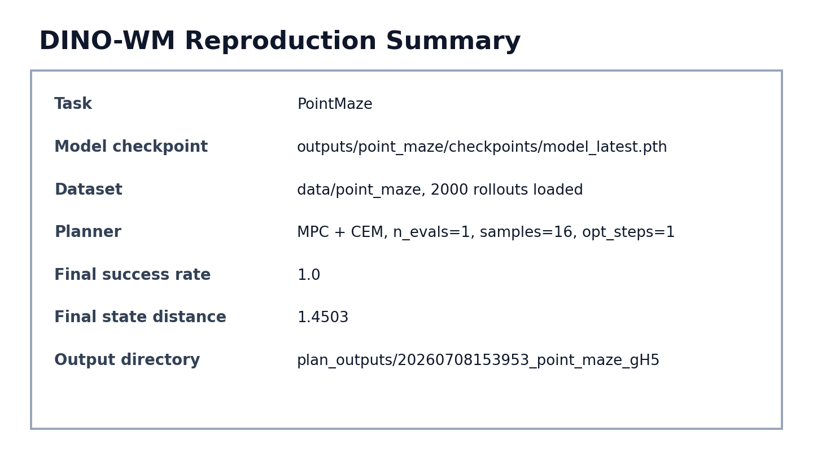
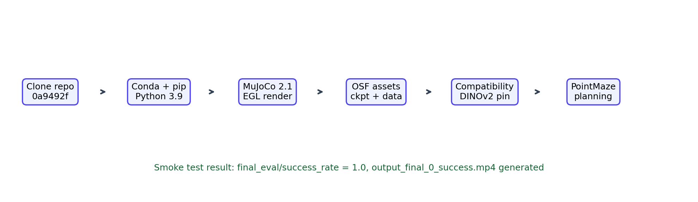
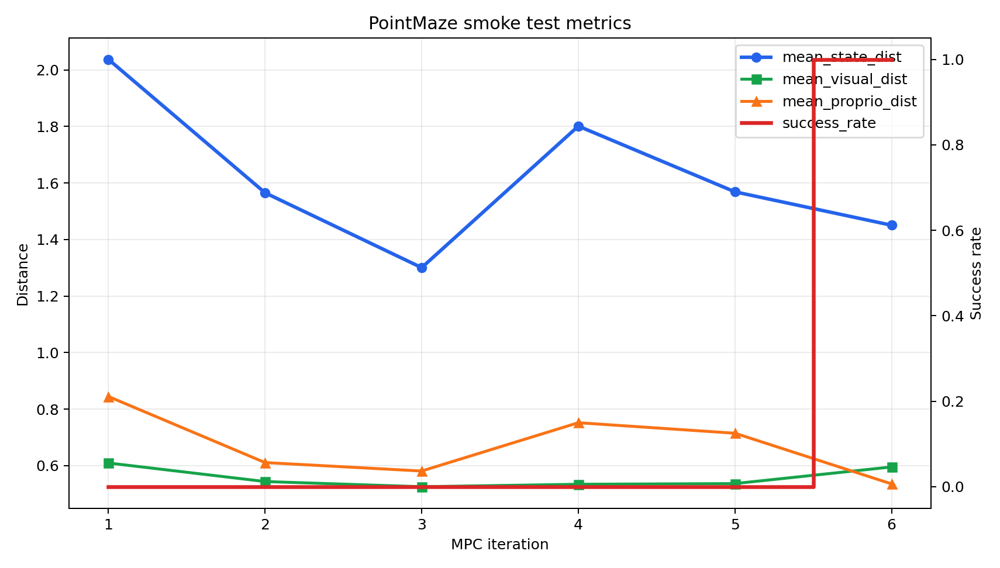
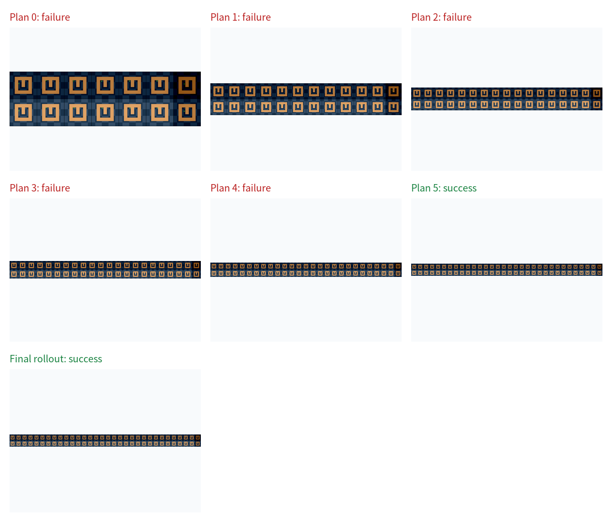
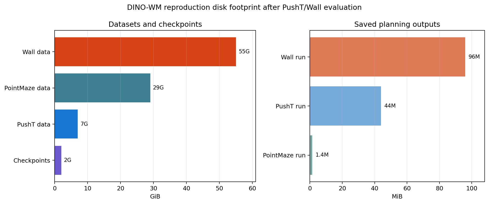
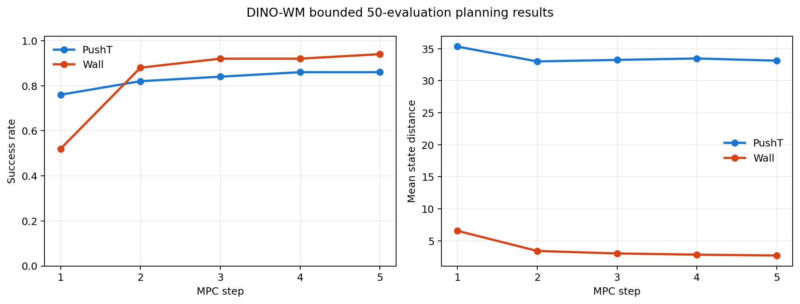

# DINO-WM 复现报告：PointMaze、PushT 与 Wall 预训练规划复现

生成时间：2026-07-10  
默认教程目录：`$HOME/dino_wm_repro`（可通过 `REPRO_ROOT` 覆盖）  
代码仓库：`https://github.com/gaoyuezhou/dino_wm`  
固定提交：`0a9492fa12044b852ae9e001cc74604b79c8bb0c`

## 1. 结论

本次已完成 DINO-WM 的可验证复现链路：先使用官方 PointMaze 数据集和官方预训练 checkpoint 运行 `plan_point_maze.yaml` 的 planning smoke test，再下载 PushT 与 Wall 数据，按更接近论文 planning 的参数复跑 `plan_pusht.yaml` 和 `plan_wall.yaml`。为了让报告中的命令后续可直接执行，我额外生成了脚本：

- `scripts/repro_env.sh`：统一设置 conda、MuJoCo、EGL、数据目录和 wandb offline 环境变量。
- `scripts/validate_runtime.sh`：验证 PyTorch/CUDA、mujoco-py 离屏渲染、pip 依赖。
- `scripts/run_pointmaze_smoke.sh`：一行复跑 PointMaze smoke test。
- `scripts/run_pusht_wall_eval.sh`：一行复跑 PushT 与 Wall 的 50-eval 有界评估。
- `scripts/analyze_extended_results.py`：汇总 PushT/Wall 的成功率、Wilson 95% 区间、CSV、JSON 和曲线图。
- `scripts/commands.sh`：从环境准备到 PointMaze、PushT、Wall 评估的命令清单。

本次实测结果如下：

| 任务 | 配置 | 参数 | 最终结果 |
|---|---|---|---|
| PointMaze | `plan_point_maze.yaml` | smoke test 快速参数 | `final_eval/success_rate = 1.0` |
| PushT | `plan_pusht.yaml` | `seed=99, n_evals=50, num_samples=300, opt_steps=10, max_iter=5` | `43/50 = 0.86`，Wilson 95% CI `[0.738, 0.930]` |
| Wall | `plan_wall.yaml` | `seed=99, n_evals=50, num_samples=300, opt_steps=10, max_iter=5` | `47/50 = 0.94`，Wilson 95% CI `[0.838, 0.979]` |

说明：上游默认 `planner.max_iter: null` 会持续规划到全部 episode 成功或环境终止，完整运行时间不可控。本报告固定 `max_iter=5`，保留论文关键采样配置 `n_evals=50`、`num_samples=300`、`opt_steps=10`，以获得可复跑、可记录的有界结果。若需要完全无界的论文式运行，可去掉脚本中的 `planner.max_iter` 覆盖或显式设置为 `null` 后另行长时间运行。



## 2. 复现流程总览



关键路径如下：

| 项目 | 路径 |
|---|---|
| 仓库 | `$REPRO_ROOT/dino_wm` |
| Conda 环境 | `$REPRO_ROOT/miniconda3/envs/dino_wm` |
| PointMaze 数据 | `$REPRO_ROOT/data/point_maze` |
| PushT 数据 | `$REPRO_ROOT/data/pusht_noise` |
| Wall 数据 | `$REPRO_ROOT/data/wall_single` |
| Checkpoints | `$REPRO_ROOT/checkpoints/outputs/*/checkpoints/model_latest.pth` |
| 本次成功输出 | `$REPRO_ROOT/dino_wm/plan_outputs/20260708153953_point_maze_gH5` |
| PushT 输出 | `$REPRO_ROOT/dino_wm/plan_outputs/20260709_pusht_ne50_ns300_os10_mi5_seed99` |
| Wall 输出 | `$REPRO_ROOT/dino_wm/plan_outputs/20260709_wall_ne50_ns300_os10_mi5_seed99` |

## 3. 可运行命令清单（按作用分组）

下面的教程面向 Ubuntu x86_64、NVIDIA GPU 和 Bash。先执行第 0 步；后续命令都通过变量定位文件，不依赖作者机器的用户名或绝对路径。默认安装到 `$HOME/dino_wm_repro`；如需其他位置，请在第 0 步之前执行 `export REPRO_ROOT=/你的/工作目录`。如果报告目录不在 `$REPRO_ROOT/report`，同理覆盖 `REPORT_DIR`。

每组先说明作用，再给命令。代码块内不混入注释，每一行都可直接在 Bash 中执行。

### 0. 定义通用路径变量

**作用：** 统一后续命令的仓库、Conda、MuJoCo 和报告路径。

**预期结果：** `printf` 输出当前采用的复现根目录；默认是当前用户主目录下的 `dino_wm_repro`。

```bash
export REPRO_ROOT="${REPRO_ROOT:-${HOME}/dino_wm_repro}"
export REPORT_DIR="${REPORT_DIR:-${REPRO_ROOT}/report}"
export DINO_WM_REPO="${DINO_WM_REPO:-${REPRO_ROOT}/dino_wm}"
export CONDA_ROOT="${CONDA_ROOT:-${REPRO_ROOT}/miniconda3}"
export CONDA_ENV="${CONDA_ENV:-${CONDA_ROOT}/envs/dino_wm}"
export MUJOCO_ROOT="${MUJOCO_ROOT:-${HOME}/.mujoco}"
export DINO_WM_COMMIT="${DINO_WM_COMMIT:-0a9492fa12044b852ae9e001cc74604b79c8bb0c}"
printf 'REPRO_ROOT=%s\n' "${REPRO_ROOT}"
```

### 1. 安装 Ubuntu 系统工具

**作用：** 安装下载、编译、OpenGL 和报告编译所需的系统包。

**预期结果：** `git`、`wget`、`unzip`、编译工具和 `xelatex` 可用。

```bash
sudo apt-get update
sudo apt-get install -y git wget unzip build-essential libgl1-mesa-dev libglfw3-dev libglew-dev patchelf texlive-xetex texlive-lang-chinese fonts-noto-cjk poppler-utils
```

### 2. 创建复现工作目录

**作用：** 准备数据、checkpoint、日志和运行输出目录。

**预期结果：** `$REPRO_ROOT` 下出现 `data`、`checkpoints`、`runs` 和 `logs`。

```bash
mkdir -p "${REPRO_ROOT}/data" "${REPRO_ROOT}/checkpoints" "${REPRO_ROOT}/runs" "${REPRO_ROOT}/logs"
```

### 3. 克隆官方仓库并固定提交

**作用：** 使用官方 DINO-WM 代码，并固定到本次验证过的提交，避免上游变化影响复现。

**预期结果：** 仓库位于 `$DINO_WM_REPO`，HEAD 为 `$DINO_WM_COMMIT`。

```bash
test -d "${DINO_WM_REPO}/.git" || git clone https://github.com/gaoyuezhou/dino_wm.git "${DINO_WM_REPO}"
git -C "${DINO_WM_REPO}" checkout "${DINO_WM_COMMIT}"
git -C "${DINO_WM_REPO}" rev-parse HEAD
```

### 4. 安装 Miniconda 并配置 conda-forge

**作用：** 在复现目录内安装独立 Conda，避免污染系统环境；使用 conda-forge 避免默认 Anaconda channel 的交互式 ToS。

**预期结果：** `$CONDA_ROOT/bin/conda` 可用，channel priority 为 strict。

```bash
test -x "${CONDA_ROOT}/bin/conda" || wget -O "${REPRO_ROOT}/Miniconda3-latest-Linux-x86_64.sh" https://repo.anaconda.com/miniconda/Miniconda3-latest-Linux-x86_64.sh
test -x "${CONDA_ROOT}/bin/conda" || bash "${REPRO_ROOT}/Miniconda3-latest-Linux-x86_64.sh" -b -p "${CONDA_ROOT}"
"${CONDA_ROOT}/bin/conda" config --system --remove channels defaults || true
"${CONDA_ROOT}/bin/conda" config --system --add channels conda-forge
"${CONDA_ROOT}/bin/conda" config --system --set channel_priority strict
"${CONDA_ROOT}/bin/conda" --version
```

### 5. 创建 `dino_wm` 环境并安装依赖

**作用：** 按官方 `environment.yaml` 创建 Python 3.9 环境，并补齐 `egl-probe` 与 `mujoco-py` 的构建依赖。

**预期结果：** `$CONDA_ENV/bin/python` 可用，pip 依赖检查无冲突。

```bash
if "${CONDA_ROOT}/bin/conda" env list | grep -q '^dino_wm '; then echo 'conda env dino_wm exists'; else "${CONDA_ROOT}/bin/conda" env create -f "${DINO_WM_REPO}/environment.yaml"; fi
awk '/^  - pip:/{flag=1; next} flag && /^      - /{sub(/^      - /, ""); print}' "${DINO_WM_REPO}/environment.yaml" > "${REPRO_ROOT}/requirements-pip.txt"
"${CONDA_ROOT}/bin/conda" install -n dino_wm -y cmake glew mesalib glfw patchelf
env PATH="${CONDA_ENV}/bin:${CONDA_ROOT}/bin:${PATH}" "${CONDA_ENV}/bin/python" -m pip install --no-deps -U -r "${REPRO_ROOT}/requirements-pip.txt" --exists-action=b --progress-bar=on --log "${REPRO_ROOT}/logs/pip_install_pathfix.log"
"${CONDA_ENV}/bin/python" -m pip check
```

### 6. 安装 MuJoCo 2.1

**作用：** 为 `mujoco-py` 提供其默认使用的 MuJoCo 2.1 运行时。

**预期结果：** `$MUJOCO_ROOT/mujoco210` 存在。

```bash
mkdir -p "${MUJOCO_ROOT}"
test -f "${MUJOCO_ROOT}/mujoco210-linux-x86_64.tar.gz" || wget https://mujoco.org/download/mujoco210-linux-x86_64.tar.gz -O "${MUJOCO_ROOT}/mujoco210-linux-x86_64.tar.gz"
test -d "${MUJOCO_ROOT}/mujoco210" || tar -xzf "${MUJOCO_ROOT}/mujoco210-linux-x86_64.tar.gz" -C "${MUJOCO_ROOT}"
```

### 7. 验证 CUDA、依赖和 MuJoCo EGL 渲染

**作用：** 确认 PyTorch 能看到 GPU、`mujoco-py` 能离屏渲染、pip 依赖没有破损。

**预期结果：** 输出 `cuda True`、至少 1 个 GPU、`mujoco_py render ok` 和 `No broken requirements found`。本次实测环境为 PyTorch 2.3.0+cu121、8 张 GPU。

```bash
bash "${REPORT_DIR}/scripts/validate_runtime.sh"
```

### 8. 下载并解压官方 checkpoint

**作用：** 获取官方预训练模型，供 PointMaze、PushT 和 Wall planning 使用。

**预期结果：** `$REPRO_ROOT/checkpoints/outputs/point_maze/checkpoints/model_latest.pth` 存在。

```bash
wget -c --progress=dot:giga 'https://osf.io/download/xvzs4/?view_only=a56a296ce3b24cceaf408383a175ce28' -O "${REPRO_ROOT}/checkpoints/outputs.zip"
unzip -q -n "${REPRO_ROOT}/checkpoints/outputs.zip" -d "${REPRO_ROOT}/checkpoints"
test -f "${REPRO_ROOT}/checkpoints/outputs/point_maze/checkpoints/model_latest.pth"
```

### 9. 下载并解压 PointMaze 数据集

**作用：** 获取 smoke test 使用的 PointMaze 轨迹、动作、状态和观测。

**预期结果：** `$REPRO_ROOT/data/point_maze` 下存在 `states.pth`、`actions.pth`、`seq_lengths.pth` 和 `obses`。

```bash
wget -c --progress=dot:giga 'https://osf.io/download/vr5gy/?view_only=a56a296ce3b24cceaf408383a175ce28' -O "${REPRO_ROOT}/data/point_maze.zip"
unzip -q -n "${REPRO_ROOT}/data/point_maze.zip" -d "${REPRO_ROOT}/data"
test -f "${REPRO_ROOT}/data/point_maze/states.pth"
test -f "${REPRO_ROOT}/data/point_maze/actions.pth"
test -f "${REPRO_ROOT}/data/point_maze/seq_lengths.pth"
test -d "${REPRO_ROOT}/data/point_maze/obses"
```

### 10. 应用复现兼容性补丁

**作用：** 固定 DINOv2 到 Python 3.9 兼容提交，并为 PointMaze 增加单进程 `SerialVectorEnv` 开关。

**预期结果：** `models/dino.py` 固定 DINOv2 commit；`plan.py` 支持 `+use_serial_env=true`。重复执行时会报告补丁已应用。

```bash
if git -C "${DINO_WM_REPO}" apply --check "${REPORT_DIR}/repro_compat.patch"; then git -C "${DINO_WM_REPO}" apply "${REPORT_DIR}/repro_compat.patch"; elif git -C "${DINO_WM_REPO}" apply --reverse --check "${REPORT_DIR}/repro_compat.patch"; then echo 'compat patch already applied'; else echo 'compat patch does not match this checkout' >&2; exit 1; fi
```

### 11. 运行 PointMaze planning smoke test

**作用：** 用官方 PointMaze checkpoint 和数据执行最小 planning 验证，缩小参数以快速确认完整链路。

**预期结果：** 在 `$DINO_WM_REPO/plan_outputs` 下生成 `<timestamp>_point_maze_gH5`；本次实测 `final_eval/success_rate = 1.0`。

```bash
bash "${REPORT_DIR}/scripts/run_pointmaze_smoke.sh"
```

### 12. 检查最新结果

**作用：** 找到最新运行目录并输出最终评估指标和生成的可视化文件。

**预期结果：** 日志中出现 `final_eval/success_rate`，目录中包含 PNG/MP4。

```bash
export LATEST_RUN="$(find "${DINO_WM_REPO}/plan_outputs" -mindepth 1 -maxdepth 1 -type d -name '*_point_maze_gH5' -printf '%T@ %p\n' | sort -nr | head -n 1 | cut -d' ' -f2-)"
printf 'LATEST_RUN=%s\n' "${LATEST_RUN}"
grep -n 'final_eval/success_rate' "${LATEST_RUN}/logs.json"
find "${LATEST_RUN}" -maxdepth 1 -type f \( -name '*.png' -o -name '*.mp4' \) -print
```

### 13. 下载并校验 PushT 数据集

**作用：** 下载官方 `pusht_noise.zip`，验证本次实测文件的 SHA-256，并解压到通用数据目录。

**预期结果：** `$REPRO_ROOT/data/pusht_noise` 下存在 `train` 和 `val`，校验输出为 `OK`。

```bash
wget -c --progress=dot:giga 'https://osf.io/download/k2d8w/?view_only=a56a296ce3b24cceaf408383a175ce28' -O "${REPRO_ROOT}/data/pusht_noise.zip"
printf '%s  %s\n' '442f5dee246edf670964ed7bdecd248683cd6d00580fa0e4d458abb53f92da08' "${REPRO_ROOT}/data/pusht_noise.zip" | sha256sum -c -
unzip -q -n "${REPRO_ROOT}/data/pusht_noise.zip" -d "${REPRO_ROOT}/data"
test -f "${REPRO_ROOT}/data/pusht_noise/train/states.pth"
test -f "${REPRO_ROOT}/data/pusht_noise/val/states.pth"
```

### 14. 下载并校验 Wall 数据集

**作用：** 下载官方 `wall_single.zip`，验证 SHA-256，并解压用于 Wall planning。

**预期结果：** `$REPRO_ROOT/data/wall_single` 下存在状态、动作、墙位置和观测文件，校验输出为 `OK`。

```bash
wget -c --progress=dot:giga 'https://osf.io/download/49rnx/?view_only=a56a296ce3b24cceaf408383a175ce28' -O "${REPRO_ROOT}/data/wall_single.zip"
printf '%s  %s\n' '2b4ae4ed0ad03b337efac637f17752e7e27f864fec39dc25b51fef490c980d' "${REPRO_ROOT}/data/wall_single.zip" | sha256sum -c -
unzip -q -n "${REPRO_ROOT}/data/wall_single.zip" -d "${REPRO_ROOT}/data"
test -f "${REPRO_ROOT}/data/wall_single/states.pth"
test -f "${REPRO_ROOT}/data/wall_single/actions.pth"
test -d "${REPRO_ROOT}/data/wall_single/obses"
```

### 15. 运行 PushT 与 Wall 的 50-eval 有界评估

**作用：** 使用 `seed=99`、`n_evals=50`、`num_samples=300`、`opt_steps=10` 和 `max_iter=5` 运行两个 checkpoint。默认在一张 GPU 上顺序执行，避免显存争用。

**预期结果：** `$DINO_WM_REPO/plan_outputs` 下分别生成 PushT 与 Wall 输出目录，每个 `logs.json` 含 5 条 `mpc` 记录和 1 条 `final_eval` 记录。Wall checkpoint 的目录名是 `wall_single`，脚本内已使用 `model_name=wall_single`。

```bash
export RUN_TAG="$(date -u +%Y%m%d%H%M%S)"
export MAX_ITER=5
export RUN_PARALLEL=0
export PUSHT_GPU=0
export WALL_GPU=0
bash "${REPORT_DIR}/scripts/run_pusht_wall_eval.sh"
```

有两张空闲 GPU 时可并行执行：

```bash
export RUN_TAG="$(date -u +%Y%m%d%H%M%S)"
RUN_PARALLEL=1 PUSHT_GPU=0 WALL_GPU=1 MAX_ITER=5 bash "${REPORT_DIR}/scripts/run_pusht_wall_eval.sh"
```

### 16. 汇总统计并生成曲线

**作用：** 读取两个完整 `logs.json`，计算最终成功数、成功率的 Wilson 95% 置信区间，并输出 CSV、JSON 和 PNG。

**预期结果：** `$REPORT_DIR/repro_assets` 下生成 `extended_metrics.csv`、`extended_results_summary.json` 和 `extended_metrics_curve.png`；若日志缺少 `final_eval`，命令会明确失败。

```bash
export MAX_ITER="${MAX_ITER:-5}"
export PUSHT_RUN_DIR="${PUSHT_RUN_DIR:-${DINO_WM_REPO}/plan_outputs/${RUN_TAG}_pusht_ne50_ns300_os10_mi${MAX_ITER}_seed99}"
export WALL_RUN_DIR="${WALL_RUN_DIR:-${DINO_WM_REPO}/plan_outputs/${RUN_TAG}_wall_ne50_ns300_os10_mi${MAX_ITER}_seed99}"
"${CONDA_ENV}/bin/python" "${REPORT_DIR}/scripts/analyze_extended_results.py" --pusht-dir "${PUSHT_RUN_DIR}" --wall-dir "${WALL_RUN_DIR}" --output-dir "${REPORT_DIR}/repro_assets"
```

### 17. 检查扩展评估结果

**作用：** 确认两个任务都产生最终评估记录和规划图片。

**预期结果：** 两个日志均出现 `final_eval/success_rate`，并找到 `output_final.png`。

```bash
export MAX_ITER="${MAX_ITER:-5}"
export PUSHT_RUN_DIR="${PUSHT_RUN_DIR:-${DINO_WM_REPO}/plan_outputs/${RUN_TAG}_pusht_ne50_ns300_os10_mi${MAX_ITER}_seed99}"
export WALL_RUN_DIR="${WALL_RUN_DIR:-${DINO_WM_REPO}/plan_outputs/${RUN_TAG}_wall_ne50_ns300_os10_mi${MAX_ITER}_seed99}"
grep -n 'final_eval/success_rate' "${PUSHT_RUN_DIR}/logs.json"
grep -n 'final_eval/success_rate' "${WALL_RUN_DIR}/logs.json"
test -f "${PUSHT_RUN_DIR}/output_final.png"
test -f "${WALL_RUN_DIR}/output_final.png"
```

### 18. 重新编译本报告 PDF

**作用：** 在修改 Markdown、LaTeX 或图片后重新生成 PDF。

**预期结果：** `$REPORT_DIR/DINO_WM_reproduction_report.pdf` 更新。

```bash
cd "${REPORT_DIR}" && xelatex -interaction=nonstopmode -halt-on-error DINO_WM_reproduction_report.tex
cd "${REPORT_DIR}" && xelatex -interaction=nonstopmode -halt-on-error DINO_WM_reproduction_report.tex
```

完整自动化脚本见 `scripts/commands.sh`；按作用拆分的独立清单见 `commands_by_purpose.md`。

## 4. 实际执行中的问题与修复

### 4.1 Conda 默认频道 ToS

默认 Anaconda channels 需要接受 ToS。为了避免交互式阻塞，已将本地 Miniconda system channel 改为 `conda-forge` 并启用 strict priority。

### 4.2 `egl-probe` 构建找不到 CMake

官方 `environment.yaml` 的 pip 依赖里包含 `egl-probe==1.0.2`，它需要 `cmake` 构建。解决方式是在 pip 安装前安装 `cmake`，并确保 pip 构建子进程的 `PATH` 包含 conda 环境的 `bin`。

### 4.3 DINOv2 上游 main 与 Python 3.9 不兼容

原始代码直接执行：`torch.hub.load("facebookresearch/dinov2", name)`。2025-06-11 之后 DINOv2 main 引入了 Python 3.10 风格类型注解，官方 DINO-WM 环境为 Python 3.9，会报 `unsupported operand type(s) for |: 'type' and 'NoneType'`。

本次将 DINOv2 固定到父提交：`b48308a394a04ccb9c4dd3a1f0a4daa1ce0579b8`。

### 4.4 MuJoCo EGL 子进程渲染失败

本机单进程 `mujoco_py` EGL 离屏渲染通过，但 `SubprocVectorEnv` worker 内初始化 OpenGL 失败。因此给 `plan.py` 增加了 `+use_serial_env=true` 开关，PointMaze smoke test 使用 `SerialVectorEnv` 跑通。

### 4.5 Wall checkpoint 的命名

Wall 使用 `plan_wall.yaml`，但官方 checkpoint 解压后的模型目录是 `outputs/wall_single/checkpoints/model_latest.pth`。因此复跑 Wall 时需要覆盖 `model_name=wall_single`，否则会去寻找不存在的 `outputs/wall/checkpoints/model_latest.pth`。

源码最小改动保存在：`repro_compat.patch`。

## 5. 结果可视化

### 5.1 指标曲线

日志来自 `logs.json`。6 次 MPC 迭代中，最终 `success_rate` 从 0 提升到 1。



### 5.2 规划过程拼图

前 5 次 MPC 迭代未成功，第 6 次成功。最终输出视频为 `output_final_0_success.mp4`。



### 5.3 磁盘占用



### 5.4 PushT 与 Wall 50-eval 有界评估

本节结果来自 2026-07-09 UTC 启动、2026-07-10 UTC 完成的正式复跑。两组实验都使用官方 checkpoint、`seed=99`、`n_evals=50`、`num_samples=300`、`opt_steps=10`、`n_plot_samples=10`，并固定 `planner.max_iter=5`。数据集校验与占用如下：

| 数据集 | 压缩包 SHA-256 | 解压后规模 | 文件数 |
|---|---|---:|---:|
| PushT `pusht_noise.zip` | `442f5dee246edf670964ed7bdecd248683cd6d00580fa0e4d458abb53f92da08` | 7.0G | 18718 |
| Wall `wall_single.zip` | `2b4ae4ed0ad03b337efac637f17752e7e27f864fec39dc25b51fef490c980d` | 55G | 5779 |

| 任务 | `logs.json` 末行 | 成功数 | 成功率 | Wilson 95% CI | 平均状态距离 | 输出目录 |
|---|---|---:|---:|---:|---:|---|
| PushT | `final_eval` | 43/50 | 0.86 | `[0.738, 0.930]` | 33.142 | `dino_wm/plan_outputs/20260709_pusht_ne50_ns300_os10_mi5_seed99` |
| Wall | `final_eval` | 47/50 | 0.94 | `[0.838, 0.979]` | 2.692 | `dino_wm/plan_outputs/20260709_wall_ne50_ns300_os10_mi5_seed99` |



PushT 最终规划截图：


Wall 最终规划截图：


## 6. 关键结果文件

| 文件 | 说明 |
|---|---|
| `logs.json` | 每次 MPC 迭代和最终评估指标 |
| `plan_targets.pkl` | smoke test 目标状态 |
| `output_final.png` | 最终可视化截图 |
| `output_final_0_success.mp4` | 最终成功轨迹视频 |
| `repro_assets/extended_metrics.csv` | PushT/Wall 每个 MPC step 的成功率和距离指标 |
| `repro_assets/extended_results_summary.json` | PushT/Wall 最终成功数、成功率和 Wilson 95% 区间 |
| `repro_assets/extended_metrics_curve.png` | PushT/Wall 指标曲线 |
| `repro_assets/pusht_extended_final.png` | PushT 最终规划截图 |
| `repro_assets/wall_extended_final.png` | Wall 最终规划截图 |
| `wandb/offline-run-*/run-*.wandb` | offline wandb 日志 |

## 7. 下一步建议

1. 若需要严格论文式无界评估，可将 `planner.max_iter` 恢复为 `null` 并准备更长运行时间，随后用同一分析脚本汇总。
2. 若需要更稳健的统计结论，可增加多随机种子重复评估，并报告 seed 间均值与方差。
3. 如需 deformable 环境，另行安装 PyFleX；该部分依赖 Docker/NVIDIA Docker，建议单独隔离环境。
