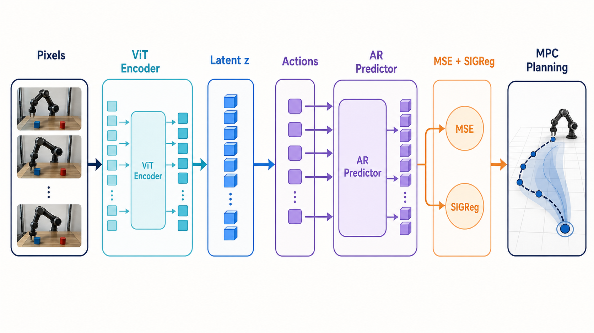
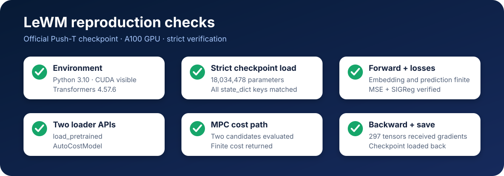
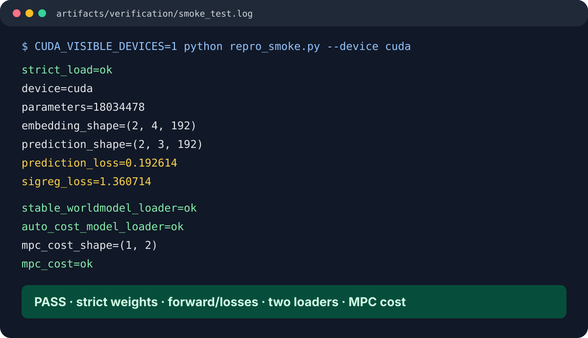
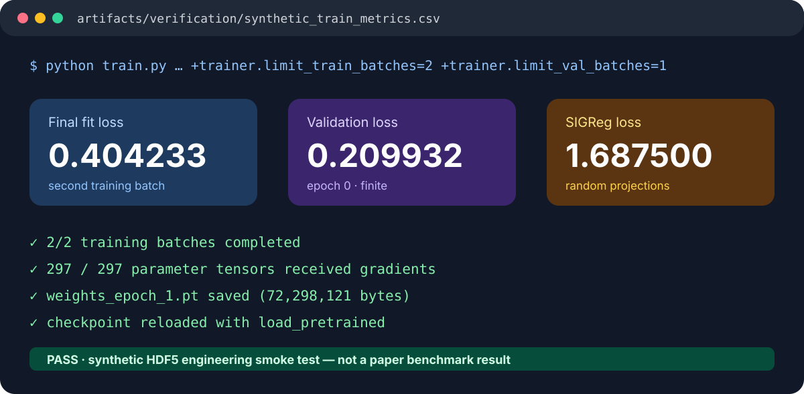
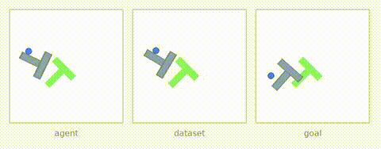
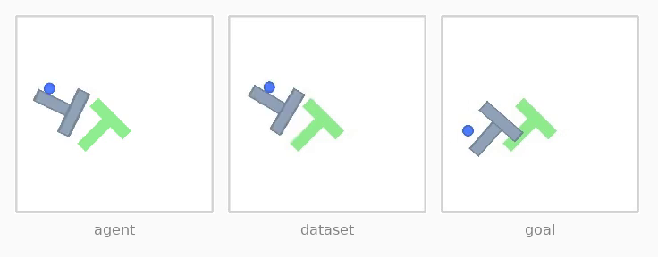
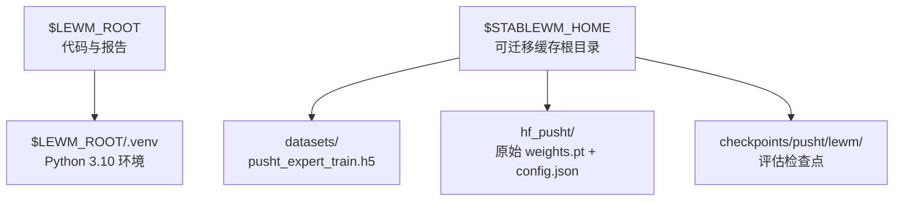
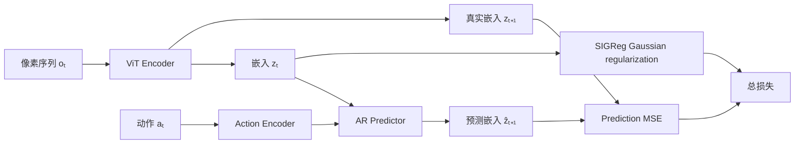

# LeWorldModel（LeWM）Push-T 完整复现报告

> 论文：**Stable End-to-End Joint-Embedding Predictive Architecture from Pixels**  
> 官方代码：[lucas-maes/le-wm](https://github.com/lucas-maes/le-wm)  
> 论文与数据集合：[Hugging Face LeWM Collection](https://huggingface.co/collections/quentinll/lewm)  
> 本报告固定官方提交：`8edfeb336732b5f3ce7b8b210d0ba370a09e2cac`



## 1. 复现结论

本次已经完成并实际验证：

- Python 3.10 独立环境创建；
- 官方 Push-T 权重下载及 SHA-256 校验；
- `state_dict` 严格加载（`strict=True`）；
- 像素编码、动作编码、下一嵌入预测、MSE 和 SIGReg 前向计算；
- 当前 `load_pretrained` 与旧版 `AutoCostModel` 两条检查点加载路径；
- MPC 两组候选动作代价计算；
- 同 schema 合成 HDF5 的数据加载、验证 batch、两个训练 batch、反向传播和检查点保存；
- 训练检查点重新加载。
- 官方公开 Push-T 权重的 **50 episode** MPC 评测：**96.0%（48 / 50 成功）**。



### 可追溯的真实验证证据

下图不是示意图，而是本目录重新执行 `repro_smoke.py` 后的真实输出摘录；完整原始输出见 [smoke_test.log](../../../repro_assets/smoke_test.log)。



训练验证使用同一数据 schema 的合成 HDF5，仅证明数据加载、前向、反向和保存流程可运行；原始终端输出见 [synthetic_train.log](../../../repro_assets/synthetic_train.log)，指标见 [synthetic_train_metrics.csv](../../../repro_assets/synthetic_train_metrics.csv) 与 [synthetic_train_summary.json](../../../repro_assets/synthetic_train_summary.json)。



### 真实 Push-T 控制结果（50 episode）

这是本目录实际运行官方完整评测配置所得，而不是 README 的示意 GIF：`num_eval=50`、`eval_budget=50`、CEM `num_samples=300`、`n_steps=30`，随机种子 42。结果为 **48 / 50 成功，success_rate = 96.0%**，评测耗时 363.62 秒。完整机器可读指标见 [pusht_real_50_results.txt](../../../repro_assets/pusht_real_50_results.txt)，完整运行日志见 [pusht_real_50.log](../../../repro_assets/pusht_real_50.log)。

<video controls muted loop playsinline width="480" poster="repro_assets/pusht_real_50_first_frame.png">
  <source src="../../../repro_assets/pusht_real_50.mp4" type="video/mp4">
  当前 Markdown 预览器不支持内嵌视频；请打开 <a href="repro_assets/pusht_real_50.mp4">pusht_real_50.mp4</a>。
</video>

**真实视频文件：** [pusht_real_50.mp4](../../../repro_assets/pusht_real_50.mp4)。上面的播放器与此文件均为本次 50 episode 评测的第 0 个环境轨迹。





实测模型参数量为 **18,034,478**。这比论文摘要里的“约 15M”略高，原因是当前公开配置中的 ViT、6 层预测器和两个 2048 维投影 MLP 合计约 18.0M；不是权重漏载。

工程链路与 50 episode 控制评测均已跑通。真实 Push-T 数据的压缩包约 13.1 GB；上面的成功率只对应本报告固定的公开权重、随机种子与评测配置，不应替代论文在其他设置下的统计结果。

<p align="center">
  
</p>

## 2. 平台范围与路径约定

### 2.1 支持范围

以下命令在 **Linux + Bash + NVIDIA GPU** 上验证。Windows 请使用 WSL2；macOS 可以运行 CPU 模型检查，但不能复现 CUDA/EGL 的论文训练与规划速度。

“适配每台电脑”在本报告中表示：

- 不写包含本机用户名的绝对路径；
- 项目位置由 Git 自动发现；
- 数据目录由 `$STABLEWM_HOME` 控制；
- GPU 编号由 `$CUDA_VISIBLE_DEVICES` 控制；
- 所有生成文件都写入项目目录或缓存目录。

### 2.2 每次打开新终端先执行

请先进入仓库任意子目录，然后执行：

```bash
export LEWM_ROOT="$(git rev-parse --show-toplevel)"
export STABLEWM_HOME="${STABLEWM_HOME:-$HOME/.stable-wm}"
export CUDA_VISIBLE_DEVICES="${CUDA_VISIBLE_DEVICES:-0}"
cd "$LEWM_ROOT"
mkdir -p "$STABLEWM_HOME"
```

检查变量：

```bash
printf 'LEWM_ROOT=%s\nSTABLEWM_HOME=%s\nCUDA_VISIBLE_DEVICES=%s\n' \
  "$LEWM_ROOT" "$STABLEWM_HOME" "$CUDA_VISIBLE_DEVICES"
```

目录关系如下：



## 3. 获取固定版本代码

如果尚未下载仓库，在任意工作目录执行：

```bash
export LEWM_ROOT="${LEWM_ROOT:-$HOME/le-wm}"
git clone https://github.com/lucas-maes/le-wm.git "$LEWM_ROOT"
git -C "$LEWM_ROOT" checkout 8edfeb336732b5f3ce7b8b210d0ba370a09e2cac
cd "$LEWM_ROOT"
```

如果仓库已经存在，只检查版本，不修改工作区：

```bash
export LEWM_ROOT="$(git rev-parse --show-toplevel)"
git -C "$LEWM_ROOT" rev-parse HEAD
```

预期输出：

```text
8edfeb336732b5f3ce7b8b210d0ba370a09e2cac
```

## 4. 安装可复现环境

### 4.1 安装 uv

Linux、WSL2 或 macOS：

```bash
if ! command -v uv >/dev/null 2>&1; then
  curl -LsSf https://astral.sh/uv/0.11.28/install.sh | sh
  export PATH="$HOME/.local/bin:$PATH"
fi
uv --version
```

这是 [uv 官方安装方式](https://docs.astral.sh/uv/getting-started/installation/)。固定 `0.11.28`，避免安装器未来变化导致行为漂移。

### 4.2 创建环境并安装依赖

在仓库内执行。该命令可重复运行：已有虚拟环境时不会删除它。

```bash
export LEWM_ROOT="$(git rev-parse --show-toplevel)"
cd "$LEWM_ROOT"

if [ ! -x .venv/bin/python ]; then
  uv venv --python 3.10 .venv
fi

uv pip install --python .venv/bin/python swig==4.4.1
PATH="$LEWM_ROOT/.venv/bin:$PATH" uv pip install \
  --python .venv/bin/python \
  'stable-worldmodel[train,env]==0.1.1' \
  'stable-pretraining==0.1.8' \
  'torch==2.13.0' \
  'torchvision==0.28.0' \
  'transformers==4.57.6' \
  'hdf5plugin==6.0.0' \
  'huggingface-hub[hf-xet]>=0.34,<1' \
  'swig==4.4.1'
```

激活环境并检查：

```bash
export LEWM_ROOT="$(git rev-parse --show-toplevel)"
cd "$LEWM_ROOT"
source .venv/bin/activate

python - <<'PY'
import sys
import torch
import transformers
import stable_pretraining as spt
import stable_worldmodel as swm

assert sys.version_info[:2] == (3, 10), sys.version
assert transformers.__version__ == "4.57.6", transformers.__version__
print("python:", sys.version.split()[0])
print("torch:", torch.__version__)
print("cuda runtime:", torch.version.cuda)
print("cuda available:", torch.cuda.is_available())
print("stable-pretraining:", spt.__version__)
print("stable-worldmodel import: OK")
PY
```

本次验证环境：

| 组件 | 版本/结果 |
|---|---|
| Python | 3.10.20 |
| PyTorch | 2.13.0 + CUDA 13.0 |
| Transformers | 4.57.6 |
| stable-pretraining | 0.1.8 |
| stable-worldmodel | 0.1.1 |
| GPU | NVIDIA A100 80GB |

> 首次安装会拉取 PyTorch、CUDA、MuJoCo 和环境依赖。本次 `.venv` 约 7 GB，请预留至少 12 GB 环境空间。

## 5. 下载并校验官方权重

`huggingface-hub` 自带 `hf` 命令，语法可参考 [Hugging Face 官方 CLI 文档](https://huggingface.co/docs/huggingface_hub/guides/cli)。

```bash
export LEWM_ROOT="$(git rev-parse --show-toplevel)"
export STABLEWM_HOME="${STABLEWM_HOME:-$HOME/.stable-wm}"
cd "$LEWM_ROOT"
source .venv/bin/activate

mkdir -p "$STABLEWM_HOME/hf_pusht"
hf download quentinll/lewm-pusht config.json weights.pt \
  --local-dir "$STABLEWM_HOME/hf_pusht"
```

使用 Python 校验 SHA-256，避免依赖 Linux 专有的 `sha256sum`：

```bash
export STABLEWM_HOME="${STABLEWM_HOME:-$HOME/.stable-wm}"

python - <<'PY'
import hashlib
import os
from pathlib import Path

root = Path(os.environ["STABLEWM_HOME"]) / "hf_pusht"
expected = {
    "config.json": "2564086e961e7b5c7c04dffc451091115b389a590645ff19653c64fd0bc16e09",
    "weights.pt": "48938400ae3464c9680731287f583a9cb516f55a8ec64ea13a91be47fb15b607",
}
for name, wanted in expected.items():
    got = hashlib.sha256((root / name).read_bytes()).hexdigest()
    assert got == wanted, f"{name}: {got} != {wanted}"
    print(f"{name}: OK ({got})")
PY
```

## 6. 转换检查点并严格验证

### 6.1 为什么同时保存三种文件

当前代码存在两套加载接口：

- `eval.py` 使用 `stable_worldmodel.wm.utils.load_pretrained`，需要 `weights.pt + config.json`；
- README 中的 `AutoCostModel` 仍加载 `*_object.ckpt`。

为兼容二者，统一保存到：

```text
$STABLEWM_HOME/checkpoints/pusht/lewm/
├── config.json
├── weights.pt
└── lewm_object.ckpt
```

### 6.2 转换命令

```bash
export LEWM_ROOT="$(git rev-parse --show-toplevel)"
export STABLEWM_HOME="${STABLEWM_HOME:-$HOME/.stable-wm}"
cd "$LEWM_ROOT"
source .venv/bin/activate

python - <<'PY'
import json
import os
from pathlib import Path

import torch
from hydra.utils import instantiate

root = Path(os.environ["STABLEWM_HOME"])
src = root / "hf_pusht"
out = root / "checkpoints" / "pusht" / "lewm"
out.mkdir(parents=True, exist_ok=True)

cfg = json.loads((src / "config.json").read_text())
model = instantiate(cfg)
state = torch.load(src / "weights.pt", map_location="cpu", weights_only=True)
model.load_state_dict(state, strict=True)

torch.save(state, out / "weights.pt")
(out / "config.json").write_text(json.dumps(cfg, indent=2) + "\n")
torch.save(model, out / "lewm_object.ckpt")

count = sum(parameter.numel() for parameter in model.parameters())
assert count == 18_034_478, count
print("strict_load: OK")
print("parameters:", count)
print("checkpoint_dir:", out)
PY
```

### 6.3 两种加载器验证

```bash
export LEWM_ROOT="$(git rev-parse --show-toplevel)"
export STABLEWM_HOME="${STABLEWM_HOME:-$HOME/.stable-wm}"
cd "$LEWM_ROOT"
source .venv/bin/activate

python - <<'PY'
import stable_worldmodel as swm

current = swm.wm.utils.load_pretrained("pusht/lewm")
legacy = swm.policy.AutoCostModel("pusht/lewm")

assert hasattr(current, "get_cost")
assert hasattr(legacy, "get_cost")
print("load_pretrained: OK")
print("AutoCostModel: OK")
PY
```

### 6.4 GPU 前向、双损失和 MPC cost 验证

本复现目录已经提供 [repro_smoke.py](LeWM_复现报告交付包/repro_smoke.py)：

```bash
export LEWM_ROOT="$(git rev-parse --show-toplevel)"
export STABLEWM_HOME="${STABLEWM_HOME:-$HOME/.stable-wm}"
export CUDA_VISIBLE_DEVICES="${CUDA_VISIBLE_DEVICES:-0}"
cd "$LEWM_ROOT"
source .venv/bin/activate

python repro_smoke.py --device cuda
```

已验证输出的关键部分：

```text
strict_load=ok
parameters=18034478
embedding_shape=(2, 4, 192)
prediction_shape=(2, 3, 192)
stable_worldmodel_loader=ok
auto_cost_model_loader=ok
mpc_cost_shape=(1, 2)
mpc_cost=ok
```

SIGReg 每次会重新采样随机投影，因此其数值会小幅变化；应检查“有限值”和执行成功，不应要求每次小数完全一致。

## 7. 下载并解压 Push-T 数据

公开文件名是 `pusht_expert_train.h5.zst`，不是仓库配置中写的 `.lance`。

大文件使用普通 HTTPS 的可续传下载。`-C -` 会从已有文件长度继续下载；这避开部分代理环境中 Hugging Face Xet 的 TLS 握手失败：

```bash
export LEWM_ROOT="$(git rev-parse --show-toplevel)"
export STABLEWM_HOME="${STABLEWM_HOME:-$HOME/.stable-wm}"
cd "$LEWM_ROOT"
source .venv/bin/activate

if [ ! -f "$STABLEWM_HOME/datasets/pusht_expert_train.h5" ]; then
  mkdir -p "$STABLEWM_HOME/downloads" "$STABLEWM_HOME/datasets"
  archive="$STABLEWM_HOME/downloads/pusht_expert_train.h5.zst"
  url="https://huggingface.co/datasets/quentinll/lewm-pusht/resolve/main/pusht_expert_train.h5.zst"
  until curl -fL -C - --retry 8 --retry-delay 3 -o "$archive" "$url"; do
    echo "Download interrupted; retrying in 10 seconds..." >&2
    sleep 10
  done
fi
```

使用已经安装的 Python `zstandard` 解压，不依赖系统级 zstd 命令行工具：

```bash
export STABLEWM_HOME="${STABLEWM_HOME:-$HOME/.stable-wm}"

python - <<'PY'
import os
from pathlib import Path
import zstandard as zstd

root = Path(os.environ["STABLEWM_HOME"])
src = root / "downloads" / "pusht_expert_train.h5.zst"
dst = root / "datasets" / "pusht_expert_train.h5"

if not dst.exists():
    assert src.exists(), f"missing archive: {src}"
    with src.open("rb") as source, dst.open("wb") as target:
        zstd.ZstdDecompressor().copy_stream(source, target)
print("dataset:", dst)
print("bytes:", dst.stat().st_size)
PY
```

校验 HDF5 schema：

```bash
export STABLEWM_HOME="${STABLEWM_HOME:-$HOME/.stable-wm}"

python - <<'PY'
import os
from pathlib import Path
import hdf5plugin  # noqa: F401 -- 注册 HDF5 压缩过滤器
import h5py

path = Path(os.environ["STABLEWM_HOME"]) / "datasets" / "pusht_expert_train.h5"
with h5py.File(path, "r") as handle:
    required = {"pixels", "action", "proprio", "state", "ep_len", "ep_offset"}
    missing = required.difference(handle.keys())
    assert not missing, f"missing keys: {sorted(missing)}"
    print("keys:", sorted(handle.keys()))
    print("steps:", handle["pixels"].shape[0])
    print("episodes:", handle["ep_len"].shape[0])
PY
```

建议为数据、解压副本、环境和检查点合计预留至少 **50 GB** 可用空间。

## 8. 训练

### 8.1 先跑两个 batch

关键点：用 Hydra 命令行覆盖错误的 `.lance` 配置，不要求修改源码；新增的 Trainer 字段必须带 `+`。

```bash
export LEWM_ROOT="$(git rev-parse --show-toplevel)"
export STABLEWM_HOME="${STABLEWM_HOME:-$HOME/.stable-wm}"
export CUDA_VISIBLE_DEVICES="${CUDA_VISIBLE_DEVICES:-0}"
cd "$LEWM_ROOT"
source .venv/bin/activate

python train.py data=pusht \
  data.dataset.name=pusht_expert_train.h5 \
  trainer.max_epochs=1 \
  +trainer.limit_train_batches=2 \
  +trainer.limit_val_batches=1 \
  trainer.devices=1 \
  loader.batch_size=8 \
  loader.num_workers=1 \
  loader.persistent_workers=false \
  wandb.enabled=false \
  subdir=pusht_smoke \
  output_model_name=lewm_pusht_smoke
```

成功标志：

- 出现训练/验证 `pred_loss`、`sigreg_loss` 和总 `loss`；
- 训练完成提示 `max_epochs=1 reached`；
- `$STABLEWM_HOME/checkpoints/lewm_pusht_smoke/weights_epoch_1.pt` 存在。

### 8.2 完整 100 epoch 训练

```bash
export LEWM_ROOT="$(git rev-parse --show-toplevel)"
export STABLEWM_HOME="${STABLEWM_HOME:-$HOME/.stable-wm}"
export CUDA_VISIBLE_DEVICES="${CUDA_VISIBLE_DEVICES:-0}"
cd "$LEWM_ROOT"
source .venv/bin/activate

python train.py data=pusht \
  data.dataset.name=pusht_expert_train.h5 \
  trainer.devices=1 \
  wandb.enabled=false \
  subdir=pusht_lewm_train \
  output_model_name=lewm
```

训练回调每个 epoch 保存一个文件，因此完整目录中会有多个 `.pt`。加载时必须明确指定：

```text
lewm/weights_epoch_100.pt
```

## 9. MPC 评估

### 9.1 官方预训练权重单回合 smoke test

```bash
export LEWM_ROOT="$(git rev-parse --show-toplevel)"
export STABLEWM_HOME="${STABLEWM_HOME:-$HOME/.stable-wm}"
export CUDA_VISIBLE_DEVICES="${CUDA_VISIBLE_DEVICES:-0}"
cd "$LEWM_ROOT"
source .venv/bin/activate

python eval.py --config-name=pusht.yaml \
  policy=pusht/lewm \
  eval.num_eval=1 \
  eval.eval_budget=25 \
  solver.num_samples=30 \
  solver.n_steps=2 \
  output.filename=pusht_smoke_results.txt
```

### 9.2 官方预训练权重 50 回合评估

```bash
export LEWM_ROOT="$(git rev-parse --show-toplevel)"
export STABLEWM_HOME="${STABLEWM_HOME:-$HOME/.stable-wm}"
export CUDA_VISIBLE_DEVICES="${CUDA_VISIBLE_DEVICES:-0}"
cd "$LEWM_ROOT"
source .venv/bin/activate

python eval.py --config-name=pusht.yaml policy=pusht/lewm
```

### 9.3 评估自己训练的第 100 epoch

```bash
export LEWM_ROOT="$(git rev-parse --show-toplevel)"
export STABLEWM_HOME="${STABLEWM_HOME:-$HOME/.stable-wm}"
export CUDA_VISIBLE_DEVICES="${CUDA_VISIBLE_DEVICES:-0}"
cd "$LEWM_ROOT"
source .venv/bin/activate

python eval.py --config-name=pusht.yaml \
  policy=lewm/weights_epoch_100.pt
```

## 10. 核心方法理解



训练目标只有两项：

```text
loss = prediction_loss + 0.09 × sigreg_loss
```

- `prediction_loss`：预测下一时刻嵌入与真实嵌入的均方误差；
- `sigreg_loss`：沿随机方向投影嵌入，并用正态性统计量避免表示坍塌；
- 没有 stop-gradient、EMA teacher 或像素重建器；
- 规划时比较预测终点嵌入与目标图像嵌入之间的距离。

## 11. 本次复现遇到的坑

### 坑 1：`box2d-py` 编译时报 `swig: No such file or directory`

原因：`stable-worldmodel[env] -> gymnasium[all] -> box2d-py` 会从源码编译。

解决：先把 PyPI 的 SWIG 二进制装入虚拟环境，再把 `.venv/bin` 放入安装命令的 `PATH`：

```bash
uv pip install --python .venv/bin/python swig==4.4.1
PATH="$PWD/.venv/bin:$PATH" uv pip install \
  --python .venv/bin/python 'stable-worldmodel[train,env]==0.1.1'
```

### 坑 2：Transformers 5.x 无法加载发布权重

发布权重使用 Transformers 4.x 的 ViT 参数名；5.x 重命名了 attention 层参数。新环境若不固定版本，会出现大量 missing/unexpected keys。官方仓库的[复现 issue #80](https://github.com/lucas-maes/le-wm/issues/80)也确认需要固定 `<5`。

解决：

```bash
uv pip install --python .venv/bin/python transformers==4.57.6
```

### 坑 3：README 说 HDF5，训练配置却写 `.lance`

公开仓库当前配置是 `pusht_expert_train.lance`，但 Hugging Face 实际只发布 `pusht_expert_train.h5.zst`。

不修改源码的解决方式：

```bash
python train.py data=pusht \
  data.dataset.name=pusht_expert_train.h5 \
  trainer.max_epochs=1
```

### 坑 4：新版缓存布局与 README 不同

README 展示旧布局 `$STABLEWM_HOME/pusht/...`；`stable-worldmodel==0.1.1` 实际使用：

```text
$STABLEWM_HOME/datasets/...
$STABLEWM_HOME/checkpoints/...
```

数据或检查点放在缓存根目录时，当前加载器找不到它们。

### 坑 5：对象检查点与 weights/config 两套 API

当前 `eval.py` 使用 `load_pretrained`，README 的示例使用 `AutoCostModel`。前者加载 `weights.pt + config.json`，后者加载 pickle 对象。第 6 节同时生成两种格式，避免版本切换时再次转换。

### 坑 6：Hydra 新字段必须带 `+`

错误写法：

```text
python train.py trainer.limit_train_batches=2
```

正确写法：

```bash
python train.py +trainer.limit_train_batches=2
```

否则会收到 `Key ... is not in struct`。

### 坑 7：HDF5 压缩过滤器未注册

仅安装 `h5py` 可能无法读取数据的压缩 dataset。需要：

```bash
uv pip install --python .venv/bin/python hdf5plugin==6.0.0
```

读取前显式 `import hdf5plugin` 最稳妥。

### 坑 8：完整训练目录包含多个 `.pt`

`load_pretrained("lewm")` 遇到多个 `.pt` 会认为路径有歧义。应传具体文件：

```text
policy=lewm/weights_epoch_100.pt
```

### 坑 9：`precision=bf16` 会出现弃用提醒

Lightning 仍兼容该值并自动解释成 `bf16-mixed`，因此官方配置可以运行。这只是提示，不是训练失败。若自行清理配置，可改成 `bf16-mixed`，但严格对照官方设置时建议保留原值。

### 坑 10：下载速度和磁盘占用容易被低估

模型仅约 72 MB，但数据压缩包约 13.1 GB；环境还会下载数 GB CUDA 依赖。建议使用报告中的 `curl -C -` 续传命令；本机实测 Hugging Face Xet 在代理下会出现 TLS handshake EOF，普通 HTTPS 更稳定。

## 12. 已验证结果记录

| 检查项 | 结果 |
|---|---|
| 官方权重 SHA-256 | 通过 |
| `strict=True` 权重加载 | 通过 |
| 参数量 | 18,034,478 |
| 嵌入 shape | `(2, 4, 192)` |
| 预测 shape | `(2, 3, 192)` |
| MSE / SIGReg | 有限值，反向可导 |
| 当前 `load_pretrained` | 通过 |
| README `AutoCostModel` | 通过 |
| MPC 两候选 cost | `(1, 2)`，有限值 |
| 合成 HDF5 两 batch 训练 | 通过 |
| 获得梯度的参数张量 | 297 / 297 |
| 训练检查点重新加载 | 通过 |
| 真实 Push-T 50 episode MPC 评测 | **96.0%（48 / 50 成功）** |
| 真实评测耗时 | 363.62 秒 |
| 真实视频 / GIF / 原始指标 | 已保存于 `repro_assets/` |

## 13. 最短可执行清单

环境和模型闭环：

```bash
export LEWM_ROOT="$(git rev-parse --show-toplevel)"
export STABLEWM_HOME="${STABLEWM_HOME:-$HOME/.stable-wm}"
export CUDA_VISIBLE_DEVICES="${CUDA_VISIBLE_DEVICES:-0}"
cd "$LEWM_ROOT"
source .venv/bin/activate
python repro_smoke.py --device cuda
```

真实数据准备：

```bash
export LEWM_ROOT="$(git rev-parse --show-toplevel)"
export STABLEWM_HOME="${STABLEWM_HOME:-$HOME/.stable-wm}"
cd "$LEWM_ROOT"
source .venv/bin/activate
bash scripts/download_pusht.sh
```

完整训练：

```bash
export LEWM_ROOT="$(git rev-parse --show-toplevel)"
export STABLEWM_HOME="${STABLEWM_HOME:-$HOME/.stable-wm}"
export CUDA_VISIBLE_DEVICES="${CUDA_VISIBLE_DEVICES:-0}"
cd "$LEWM_ROOT"
source .venv/bin/activate
python train.py data=pusht \
  data.dataset.name=pusht_expert_train.h5 \
  trainer.devices=1 \
  wandb.enabled=false \
  subdir=pusht_lewm_train \
  output_model_name=lewm
```

官方权重完整评估：

```bash
export LEWM_ROOT="$(git rev-parse --show-toplevel)"
export STABLEWM_HOME="${STABLEWM_HOME:-$HOME/.stable-wm}"
export CUDA_VISIBLE_DEVICES="${CUDA_VISIBLE_DEVICES:-0}"
cd "$LEWM_ROOT"
source .venv/bin/activate
python eval.py --config-name=pusht.yaml policy=pusht/lewm
```

---

本报告的原则是：**区分“工程链路跑通”和“论文指标复现”**。本报告已经完成公开官方权重的 50 episode 评测；如需宣称从头训练复现论文，仍应以本机完整训练所得检查点重新完成同一评测。
