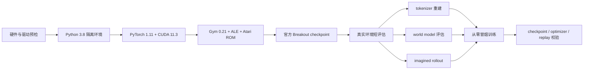
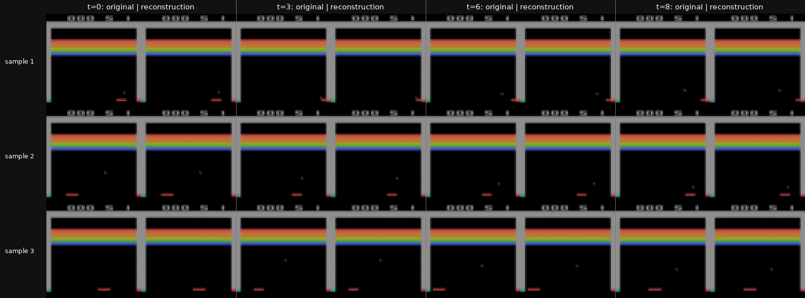
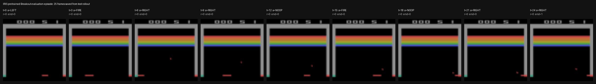
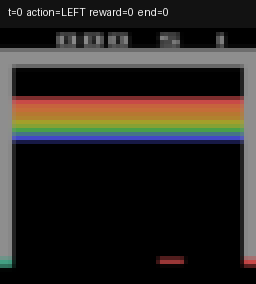
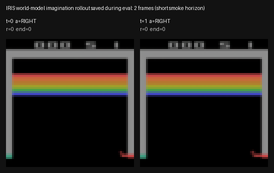

# IRIS 环境、预训练模型与冒烟测试复现指南

本文总结一次已经实际完成的 IRIS（*Transformers are Sample-Efficient
World Models*）复现准备过程。目标只有三项：

1. 建立与官方代码兼容的隔离环境；
2. 下载并验证官方 Breakout 预训练模型；
3. 用极小工作量跑通真实环境采集、tokenizer、Transformer world model、
   actor-critic、checkpoint 和 replay dataset。

本文**不会启动 100k environment steps 的正式训练**。冒烟测试只能证明
训练管线能运行，不能证明论文分数已复现。

## 整体复现流程



图中前半段解决旧依赖和 Atari 环境兼容问题；后半段分别验证预训练推理链路
与从随机初始化开始的反向传播链路。

---

## 1. “任何机器直接运行”的实际边界

原始 IRIS 使用 2022 年的软件栈，无法不加条件地在所有机器上运行。下列
命令面向满足这些条件的机器：

- Linux x86-64；
- NVIDIA GPU，以及可运行 CUDA 11.3 程序的驱动；
- 推荐 A100、V100 或 RTX 30 系列；本文实际验证的是 A100-SXM4-80GB；
- 至少 10GB 可用磁盘空间；
- 能访问 GitHub、PyPI、PyTorch 下载站和 Hugging Face；
- 已安装 `bash`、`git`、`curl`、`sha256sum` 和 `nvidia-smi`；
- 用户拥有合法使用 Atari ROM 的权利。

RTX 40、H100、Blackwell、AMD GPU、Apple Silicon、纯 CPU、Windows 原生环境
不属于本文的已验证范围。原因不是命令写法，而是 PyTorch 1.11/CUDA 11.3
与新硬件架构之间可能不兼容。

以下所有命令均使用普通用户目录，不依赖 `/home/xuyidong`。请在同一个
`bash` 会话中按顺序执行。默认使用物理 GPU 0；需要使用其他卡时，在开始前
执行例如 `export GPU_ID=2`。

---

## 2. 硬件和基础命令预检

```bash
set -euo pipefail

export GPU_ID="${GPU_ID:-0}"

uname -s
uname -m
command -v bash
command -v git
command -v curl
command -v sha256sum
command -v nvidia-smi
nvidia-smi
nvidia-smi -i "$GPU_ID"
df -h "$HOME"
```

必须看到：

- 操作系统为 `Linux`；
- 架构为 `x86_64`；
- `nvidia-smi` 能列出 NVIDIA GPU；
- `$HOME` 所在磁盘至少有 10GB 可用空间。

---

## 3. 安装 Miniforge

已有 `$HOME/miniforge3` 时会直接复用，没有时才下载安装。

```bash
set -euo pipefail

if [ ! -x "$HOME/miniforge3/bin/conda" ]; then
  curl -L --fail --retry 3 \
    -o /tmp/Miniforge3-Linux-x86_64.sh \
    https://github.com/conda-forge/miniforge/releases/latest/download/Miniforge3-Linux-x86_64.sh
  bash /tmp/Miniforge3-Linux-x86_64.sh -b -p "$HOME/miniforge3"
  rm -f /tmp/Miniforge3-Linux-x86_64.sh
fi

source "$HOME/miniforge3/etc/profile.d/conda.sh"
conda --version
```

---

## 4. 获取并冻结官方代码

复现使用的官方 commit 为：

```text
24326aaaa283c527f42b89b44cfdecf2665a7a16
```

下面的写法在目标目录尚不存在时克隆代码；目录已经是 IRIS Git 仓库时则复用。

```bash
set -euo pipefail

export IRIS_ROOT="${IRIS_ROOT:-$HOME/iris_repro}"
export IRIS_COMMIT="24326aaaa283c527f42b89b44cfdecf2665a7a16"

if [ -e "$IRIS_ROOT" ] && [ ! -d "$IRIS_ROOT/.git" ]; then
  echo "ERROR: $IRIS_ROOT exists but is not an IRIS Git repository." >&2
  echo "Choose another path with: export IRIS_ROOT=/path/to/iris_repro" >&2
  exit 1
fi

if [ ! -d "$IRIS_ROOT/.git" ]; then
  git clone https://github.com/eloialonso/iris.git "$IRIS_ROOT"
fi

git -C "$IRIS_ROOT" fetch origin
git -C "$IRIS_ROOT" checkout --detach "$IRIS_COMMIT"
cd "$IRIS_ROOT"

test "$(git rev-parse HEAD)" = "$IRIS_COMMIT"
git rev-parse HEAD
```

最后一行应输出完整 commit：

```text
24326aaaa283c527f42b89b44cfdecf2665a7a16
```

---

## 5. 创建 Python 3.8 环境

环境不存在时创建，存在时复用。

```bash
set -euo pipefail

source "$HOME/miniforge3/etc/profile.d/conda.sh"

if [ ! -x "$HOME/miniforge3/envs/iris/bin/python" ]; then
  conda create -n iris python=3.8 pip -y
fi

conda activate iris
python --version
```

应得到 Python 3.8；本次实际安装的是 Python 3.8.20。

---

## 6. 安装固定依赖

Gym 0.21 无法可靠地使用最新 pip/wheel 构建，因此先固定构建工具：

```bash
set -euo pipefail

conda activate iris
python -m pip install \
  pip==23.3.2 \
  setuptools==66.0.0 \
  wheel==0.38.4
```

安装论文代码使用的 CUDA 11.3 版 PyTorch：

```bash
set -euo pipefail

conda activate iris
python -m pip install \
  torch==1.11.0+cu113 \
  torchvision==0.12.0+cu113 \
  --extra-index-url https://download.pytorch.org/whl/cu113
```

下一条命令会安装 Atari ROM 许可包。只有确认自己拥有合法使用 ROM 的权利后
才应执行：

```bash
set -euo pipefail

conda activate iris
cd "$IRIS_ROOT"
python -m pip install -r requirements.txt
python -m pip check
```

本次成功运行时解析出的完整 Python 依赖保存在相邻文件
`requirements-lock-py38.txt`。如果该文件也被复制到了新机器，可用下面的
命令把环境收敛到同一组版本：

```bash
set -euo pipefail

conda activate iris
cd "$IRIS_ROOT"
test -f requirements-lock-py38.txt
python -m pip install \
  --extra-index-url https://download.pytorch.org/whl/cu113 \
  -r requirements-lock-py38.txt
python -m pip check
```

---

## 7. 验证 CUDA、Gym、ALE 和 Breakout

```bash
set -euo pipefail

conda activate iris
cd "$IRIS_ROOT"

export GPU_ID="${GPU_ID:-0}"

CUDA_VISIBLE_DEVICES="$GPU_ID" python - <<'PY'
import sys
import ale_py
import cv2
import gym
import torch
import torchvision

print("python:", sys.version.split()[0])
print("torch:", torch.__version__)
print("torchvision:", torchvision.__version__)
print("torch CUDA runtime:", torch.version.cuda)
print("CUDA available:", torch.cuda.is_available())

assert torch.cuda.is_available(), "PyTorch cannot access an NVIDIA GPU"
print("GPU:", torch.cuda.get_device_name(0))

x = torch.randn(1024, 1024, device="cuda")
y = x @ x
assert y.shape == (1024, 1024)
assert torch.isfinite(y).all()

print("gym:", gym.__version__)
print("ale-py:", ale_py.__version__)
print("opencv:", cv2.__version__)

env = gym.make("BreakoutNoFrameskip-v4")
obs = env.reset()
assert obs.shape == (210, 160, 3)
assert env.action_space.n == 4

obs, reward, done, info = env.step(env.action_space.sample())
assert obs.shape == (210, 160, 3)
assert isinstance(info, dict)
env.close()

print("CUDA and Atari checks: PASS")
PY
```

本次成功验证的核心版本为：

```text
Python 3.8.20
torch 1.11.0+cu113
torchvision 0.12.0+cu113
Gym 0.21.0
ALE 0.7.4
```

---

## 8. 下载并校验官方 Breakout checkpoint

```bash
set -euo pipefail

conda activate iris
cd "$IRIS_ROOT"

mkdir -p pretrained_models
curl -L --fail --retry 3 \
  -o pretrained_models/Breakout.pt \
  https://huggingface.co/eloialonso/iris/resolve/main/pretrained_models/Breakout.pt

printf '%s  %s\n' \
  '169e3669b7d1901990b4ebce35ff8f3355610fae393e6a587fd62c40faf790f4' \
  'pretrained_models/Breakout.pt' \
  | sha256sum -c -
```

成功时应输出：

```text
pretrained_models/Breakout.pt: OK
```

进一步检查 checkpoint 内容：

```bash
set -euo pipefail

conda activate iris
cd "$IRIS_ROOT"

python - <<'PY'
import torch

state = torch.load("pretrained_models/Breakout.pt", map_location="cpu")
assert len(state) == 624
assert all(torch.is_tensor(value) for value in state.values())
print("checkpoint tensors:", len(state))
print("checkpoint structure: PASS")
PY
```

---

## 9. 运行缩短版预训练模型验证

该命令不会评估论文分数。它只运行 100 步上限的 Breakout episode，并验证：

- 预训练 tokenizer、world model、actor-critic 能全部加载；
- agent 能在真实 Atari 环境中行动；
- tokenizer reconstruction 能生成；
- world-model loss 能计算；
- imagined rollout 能生成。

第一次构造 tokenizer 时会额外下载约 528MB 的 VGG16 权重和约 7KB 的 LPIPS
权重，之后会复用缓存。

```bash
set -euo pipefail

conda activate iris
cd "$IRIS_ROOT"

export GPU_ID="${GPU_ID:-0}"
export PRETRAINED_OUT="outputs/pretrained-breakout-check-$(date -u +%Y%m%dT%H%M%S%N)"
export BREAKOUT_CKPT="$IRIS_ROOT/pretrained_models/Breakout.pt"

CUDA_VISIBLE_DEVICES="$GPU_ID" WANDB_SILENT=true python src/main.py \
  hydra.run.dir="$PRETRAINED_OUT" \
  wandb.mode=disabled \
  env.train.id=BreakoutNoFrameskip-v4 \
  env.test.max_episode_steps=100 \
  common.device=cuda:0 \
  common.epochs=1 \
  common.do_checkpoint=False \
  initialization.path_to_checkpoint="$BREAKOUT_CKPT" \
  initialization.load_tokenizer=True \
  initialization.load_world_model=True \
  initialization.load_actor_critic=True \
  training.should=False \
  evaluation.should=True \
  evaluation.every=1 \
  collection.test.num_envs=1 \
  collection.test.num_episodes_to_save=1 \
  collection.test.config.num_episodes=1 \
  evaluation.tokenizer.start_after_epochs=0 \
  evaluation.world_model.start_after_epochs=0 \
  evaluation.actor_critic.start_after_epochs=0 \
  evaluation.actor_critic.num_episodes_to_save=2 \
  evaluation.actor_critic.horizon=2
```

检查必要产物：

```bash
set -euo pipefail

cd "$IRIS_ROOT"
test -f "$PRETRAINED_OUT/config/trainer.yaml"
test -n "$(find "$PRETRAINED_OUT/media/reconstructions" -name '*.png' -print -quit)"
test -n "$(find "$PRETRAINED_OUT/media/episodes/test" -name '*.pt' -print -quit)"
test -n "$(find "$PRETRAINED_OUT/media/episodes/imagination" -name '*.pt' -print -quit)"

find "$PRETRAINED_OUT/media/reconstructions" -name '*.png' | sort | sed -n '1,10p'
echo "pretrained validation artifacts: PASS"
```

### 本次实际生成的 tokenizer 对照图



如果这里没有显示图片，请确认你打开的是整个 `iris_repro` 目录里的 Markdown，
而不是只拷贝了单个 `.md` 文件。图片文件位于：

```text
docs/assets/iris_reproduction/tokenizer_reconstruction_sequence.png
```

图中每一行是独立采样的 Breakout 片段，每个时间点都按
`original | reconstruction` 排列：左侧是输入 tokenizer 的 64×64 真实帧，
右侧是离散 tokenizer 编码再解码后的重建帧。为了便于查看，图像仅使用
nearest-neighbor 放大并拼版，没有修改模型输出。

可以看到计分区、彩色砖墙、球、挡板和边界均被保留，且球和挡板随时间发生
相应位移。这证明 checkpoint、Atari 预处理、离散编码器和解码器已经正确接通；
它不等价于 world model 长时预测准确，也不代表论文分数已经复现。

### 评价过程中保存的轨迹图

下面这张图来自同一次预训练 checkpoint 的 shortened evaluation，
文件源是：

```text
outputs/pretrained-breakout-check/media/episodes/test/episode_0_epoch_1.pt
```



每个小格是评价 episode 中抽取的一个时间点，标题里包含 timestep、动作、
即时 reward 和 end 标记。这个图主要用于确认 evaluation 阶段确实跑通了
真实 Atari 环境、策略动作被记录、轨迹文件可以被正常解析。

同一段评价轨迹也导出了一份 GIF：



评价脚本还保存了 world model imagination 轨迹。因为本指南中的冒烟验证
把 `evaluation.actor_critic.horizon=2`，所以这里的想象轨迹只有 2 帧：



如果要生成更有说明力的 imagination 长轨迹，可以在完成冒烟测试后单独把
`evaluation.actor_critic.horizon` 调大，再重新运行 evaluation；这会更耗时，
但能更直观地展示 world model 的连续想象能力。

---

## 10. 运行从随机初始化开始的冒烟训练

该测试沿用完整模型结构，但把实验缩短为：

- 64 个真实环境步骤；
- tokenizer、world model、actor-critic 各 1 次 optimizer step；
- batch size 为 2；
- actor burn-in 和 imagination horizon 为 2；
- 不运行测试集评估；
- 保存 checkpoint、三个 optimizer 和 replay dataset。

```bash
set -euo pipefail

conda activate iris
cd "$IRIS_ROOT"

export GPU_ID="${GPU_ID:-0}"
export SMOKE_OUT="outputs/scratch-breakout-smoke-$(date -u +%Y%m%dT%H%M%S%N)"

CUDA_VISIBLE_DEVICES="$GPU_ID" WANDB_SILENT=true python src/main.py \
  hydra.run.dir="$SMOKE_OUT" \
  wandb.mode=disabled \
  env.train.id=BreakoutNoFrameskip-v4 \
  common.device=cuda:0 \
  common.epochs=1 \
  common.do_checkpoint=True \
  collection.train.stop_after_epochs=1 \
  collection.train.num_episodes_to_save=1 \
  collection.train.config.num_steps=64 \
  training.tokenizer.start_after_epochs=0 \
  training.tokenizer.steps_per_epoch=1 \
  training.tokenizer.batch_num_samples=2 \
  training.world_model.start_after_epochs=0 \
  training.world_model.steps_per_epoch=1 \
  training.world_model.batch_num_samples=2 \
  training.actor_critic.start_after_epochs=0 \
  training.actor_critic.steps_per_epoch=1 \
  training.actor_critic.batch_num_samples=2 \
  training.actor_critic.burn_in=2 \
  training.actor_critic.imagine_horizon=2 \
  evaluation.should=False
```

---

## 11. 严格检查冒烟训练产物

```bash
set -euo pipefail

conda activate iris
cd "$IRIS_ROOT"

SMOKE_OUT="$SMOKE_OUT" python - <<'PY'
import os
from pathlib import Path

import torch

root = Path(os.environ["SMOKE_OUT"]) / "checkpoints"

required = [
    root / "last.pt",
    root / "optimizer.pt",
    root / "epoch.pt",
    root / "dataset",
]
for path in required:
    assert path.exists(), f"missing artifact: {path}"

state = torch.load(root / "last.pt", map_location="cpu")
assert len(state) == 624

nonfinite = [
    name
    for name, value in state.items()
    if torch.is_tensor(value) and not torch.isfinite(value).all()
]
assert not nonfinite, f"non-finite checkpoint tensors: {nonfinite}"

optimizers = torch.load(root / "optimizer.pt", map_location="cpu")
expected_optimizers = {
    "optimizer_tokenizer",
    "optimizer_world_model",
    "optimizer_actor_critic",
}
assert set(optimizers) == expected_optimizers

episode_files = sorted((root / "dataset").glob("*.pt"))
assert episode_files, "replay dataset is empty"

lengths = []
for path in episode_files:
    episode = torch.load(path, map_location="cpu")
    lengths.append(len(episode["actions"]))

assert sum(lengths) == 64, f"expected 64 replay steps, got {sum(lengths)}"
assert torch.load(root / "epoch.pt", map_location="cpu") == 1

print("checkpoint tensors:", len(state))
print("non-finite tensors:", len(nonfinite))
print("optimizer states:", sorted(optimizers))
print("replay episode lengths:", lengths)
print("replay steps:", sum(lengths))
print("scratch training smoke test: PASS")
PY
```

不同随机运行可能把 64 步切成不同数量、不同长度的 episode；唯一固定要求是
总步数为 64。

---

## 12. 本次实际执行结果

在 A100-SXM4-80GB 上，本指南对应流程实际得到：

- CUDA 矩阵运算：通过；
- `BreakoutNoFrameskip-v4` reset/step：通过；
- 官方 Breakout checkpoint SHA-256：通过；
- 官方 checkpoint 张量数：624；
- 预训练真实环境采集：通过；
- tokenizer reconstruction：生成 20 张 PNG；
- world model evaluation：通过；
- imagined rollout：通过；
- 从零训练的三个 optimizer step：全部通过；
- 冒烟 checkpoint 张量数：624；
- NaN/Inf 张量数：0；
- replay dataset 总步数：64；
- checkpoint、optimizer、dataset 回读：通过；
- `pip check`：无损坏依赖。

本机首次安装占用大约：

- Conda 环境：3.8GB；
- 仓库、checkpoint 和本次测试输出：约 394MB；
- VGG16 缓存：528MB。

主要等待时间来自 PyTorch、VGG16 和 checkpoint 下载；缓存完成后，两次缩短测试
在 A100 上均只需要很短时间。

---

## 13. 后续重新进入环境

```bash
source "$HOME/miniforge3/etc/profile.d/conda.sh"
conda activate iris
export IRIS_ROOT="${IRIS_ROOT:-$HOME/iris_repro}"
export GPU_ID="${GPU_ID:-0}"
cd "$IRIS_ROOT"
```

到此为止，环境和训练管线已经验证完毕。不要把本指南的冒烟结果当成论文性能复现。
