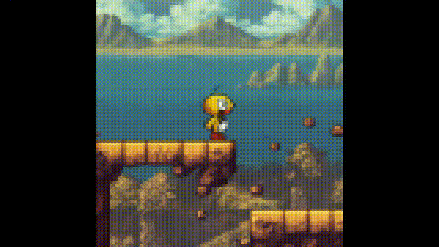

# 概览与问题设定

## 本页目标

本章介绍 Genie 的研究背景、任务定义和数据问题，重点回答：

```text
Genie 为什么出现？
普通视频生成为什么不能直接作为交互环境？
什么样的生成结果才能被称为可交互？
传统世界模型为什么依赖动作标签？
为什么二维平台游戏适合作为第一代验证场景？
```

## 从生成内容到生成体验

图像生成模型可以根据文字生成一张新图片，视频生成模型可以根据文字或初始画面生成一段动态内容。

这类模型主要解决：

```text
世界看起来是什么样
以及
一段视频可能如何发展
```

但用户通常无法在视频生成过程中逐帧决定角色行为。

例如，模型生成了一段角色穿过森林的视频。即使视频非常清晰，观看者通常也不能在第三秒决定：

```text
让角色向左
让角色跳跃
让角色停止
改变原本的视频轨迹
```

Genie 关注的不是只生成内容，而是生成可以被操作的体验。

## 视频生成和可交互环境的差别

普通视频生成过程通常是：

```text
文本或初始图像
-> 视频生成模型
-> 一段完整视频
```

可交互环境则要求形成闭环：

```text
当前画面
+ 用户动作
-> 下一画面

下一画面
+ 新动作
-> 再下一画面
```

用户的动作需要真正改变未来。

同一个初始画面下：

```text
选择动作 A
-> 轨迹 A

选择动作 B
-> 轨迹 B
```

如果不同动作产生相同结果，模型实际上忽略了控制输入；如果动作能改变轨迹，但画面立即崩坏，也难以作为可用环境。

## 可交互环境需要满足什么

一段生成结果要成为可交互环境，至少需要具备五类能力：

| 能力 | 含义 |
| --- | --- |
| 动作敏感性 | 用户输入的动作能够影响下一状态 |
| 动作可区分性 | 不同动作能够产生不同未来 |
| 语义一致性 | 同一个动作在不同场景中具有相对稳定的效果 |
| 时间连续性 | 多步交互过程中角色和场景变化保持连贯 |
| 闭环控制 | 新生成的画面能够继续作为下一步动作的输入状态 |

这比普通视频生成增加了一个关键问题：

```text
不仅要预测“接下来可能发生什么”，
还要预测“采取指定动作后会发生什么”。
```


图中从相同或相似的初始图像出发，通过不同 latent action 得到不同轨迹。需要重点观察的不是单帧画质，而是角色运动是否随动作发生分叉。

## 传统世界模型的数据形式

传统动作条件世界模型通常使用：

```text
当前状态
+ 真实动作
+ 下一状态
```

例如，游戏数据可以记录：

```text
当前游戏画面
+ 玩家按下向左键
+ 下一帧游戏画面
```

机器人数据可以记录：

```text
当前相机图像
+ 机械臂末端控制命令
+ 下一时刻图像
```

真实动作使模型能够学习：

```text
某个动作会造成什么结果
```

但这种数据需要访问游戏引擎、机器人控制器或仿真器接口。

## 互联网视频缺少什么

互联网中存在大量游戏录像和机器人演示视频，但大多数视频只保存视觉内容。

视频通常不会同步记录：

```text
玩家按下了哪个键
手柄摇杆的具体数值
相机控制指令
机械臂关节动作
末端执行器速度
夹爪控制量
```

因此，虽然视频数量巨大，却不能直接被传统世界模型当作完整的 observation-action-next observation 数据使用。

Genie 的核心问题就是：

```text
能否只观察视频，
自动发现画面之间的潜在控制因素，
再用这些控制因素构建可交互环境？
```

## 动作被视为隐藏变量

假设视频包含：

```text
x₁, x₂, x₃, ..., xₜ
```

训练数据没有提供动作，但相邻帧之间的变化包含动作造成的视觉结果。

Genie 在状态之间引入隐藏变量：

```text
xₜ + aₜ -> xₜ₊₁
```

其中 `aₜ` 表示潜在动作。

模型需要从视频中自动推断：

```text
哪些变化可能来自用户控制
哪些变化来自环境自身运动
哪些变化来自相机
哪些变化只是视觉噪声
```

这使 Genie 能够利用只包含视频的数据学习动作条件动态。

## 为什么选择二维平台游戏

第一代 Genie 的主要训练数据来自二维平台游戏。

这种场景具有几个优势：

1. 可控角色通常比较明显；
2. 运动模式相对简单；
3. 左右移动、跳跃和下落在许多游戏中反复出现；
4. 不同游戏虽然画风不同，但共享类似控制结构；
5. 环境变化在视觉上容易观察；
6. 可以用有限动作代码验证可控性。

二维平台游戏并不代表 Genie 的最终应用范围，而是一个适合验证核心假设的起点：

```text
在没有动作标签的情况下，
模型能否从多种视觉环境中发现共享控制结构？
```

## Platformers 数据的初始收集

研究团队根据平台游戏关键词，从公开视频中构建初始数据。

筛选条件包括：

```text
标题包含二维平台游戏相关关键词
标题或描述包含 playthrough、speedrun 等行为词
标题中排除 movie、unboxing 等不符合游戏操作的视频
```

原始处理得到约：

| 项目 | 初始规模 |
| --- | --- |
| 视频片段 | 约 5500 万段 |
| 单段长度 | 16 秒 |
| 帧率 | 10 FPS |
| 单段帧数 | 160 帧 |
| 分辨率 | 160 × 90 |
| 总时长 | 约 24.4 万小时 |

原始数据规模很大，但其中包含菜单、主播头像、片头、低质量画面和不清晰的游戏过程。

## 数据质量过滤

为了过滤低质量视频，研究团队先人工标注约 1 万段视频，质量等级从 1 到 5。

随后使用这些标注训练一个约 11M 参数的 ResNet-18 分类器，用于识别：

```text
清晰的平台游戏过程
和
带有菜单、主播画面或其他干扰内容的视频
```

经过过滤后，最终数据集包含：

| 项目 | 最终规模 |
| --- | --- |
| 视频片段 | 约 680 万段 |
| 总时长 | 约 3 万小时 |
| 单段长度 | 16 秒 |
| 帧率 | 10 FPS |
| 分辨率 | 160 × 90 |

最终数据量只占原始数据的一小部分，但使用同类模型评估时，过滤后的数据获得了更好的 FVD。

这说明，对视频世界模型而言：

```text
数据数量很重要，
但清晰且真正包含交互过程的数据质量同样重要。
```

## Genie 的输入和输出

Genie 的交互输入包括：

```text
初始图像
+ 当前 latent action
```

输出是：

```text
动作执行后的下一视觉状态
```

完整闭环为：

```text
初始图像
-> 用户选择动作
-> 生成下一帧
-> 用户再次选择动作
-> 继续生成轨迹
```

用户并不直接编辑角色坐标，也不访问游戏程序。所有状态变化都由生成模型在视觉空间中预测。

## Genie 与其他系统的区别

| 系统 | 训练数据 | 控制方式 | 输出特点 |
| --- | --- | --- | --- |
| 普通视频生成模型 | 视频、文本或图像 | 通常是视频级提示 | 一段自动生成的视频 |
| 传统动作条件世界模型 | 视频或状态 + 真实动作 | 真实动作接口 | 动作条件的未来状态 |
| 传统游戏引擎 | 人工资产、规则和代码 | 预先定义的动作 | 明确、可查询的游戏状态 |
| Genie | 只有视频 | 自动学习的 latent action | 可逐帧控制的生成视觉轨迹 |

Genie 的优势是能够利用大规模无动作视频。

它的代价是缺少游戏引擎中的显式状态和规则。

## Genie 能做什么

第一代 Genie 已展示：

```text
从单张图像开始交互
从平台游戏视频中学习有限 latent action
从生成图、草图和照片中生成游戏式轨迹
在机器人视频中学习相对一致的运动代码
将 latent action 用于无动作专家视频的策略学习
```

## Genie 暂时不能做什么

第一代 Genie 不能被直接等同于：

```text
完整游戏开发工具
长期稳定的三维模拟器
精确机器人控制器
带显式物理状态的仿真器
可以查询对象位置的世界数据库
```

它生成的是动作条件视觉轨迹，而不是传统意义上的完整程序化世界。

## 动态交互示例



这段官方 GIF 展示了平台场景中的连续角色运动，对应 Genie 让用户在生成过程中持续输入 latent action 的交互设定。观察重点是角色、地形和画面滚动如何随时间共同变化，而非单帧是否足够清晰；它展示的是生成出的动作条件轨迹，不能证明环境具有显式游戏规则或长期精确物理状态。

## 本页小结

Genie 的核心问题不是单纯生成更清晰的视频，而是从没有动作标签的视频中恢复控制结构。

它将动作视为画面之间的隐藏变量，并通过有限 latent action 构建逐帧交互闭环。二维平台游戏为这一想法提供了行为清晰、视觉多样且数据规模较大的验证环境。

Genie 的贡献首先是证明：

```text
普通视频不仅可以用于学习外观，
还可能被用于学习动作和环境动态。
```

