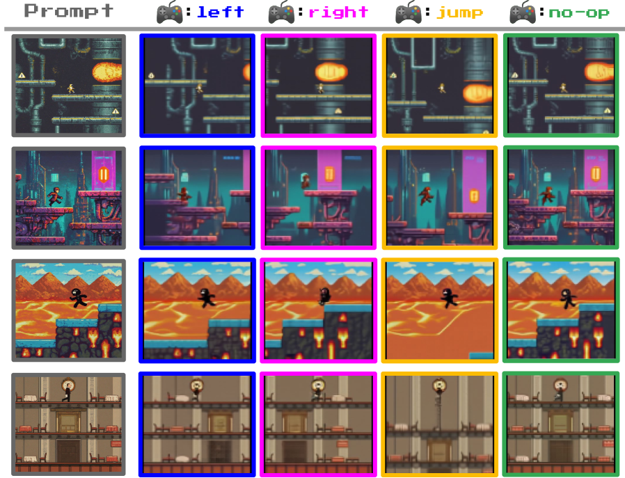

# 潜在动作学习

## 本页目标

Genie 只使用视频进行训练，但可交互环境必须接收动作。

本页独立解释：

```text
为什么动作在普通视频中是不可观测变量
LAM 如何从历史画面和下一帧推断动作
为什么 latent action 使用离散 codebook
动作数量过多或过少会有什么影响
如何判断 latent action 是否具有稳定语义
为什么 LAM 直接读取像素而不是视觉 token
```

## 动作为什么是隐藏变量

在带控制日志的游戏或机器人数据中，动作是明确记录的。

例如：

```text
状态：角色位于平台中央
动作：向左
结果：角色移动到平台左侧
```

互联网视频通常只提供：

```text
角色位于中央
-> 角色移动到左侧
```

模型看不到“向左”这个真实控制命令。

因此，它只能根据视觉变化推断一个隐藏变量：

```text
过去画面 + 隐藏动作 -> 下一画面
```

## 帧变化不一定全部来自动作

从画面变化中发现动作并不简单，因为帧之间的变化可能同时来自多个因素：

```text
玩家控制角色移动
相机跟随角色移动
背景自动滚动
NPC 自主运动
粒子和动画自动播放
游戏界面变化
视频压缩噪声
```

例如，角色在画面中保持不动，但背景向右移动，可能意味着角色实际上向左前进，同时相机在跟随。

LAM 需要从这些混合变化中提取最有控制意义的部分。

## 一个具体例子

假设第 `t` 帧中：

```text
角色站在平台中央
前景中有一块岩石
远处背景中有山峰
```

第 `t+1` 帧中：

```text
角色出现在左侧
前景岩石向右移动较多
远处山峰只轻微移动
```

模型需要判断：

```text
角色是否执行了向左动作
相机是否同时跟随角色
背景变化是否只是视差
哪些变化应该被压缩到同一个动作代码中
```

latent action 不一定只描述角色位移，也可能同时隐含相机和场景响应。

## LAM 的基本结构

潜在动作模型（Latent Action Model，LAM）由 Encoder、离散 codebook 和 Decoder 组成。


训练时，Encoder 读取历史画面和下一帧：

```text
历史画面 x≤t
+ 下一帧 xₜ₊₁
-> LAM Encoder
-> 连续动作表示
```

连续表示随后经过向量量化，被映射到有限 codebook 中的某个离散动作。

Decoder 接收：

```text
历史画面
+ 离散 latent action
```

并尝试重建下一帧。

## 为什么 Decoder 能迫使动作包含关键信息

LAM Decoder 看不到真实下一帧。

它只能使用：

```text
过去发生了什么
以及
Encoder 提供的 latent action
```

如果 latent action 没有包含角色移动等关键信息，Decoder 就无法准确重建未来。

因此，训练过程会推动动作代码记录：

```text
过去画面无法单独推断的关键变化
```

例如，过去帧无法确定角色下一步向左还是向右，那么 latent action 就必须区分这两种未来。

## VQ 量化的作用

LAM 使用类似 VQ-VAE 的离散化机制。

Encoder 最初生成连续向量，随后选择 codebook 中最接近的离散向量。

可以表示为：

```text
连续动作表示
-> 在 codebook 中寻找最近代码
-> 离散 latent action
```

离散化带来几个作用：

1. 限制动作空间规模；
2. 让人类可以直接选择动作编号；
3. 让智能体 policy 可以预测有限类别；
4. 促进不同视频中的相似变化共享动作代码；
5. 防止动作表示退化成难以解释的高维连续噪声。

## 为什么主要实验使用 8 个动作

Platformers 主要模型使用 8 个 latent action。

这并不意味着所有平台游戏只有 8 个真实动作，而是模型使用 8 个离散代码压缩最主要的控制变化。

动作数量过少时：

```text
向左、向右和跳跃等行为可能被混合
模型无法区分不同未来
```

动作数量过多时：

```text
同一行为可能被拆成多个相似代码
用户难以理解每个按键
智能体动作空间增大
动作利用率可能不均衡
```

论文指出，增加代码数量可能改善表示能力，但会降低人类和智能体操作的便利性。

因此，8 个动作是表达能力和可操作性之间的折中。

## 动作塌缩问题

潜在动作学习可能出现动作塌缩：

```text
模型只使用少数几个 code
其他 code 几乎不被使用
```

如果 Dynamics Model 足够强，它可能尝试仅凭历史画面预测未来，而忽略 latent action。

这种情况下，虽然模型仍能生成视频，但用户动作不能有效改变结果。

判断是否出现动作塌缩，需要观察：

```text
不同 code 的使用频率
不同动作是否产生可区分轨迹
相同动作是否具有一致含义
随机动作是否显著改变生成结果
```

## 动作语义如何形成

Genie 没有人工规定动作含义。

动作语义来自视频中的重复规律。

数百款平台游戏虽然外观不同，但经常包含：

```text
向左
向右
跳跃
保持不动
下落
```

当类似视觉变化在大量视频中反复出现时，LAM 倾向于把它们压缩到共享 code 中。

论文展示的部分动作具有近似语义：

```text
left
right
jump
no-op
```

但这些含义是训练结果，而不是预先指定标签。

## 跨场景动作一致性



图中从多个不同起始画面出发，每列重复执行相同 latent action。需要观察的是，同一列中的角色是否呈现相似移动方向。

更多 latent action 一致性演示可以在 [Genie 官方项目页](https://sites.google.com/view/genie-2024/home) 中查看。

## 一致性不等于完全固定语义

相同 latent action 在多个场景中可能表现相似，但并不保证永远对应唯一真实动作。

原因包括：

```text
不同游戏的控制规则不同
角色外观和姿态不同
相机模式不同
某些画面没有明显可控角色
动作、相机和背景变化相互耦合
```

一个 code 可能同时代表：

```text
角色向左
相机跟随
背景向右滚动
角色动画变化
```

因此，latent action 是数据驱动的控制表示，不是严格的游戏引擎按键。

## 为什么 LAM 直接读取像素

论文比较了两种 LAM 输入：

```text
Pixel-input：
直接读取原始视频帧

Token-input：
读取 Video Tokenizer 压缩后的 token
```

在 Platformers 中：

| 方法 | FVD | 可控性指标 |
| --- | ---: | ---: |
| Token-input | 38.8 | 1.33 |
| Pixel-input | 40.1 | 1.91 |

Token-input 的 FVD 略好，但可控性明显更低。

在 Robotics 中：

| 方法 | FVD | 可控性指标 |
| --- | ---: | ---: |
| Token-input | 257.8 | 1.65 |
| Pixel-input | 136.4 | 2.07 |

机器人数据上，Pixel-input 在视频质量和可控性上都更好。

这说明视觉 Tokenizer 在压缩画面时，可能丢失对动作发现很重要的微小运动细节。

## 训练和推理阶段的差别

训练阶段：

```text
真实过去帧 + 真实下一帧
-> LAM 推断 latent action
-> Dynamics Model 学习动作条件未来
```

推理阶段：

```text
用户直接选择动作编号
-> 查询 LAM codebook
-> Dynamics Model 生成下一帧
```

LAM 的 Encoder 和 Decoder 主要用于训练。

推理时，除了动作 codebook，其余 LAM 模块可以被用户动作替代。

## 与真实动作空间的关系

latent action 并不直接等于真实键盘或机器人控制命令。

在机器人任务中，一个 code 看起来像“机械臂向左”，但它不一定明确对应：

```text
某个关节旋转角度
末端执行器目标位置
笛卡尔速度
夹爪控制量
```

真实使用时仍需要学习：

```text
latent action -> real action
```

这种对齐在 CoinRun 行为克隆实验中通过少量带真实动作的数据完成。

## 能力边界

LAM 可以从视频变化中发现稳定行为模式，但它仍面临：

```text
动作和环境自动变化难以分离
相机运动与角色运动可能混合
动作代码语义不完全固定
code 使用可能不均衡
复杂连续控制难以压缩为少数离散动作
```

因此，第一代 LAM 更适合行为结构相对清晰的环境。

## 本页小结

LAM 将动作视为历史画面和下一帧之间的隐藏变量。

Encoder 推断动作，VQ codebook 将其离散化，Decoder 则迫使动作表示保留未来变化所需的信息。有限动作 code 让用户和 agent 能够直接操作生成环境。

论文实验也表明，动作发现需要保留细粒度像素运动信息。视觉压缩适合生成，并不一定适合推断动作。

