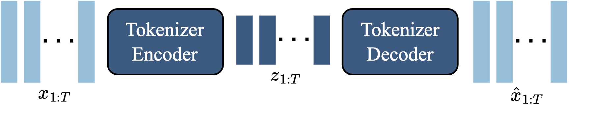
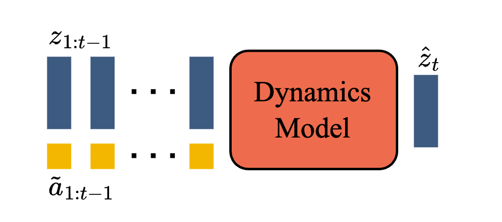

# 模型组件与训练

## 本页目标

Genie 要同时解决三个不同问题：

```text
如何压缩高维视频
如何从无标签视频发现动作
如何根据动作预测未来画面
```

本页独立介绍 Genie 的完整数据流、时空 Transformer、Video Tokenizer、LAM、Dynamics Model、两阶段训练和模型规模。

## 整体数据流

Genie 包含三个主要组件：

```text
Video Tokenizer
Latent Action Model
Dynamics Model
```

<p align="center">
  
</p>

原始视频沿两条路径处理。

视觉路径：

```text
原始视频
-> Video Tokenizer
-> 离散视觉 token
```

动作路径：

```text
原始视频
-> LAM
-> 相邻帧之间的 latent action
```

随后：

```text
历史视觉 token
+ latent action
-> Dynamics Model
-> 下一帧视觉 token
```

最后由 Tokenizer Decoder 将 token 还原成 RGB 图像。

## 不同阶段看见的信息

| 阶段 | 输入 | 输出 | 目的 |
| --- | --- | --- | --- |
| Tokenizer 训练 | 原始视频 | 视觉 token 与重建视频 | 压缩视觉世界 |
| LAM 训练 | 历史帧和下一帧 | latent action | 发现控制因素 |
| Dynamics 训练 | 历史 token 和 latent action | 下一帧 token | 学习动作条件动态 |
| 交互推理 | 初始图像和用户动作 | 连续生成画面 | 构建可控轨迹 |

这张表说明，三个模块虽然使用同一批视频，但解决的目标并不相同。

## 为什么需要视觉 Tokenizer

原始视频包含大量像素。

如果模型直接在像素空间预测每个未来帧：

```text
计算量大
生成序列长
高频细节难以建模
Transformer token 数量过多
```

Video Tokenizer 将图像压缩成离散 token，使 Dynamics Model 在更小的表示空间中学习。

编码：

```text
RGB 视频帧
-> Tokenizer Encoder
-> 离散视觉 token
```

解码：

```text
视觉 token
-> Tokenizer Decoder
-> RGB 视频帧
```

## Video Tokenizer 结构



Genie 的 Tokenizer 基于 VQ-VAE 思路，并使用时空 Transformer。

主要设置包括：

| 项目 | 设置 |
| --- | --- |
| 参数量 | 约 200M |
| Patch size | 4 |
| Codebook 大小 | 1024 |
| Latent dimension | 32 |
| 序列长度 | 16 帧 |

每个离散视觉 token 不只描述单张画面的局部外观，还能通过时间注意力包含部分历史动态信息。

## ST-Transformer

Genie 的主要组件都使用时空 Transformer（Spatiotemporal Transformer，ST-Transformer）。


完整时空注意力让所有视频 token 彼此交互，内存成本会随帧数和空间 token 数量快速增长。

ST-Transformer 将注意力拆分为：

```text
空间注意力：
同一帧内不同位置之间的关系

时间注意力：
同一空间位置跨时间步的变化
```

一个 block 包含：

```text
Spatial Attention
-> Temporal Attention
-> Feed-Forward Layer
```

这种结构使主要计算成本随帧数近似线性增长，而不是完整时空注意力中的更高增长。

## 空间注意力和时间注意力分别学什么

空间注意力主要帮助模型理解：

```text
角色位于哪里
平台边缘在哪里
背景和前景如何排列
物体之间是什么关系
```

时间注意力主要帮助模型理解：

```text
角色如何移动
相机如何变化
背景如何滚动
物体状态如何随时间变化
```

Genie 并没有显式分割角色和背景，而是让时空注意力从视频中学习这些关系。

## LAM 在整体模型中的位置

LAM 直接读取像素视频，并为相邻帧生成 latent action。


它不负责最终视频生成，而是提供动作条件。

LAM 的详细动作发现过程可单独查看：

[潜在动作学习](02-latent-action-learning.md)

在整个系统中，LAM 的作用可以概括为：

```text
把没有动作标签的视频
转化为带 latent action 的训练序列
```

## Dynamics Model

Dynamics Model 根据历史视觉 token 和动作预测下一帧 token。



输入为：

```text
历史视频 token
+ latent action embedding
```

输出为：

```text
下一帧 token
```

它是完整 Genie 中参数量最大的模块，也是负责建模世界外观和动态的核心。

## MaskGIT 生成方式

Dynamics Model 使用 decoder-only MaskGIT。

训练时，目标帧的一部分 token 被随机遮挡：

```text
可见历史 token
+ 当前 latent action
+ 部分被遮挡的目标 token
-> 预测完整目标帧
```

模型使用交叉熵学习恢复正确离散 token。

推理时，每一帧需要进行多轮 MaskGIT 采样。论文设置为每帧 25 个 MaskGIT step，并使用随机采样生成结果。

这种方式比严格逐 token 生成具有更高并行性，但仍增加了每帧推理开销。

## 动作如何进入 Dynamics Model

常见世界模型会将动作作为额外 token 拼接到视觉序列。

Genie 发现，将 latent action 作为 additive embedding 加入视觉表示，更有利于提高可控性。

可以理解为：

```text
每个相关视觉 token
都同时感知当前动作条件
```

这比把动作只放在序列一端，更容易让动作影响整幅目标帧。

## 两阶段训练

Genie 的训练分为两个阶段。

### 第一阶段：训练 Video Tokenizer

```text
输入视频
-> 编码成离散视觉 token
-> 解码重建原始视频
```

Tokenizer 单独训练约 300k step。

目标是建立适合后续视频预测的离散视觉空间。

### 第二阶段：共同训练 LAM 和 Dynamics Model

```text
LAM：
从像素视频中推断 latent action

Dynamics Model：
从视觉 token 和 latent action 中预测未来
```

两部分共同训练，使动作表示与环境动态相互适配。

LAM 学习：

```text
哪些变化值得被编码成动作
```

Dynamics Model 学习：

```text
这些动作在不同环境中会造成什么视觉结果
```

## 模型规模

完整模型主要由：

| 组件 | 参数量 |
| --- | ---: |
| Video Tokenizer | 约 200M |
| LAM | 约 300M |
| Dynamics Model | 约 10.1B |
| 合计 | 约 10.7B |

论文通常将其称为 11B Genie。

最终 Dynamics Model 使用：

| 项目 | 设置 |
| --- | --- |
| Batch size | 512 |
| 训练步数 | 125k |
| 训练 token | 约 942B |
| 训练硬件 | 256 个 TPU v5p |
| 层数 | 48 |
| Model dimension | 5120 |

这些数字说明，第一代 Genie 已经采用基础模型级别的扩展方式，而不是小规模单游戏模拟器。

## 模型扩展实验


论文先训练从约 40M 到 2.7B 参数的一系列 Dynamics Model。

随着模型规模增加，训练损失持续降低。

论文还在约 2.3B 参数模型上比较不同 batch size，发现更大的 batch 同样带来改善。

这些结果支持：

```text
更大的模型
+ 更大的有效 batch
+ 大规模视频数据
能够持续改善视频动态建模
```

但训练损失下降只能说明模型更好地拟合训练目标，并不能单独证明：

```text
长期状态完全稳定
物理规律准确
动作适合真实机器人
环境可以用于严格 benchmark
```

## 网站展示分辨率

主要训练视频分辨率为 160 × 90。

官方项目页展示中还使用了更大的 Decoder，将视觉 token 解码为 360p 视频。

这说明：

```text
内部世界动态表示
和
最终展示画质
可以由不同规模的 Decoder 处理。
```

## 本页小结

Genie 通过 Video Tokenizer 压缩视觉内容，通过 LAM 为无动作视频补充 latent action，再通过 Dynamics Model 学习动作条件下的未来。

ST-Transformer 贯穿多个组件，负责在可控计算成本下建模空间和时间关系。完整系统约 10.7B 参数，显示出生成式可交互环境同样能够从模型和数据规模扩展中获益。

