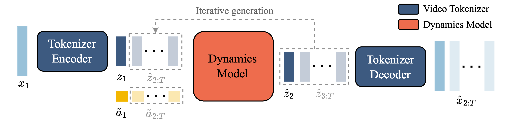
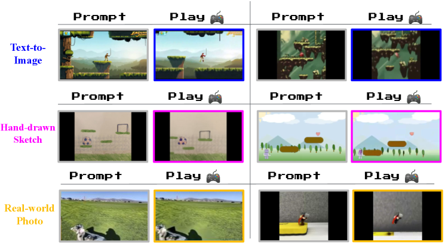
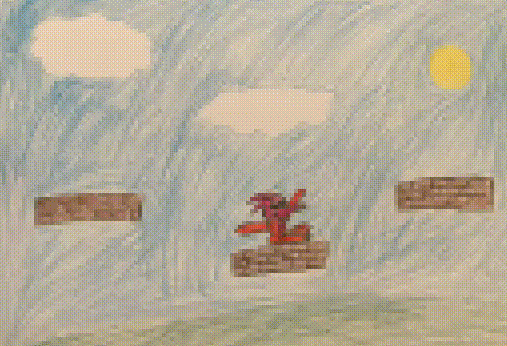
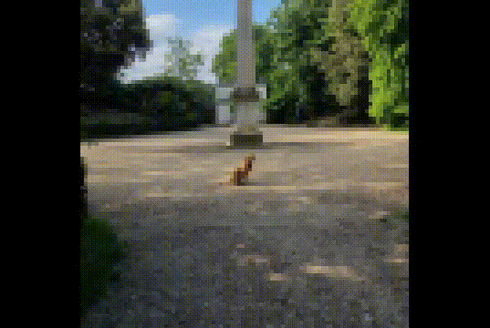

# 交互生成与泛化

## 本页目标

Genie 不只在训练视频中重放已有轨迹，还可以从新的初始图像开始交互。

本页介绍：

```text
推理阶段如何逐帧生成
同一个初始画面如何产生不同轨迹
为什么图像 Prompt 可以来自训练分布之外
草图和真实照片结果应该如何理解
视差说明了什么
自回归生成为什么会逐渐漂移
```

## 推理阶段不再需要真实下一帧

训练时，LAM 通过真实下一帧推断动作。

推理时，未来尚未发生，因此用户直接选择 latent action。



推理流程为：

```text
初始图像
-> Video Tokenizer 编码
-> 用户选择 latent action
-> Dynamics Model 预测下一帧 token
-> Tokenizer Decoder 还原图像
-> 用户继续选择动作
```

用户输入的动作替代训练阶段由 LAM Encoder 推断的动作。

## 自回归交互闭环

每个新生成的画面会成为下一次预测的历史输入：

```text
生成帧 1
-> 选择动作
-> 生成帧 2
-> 再选择动作
-> 生成帧 3
```

这种方式允许用户随时改变轨迹。

例如：

```text
前几步连续选择向右动作
-> 角色向右移动

随后改用跳跃动作
-> 角色轨迹向上变化
```

世界未来会在交互过程中逐步展开，而不是在开始时一次生成完毕。

## 初始图像和动作分别控制什么

可以将 Genie 的两个主要控制因素理解为：

```text
初始图像：
定义世界的外观、角色和场景布局

latent action：
决定世界下一步发生的变化
```

同一个动作可以被应用到不同初始图像中。

同一张初始图像也可以通过不同动作产生不同未来。

## 不同类型的初始 Prompt

论文使用多种分布外图像测试 Genie：

```text
文本到图像模型生成的场景
手绘草图
真实世界照片
未见过的强化学习环境画面
```



图中每组展示初始图像，以及连续执行相同 latent action 后的结果。

需要重点观察：

```text
角色或主体是否发生运动
环境是否随运动同步变化
同一个动作是否在不同输入上保留相似方向
```

## 文本生成图像

文本到图像模型可以生成训练集中不存在的角色和场景。

例如：

```text
幻想角色站在平台上
机器人位于彩色洞穴中
动物出现在游戏式道路上
```

Genie 将这些图像视为第一帧，并根据平台游戏视频中学到的动态模式生成后续轨迹。

这意味着世界的外观不必直接复制训练视频，但生成的交互规律仍然明显受到平台游戏数据影响。

## 手绘草图

手绘草图可能只有：

```text
一个简单角色
几条平台线
地面轮廓
简单障碍
```



官方 GIF 从手绘平台和角色构成的 Prompt 出发，展示模型将简化线条延展为连续可控画面的过程。它对应“从草图开始交互”的泛化问题；应观察运动是否仍围绕可辨认的平台结构展开，而不能把这种视觉延展理解为生成了碰撞体、奖励函数或完整游戏源码。

草图实验说明 Genie 能够把非常简化的视觉结构解释为游戏式环境。

但它并没有显式生成：

```text
游戏代码
碰撞体
地图文件
奖励函数
脚本逻辑
```

所以“从草图生成可交互轨迹”不等于“从草图生成完整游戏程序”。

## 真实世界照片

真实照片与二维游戏训练分布差异更大。

例如，模型可能接收：

```text
草地照片
室外景观
真实道路
真实物体画面
```

真实照片中的对象可能在动作控制下呈现游戏式移动。



这段官方 GIF 展示模型以真实世界照片作为视觉起点后生成的后续轨迹。它对应从非训练风格 Prompt 启动的能力；应观察模型是否保持了可辨认的场景主体和运动方向，但它不能证明模型恢复了照片对应的真实三维几何或物理规律。

更准确的理解是：

```text
模型使用平台游戏中学到的动态，
对真实照片进行游戏化解释。
```

它并不一定恢复照片背后的真实三维空间和物理规律。

## 没有明显角色时会发生什么

有些 Prompt 中没有清晰的可控角色。

模型可能：

```text
自动把某个对象当成角色
移动整个画面中的局部主体
通过相机运动表达动作
生成新的角色式对象
```

这种行为反映了模型的生成性，也暴露出控制语义的不确定性。

如果环境中没有明显可操作对象，latent action 的含义可能更加模糊。

## 同一动作的跨 Prompt 一致性

Genie 的重要现象是：同一 latent action 在多种 Prompt 中通常保持相似方向。

例如：

```text
动作 A：
在多种场景中倾向于向左

动作 B：
倾向于向右

动作 C：
倾向于跳跃或向上
```

这种一致性使用户能够像学习新手柄一样，逐渐理解各动作代码。

但一致性不是绝对的。不同角色、视角和场景可能改变动作的具体视觉效果。

## 视差现象


图中展示角色移动时不同深度层的位移差异。

平台游戏常见的视差包括：

```text
前景移动较快
中景移动较慢
远处背景移动最少
```

Genie 没有读取游戏引擎中的显式层级，却能够从视频中学习类似动态。

这说明模型不只是把角色像素平移，还会同步调整背景和前景。

不过，视差只说明模型学习到空间视觉规律，不代表它内部建立了精确三维地图。

## 新轨迹与重建轨迹

Genie 可以用两种方式生成：

### 重建已有视频

```text
使用视频第一帧
+ LAM 从真实视频推断的动作
-> 尝试重建原视频轨迹
```

### 生成新轨迹

```text
使用相同第一帧
+ 用户选择的新动作序列
-> 生成不同未来
```

第二种方式体现了模型的交互性。

它不只是记忆训练视频，而是将新的动作组合应用到当前画面。

## 自回归误差累积

每次生成结果都会进入下一步历史，因此误差会传播：

```text
当前帧出现轻微偏差
-> 偏差成为下一帧输入
-> 角色和场景继续漂移
```

长时间生成时可能出现：

```text
角色外观变化
平台边缘改变
物体突然出现或消失
背景结构不一致
动作响应逐渐减弱
```

第一代 Genie 更适合短时交互演示，而不是长期稳定世界。

## 与传统游戏引擎的区别

| 传统游戏引擎 | Genie |
| --- | --- |
| 显式角色坐标 | 状态主要隐含在视觉 token 中 |
| 明确碰撞规则 | 从视频中学习视觉动态 |
| 对象状态可查询 | 不提供明确对象数据库 |
| 地图预先构建 | 场景随生成过程展开 |
| 相同输入通常确定 | 生成过程具有随机性 |
| 长期状态较稳定 | 自回归生成可能漂移 |

两者并不是简单替代关系。

Genie 更擅长从数据中快速产生多样外观，传统引擎更擅长提供稳定、明确和可验证的状态。

## 本页小结

Genie 可以从生成图、手绘草图和真实照片出发，通过用户连续输入 latent action 生成新轨迹。

其泛化说明大规模视频训练能够学习超出固定游戏截图的动态模式，但这些结果仍是生成式视觉模拟，而不是显式游戏程序或精确三维重建。

视差、动作一致性和轨迹分叉展示了模型的交互能力；自回归漂移和语义不确定性则限制了长期使用。
