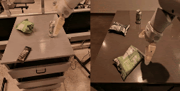
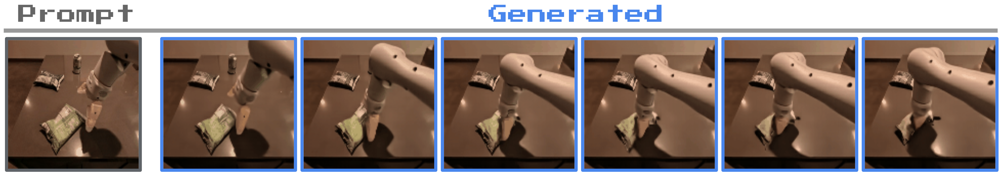
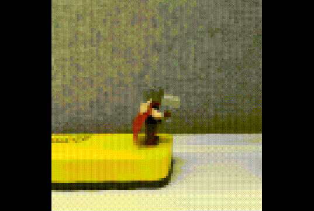
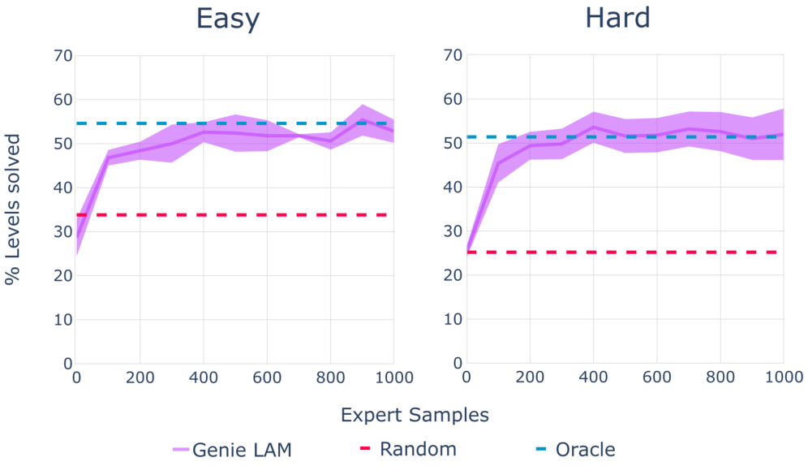
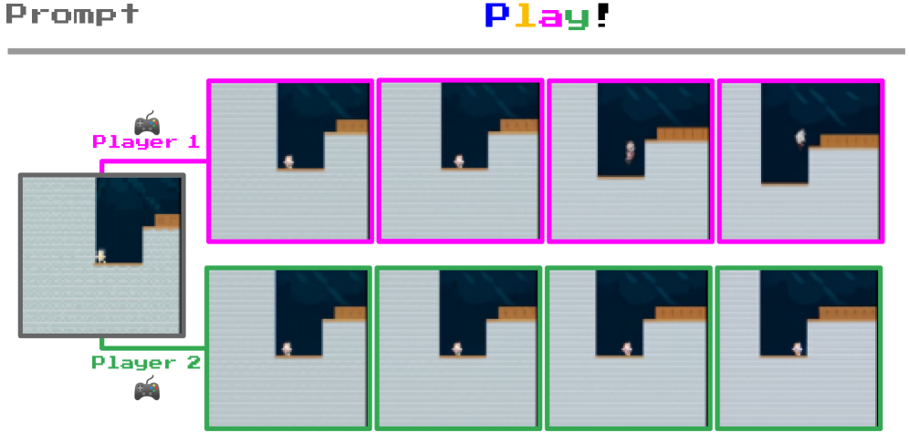

# 机器人与智能体学习

## 本页目标

Genie 的主要模型使用二维平台游戏视频训练，但论文还研究了两个更广泛的问题：

```text
无动作标签的机器人视频能否学习一致动作
无动作专家视频能否用于训练策略
```

本页独立介绍 Robotics Genie、可变形物体模拟、latent-to-real action 映射和 CoinRun 行为克隆实验。

## Robotics Genie 的数据

机器人版本使用真实机器人演示和模拟机器人视频。

数据包含与 RT-1 相关的机器人数据，以及其他真实和模拟机器人序列。

研究者不使用这些数据原本附带的动作标签，而是把它们当作普通视频：

```text
机械臂当前画面
-> 机械臂移动后的画面
-> 物体发生变化后的画面
```

这与平台游戏设置保持一致：

```text
模型只能观察发生了什么，
不能直接读取控制命令。
```

## 机器人模型规模

Robotics Genie 约为 2.5B 参数。

它仍然使用：

```text
Video Tokenizer
LAM
Dynamics Model
```

论文报告该模型在机器人测试集上的 FVD 为 82.7。

该数字反映生成视频与真实视频分布的差距，但不能单独说明机器人控制是否准确。

## 机器人 latent action


图中每列重复使用相同 latent action，不同行对应不同机器人初始画面。

部分动作表现出较稳定语义：

```text
机械臂向下
机械臂向上
机械臂向左
```

虽然模型从未读取真实控制标签，但相同视觉运动被压缩到了共享动作 code。



官方 GIF 展示机械臂场景中的连续视觉变化，对应把无标签机器人视频压缩为可重复 latent action 的设定。应观察机械臂、工作台和目标物如何随动作共同变化；它只说明模型能产生视觉上连贯的动作条件轨迹，不能验证关节运动学、接触力或实际控制安全性。

## 为什么机器人动作发现更困难

平台游戏角色通常具有明显轮廓，动作也多为离散移动。

机器人视频中则可能同时出现：

```text
多个关节运动
相机轻微变化
机械臂遮挡
夹爪开合
物体位移
物体形变
接触过程
```

一个 latent action 可能混合多个关节和末端效果。

因此，机器人动作代码通常不能直接解释为单一关节命令。

## Latent action 不是控制器命令

即使某个 code 在视觉上表现为“机械臂向左”，它也不直接等于：

```text
关节 1 旋转 5 度
末端执行器向左移动 2 厘米
以某个速度执行笛卡尔控制
```

latent action 表达的是视频中观察到的视觉变化模式。

若要用于真实机器人，需要额外建立：

```text
latent action
-> 真实机器人 action
```

这一步可能依赖少量带真实动作的数据、控制器模型或系统辨识。

## 可变形物体



图中展示机械臂和零食袋等可变形物体的生成轨迹。

模型不仅预测机械臂移动，也尝试预测物体受到接触后的形变。



当前 GIF 展示物体在连续交互中的外观变化，对应 Genie 从视频中学习形变过程的实验现象。应观察形状变化是否随时间保持视觉连贯；它不能证明模型满足材料参数、接触力和能量守恒等精确物理约束。

传统可变形物体模拟通常需要：

```text
网格
材料参数
弹性
摩擦
碰撞
接触求解
```

Genie 则从视频中学习：

```text
采取某种动作后，
画面中的物体通常如何变化。
```

## 视觉合理和物理准确的差别

生成的袋子形变看起来合理，不代表模型精确模拟了：

```text
材料刚度
受力大小
接触点
质量
摩擦
形变恢复
```

对于真实机器人控制，物理误差会影响策略迁移。

因此，机器人实验更适合说明：

```text
方法可以从机器人视频中发现控制结构和交互动态
```

而不是说明 Genie 已经可以替代机器人仿真器。

## 无动作专家视频的问题

标准行为克隆需要：

```text
观察 oₜ
+ 专家动作 aₜ
-> 训练 policy
```

互联网视频或普通专家录像通常没有动作标签。

即使画面展示了成功行为，也无法直接训练策略预测真实动作。

Genie 提出的思路是先用 LAM 自动补充 latent action。

## LAM 为专家视频添加动作

完整过程为：

```text
无动作专家视频
-> 冻结 LAM
-> 为每一步推断 latent action
-> 得到 observation-latent action 数据
```

随后训练 latent policy：

```text
当前观察
-> 预测专家可能选择的 latent action
```

这样，大量没有真实动作的专家视频也能提供行为监督。

## Latent-to-real action 映射

在真实环境执行时，policy 输出的是 latent action，而环境需要真实 action。

研究者使用少量带真实动作的专家序列建立映射：

```text
latent action 0 -> 可能对应某个真实动作
latent action 1 -> 可能对应另一个真实动作
```

映射仅依赖 latent 和 real action 的对应关系，不读取当前观察。

这使研究者能够检验 latent action 是否具有跨状态一致语义。

## CoinRun 实验

论文在 Procgen CoinRun 的 Easy 和 Hard 设置中验证这一方法。

对比包括：

```text
Oracle BC：
直接使用真实专家动作训练

Genie LAM Policy：
使用 latent action 训练，再通过少量真实动作完成映射

Random：
随机动作
```



评价指标是完成关卡的比例，并对多个随机种子和测试样本进行统计。

## 200 个专家样本结果

论文报告，在使用约 200 个带真实动作的专家样本完成动作适配后，LAM-based policy 可以达到与 Oracle BC 接近或相同的分数。

这个结果说明：

```text
LAM 推断的动作代码保留了可用于行为迁移的结构。
```

因为 latent-to-real 映射本身不依赖当前观察，所以策略性能不能完全依靠状态特定映射获得。

## 未见 RL 环境中的轨迹



图中展示 Genie 从未见 RL 环境的初始图像生成多种轨迹。

不同 latent action 产生不同角色运动，说明模型可以把平台游戏中学到的控制结构应用到新的视觉环境。

这些轨迹是世界模型生成结果，不等于目标环境中的真实 rollout。

## 如何正确理解策略实验

CoinRun 实验是概念验证，而不是通用机器人策略学习结论。

它具有以下受控条件：

```text
二维平台环境
有限离散动作
明显可控角色
与 Genie 训练数据具有相似行为结构
```

真实机器人还需要处理：

```text
连续动作
精确接触
多自由度控制
安全约束
传感器噪声
系统延迟
```

因此，论文主要证明：

```text
无动作专家视频
可以通过 LAM 转化为具有行为监督的数据。
```

## 对具身智能的潜在价值

机器人数据采集昂贵，原因包括：

```text
硬件成本
人工示范
动作和视频同步
安全控制
重复实验
设备差异
```

无动作视频数量更大，但缺少控制信息。

latent action 提供一条中间路线：

```text
大规模视频学习通用行为结构
-> 少量真实动作完成接口对齐
-> 用于策略预训练或初始化
```

潜在应用包括：

```text
机器人视频预训练
模仿学习
动作表示学习
跨机器人平台迁移
世界模型训练
策略初始化
```

## 本页小结

Robotics Genie 表明，latent action 不只可以描述平台游戏角色，也能够从无动作机器人视频中发现相对一致的机械臂运动。

可变形物体实验展示了视频模型学习复杂视觉交互的潜力，CoinRun 实验则说明 LAM 可以为无动作专家视频补充策略监督。

但 latent action 仍然是视觉行为代码。要用于真实机器人，还需要动作接口映射、物理验证和安全控制。
