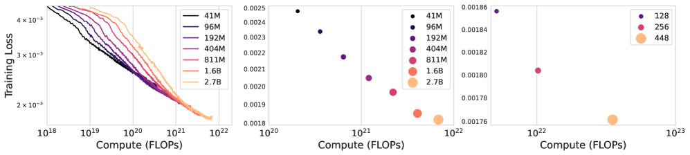

# 评测、局限与研究意义

## 本页目标

评价生成式可交互环境，不能只看单帧画质。

本页独立讨论：

```text
Genie 如何评价视频质量
如何评价动作可控性
为什么视频质量和可控性可能冲突
消融实验说明了什么
Scaling 结果应该如何理解
第一代 Genie 有哪些明确限制
它对世界模型和具身智能有何意义
```

## 两个基本评价维度

论文将 Genie 的评价重点分为：

```text
Video Fidelity：
生成视频是否自然、连贯并接近真实视频

Controllability：
latent action 是否真正改变生成结果
```

这两个目标并不完全一致。

一个模型可能具有很高的视频质量，但忽略动作输入；另一个模型可能对动作非常敏感，却生成不稳定画面。

理想环境需要同时满足：

```text
画面稳定
动作有效
动作可区分
语义相对一致
多步轨迹可持续
```

## FVD 评价什么

论文使用 Frechet Video Distance（FVD）评估视频质量。

FVD 将真实视频和生成视频映射到视频特征空间，再比较两者的统计分布。

较低 FVD 通常说明：

```text
生成运动更加自然
视频时间连续性更好
生成分布更接近真实视频
```

FVD 适合总体评价视频生成质量，但它不能回答：

```text
用户动作是否真的生效
相同动作是否具有稳定语义
环境能否支持任务执行
长时间交互是否保持一致
```

因此，FVD 不能单独评价可交互环境。

## 基于 PSNR 的可控性指标

论文还构造了基于 PSNR 的可控性指标。

它比较两种生成结果：

```text
使用真实视频推断的 latent action 生成

与

使用随机 latent action 生成
```

如果随机动作生成结果与真实轨迹明显不同，说明动作对未来具有较强影响。

该指标较高通常意味着：

```text
模型没有完全忽略动作
不同动作能够造成可观察变化
```

但它也不能保证：

```text
动作语义符合人类预期
相同动作在所有场景中稳定
生成环境可以完成具体任务
```

## 为什么质量和可控性可能冲突

假设模型只根据历史画面预测最常见未来：

```text
视频可能很平滑
但动作几乎不起作用
```

这类模型 FVD 可能较好，却缺乏交互性。

另一种模型可能强行让不同动作产生明显差异：

```text
动作影响较强
但画面变化过大或出现伪影
```

因此，评价 Genie 需要联合观察：

```text
FVD
可控性指标
动作一致性可视化
实际多步交互视频
```

## Pixel-input 和 Token-input 消融

LAM 输入消融结果：

| 数据集 | LAM 输入 | FVD | 可控性 |
| --- | --- | ---: | ---: |
| Platformers | Token | 38.8 | 1.33 |
| Platformers | Pixel | 40.1 | 1.91 |
| Robotics | Token | 257.8 | 1.65 |
| Robotics | Pixel | 136.4 | 2.07 |

Platformers 中 Token-input 的 FVD 略低，但 Pixel-input 的可控性明显更好。

Robotics 中 Pixel-input 在两个指标上都更好。

这说明：

```text
压缩表示可能适合视频生成，
但动作发现更依赖原始像素中的细粒度运动。
```

## Tokenizer 架构消融

论文比较：

```text
空间 ViT
C-ViViT
ST-ViViT
```

结果为：

| Tokenizer | 内存 | FVD | 可控性 |
| --- | ---: | ---: | ---: |
| ViT | 0.3 GB | 114.5 | 1.39 |
| C-ViViT | 1.6 GB | 272.7 | 1.37 |
| ST-ViViT | 0.9 GB | 81.4 | 1.66 |

ST-ViViT 在合理内存成本下同时获得更好的 FVD 和可控性。

完整时空注意力 C-ViViT 使用更多内存，但结果反而更差，论文认为其可能更容易过拟合。

这说明更复杂的注意力结构并不一定直接带来更好世界建模效果。

## 数据过滤实验

论文还比较原始数据和过滤数据。

在相同规模模型下：

| 数据 | 视频数量 | FVD |
| --- | ---: | ---: |
| 原始数据 | 约 5500 万 | 61.4 |
| 过滤数据 | 约 680 万 | 54.8 |

过滤后数据量明显减少，FVD 却得到改善。

这一结果说明：

```text
清晰的交互过程
比大量菜单、主播画面和低质量片段
更有利于学习世界动态。
```

## Scaling 曲线应该如何阅读



模型从约 40M 扩展到 2.7B 参数时，训练损失持续降低。

增加 batch size 也能带来改善。

这支持：

```text
Genie 架构能够利用更多参数、数据和计算资源。
```

但 Scaling 曲线不能直接证明：

```text
模型具有准确物理规律
模型可以无限交互
模型可以替代游戏引擎
模型适合真实机器人部署
```

训练损失主要衡量预测训练 token 的能力，而不是完整环境可用性。

## 场景范围限制

第一代 Genie 主要训练在二维平台游戏上。

它最擅长的模式包括：

```text
左右移动
跳跃
下落
场景滚动
简单角色动画
```

它没有证明能够稳定解决：

```text
自由三维导航
复杂室内空间
多物体操作
多智能体交互
开放世界任务
精确连续控制
```

## 时间和记忆限制

主要模型使用 16 帧序列，训练帧率为 10 FPS。

有限历史使模型难以长期保持：

```text
角色外观
场景结构
已访问区域
物体状态
早期动作结果
```

自回归生成时间越长，误差越容易累积。

## 分辨率限制

主要训练数据为 160 × 90。

官方展示使用额外 Decoder 输出 360p 视频，但内部主要训练设置仍然较低分辨率。

低分辨率会限制：

```text
小物体识别
文字和标志读取
细粒度操作
复杂几何理解
机器人精确控制
```

## 推理效率限制

每个生成帧需要进行 25 个 MaskGIT 采样 step。

这使第一代 Genie 更适合研究验证和交互演示，而不是高帧率游戏体验。

论文没有将其定位为可以直接替代传统实时渲染引擎的系统。

## Latent action 语义限制

latent action 没有预定义语义。

可能存在：

```text
不同模型动作编号不一致
同一 code 混合多个视觉变化
动作和相机变化耦合
动作无法直接映射真实控制器
```

人类需要通过尝试学习按键含义，机器人则需要额外动作映射。

## 物理可靠性限制

Genie 能生成视觉上合理的：

```text
角色运动
背景视差
机械臂移动
物体形变
```

但没有显式保证：

```text
碰撞准确
摩擦准确
质量正确
接触力正确
关节限制正确
能量守恒
```

视觉合理不等于物理正确。

这意味着 Genie 当前不能直接替代高精度机器人模拟器。

## 计算成本和复现限制

完整 Genie 约 10.7B 参数。

最终 Dynamics Model 使用 256 个 TPU v5p，训练约 125k step，处理约 942B token。

这使主模型训练超出普通研究团队资源范围。

本教程只介绍论文方法，不添加不存在的主模型下载和本地部署步骤。

## CoinRun 可复现案例

论文附录提供了一个较小的 CoinRun 案例。

该案例包括：

```text
约 1000 万条 transition
较小的 Tokenizer、LAM 和 Dynamics Model
16GB 级别单个 TPU 或 GPU
一周以内的训练时间
```

这个案例适合验证核心架构：

```text
视频离散化
latent action 学习
动作条件生成
```

但它不能复现 11B 主模型的数据规模和泛化能力。

## Genie 的研究意义

Genie 改变了动作条件世界模型的数据假设。

传统路线是：

```text
必须收集状态、真实动作和下一状态。
```

Genie 展示了：

```text
只使用视频
-> 自动发现 latent action
-> 学习动作条件未来。
```

这使互联网视频有机会从：

```text
视觉表征数据
```

扩展为：

```text
环境动态数据
行为表示数据
智能体预训练数据
```

## 与传统模拟器的关系

| 生成式世界模型 | 传统模拟器 |
| --- | --- |
| 可以从视频学习多样外观 | 状态和规则明确 |
| 新视觉场景生成成本可能更低 | 物理过程更加可控 |
| 能学习难以手工描述的视觉变化 | 长期状态通常更稳定 |
| 容易出现幻觉和漂移 | 需要人工制作资产和规则 |
| 动作语义可能隐式 | 动作接口通常明确 |

未来更可能出现组合方式：

```text
生成模型提供视觉和场景多样性
+
传统模拟器提供状态和物理约束
```

## 对具身智能的意义

具身智能需要大量环境进行试错。

现实世界训练成本高，人工模拟器的场景数量也有限。

生成式世界模型可能为智能体提供：

```text
更多视觉环境
更多起始状态
反事实轨迹
低成本行为数据
新的策略预训练方式
```

第一代 Genie 还不是通用智能体基础设施，但它证明了从无动作互联网视频学习可控世界具有可行性。

## 后续关键问题

第一代 Genie 暴露出的限制，也定义了后续研究方向：

```text
更长时间记忆
更高生成速度
更高分辨率
更复杂三维空间
更稳定动作语义
更准确物体状态
更可靠物理规律
与真实动作接口对齐
```

## 本页小结

评价 Genie 必须同时考虑视频质量和动作可控性。

FVD 只能反映视频分布质量，基于 PSNR 的指标用于观察动作是否真正改变未来，消融实验则说明动作发现和视觉压缩需要不同的信息保留方式。

第一代 Genie 仍受到二维场景、短历史、低分辨率、高计算成本、动作语义不确定和物理可靠性不足的限制。

尽管如此，它的重要贡献是证明：

```text
没有动作标签的视频
也可以用于学习控制结构和环境动态。
```

## 参考资料

- [Genie 官方项目页](https://sites.google.com/view/genie-2024/home)
- [Genie 原始论文](https://arxiv.org/abs/2402.15391)
- [Genie 论文 HTML](https://arxiv.org/html/2402.15391v1)
- [Google DeepMind 论文页面](https://deepmind.google/research/publications/60474/)

## 相关页面

- [返回 Genie 总览](../01-genie.md)
- [概览与问题设定](01-overview-and-problem-setting.md)
- [潜在动作学习](02-latent-action-learning.md)
- [模型组件与训练](03-model-components-and-training.md)
- [机器人与智能体学习](05-robotics-and-agent-learning.md)
