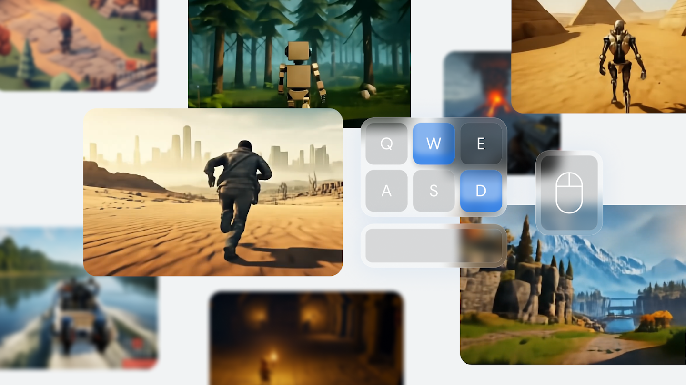

# 概览与技术演进

## 目标

Genie 2 是 Google DeepMind 在 Genie 基础上提出的大规模生成式世界模型。它从一张初始图像开始，根据键盘和鼠标动作连续生成后续环境，使人类或智能体能够进入并探索一个此前不存在的三维世界。

本节主要介绍 Genie 2 的研究动机、输入输出形式，以及它相较第一代 Genie 的主要变化。

## 训练环境不足的问题

具身智能体需要在环境中反复行动和试错。训练一个能够在不同世界中理解语言、导航、操作和完成目标的通用 agent，通常需要大量环境。

传统训练环境主要来自：

```text
商业游戏
人工制作的仿真场景
机器人模拟器
真实机器人采集
```

这些环境能够提供明确状态和动作接口，但建设成本较高。

研究人员通常需要分别处理：

```text
场景建模
物体摆放
角色控制
任务设计
物理系统
奖励和终止条件
```

环境数量和多样性因此成为训练通用 agent 的限制因素。

Genie 2 尝试提供另一种方式：

```text
生成一张世界图像
-> 将图像变成可交互环境
-> 让智能体在生成环境中训练或评测
```

它的目标不是只生成一段好看的三维视频，而是生成能够根据动作不断响应的视觉世界。

## 从 Genie 到 Genie 2

第一代 Genie 主要展示了：

```text
从无动作标签视频学习 latent action
从单张图像生成二维平台式交互轨迹
通过有限动作代码控制角色运动
```

Genie 2 将研究重点扩展到：

```text
更丰富的三维场景
键盘和鼠标控制
不同相机视角
长期世界记忆
角色、物体和 NPC
物体交互和环境物理
智能体任务训练与评测
```

两代模型之间并不是简单的图像质量升级。

第一代 Genie 的核心问题是：

```text
没有真实动作标签时，
如何从视频中发现控制因素？
```

Genie 2 更关注：

```text
如何将生成式世界模型扩展到复杂三维环境，
并让人类或智能体使用标准输入设备持续控制？
```

## 从一张图像进入世界

Genie 2 的生成过程从单张图像开始。

官方演示中的初始图像通常由 Imagen 3 根据文本描述生成：

```text
文本描述
-> Imagen 3
-> 世界的初始画面
```

随后 Genie 2 接收这张画面，并将其扩展为可以通过动作探索的环境：

```text
初始图像
+ 键盘和鼠标动作
-> 下一帧世界状态
```



图中展示了 Genie 2 能够生成的多样三维环境，包括森林、沙漠、城市、山地和第一人称视角等场景。画面中央的键盘和鼠标提示强调：这些场景并不是固定视频，而是可以由用户控制的生成世界。

## 标准动作接口

Genie 2 支持类似三维游戏的动作输入，例如：

```text
W：向前移动
A：向左移动
S：向后移动
D：向右移动
Space：跳跃
鼠标：调整视角或方向
其他按键：攻击或触发交互
```


图中展示了 Genie 2 的标准动作接口。模型需要判断哪个对象是当前可控制角色，并让角色、相机和环境对输入产生合理变化，而不是简单移动整张图像。

<video src="assets/genie2-action-control.mp4" controls width="100%"></video>


## 动作控制比视频续写更困难

普通视频生成只需要预测“接下来可能发生什么”。

动作条件世界模型还需要回答：

```text
如果用户向前移动，世界应该如何变化？
如果用户转动相机，视角应该如何变化？
如果角色跳跃，角色、地面和背景应该如何运动？
如果用户与物体交互，物体状态应该如何更新？
```

相同初始画面在不同动作下必须产生不同未来。

因此，Genie 2 不只要学习视频外观，还要学习：

```text
动作和观察之间的因果关系
角色与环境之间的相对运动
相机变化
场景遮挡
物体持续存在
交互后的状态变化
```

## 生成时间与世界持续性

官方介绍指出，Genie 2 可以生成最长约一分钟的一致世界，多数展示案例持续约 10–20 秒。

这比第一代 Genie 的短序列交互明显更长，但仍不能理解为无限稳定运行。

随着生成时间增加，模型需要持续维护：

```text
角色身份
环境布局
已出现的建筑和物体
相机走过的路径
动作对世界造成的结果
```

这些状态如果不能被保留，重新回到旧区域时就可能看到完全不同的内容。

因此，生成时长不仅是视频长度问题，也反映世界模型的记忆和状态一致性。

## 世界模型而不是传统三维引擎

Genie 2 的输出看起来像三维游戏，但它的内部工作方式与传统游戏引擎不同。

传统游戏引擎显式维护：

```text
三维网格
角色坐标
物体坐标
碰撞体
材质和光照
物理参数
任务脚本
```

Genie 2 主要通过生成模型预测下一视觉状态：

```text
历史潜在帧
+ 当前动作
-> 下一潜在帧
```

因此，Genie 2 所生成的三维感首先是一种从视频中学习到的视觉和动态规律。

它能够表现：

```text
相机移动
空间遮挡
物体交互
重力
水和烟雾
光照和反射
```

但这不等于其内部一定建立了传统意义上的显式三维地图和物理引擎。

## 本页内容回顾

Genie 2 将生成式可交互环境从二维平台式轨迹扩展到更加丰富的三维世界。

它以单张图像作为入口，接收键盘和鼠标动作，并逐步生成后续观察。研究重点也从发现潜在动作进一步转向世界一致性、三维空间、物体交互和智能体训练环境。
