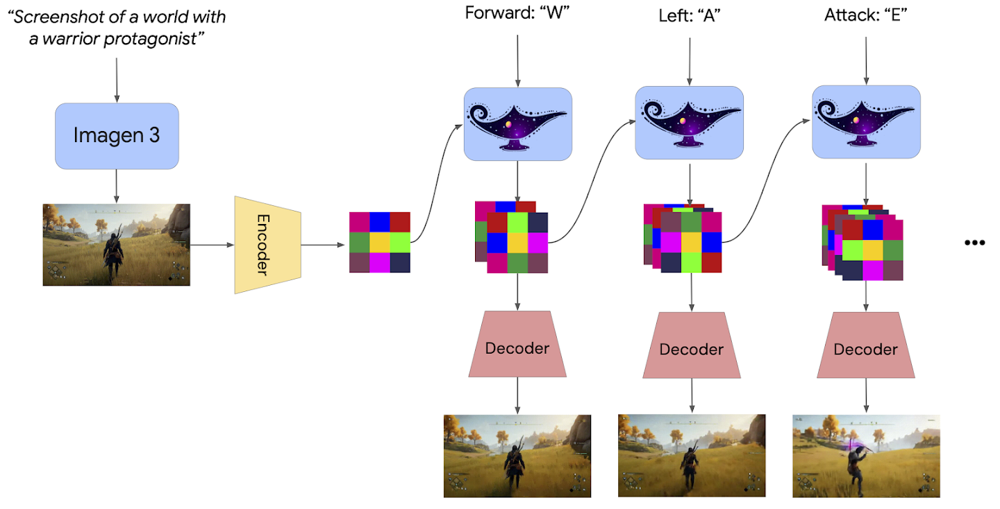

# 模型结构与生成过程


Genie 2 目前主要通过 Google DeepMind 官方介绍页面公开。官方没有在当前资料中公布完整论文、参数量、训练数据规模、训练硬件或全部实现细节。

因此，本页只介绍官方已经披露的整体架构，不对未公开模块进行推测。

## 自回归潜空间扩散模型

Genie 2 是一种自回归潜空间扩散世界模型。

可以将其拆成三个主要部分：

```text
视觉编码器和解码器
+ Transformer 动力学模型
+ 动作条件生成机制
```

<p align="center">
  
</p>

图中展示了 Genie 2 的整体生成流程。初始世界图像首先被编码为潜空间表示；人类或智能体不断提供键盘和鼠标动作；动力学模型根据历史潜在帧和动作预测新的潜在状态；最后由解码器恢复成可以观看的世界画面。

## 初始图像生成

官方演示常采用以下流程：

```text
用户描述一个世界
-> Imagen 3 生成若干候选图像
-> 用户选择一张初始图像
-> Genie 2 将其扩展成可交互世界
```

例如，用户可以描述：

```text
森林中的人形机器人
古埃及中的机械角色
紫色星球上的第一人称机器人
城市公寓中的机器人
```

Imagen 3 负责生成第一张画面的外观，Genie 2 负责让该画面随动作继续演化。

这里需要区分：

```text
Imagen 3：
决定初始画面长什么样

Genie 2：
预测进入该画面后世界如何响应动作
```

Genie 2 并不要求初始图像必须来自 Imagen 3。官方还展示了真实照片和概念设计作为输入的案例。

## 潜空间编码

直接在高分辨率像素空间逐帧生成需要很高计算成本。

Genie 2 首先通过 autoencoder 将图像压缩成潜在网格：

```text
RGB 图像
-> Encoder
-> Latent Grid
```

潜在表示保留画面中的主要视觉信息，但比原始像素更紧凑。

后续动力学预测主要在潜空间完成：

```text
历史 latent frames
+ action
-> next latent frame
```

完成预测后，再通过 decoder 将潜在帧恢复为图像：

```text
新 latent frame
-> Decoder
-> 新世界画面
```

这种设计使大模型能够把更多计算用于学习环境动态，而不是直接处理每一个像素。

## Transformer 动力学模型

Genie 2 使用大型 Transformer 动力学模型处理潜在帧序列。

官方将其描述为类似大型语言模型的因果建模方式。

语言模型按照如下形式预测：

```text
之前的 token
-> 下一个 token
```

Genie 2 则按照如下形式预测：

```text
之前的世界状态
+ 当前动作
-> 下一个世界状态
```

因果掩码保证模型在预测当前时刻时，只使用过去的潜在帧和已经提供的动作，不读取未来内容。

可以写成：

```text
z₁, z₂, ..., zₜ
+ actionₜ
-> zₜ₊₁
```

其中 `z` 表示压缩后的潜在世界状态。

## 动作条件

每个时间步，人类或 agent 都会提供新的动作。

动作可能包括：

```text
移动
转向
跳跃
攻击
物体交互
相机变化
```

模型需要将动作和当前环境状态结合起来。

例如，相同的 `W` 键在不同视角下可能产生不同画面变化：

```text
第三人称角色：
角色向前跑动，相机跟随

第一人称场景：
相机向前移动，近处物体变大

驾驶场景：
车辆前进，道路和环境向后移动
```

因此，动作不是简单的固定像素变换，而需要结合角色、视角和世界内容解释。

## 自回归生成

Genie 2 逐步生成世界：

```text
初始潜在帧
-> 输入动作 1
-> 生成潜在帧 2
-> 输入动作 2
-> 生成潜在帧 3
-> 持续重复
```

每一个新生成状态都会成为下一步的历史输入。

这种方式允许用户随时改变动作，也使模型能够生成此前初始图像中不存在的新区域。

但它同时带来误差累积问题：

```text
当前帧出现轻微偏差
-> 偏差进入历史状态
-> 影响下一帧
-> 长时间生成后偏差扩大
```

世界的一致性因此取决于模型能否在长轨迹中保持角色、物体和场景结构。

## 潜空间扩散

Genie 2 的潜在帧不是通过一次确定性预测生成，而是使用扩散模型逐步恢复。

扩散模型通常从带噪潜变量开始，再逐步去除噪声：

```text
噪声 latent
-> 多步去噪
-> 下一世界状态
```

这种方法能够生成更加丰富的视觉细节，但每一帧需要多步采样，计算开销较大。

官方展示的高质量样本来自未蒸馏的基础模型。

## Classifier-Free Guidance

Genie 2 使用 classifier-free guidance 改善动作可控性。

在生成模型中，guidance 用于增强输出与条件之间的对应关系。

在 Genie 2 中，条件不仅包括初始图像和历史帧，还包括用户动作。

其目标是让模型更加明确地区分：

```text
输入向左
和
输入向右
```

避免不同动作产生过于相似的未来。

提高 guidance 通常可以加强条件响应，但也可能降低生成多样性或增加视觉伪影。因此，动作可控性和画面自然性之间仍需要平衡。

## 基础模型与蒸馏模型

官方页面说明，展示中的高质量样本来自未蒸馏基础模型。

基础模型：

```text
生成质量更高
计算开销更大
不一定能够实时运行
```

经过蒸馏的版本：

```text
运行速度更快
能够实现实时交互
输出质量会有所下降
```

这反映了生成式世界模型中的重要权衡：

```text
视觉质量
生成速度
动作响应
长期一致性
```

如果一个模型生成质量很高但无法快速响应动作，就难以作为交互环境；如果为了实时性大幅降低质量，环境的感知和任务价值也可能下降。

## Genie 1 与 Genie 2 的技术差异

可以从公开信息层面进行如下对比：

| 方面 | Genie | Genie 2 |
| --- | --- | --- |
| 主要环境 | 二维平台式环境 | 多样三维世界 |
| 控制形式 | 自动学习的离散 latent action | 键盘和鼠标动作 |
| 核心生成结构 | Tokenizer、LAM、MaskGIT Dynamics | Autoencoder、潜空间扩散、Transformer Dynamics |
| 生成长度 | 短序列交互 | 多数示例 10–20 秒，最长约一分钟 |
| 重点能力 | 从无标签视频发现动作 | 三维世界、记忆、交互和智能体任务 |
| 实时能力 | 约逐帧低速生成 | 蒸馏版本可实时运行，但质量下降 |

需要注意，Genie 2 官方没有完整披露动作监督和训练数据细节。因此不能简单断言 Genie 2 沿用了第一代完全相同的 latent action 学习方式。

## 本页内容回顾

Genie 2 使用 autoencoder 将图像压缩到潜空间，再通过带因果掩码的 Transformer 动力学模型，根据历史潜在帧和当前动作预测下一世界状态。

模型采用自回归潜空间扩散生成，并使用 classifier-free guidance 提高动作可控性。高质量基础模型和实时蒸馏模型之间存在明显的速度与质量权衡。
