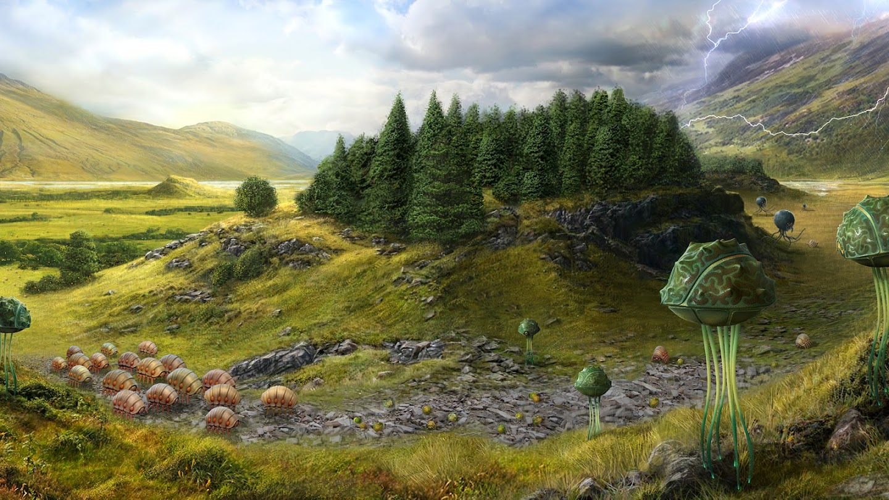
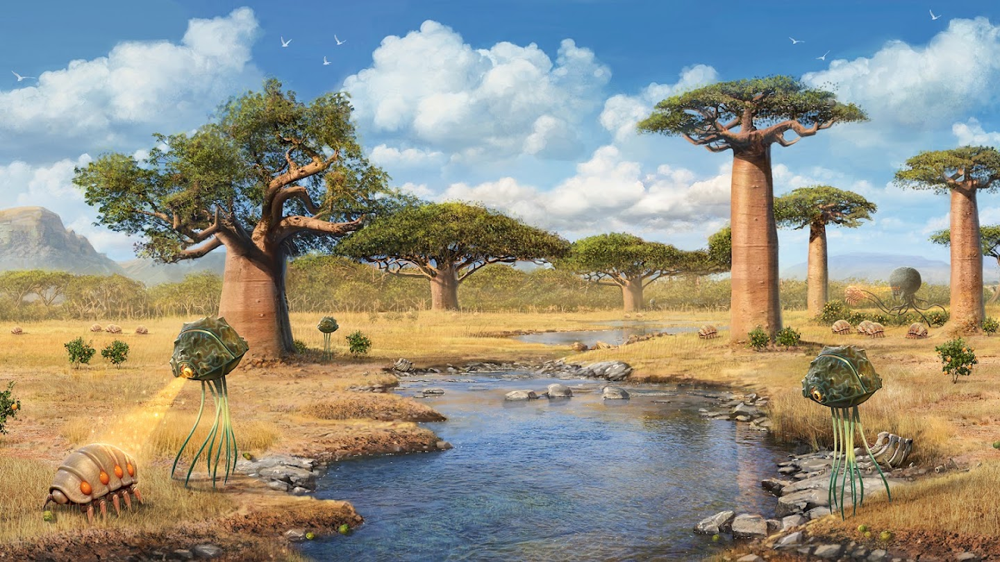
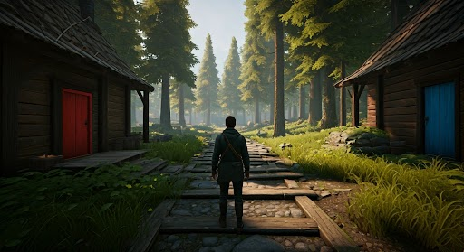
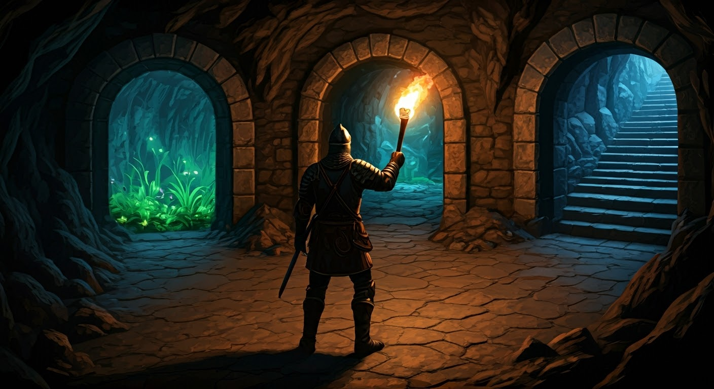

# 快速原型与智能体评测

## 从概念图到交互环境

传统三维环境制作通常需要：

```text
概念设计
三维建模
纹理制作
场景搭建
角色动画
交互逻辑
物理和碰撞
```

Genie 2 尝试缩短这一流程。

用户可以先通过文本生成或人工绘制一张概念图，再让世界模型将其扩展为可交互环境。

基本过程可以表示为：

```text
文本描述或概念设计
-> 一张初始图像
-> Genie 2
-> 可以移动和探索的环境
```

## 概念设计示例



图中展示了环境概念设计原图。场景包含山谷、树林、河流和幻想生物，能够表达整体艺术方向，但它本身仍然只是一张静态画面。



图中展示了根据相似概念生成的交互环境画面。Genie 2 可以让设计者进入类似世界并探索其视觉效果。

<video src="assets/genie2-concept-art-interaction.mp4" controls width="100%"></video>

这种方式适合快速验证：

```text
场景风格是否合适
角色在环境中的视觉尺度
不同 avatar 如何运动
第一人称或第三人称视角效果
某个场景是否适合作为 agent 任务
```

## 快速原型不等于完整游戏开发

Genie 2 可以快速生成视觉和交互原型，但它没有直接输出传统游戏开发所需的全部资源。

例如，官方没有说明其可以导出：

```text
可编辑三维模型
碰撞体
关卡脚本
行为树
导航网格
奖励函数
任务配置
确定性物理状态
```

因此，它更适合：

```text
探索想法
验证视觉方向
构造临时研究场景
生成 agent 测试环境
```

而不是直接替代完整游戏引擎和专业开发流程。

## 生成多样训练环境

通用 embodied agent 需要接触大量不同世界。

如果训练环境过少，agent 可能记住：

```text
固定地图
固定物体位置
固定纹理
固定任务路线
```

Genie 2 可以利用不同初始图像生成大量环境变化：

```text
森林
城市
洞穴
沙漠
室内空间
幻想世界
驾驶场景
飞行场景
```

这为构造大规模环境课程提供了可能。

训练课程可以包含：

```text
简单开放场景
-> 有障碍的导航
-> 多门选择
-> 物体交互
-> NPC 和动态环境
-> 长程任务
```

## 为智能体生成未见任务

评价 agent 泛化能力时，一个重要问题是：

```text
测试环境是否真的没有出现在训练中？
```

固定游戏和仿真器可能被模型在训练阶段间接接触。

生成式世界模型可以根据新的初始图像临时创建任务环境，使 agent 面对之前没有见过的视觉布局。

这有助于构造：

```text
新的导航地图
新的目标物体
新的场景组合
新的角色外观
新的任务指令
```

## SIMA 智能体

SIMA 是 Google DeepMind 研究的通用三维虚拟环境智能体。

它接收：

```text
自然语言指令
第一人称或第三人称画面
```

并通过：

```text
键盘
鼠标
```

控制角色执行任务。

在 Genie 2 示例中，SIMA 不需要访问世界模型内部状态，只根据生成画面和语言指令行动。

这与普通人类玩家的交互方式相似：

```text
观察屏幕
-> 理解任务
-> 输入键盘和鼠标动作
```

## 打开不同颜色的门



图中展示了由单张图像构造的森林任务环境。左右两座房屋分别具有红色和蓝色门。

研究者向 SIMA 提供不同语言指令：

```text
Open the blue door
Open the red door
```

SIMA 控制角色移动，而 Genie 2 根据其键盘和鼠标动作生成后续画面。

<video src="assets/genie2-sima-agent.mp4" controls width="100%"></video>


这个案例连接了两个模型：

```text
SIMA：
决定下一步做什么

Genie 2：
模拟动作之后世界会变成什么
```

## 使用智能体评估世界模型

智能体不仅可以在 Genie 2 中完成任务，也可以反过来用于测试世界模型。

例如，研究者要求 SIMA：

```text
Turn around
Go behind the house
```

这会迫使世界模型生成初始视野之外的区域，并在角色回头时维持房屋和环境结构。

如果环境生成不稳定，可能出现：

```text
房屋消失
门的颜色变化
建筑位置改变
房屋背后结构不合理
角色无法持续导航
```

因此，agent rollout 可以作为世界一致性测试。

## 多路径洞穴任务



图中展示了一个包含三个入口的洞穴环境。不同入口通向发光植物、危险通道或向上的楼梯。

研究者可以给出：

```text
Go up the stairs
Go where the plants are
Go to the middle door
```

这种场景适合测试 agent 是否能够：

```text
理解自然语言目标
识别不同视觉地标
选择正确路径
持续控制角色
```

它也能测试 Genie 2 是否能为不同路线生成相对一致的后续环境。

## Agent 与世界模型的耦合问题

在生成环境中评测 agent 时，失败可能来自两个部分。

Agent 失败：

```text
没有理解指令
选择了错误路径
控制动作不合理
没有识别目标物体
```

世界模型失败：

```text
目标物体消失
门无法正常打开
场景结构漂移
动作没有得到正确响应
```

因此，任务失败不能自动归因于 agent。

更严格的评测需要区分：

```text
策略错误
和
环境模拟错误
```

这也是生成式世界模型用于正式 benchmark 时必须解决的问题。

## 反事实训练课程

Genie 2 可以从相同起点产生不同未来，这使得 agent 可以获得反事实经验。

例如：

```text
轨迹 A：
打开蓝门

轨迹 B：
打开红门

轨迹 C：
绕到房屋后面

轨迹 D：
停留在原地观察
```

这些轨迹可以用于：

```text
比较不同策略
学习因果结果
训练规划模型
构造困难负样本
分析失败路径
```

如果世界模型足够稳定，agent 可以在较低现实成本下大量尝试。

## 对机器人和具身智能研究的潜在价值

Genie 2 当前展示的环境主要具有游戏式视觉表现，但其研究目标指向更一般的 embodied agent。

生成式世界模型可能用于：

```text
大规模导航预训练
视觉语言 agent 评测
探索策略学习
任务规划
安全失败测试
反事实模拟
课程学习
```

不过，机器人训练需要更加准确的：

```text
真实物理
连续控制
接触和碰撞
深度与几何
传感器噪声
动作延迟
```

Genie 2 的官方展示尚不足以证明它可以直接替代机器人模拟器。

其主要意义是展示：未来训练环境可能不再完全依赖人工制作，而可以部分由生成模型按需创建。
