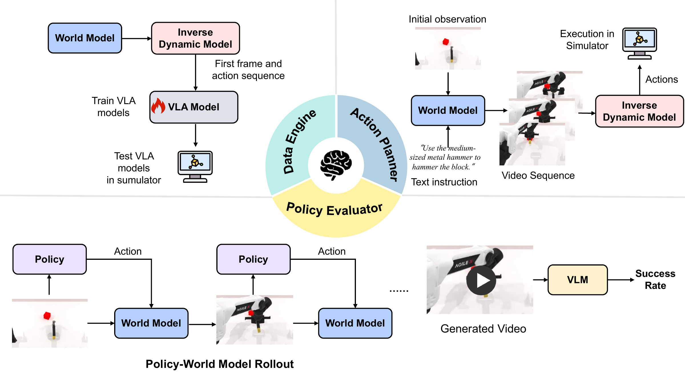

# 具身任务评测

具身任务评测把世界模型接入下游系统，通过仿真器中的任务成功率或策略排序，检查预测是否含有决策价值。Data Engine、Policy Evaluator 和 Action Planner 分别把世界模型用于数据合成、环境代理和动作规划。

<figure>
  
  <figcaption>WorldArena 的三种功能角色。Data Engine 用生成数据训练策略，Policy Evaluator 把世界模型当作环境代理，Action Planner 从预测表征解码动作；三者最终都通过下游执行或排序判断功能价值。</figcaption>
</figure>

## 三类具身任务

| 页面 | 世界模型的作用 | 下游评测器 | 最终证据 |
| --- | --- | --- | --- |
| [Data Engine](04-embodied-task-evaluation/01-data-engine.md) | 生成视频，并由动作头恢复标签 | π0.5 训练、RoboTwin 执行 | 每任务成功率与增益 |
| [Policy Evaluator](04-embodied-task-evaluation/02-policy-evaluator.md) | 根据策略动作递归生成观测 | VLM 成功判别器、仿真器参照 | 多种策略的成功率与相关性 |
| [Action Planner](04-embodied-task-evaluation/03-action-planner.md) | 提供预测特征，由动作头直接产生控制序列 | RoboTwin 执行 | 每任务成功率 |
| [功能结果与感知—功能差距](04-embodied-task-evaluation/04-functional-results.md) | 汇总三种功能实验并比较感知分数 | 任务结果与模型级相关性分析 | 成功率与 Pearson 相关系数 |

三条链的最终分数都混合了世界模型与外部组件。视觉误差、动作模式、策略容量、训练超参数、rollout 长度、仿真器重置方式和成功判据均可能改变结果，因此功能分数不是纯粹的生成模型内在属性。

## 论文设置与公开实现

论文 v2 在 `adjust_bottle` 和 `click_bell` 上研究三种功能角色，并使用六个代表性世界模型。公开 Data Engine 协议扩展到五个任务；Policy Evaluator 的公开实现覆盖策略 rollout、GT 映射、VLM 成功判别，以及世界模型结果与仿真器结果之间的 Pearson 相关性计算。两种设置的任务数、输入格式和统计协议不同，数值不能直接混合比较。

三种功能角色没有共同的统一指数。Data Engine 结果的单位是训练后策略的任务成功率，Policy Evaluator 的核心是多种策略在世界模型与仿真器中的相对关系，Action Planner 则直接测量规划动作的任务成功率。

## 感知—功能差距

视频质量评测观察生成视频本身，具身任务评测观察视频或中间特征能否支持数据学习、策略排序和动作执行。视觉清晰的视频可能缺少可恢复的控制信息；与参考轨迹接近的短视频也可能在递归 rollout 中逐步漂移。两类结果并列后才能判断感知质量是否转化为下游效用。

论文报告 EWMScore 与数据合成表现的相关性高于其与动作规划表现的相关性，但两者都不能由单项感知指标直接推出。

## 导航

- 返回上级：[WorldArena](../01-worldarena.md)
- 上一节：[Controllability](03-video-quality-evaluation/06-controllability.md)
- 下一节：[Data Engine](04-embodied-task-evaluation/01-data-engine.md)
