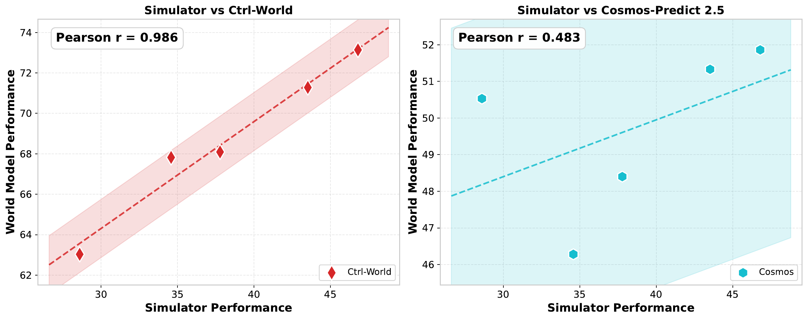

# Policy Evaluator

Policy Evaluator 检查动作可控世界模型能否充当环境代理，对能力不同的策略给出与 RoboTwin 仿真器相近的相对判断。核心不是生成一段开放式视频，而是让策略与世界模型递归交互。

## 闭环 rollout

策略接收当前 RGB、机器人状态和指令，输出一段 `joint14` 动作块；世界模型根据当前帧和动作生成下一段观测。每轮末帧成为下一轮输入：

```text
policy(current_frame, policy_state, instruction)
    → joint14 action chunk
    → action bridge
    → world model(current_frame, wm_action)
    → future video
    → last frame / last state feed back
```

递归过程会累积误差。单步输出接近真实画面时，末帧的轻微位置偏差仍可能成为下一轮条件，最终导致机械臂、物体和背景逐步漂移。

论文实验和公开实现都使用能力不同的 π0.5 策略。公开实现将五种策略的输出目录命名为 `10data`、`20data`、`30data`、`50data` 和 `fulldata`，分别对应使用 10%、20%、30%、50% 和全量数据训练的策略。每个目录包含 500 个 rollout 视频。世界模型对五种策略得到成功率后，与仿真器中的五点结果比较相关性。

VLM 成功判别器使用独立的 GT 参考包 `worldarena_track2_policy_eval_gt.tar.gz`，其中包含 50 个任务、500 段参考视频、500 条指令和 `gt_manifest.csv`。`eval_index` 从 1 开始，默认按 `folder-major` 顺序排列；每个任务的参考回合为 `episode40` 至 `episode49`。清单把全局 `eval_index` 映射到任务名称、本地回合名称、参考视频和指令文件，避免把 rollout 的全局编号直接解释为任务内回合编号。

## 动作空间与桥接

官方数据同时包含两类表示：

| 表示 | 布局 | 作用 |
| --- | --- | --- |
| `joint14` | 左右臂各 6 个关节角和 1 个夹爪状态 | π0.5 动作输出、关节条件世界模型输入 |
| `endpose16` | 每侧 xyz、xyzw 四元数、夹爪 | 数据集中的末端状态 |
| `endpose14` | 从每侧四元数删除 `qw` | 部分世界模型的训练条件 |

以 `joint14` 为条件的世界模型使用 `passthrough`，策略动作可直接输入。以 `endpose14` 为条件的模型使用 `task_knn` 桥接：从同一任务的成对 `joint14/endpose14` 数据建立近邻库，对每个关节动作查找默认 5 个近邻，并对其末端位姿做逆距离加权平均。

桥接只转换数值表示，不验证左右臂语义、坐标系、单位或动力学可达性。例如，两个相近的关节构型可能位于操作空间障碍物两侧：kNN 平均可能生成数据中不存在的末端位姿，随后世界模型的漂移不能完全归因于视觉预测。

## 时间对齐与动作队列

策略每次输出 50 个、50 fps 的动作，不同世界模型具有不同的动作块大小和 `down_sample`。rollout 先按 `down_sample` 取样，再把有效动作放入先进先出队列；每次世界模型前向计算消耗固定数量的未来动作。队列剩余不足一个动作块时，余项被丢弃并重新调用策略。

目标长度按

$$
T_{\mathrm{target}}=
\left\lceil
\frac{T_{\mathrm{action}}\times 1.2}{\mathrm{down\_sample}}
\right\rceil
$$

计算，即 rollout 达到对应 GT 动作轨迹的 120% 后终止。不同的 `down_sample` 和动作块大小会改变重规划频率，因而也是评测协议的一部分。

## VLM 成功判别

官方示例使用 Qwen3-VL-32B-Instruct，通过 OpenAI 兼容 API 比较策略 rollout 与 GT。默认从两段视频中分别均匀抽取 5 帧。判别器检查指令指定的机械臂、生成视频与 GT 视频的最终状态和总体动作意图，并以 `vlm_answer` 记录逐回合判断：`1` 表示成功，`0` 表示失败，`-1` 表示响应无效或评测出错。

VLM 判别器容忍一定渲染伪影，但抽帧、提示词、模型版本和路径映射都会改变结果。所有策略都被判得偏高时，较高平均成功率可能来自判别器宽松或世界模型偏向成功轨迹，而不是环境代理更准确。

## 公开实现的输出

JSON 保存每条样本的原始响应、解析结果、视频路径和错误信息，并在每次判别后写入进度，因此中断后可以续跑。紧凑 CSV 按 `(eval_index, policy_model)` 输出一行结果，用于汇总每种策略的成功率。

Pearson 相关性计算默认采用 `valid-only` 模式，只统计 `vlm_answer` 为 `0` 或 `1` 的有效结果；`errors-as-fail` 模式则把 `-1` 计为失败。前者会让不同策略使用不同的有效样本数，后者会把评测错误混入任务失败，因此报告相关性时需要同时说明聚合模式和无效结果数量。

<figure>
  
  <figcaption>论文中的 Policy Evaluator 结果。CtrlWorld 的五点结果与仿真器更接近线性关系，Cosmos-Predict 2.5 的相关性较弱；相关性描述策略排序关系，不表示世界模型成功率已经校准。</figcaption>
</figure>

## 相关性如何解释

论文报告 CtrlWorld 的 Pearson 相关系数为 `r=0.986`，Cosmos-Predict 2.5 为 `r=0.483`。高相关表示世界模型更能区分策略的相对能力，但不要求成功率数值与仿真器相等；两种模型都系统性高估成功率。只有五个策略点时，单个异常点也会显著改变相关系数。

## 导航

- 返回上级：[具身任务评测](../04-embodied-task-evaluation.md)
- 上一节：[Data Engine](01-data-engine.md)
- 下一节：[Action Planner](03-action-planner.md)
