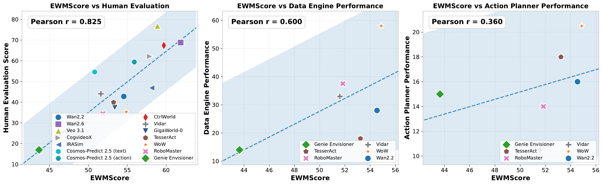

# 功能结果与感知—功能差距

功能结果回答三种不同问题：生成数据能否训练策略，世界模型能否复现策略排序，预测表征能否直接产生成功动作。三个结果没有共同分母，不能平均为单一功能总分。

## Data Engine 结果

论文 v2 每个世界模型、每个任务使用 25 条生成轨迹训练 π0.5，并在 RoboTwin 中执行 100 次：

| 训练数据 | adjust bottle | click bell |
| --- | ---: | ---: |
| 零样本 π0.5 | 2% | 5% |
| 真实数据 | 77% | 66% |
| Genie Envisioner | 7% | 21% |
| TesserAct | 1% | 35% |
| RoboMaster | 7% | 68% |
| Vidar | 13% | 53% |
| WoW | 45% | 71% |
| Wan 2.2 | 15% | 41% |

多数生成数据相比零样本策略提供增益，但整体仍低于真实数据。RoboMaster 与 WoW 在 `click_bell` 上超过真实数据 baseline，结论限定于 25 条轨迹、固定训练配置和该任务；`adjust_bottle` 没有生成数据集达到真实数据结果。

## Policy Evaluator 结果

CtrlWorld 对五种 π0.5 策略的世界模型成功率与仿真器结果具有较强相关性，论文图中 Pearson 相关系数为 `r=0.986`；Cosmos-Predict 2.5 为 `r=0.483`。两种世界模型都系统性高估策略成功率，说明排序相关与数值校准是两个问题。

较高相关支持世界模型保留了区分策略的部分转移动力学，但只有五个策略点，置信度受到样本数限制。VLM 成功判别器、动作桥接与 rollout 长度也会改变相关关系。

## Action Planner 结果

论文使用相同两个任务和每项 100 次执行：

| 规划器 | adjust bottle | click bell |
| --- | ---: | ---: |
| π0.5 | 77% | 66% |
| Genie Envisioner | 10% | 20% |
| TesserAct | 1% | 35% |
| RoboMaster | 8% | 20% |
| Vidar | 2% | 19% |
| WoW | 20% | 21% |
| Wan 2.2 | 12% | 20% |

六种基于世界模型的规划器结果均低于 π0.5。预测表征可以包含有用动态信息，却尚不足以让扩散动作头在长时闭环中稳定执行。该结果同时包含世界模型、IDM/VPP 动作头和仿真器执行误差。

<figure>
  
  <figcaption>论文对感知分数与三类外部结果的模型级比较。EWMScore 与人工判断关系最强，与数据合成功能呈中等相关，与动作规划关系较弱；相关性只覆盖所测模型和任务。</figcaption>
</figure>

## EWMScore 与功能结果

论文报告 EWMScore 与人工评测的相关性为 `r=0.825`，与数据合成表现的相关性为 `r=0.600`，与动作规划表现的相关性为 `r=0.360`。感知质量与数据效用存在一定关系，但向直接动作执行的转化更弱。

相关性下降不意味着视觉质量无用。清晰、稳定的视频有助于动作恢复和策略学习，但功能链还要求状态可控、动作可解码、递归转移稳定以及接触结果正确。EWMScore 没有直接测量这些全部条件。

## 论文结果与公开协议

上述数值来自论文 v2 的两个任务。公开 Data Engine 协议扩展为五个任务，并固定新的数据与 π0.5 训练协议；Policy Evaluator 使用包含 500 个回合的数据组织和独立 GT 参考包。论文数值只对应论文设置，不能直接作为公开协议下的比较基准。

公开 Pearson 脚本为五种策略设置的默认仿真器参考成功率分别为：`10data` 28.60%、`20data` 34.58%、`30data` 37.78%、`50data` 43.52%、`fulldata` 46.80%。这些数值用于将公开实现产生的五个 VLM 成功率与仿真器参照进行相关性计算，不是论文中 CtrlWorld 或 Cosmos-Predict 2.5 的实验结果，也不并入上方论文结果。

功能结果还依赖生成样本数、策略 checkpoint、动作表示、桥接、rollout 长度、判别器与仿真器随机化。相同世界模型在这些条件变化后形成的是新的系统结果。

## 导航

- 返回上级：[具身任务评测](../04-embodied-task-evaluation.md)
- 上一节：[Action Planner](03-action-planner.md)
- 下一节：[综合分数、人工评测与结果](../03-video-quality-evaluation/07-score-human-results.md)
