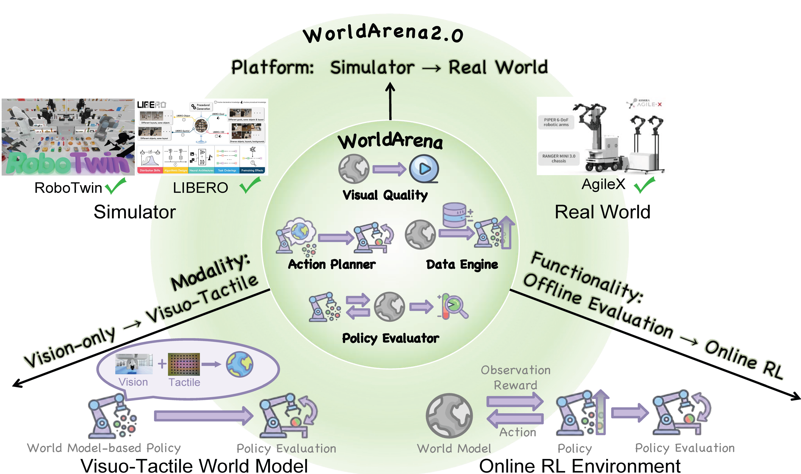

# WorldArena 2.0

WorldArena 2.0 在 WorldArena 的视频质量与具身功能评测之上，增加了三种更接近部署条件的检验：触觉是否能与视觉共同预测接触过程，世界模型能否承担强化学习中的交互环境，以及仿真中的排序能否延续到不同机器人平台与真实执行。评测对象因此从一次条件视频扩展为多模态状态转移、递归 rollout 和跨本体任务结果。

三条扩展轴对应三种不同的问题。visuotactile 协议把 RGB、触觉形变图、机器人状态和动作放到同一条预测链中，检查接触信息是否被保留；RL environment 协议让策略持续消费世界模型生成的观测并按奖励更新，检查误差是否会在优化过程中放大；cross-platform 协议在 RoboTwin 2.0、LIBERO 与 AgileX Split-Type ALOHA 间复用感知和功能评测，检查仿真结论的迁移范围。

<figure>
  
  <figcaption>WorldArena 2.0 将原有的视觉预测与具身功能评测，分别沿模态、交互功能和平台三个方向扩展。图中的模块对应本节后续各页的评测协议。</figcaption>
</figure>

## 章节内容

| 页面 | 主要内容 |
| --- | --- |
| [评测框架](02-worldarena-2/01-benchmark-framework.md) | 从 WorldArena 1.0 到 2.0 的对象、输入输出和评测单位变化 |
| [Visuotactile 评测](02-worldarena-2/02-visuotactile-evaluation.md) | UniVTAC、触觉注入架构、预测指标和接触任务结果 |
| [世界模型作为 RL 环境](02-worldarena-2/03-world-model-as-rl-environment.md) | 闭环 rollout、奖励模型、RLinf 环境接口和 RoboTwin 结果 |
| [跨平台 sim-to-real](02-worldarena-2/04-cross-platform-sim-to-real.md) | RoboTwin、LIBERO、AgileX 平台与 data engine / action planner 协议 |
| [结果与解释](02-worldarena-2/05-results-and-interpretation.md) | 触觉、RL、跨平台结果及其不能互相替代的原因 |

## References

- Project page: [WorldArena 2.0](https://v2.world-arena.ai/)
- Paper: [WorldArena 2.0: Extending Embodied World Model Benchmarking on Modality, Functionality and Platform](https://arxiv.org/abs/2605.17912)
- GitHub repository: [WorldArena2/WorldArena-2.0](https://github.com/WorldArena2/WorldArena-2.0)

## 导航

- 返回上级：[世界模型评测](../03-world-model-benchmarks.md)
- 上一节：[WorldArena](01-worldarena.md)
- 下一节：[WorldModelBench](03-worldmodelbench.md)
