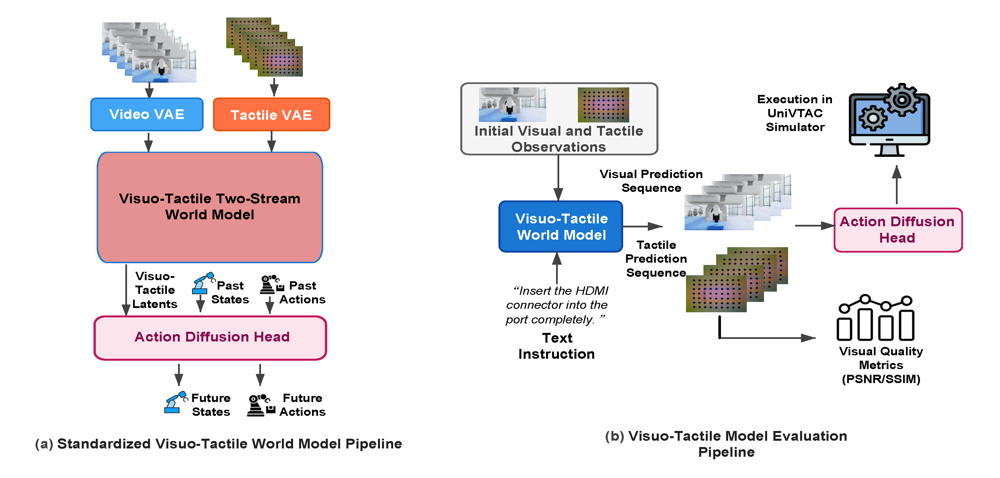

# Visuotactile 评测

机器人抓取、插接和擦拭中的接触状态并不总能从单帧 RGB 恢复。物体虽然在图像中保持静止，夹爪的压力、滑移与局部形变仍可能改变下一动作。WorldArena 2.0 以 UniVTAC 模拟器的多视角 RGB、触觉 marker image、动作和机器人状态构成统一输入，检验世界模型能否同时预测视觉和触觉演化，并把预测结果接到下游动作执行。

<figure>
  
  <figcaption>触觉 VAE 将触觉形变图编码到与视频 latent 相容的空间；双流世界模型同步去噪视觉与触觉序列；action diffusion head 使用历史状态、动作和预测 latent 生成后续动作。</figcaption>
</figure>

## 触觉注入与预测链

原有视频世界模型提供视觉 latent 和动作条件接口。WorldArena 2.0 在其上增加三个模块：tactile VAE 负责将触觉形变图压缩并对齐到视频 latent 空间；visuotactile two-stream world model 为视觉和触觉保留各自的去噪流，同时交换跨模态信息；action diffusion head 接收过去的状态、动作以及联合 latent，输出未来动作。模型仍以未来观测预测为中心，动作 head 是评测下游接口，不把该模型重新定义为直接输出动作的 world action model。

一条样本可抽象为

$$
(v_{\le t},\; q_{\le t},\; a_{\le t})
\longrightarrow
(\hat v_{>t},\; \hat q_{>t})
\longrightarrow
\hat a_{>t},
$$

其中 $v$ 是多视角 RGB，$q$ 是触觉图，$a$ 是动作，状态包含在 action head 的历史条件中。第一段检查观测预测，第二段检查联合 latent 对操作是否有用。两段输出的含义不同，评测必须分别报告。

## 指标与参照

| 信号 | 指标 | 参照对象 | 数值含义 |
| --- | --- | --- | --- |
| 触觉预测 | PSNR | 生成触觉视频与 GT 触觉视频 | 像素重建误差经对数尺度转换，越高表示误差越小 |
| 触觉预测 | SSIM | 生成触觉视频与 GT 触觉视频 | 局部亮度、对比度和结构相似性，越高越接近 GT |
| 动作离线预测 | MSE | 预测末端动作与参考动作 | 连续动作的平方误差，越低越好 |
| 动作离线预测 | NATSR | 动作误差低于阈值的时间步 | 归一化动作成功比例，越高越好 |
| 操作效用 | task success rate | UniVTAC 环境任务结果 | 成功 episode 数除以总 episode 数 |

`PSNR` 与 `SSIM` 的官方脚本比较生成视频和对应真值；`eval_action_offline.py` 则在结果目录中读取动作预测，计算 MSE 与阈值默认值为 `0.1` 的 NATSR。命令中的结果目录必须同时满足脚本期望的数据组织，命令本身不下载 UniVTAC 数据或模型权重。

```bash
python metric/val_psnr_ssim.py \
  --dataroot <path_to_results> \
  --output_json results.json

python metric/eval_action_offline.py \
  --dataroot <path_to_results> \
  --output_json action_metrics.json \
  --natsr_threshold 0.1
```

## UniVTAC 任务结果

论文在 `Insert HDMI` 和 `Lift Bottle` 上比较 ACT baseline、Vidar、Genie Envisioner 与 Wan2.2。前两列与后三列分别是触觉预测质量和环境执行结果，不能把一个任务的成功率回填为另一列指标的解释。

| 模型 | PSNR ↑ | SSIM ↑ | Insert HDMI ↑ | Lift Bottle ↑ | 平均成功率 ↑ |
| --- | ---: | ---: | ---: | ---: | ---: |
| ACT baseline | — | — | 20 | 80 | 50 |
| Vidar | 13.97 | 0.278 | 70 | 0 | 35 |
| Genie Envisioner | 13.36 | 0.456 | 0 | 0 | 0 |
| Wan2.2 | 21.26 | 0.746 | 100 | 0 | 50 |

Wan2.2 在两项触觉预测指标和 `Insert HDMI` 上居首，说明该设置中较好的触觉预测与精细插接成功同时出现。`Lift Bottle` 的结果提供了另一种情况：ACT 达到 80%，三个世界模型均为 0%。该任务要求较长时间保持力与接触反馈；短片段触觉重建的准确性不足以保证长时序控制稳定。平均成功率相同的 ACT 与 Wan2.2 也来自完全不同的任务分布，不能据此推断两者具有相同的接触建模方式。

## 数据与实现边界

UniVTAC 数据集包含多视角 RGB episode、触觉 marker image、动作、关节状态和虚拟力。仓库中的训练脚本以 Wan 2.2 TI2V-5B 为示例，并要求外部提供 UniVTAC 数据、基座权重、checkpoint 和多 GPU 环境。评测页面使用的两个 metric 命令只覆盖已有结果目录的离线指标计算；真实触觉传感器、传感器标定和完整训练配置不属于这套最小评测接口。

## 导航

- 返回上级：[WorldArena 2.0](../02-worldarena-2.md)
- 上一节：[评测框架](01-benchmark-framework.md)
- 下一节：[世界模型作为 RL 环境](03-world-model-as-rl-environment.md)
