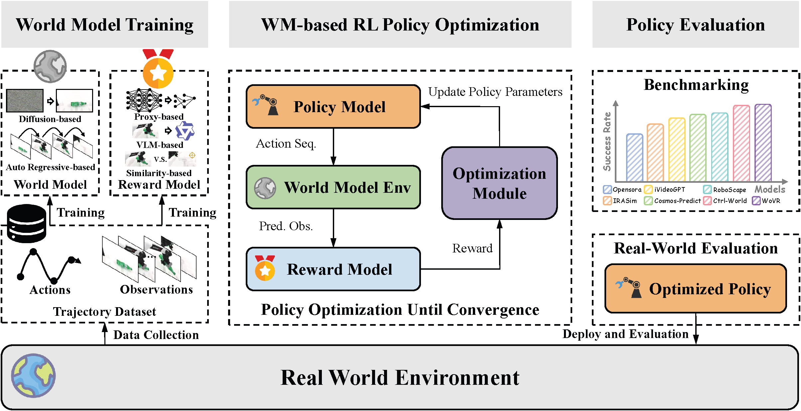

# 世界模型作为 RL 环境

离线视频质量只观察给定条件下的一段预测。将世界模型作为 RL environment 时，策略在第 $t$ 步输出动作后，模型生成的 $\hat o_{t+1}$ 又成为第 $t+1$ 步的策略输入；任一状态漂移、动作响应偏差或错误奖励都会进入后续优化。WorldArena 2.0 因此以策略在 RoboTwin 2.0 中的任务成功率评估世界模型，而非仅以生成帧相似度判断其可用性。

<figure>
  
  <figcaption>world model 先从轨迹数据学习状态转移；固定后的模型与 reward model 组成代理环境，供 policy 产生多轮 rollout；优化后的策略回到 RoboTwin 2.0 执行并计算成功率。</figcaption>
</figure>

## 闭环状态转移

真实任务可写成部分可观测 MDP $\mathcal{M}=(\mathcal O,\mathcal A,\mathcal P,\mathcal R,\gamma,\rho_0)$。世界模型以 $\hat{\mathcal P}_\phi$ 近似真实转移 $\mathcal P$，reward model 以 $\hat{\mathcal R}_\psi$ 提供训练信号，policy $\pi_\theta$ 从观测采样动作。递归 rollout 的核心关系为

$$
a_t \sim \pi_\theta(\cdot\mid \hat o_t),\qquad
\hat o_{t+1} \sim \hat{\mathcal P}_\phi(\cdot\mid \hat o_t,a_t),\qquad
\hat r_t=\hat{\mathcal R}_\psi(\hat o_t,a_t).
$$

策略更新最大化模型环境中的折扣回报，最终在真实 RoboTwin simulator 中计算 task success rate。这个终点评测同时受 transition fidelity、奖励排序、策略初始状态和优化算法影响。它不能归因到世界模型的某一个视觉分项，也不能替代真实机器人结果。

## 四个组件与奖励设计

| 组件 | 输入 | 输出 | 评测中的失效表现 |
| --- | --- | --- | --- |
| World model environment | observation、动作块、任务条件 | 预测帧和下一 observation | 长 rollout 中状态遗忘、动作后果偏移 |
| Reward model | 预测 observation、任务描述及可选目标帧/状态 | 每步 reward | 策略朝错误目标优化或奖励不稳定 |
| Policy model | 当前 observation | 动作或动作块 | 不能利用模型生成观测修正动作 |
| Optimizer | rollout、reward、policy 参数 | 更新后的 policy | 对代理环境过拟合，真实 simulator 成功率不增 |

论文比较三类 reward model。proxy-based reward 使用 ResNet，将当前视觉观测和任务文本映射为即时奖励；VLM-based reward 使用 Qwen-3.5 对观测序列与任务评分；similarity-based reward 计算预测观测与目标状态的视觉特征相似度。三种设计的参照不同，因此同一世界模型下的策略结果也可能发生排序变化。

## RLinf 环境契约

官方实现以 RLinf 适配层连接 policy training 和 world model。环境必须返回与 policy 期望字段一致的 observation，`chunk_step` 接收动作块并一次返回每步的观测、奖励和终止标志。接口中的 batch 维度和 chunk 长度由训练配置约束，不能将单步 Gym API 直接替换为这个返回结构。

```python
reset() -> tuple[dict, dict]

chunk_step(actions) -> tuple[
    list[dict],  # observations
    Tensor,      # rewards
    Tensor,      # terminations
    Tensor,      # truncations
    list[dict],  # infos
]

def compute_reward(observations, **kwargs) -> Tensor:
    ...
```

OpenPI RoboTwin head-camera 配置中的 observation 至少包含 `main_images`、`states` 与 `task_descriptions`；`main_images` 的形状为 `[B, H, W, 3]`、类型为 `uint8`，`states` 的形状为 `[B, action_dim]`。HTTP 分离式实现将 `/reset` 与 `/chunk_step` 暴露给 host proxy env。Wan 路径中 server 仅生成帧，host 接收帧后调用配置的 reward model；这种拆分使 task-specific reward 不进入 world-model server。

## RoboTwin 2.0 结果

评测使用 `Click Bell` 与 `Adjust Bottle`，以 $\pi_{0.5}$ 作为初始 embodied policy。SFT baseline 在两任务的成功率为 43.75 和 55.08；ground-truth simulator RL 在 proxy reward 下达到 87.30 和 78.90。世界模型环境无法超过 simulator RL，但 WoVR 在 `Click Bell` 的 proxy reward 下达到 75.00，Ctrl-World 在 `Adjust Bottle` 的 proxy reward 下达到 70.70。

| world model | Click Bell，proxy ↑ | Adjust Bottle，proxy ↑ | Click Bell，VLM ↑ | Adjust Bottle，VLM ↑ | Click Bell，similarity ↑ | Adjust Bottle，similarity ↑ |
| --- | ---: | ---: | ---: | ---: | ---: | ---: |
| OpenSora | 56.25 | 60.16 | 55.27 | 57.03 | 53.13 | 58.00 |
| IRASim | 53.13 | 61.33 | 53.52 | 58.98 | 50.78 | 59.38 |
| iVideoGPT | 52.53 | 56.25 | 48.44 | 58.59 | 52.15 | 60.93 |
| Cosmos-Predict-2.5 (action) | 67.38 | 63.48 | 54.10 | 58.40 | 63.09 | 61.13 |
| RoboScape | 68.75 | 60.74 | 55.46 | 59.38 | 63.48 | 59.18 |
| Ctrl-World | 69.53 | 70.70 | 66.80 | 65.04 | 69.92 | 66.02 |
| WoVR | 75.00 | 67.19 | 69.38 | 64.45 | 72.07 | 61.35 |

proxy reward 在该实验中给出最稳定的策略结果；VLM reward 未针对任务微调，similarity reward 则依赖预测帧与目标帧的质量。这个比较说明 reward model 是评测协议的一部分：固定 world model 后，更换 reward 即改变策略得到的优化方向。

## 导航

- 返回上级：[WorldArena 2.0](../02-worldarena-2.md)
- 上一节：[Visuotactile 评测](02-visuotactile-evaluation.md)
- 下一节：[跨平台 sim-to-real](04-cross-platform-sim-to-real.md)
