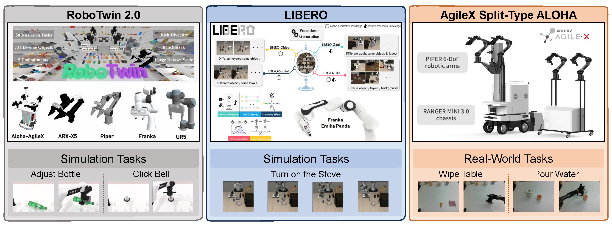

# 跨平台 sim-to-real

单一模拟器中的高分可能来自对固定相机、物体或控制频率的适配。WorldArena 2.0 在 RoboTwin 2.0、LIBERO 与 AgileX Split-Type ALOHA 上使用同类感知与功能协议。三个平台分别施加域随机化、知识组合和真实执行误差，使模型排序面对本体、场景、观测和控制接口的连续变化。

<figure>
  
  <figcaption>RoboTwin 2.0 的双臂模拟、LIBERO 的语言条件单臂任务和 AgileX Split-Type ALOHA 的真机任务形成从受控模拟到物理执行的三层平台。</figcaption>
</figure>

## 三个平台与任务

| 平台 | 本体与环境特征 | 论文任务 | 主要检验对象 |
| --- | --- | --- | --- |
| RoboTwin 2.0 | 双臂模拟，731 个物体、147 个类别；场景杂物、光照、纹理、桌高和指令可随机化 | `Adjust Bottle`、`Click Bell` | 对视觉与空间分布变化、精细接触的鲁棒性 |
| LIBERO | 基于 Robosuite 的语言条件单臂任务；130 个任务覆盖 spatial、object、goal 与 mixed 变化 | `Turn on the Stove` | 物体关系与关节物体动力学的知识迁移 |
| AgileX Split-Type ALOHA | RANGER MINI 3.0 底盘与双 PiPER 6-DoF 机械臂 | `Pour Water`、`Wipe Table` | 流体/可变形行为、长程摩擦接触和真实传感控制误差 |

[WorldArena 视频质量评测](../01-worldarena/03-video-quality-evaluation.md) 将 16 项视频指标组织为视觉、运动、内容一致性、物理遵循、三维准确性和可控性 6 个感知维度。三平台复用这些指标时，分项仍测量同类视频性质，但输入数据分布和机器人物理条件不同，跨平台比较应以趋势而非单一绝对分数为主。

## 两类功能协议

`Embodied Data Engine` 用世界模型生成的 synthetic trajectory 训练下游策略，再以目标平台的 task success rate 衡量合成数据是否保留可学习的动作后果。`Embodied Action Planner` 让模型依据当前观测持续输出或支持输出闭环动作序列，以任务完成率衡量规划可靠性。前者把误差经过数据生成和策略训练两次传递，后者更直接暴露模型对当前动作后果的估计。

| 协议 | world model 产生的对象 | 下游过程 | 成功率的含义 |
| --- | --- | --- | --- |
| Data Engine | 条件生成视频、trajectory 和相应动作条件 | 用 synthetic data 训练 policy | 合成轨迹能否训练出完成目标任务的策略 |
| Action Planner | 当前观测条件下的动作或支持动作解码的模型输出 | 闭环执行 | 模型的预测与动作选择能否在完整任务中保持一致 |

任务完成率不等于感知评测的 16 项指标聚合。一个视频模型可能在画面质量上占优，却在接触时序、奖励相关状态或动作坐标上产生足以导致失败的偏差；反过来，有限任务上的成功也不能证明模型覆盖了未测试的视觉和物理变化。

## AgileX policy 接口

`real_world_benchmark/benchmark_runner.py` 载入一个定义 `Policy` 的 Python 模块。runner 将相机图像、状态和可选任务文本组装为 `new_obs`，调用 `Policy.infer(new_obs)`，然后检查返回字典中 `actions` 是否为一维或二维 array-like。对于 eef6d 输出，runner 将前 20 维中的左右末端位姿、6D rotation 和夹爪值转换为机器人服务所需的格式。

```python
from typing import Any
import numpy as np


class Policy:
    def infer(self, new_obs: dict[str, Any]) -> dict[str, np.ndarray]:
        image = new_obs["images"]["cam_high"]  # [H, W, 3]
        state = new_obs["state"]                # eef6d 或 joint state
        _ = image, state, new_obs.get("prompt")

        # 32 维 eef6d 示例；真实策略应输出其推理得到的动作序列。
        return {"actions": np.zeros((1, 32), dtype=np.float32)}
```

`smoke` 模式用内置样本验证模块加载和返回 shape；`dataset` 模式从 `AgileXDataset` 构造离线 observation，用于接口筛查；`live` 模式经机器人服务取得观测，只有显式提供 `--send-action` 才将动作发送回服务。dataset mode 不会产生真实任务成功率，smoke mode 也不连接真实机器人。live mode 涉及物理执行，实际运行还依赖仓库未打包的服务、标定、硬件安全约束和操作流程。

```bash
python -m real_world_benchmark.benchmark_runner my_policy.py
python -m real_world_benchmark.benchmark_runner my_policy.py --mode dataset --dataset-limit 20
python -m real_world_benchmark.benchmark_runner my_policy.py --mode live --send-action
```

## 导航

- 返回上级：[WorldArena 2.0](../02-worldarena-2.md)
- 上一节：[世界模型作为 RL 环境](03-world-model-as-rl-environment.md)
- 下一节：[结果与解释](05-results-and-interpretation.md)
