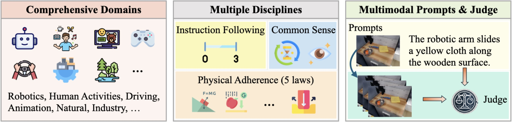

# WorldModelBench

WorldModelBench 将条件视频生成的结果作为评测对象，检验视频是否完成指定事件、保持基本视觉连贯性，并遵守可观察的物理规律。它不要求生成序列与某条参考未来逐帧一致，而是对同一初始条件下生成的开放式未来进行语义和物理判断。这一协议适合比较 text-to-video（T2V）与 image-to-video（I2V）模型在单次预测中的世界建模表现。

基准包含 350 个图文条件，覆盖 autonomous vehicle、robotics、human、industrial、natural、video games 和 animation 7 个领域、56 个子领域。每个领域固定提供 50 个条件；每条条件由首帧描述、动作指令和首帧图像组成。生成视频经过 VILA-EWM judge 后，在 instruction following、commonsense 和 physics adherence 三组指标上得到最高 10 分的结果。

<figure>
  
  <figcaption>WorldModelBench 以首帧和语言条件约束未来视频，在应用领域中观察指令完成、视觉常识与物理规律。图中的领域划分对应公开测试集的 350 条条件。</figcaption>
</figure>

同一总分压缩了任务完成和不同类型的失败信号。指令分数反映指定事件是否发生；常识分数检查画面质量与时序连续性；物理分数记录五类违规是否出现。因而 10 分只适合比较相同数据、条件形式和 judge 设置下的模型，不能推导机器人闭环控制、长期交互或真实部署能力。

## 章节内容

| 页面 | 主要内容 |
| --- | --- |
| [评测对象与条件构造](03-worldmodelbench/01-conditions-and-generation.md) | 350 条 JSON 条件、七个领域、条件来源与 T2V/I2V 输入关系 |
| [评分维度与总分](03-worldmodelbench/02-metrics-and-score.md) | 指令、常识、物理三组检查项及 0–10 分聚合关系 |
| [人工标注与 VILA-EWM](03-worldmodelbench/03-human-annotations-and-judge.md) | 人工投票、judge 训练与元评测，以及作为奖励信号的证据边界 |
| [评测器](03-worldmodelbench/04-evaluator.md) | `evaluation.py` 的 prompt、judge 调用、回答解析和结果结构 |
| [评测发现与适用边界](03-worldmodelbench/05-results-and-limits.md) | 分项差异、困难条件和结果适用范围 |
| [评测复现](03-worldmodelbench/06-reproduction.md) | 生成模型接入、VILA-EWM 官方评测、Cosmos3-Nano 示例与结果审计 |

## References

- Project page: [WorldModelBench](https://worldmodelbench-team.github.io/)
- Paper: [WorldModelBench: Judging Video Generation Models As World Models](https://arxiv.org/abs/2502.20694)
- GitHub repository: [WorldModelBench-Team/WorldModelBench](https://github.com/WorldModelBench-Team/WorldModelBench)

## 导航

- 返回上级：[世界模型评测](../03-world-model-benchmarks.md)
- 上一节：[WorldArena 2.0](02-worldarena-2.md)
- 下一节：[WorldScore](04-worldscore.md)
