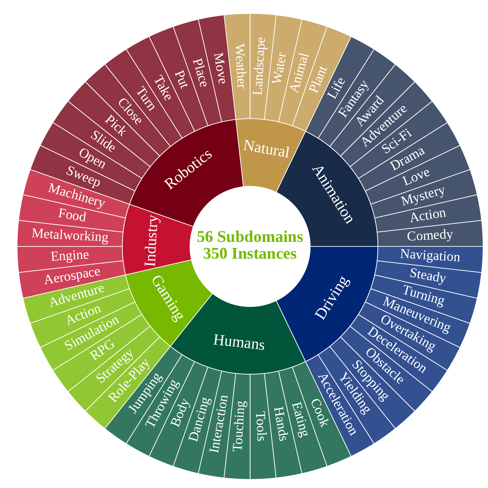

# 评测对象与条件构造

WorldModelBench 将视频生成模型视为有限时域的世界预测器：模型获得初始场景和事件要求，生成接下来若干帧，再由评测器判断事件是否完成、画面是否连贯、可观察运动是否符合基本物理规律。一个评测单位对应一条条件视频生成任务，而不是一段参考视频的重建任务。

这种定义保留了未来状态的多解性。同一辆车接近路口后，可以采用不同速度减速；机械臂抓取物体时，也可能选择不同轨迹。只要生成结果满足动作要求，并且没有出现相应的视觉或物理问题，多种后续都可以获得相同分数。参考视频用于证明条件描述的事件确实能够发生，不作为逐帧比对的标准答案。

## 设计原则

WorldModelBench 的任务设计围绕三个相互关联的要求展开：

| 要求 | 条件或评分中的对应对象 | 解决的问题 |
| --- | --- | --- |
| 明确指定未来事件 | `text_instruction` 与 instruction following 分数 | 模型是否生成了条件要求的动作或状态变化 |
| 生成可行的后续状态 | commonsense 与 physics adherence 分数 | 后续帧是否连续，物体运动和交互是否存在明显违规 |
| 覆盖应用场景 | 7 个领域、56 个子领域 | 结论是否同时包含驾驶、机器人和人体活动等复杂交互 |

指令完成与未来状态可行性分开评分，避免单一视频质量指标掩盖任务失败。画面清晰的车辆视频可能没有按要求停车；机械臂也可能完成了接近目标的运动，但夹爪悬空、物体穿透或主体形变仍会降低其他分项。领域划分则把这些失败落到具体应用条件，而不是只在通用视频集合上报告一个平均值。

## 七个领域与条件分布

公开测试集 `worldmodelbench.json` 是一个含 350 个对象的数组。每个领域固定包含 50 条条件，领域内部再按事件或场景划分子领域。

| 领域 | 条件数 | 子领域数 | 典型评测对象 |
| --- | ---: | ---: | --- |
| autonomous vehicle | 50 | 10 | 停车、转向和道路环境中的车辆决策 |
| robotics | 50 | 10 | 抓取、放置、开合和工具交互 |
| human | 50 | 10 | 人体动作以及人与物体的接触 |
| industrial | 50 | 5 | 机械过程、加工和生产场景 |
| natural | 50 | 5 | 动物、植物、水体和自然运动 |
| video games | 50 | 6 | 游戏角色、场景变化和模拟运动 |
| animation | 50 | 10 | 动画主体及其动作变化 |
| 合计 | 350 | 56 | 跨应用领域的条件视频生成 |

<figure>
  
  <figcaption>七个领域各包含 50 条条件，环图外层列出 56 个子领域。领域在总体均值中等权，各领域包含的子领域数量则不相同。</figcaption>
</figure>

环图把领域与事件类别放在两个层级上。内层的 Robotics、Driving、Humans、Gaming、Industry、Natural 和 Animation 对应总体结果中的七个领域；外层的具体动作或场景用于定位条件内容。例如 Robotics 继续分为 Move、Place、Pick、Open 等操作，Driving 包含 Stopping、Turning、Overtaking 等车辆行为。外层标签描述测试条件的语义范围，不表示每个子领域具有相同样本数。

领域等量分配使七个领域对总体均值具有相同权重，但子领域并非等量分配。领域内部的子领域结果受样本数影响，不能直接把子领域均值解释为同等精度的能力排名。350 条条件的价值主要在于统一覆盖多个应用方向，而不是在每个细分任务上形成大规模统计。

## 从参考视频到图文条件

每条条件经过参考视频选择、图文条件构造和人工检查三个阶段。

### 参考视频选择

参考视频提供一个已经发生的可行事件。驾驶场景主要来自 nuScenes，机器人场景来自 Open X-Embodiment，人体活动来自 ActivityNet；industrial、natural、video games 和 animation 等其余领域从 OpenVid 中筛选。已有数据集中的类别用于确定常见子领域，缺少细粒度类别的材料则通过视频描述和领域关键词进行筛选。

这一阶段同时承担两个约束。其一，初始状态与动作要求必须来自真实存在的视频序列，从而减少文字条件本身不可执行的情况。其二，参考来源要能覆盖对象交互较多的应用场景，例如车辆与道路规则、机械臂与物体接触、人体姿态变化。参考视频只参与条件构造，不进入被测模型的输入。

### 图像与文字条件生成

参考视频的首帧成为 I2V 的图像条件。首帧之后发生的主要变化被概括为 `text_instruction`，首帧中的对象、位置和环境则形成 `text_first_frame`。两段文字具有不同职责：

- `text_first_frame` 描述时刻 \(t_0\) 的场景，使 T2V 模型能够从语言重建初始状态。
- `text_instruction` 描述 \(t_0\) 之后应发生的事件，是 T2V 与 I2V 共享的动作约束。
- `first_frame` 保存首帧图像的引用，为 I2V 提供像素级初始状态。

动作描述中的主体和对象需要在首帧描述中有明确对应。例如，动作要求车辆在桥上的交通灯前停车时，首帧描述会包含车辆、桥梁和交通灯，而不会只写“车辆停车”。这种对应关系减少了动作指令引用未定义对象的情况，也使 T2V 与 I2V 面对相同的语义任务。

### 人工质量检查

自动筛选和描述可能引入黑色首帧、错误主体、动作描述不准确或缺少可评测变化等问题。350 组图文条件均经过人工检查，检查对象包括首帧可见内容、场景描述、动作指令和参考视频后续事件之间的对应关系。人工检查保证条件能够支持评分，但不会把参考视频中的唯一轨迹设为正确答案。

## 单条记录的数据契约

公开记录同时保存领域标签、两段文字和首帧引用：

```json
{
  "domain": "autonomous vehicle",
  "subdomain": "Stopping",
  "text_first_frame": "The autonomous vehicle approaches a traffic light ...",
  "text_instruction": "The autonomous vehicle stops at the traffic light on the bridge.",
  "first_frame": "images/69620089860948e38a4921dd4869d24f.jpg"
}
```

| 字段 | 条件构造中的含义 | 评测阶段的用途 |
| --- | --- | --- |
| `domain` | 应用领域 | 形成领域级统计 |
| `subdomain` | 领域内的事件类别 | 定位细粒度困难条件 |
| `text_first_frame` | 初始场景的语言描述 | 构成 T2V 的场景条件 |
| `text_instruction` | 后续动作或状态变化 | 构成两种模式的事件约束，并用于 instruction 判断 |
| `first_frame` | 参考视频的首帧 | 构成 I2V 的图像条件，并标识同一条测试记录 |

测试集公开条件，不公开逐题人工答案和解释。生成任务本身也没有要求与参考视频逐帧一致，因此 `worldmodelbench.json` 不能视为带有唯一未来标签的视频预测数据集。它定义的是事件级约束及其所属领域。

## T2V 与 I2V 的条件关系

两种模式使用相同的 350 条记录和相同的动作要求，初始状态的表达方式不同：

\[
\begin{aligned}
\text{T2V condition} &= \texttt{text\_first\_frame} + \texttt{text\_instruction},\\
\text{I2V condition} &= \texttt{first\_frame} + \texttt{text\_instruction}.
\end{aligned}
\]

T2V 需要同时建立场景和生成事件，场景中的视觉细节由语言描述约束。I2V 直接继承真实首帧的对象外观与空间布局，但后续帧还要保持这些内容，并将静态像素状态推进到指定事件。首帧提供了更多初始信息，也增加了保持主体身份、几何结构和背景一致性的约束。

这一差异影响结果解释。同名模型的 T2V 与 I2V 版本不能只依据模型家族合并为一个分数；输入模式、模型版本和生成条件形式共同定义一次比较。像素级首帧提供更多初始信息，但不会自动降低未来建模难度。

## 条件覆盖与结论范围

WorldModelBench 对每条条件只观察一段有限长度的生成视频。它能够检验指定事件是否在该段视频中出现，以及视频中是否暴露七类质量或物理问题。条件没有提供动作序列、控制频率、奖励函数或环境反馈，因此不包含闭环决策和多轮交互。

开放未来还带来两项限制。第一，judge 只能依据视频中实际出现的对象和运动作答；视频没有展示液体时，流体项通过不代表模型具有完整的流体模拟能力。第二，某些合理未来可能在短视频结束前尚未完成动作，instruction 分数会把“朝目标发展”和“完整完成”区分为 2 分与 3 分。条件设计因此适合比较短时事件生成，不能替代长时规划或真实任务成功率。

## 导航

- 返回上级：[WorldModelBench](../03-worldmodelbench.md)
- 下一节：[评分维度与总分](02-metrics-and-score.md)
