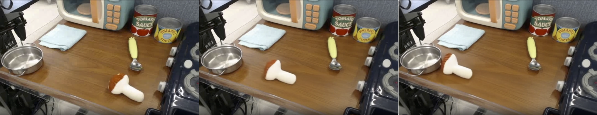

# 评分维度与总分

WorldModelBench 将每段生成视频拆成 8 个判断：1 个 0–3 分的 instruction following 判断、2 个 0/1 分的 commonsense 判断，以及 5 个 0/1 分的 physics adherence 判断。三组指标分别回答事件是否发生、视频是否构成连贯观测、可见运动是否暴露特定物理违规。8 项相加后，单视频总分范围为 0–10。

这种评分方式没有把世界建模压缩为单一的视觉相似度。模型可能生成清晰而稳定的视频，却没有执行指定事件；也可能完成动作，但在接触过程中产生物体穿透或不规则形变。分项保留了这些差异，总分只负责给出统一协议下的综合尺度。

## 指令完成程度

instruction following 以 `text_instruction` 为目标，判断主体、动作方向、交互对象和最终状态是否出现在视频中。评分关注事件完成程度，不比较生成视频与参考视频的文字或像素相似度。

| 分数 | 主体与动作状态 | 典型现象 |
| ---: | --- | --- |
| 0 | 主体缺失，或主体保持静止 | 指令要求机械臂抓取，视频中没有机械臂运动 |
| 1 | 主体或运动存在，但动作错误 | 车辆应左转却向右转，或正确动作发生在错误对象上 |
| 2 | 动作朝目标推进，但没有完成 | 手臂移向肩膀，视频结束时仍未接触肩膀 |
| 3 | 指定事件完整发生 | 主体、动作、对象和目标状态均与指令一致 |

四级量表把完全失败、方向错误、部分完成和完整完成分开。0 分与 1 分的差别在于视频是否至少包含相关主体或运动，1 分与 2 分的差别在于动作是否朝指定目标发展。2 分允许短视频记录未完成但方向正确的过程，3 分要求结果状态已经能够从视频中确认。

instruction 满分只表示动作要求得到满足。画面是否闪烁、物体是否穿透或主体是否发生不规则形变，由其他七项独立记录。反过来，视觉和物理项全部通过也不能弥补动作错误，因为一个稳定但无关的未来仍不是条件要求的预测。

## 两项视觉常识

commonsense 描述未来视频作为观测序列应满足的基本视觉条件。公开评测器用问题是否出现的形式询问 judge，因此 1 分表示没有检测到所述问题，0 分表示检测到问题。

| 检查项 | 0 分对应的可见问题 | 1 分对应的判断 |
| --- | --- | --- |
| Frame-wise quality | 单帧内容低质、明显不美观或难以辨认 | 没有检测到明显的单帧质量问题 |
| Temporal quality | 闪烁、运动断续、无关对象突然出现或消失 | 没有检测到明显的时序不连续 |

Frame-wise quality 作用于单帧可用性。一段视频可能保持相同主体和运动轨迹，但每帧包含严重纹理破坏或结构失真，这类问题会降低该项。Temporal quality 作用于跨帧关系；清晰的单帧如果在相邻时刻突然改变对象身份、背景或位置，仍会在时序项上失败。

两项常识分数合计范围为 0–2。它们不直接判断动作是否符合指令，也不逐项覆盖牛顿运动、质量守恒、流体、穿透和重力。视觉连续性是形成可解释未来序列的前提，但不能代替事件语义或物理交互判断。

## 五项物理规律

physics adherence 针对当代视频生成模型中常见、并且能够从短视频观察的五类问题。每个问题同样采用违规检测形式：judge 没有检测到违规时记 1，检测到违规时记 0。

| 检查项 | 评测对象 | 典型违规 |
| --- | --- | --- |
| Newton | 物体运动是否具有可见原因 | 物体没有受到外力却自行启动或改变运动 |
| Mass / solid | 质量表现和固体结构是否稳定 | 实体无故增减、融化，或发生不规则扭曲 |
| Fluid | 液体运动是否自然 | 水流方向、形态或扩散方式明显异常 |
| Penetration | 接触对象是否保持不可穿透性 | 手、工具、容器或其他实体相互穿过 |
| Gravity | 物体运动是否与重力一致 | 无支撑物体悬浮，或坠落方向明显异常 |

### Newton：缺少可见作用的位移

`newton.png` 中的白色物体在台面上从画面右侧移向左侧，三个选取帧没有显示夹爪、工具或其他物体与它发生接触。WorldModelBench 将这种缺少可见外部作用的位移归入 Newton 违规。图像只能支持“视频没有呈现运动原因”这一观察，不能从三个离散帧恢复物体受到的真实力。

<figure>
  
  <figcaption>Newton 违规示例。物体的位置持续变化，视频画面没有提供与该变化对应的可见外部作用。</figcaption>
</figure>

### Mass / solid：刚性结构失稳

`deformation.png` 展示机械臂接近青椒的过程。机械臂末端原本具有清楚的关节和夹爪结构，后续帧中的轮廓却发生融合与扭曲，无法继续保持同一刚性部件的几何关系。该现象对应固体本构异常；这组帧没有给出质量测量，因此只能判断可见结构不稳定，不能判断物体的实际质量变化。

<figure>
  
  <figcaption>固体形变违规示例。机械臂的刚性结构没有沿关节运动保持稳定，而是在帧间出现不规则变形。</figcaption>
</figure>

### Fluid：流动边界不连续

`fluid.png` 中的粉色液体从容器附近扩展到托盘区域，后续帧把流体表现为边界平直、厚度近似均匀的大块区域，没有呈现与倾倒过程连续对应的液柱、铺展边界或汇聚过程。该例属于不自然流动。选取帧能够显示形态变化不连续，不能据此估计黏度、流速或液体体积。

<figure>
  
  <figcaption>流体违规示例。液体边界和覆盖范围在帧间发生不自然变化，没有保持连续流动应有的形态演化。</figcaption>
</figure>

### Penetration：接触边界重叠

`penetration.png` 中的机器人末端向紫色实体下降。最后一帧里，末端结构与紫色实体占据重叠区域，实体表面也没有呈现与接触相符的阻挡或形变边界。WorldModelBench 将这种对象边界直接相互穿过的现象记为 Penetration 违规。静态选取帧能够显示几何重叠，无法给出接触力大小。

<figure>
  
  <figcaption>非物理穿透示例。机器人末端进入紫色实体内部，两个对象没有维持可辨认的接触边界。</figcaption>
</figure>

### Gravity：无支撑悬浮

`gravity.png` 中的紫色球体与机械臂末端、台面和其他支撑物之间均有可见间隔，却在连续选取帧中停留在空中。视频没有展示抓取、悬挂或抛掷关系来解释这一状态，因此该现象对应 Gravity 违规。这个判断只针对画面呈现的无支撑悬浮，不涉及球体材质或精确运动轨迹。

<figure>
  
  <figcaption>重力违规示例。球体缺少可见支撑或抓取关系，却没有按重力方向下落。</figcaption>
</figure>

五项的粒度并不相同。Mass / solid 同时覆盖质量守恒和固体本构表现，Penetration 聚焦接触几何，Newton 与 Gravity 则分别检查运动原因和重力方向。它们是面向可见失败的检查类别，不构成完整物理学分类，也没有估计速度、加速度、质量或力等连续参数。

每项 1 分表示指定问题没有在当前视频中被 judge 报告。这个结论有明确的观察范围：

- 未出现液体的视频容易通过 Fluid，但无法由此推断模型掌握流体动力学。
- 近乎静止的视频可能减少运动类违规，同时在 instruction 项上失分。
- 视频分辨率、时长或遮挡可能使某些接触问题无法被观察。
- judge 的二值回答受问题模板和视频内容影响，不是物理仿真的形式化验证。

因此，physics 子分数适合描述五类显式失败的通过率，不宜改写成模型遵守全部物理规律的概率。

## 单视频总分

设 instruction 分数为 \(I\in\{0,1,2,3\}\)，两个常识检查的通过值为 \(C_1,C_2\in\{0,1\}\)，五个物理检查的通过值为 \(P_1,\ldots,P_5\in\{0,1\}\)。单视频分数为：

\[
S = I + \sum_{j=1}^{2} C_j + \sum_{k=1}^{5} P_k,\qquad 0 \leq S \leq 10.
\]

三组指标在总分中的最高占比分别为 3、2 和 5。物理项因包含五个二值问题，占总分的一半；instruction 用四级量表表达完成程度；commonsense 用两项记录基本画面质量。这个权重来自问题数量和量表设计，并不是根据任务风险或应用价值学习得到的权重。

两个总分相同的视频可能具有完全不同的分项结构。例如，视频 A 的分数组成为 \(3+1+4=8\)，表示动作完成，但存在一个常识问题和一个物理问题；视频 B 的分数组成为 \(1+2+5=8\)，表示画面与五类物理检查全部通过，却执行了错误动作。总分能够排序，分项才能解释差异来源。

## 模型级聚合

公开评测器对全部已评视频分别聚合三组结果。设共有 \(N\) 个视频，模型级指标为：

\[
\begin{aligned}
\bar I &= \frac{1}{N}\sum_{n=1}^{N} I_n,\\
\bar C &= \sum_{j=1}^{2}\left(\frac{1}{N}\sum_{n=1}^{N} C_{n,j}\right),\\
\bar P &= \sum_{k=1}^{5}\left(\frac{1}{N}\sum_{n=1}^{N} P_{n,k}\right),\\
\bar S &= \bar I+\bar C+\bar P.
\end{aligned}
\]

这个计算与先求每个视频总分再取平均在完整数据上等价，但分项实现保留了两项常识和五项物理的独立通过率。模型级 physics 为五个通过率之和，范围是 0–5；它不是五类问题合并后的单个成功率。commonsense 同理，范围是 0–2。

领域级结果采用相同聚合方法。完整覆盖时 \(N\) 是某一领域的 50 条条件，七个领域等量，因此总体均值也等于七个领域均值的算术平均；存在缺失视频时，这一等价关系不再自动成立。子领域样本数不同，跨子领域比较时不能沿用等权解释。

## 三组指标的互补关系

分项之间不存在必然的单调关系。较高的 frame-wise 与 temporal 分数说明画面清晰、帧间变化连续，但指定动作可能没有完成；近乎静止的视频也可能通过若干物理检查，却在 instruction 上得到低分。反过来，动作完整发生时仍可能伴随穿透、异常形变或闪烁。

WorldModelBench 的主要信息不仅是 10 分制排名，还包括动作完成、视觉可用性和五类物理问题的分布。模型改进目标应对应具体分项，而不是仅依据总分推断原因；论文中的模型差异集中在结果页解释。

## 分数解释的限制

WorldModelBench 的分数只对应给定的条件集合、输入模式、生成视频和 judge。它能够支持同一协议下的模型比较，也能够指出哪些问题在生成视频中更常见。以下结论超出了指标提供的证据：

- 从 instruction 分数推断真实机器人或车辆的任务成功率；
- 从 commonsense 分数推断碰撞、重力和因果关系均正确；
- 从 physics 分数推断模型内部学习了可泛化的动力学方程；
- 从单次总分推断模型在不同视频长度、分辨率或 judge 下保持相同排序。

分项、样本条件和评测协议共同构成结果含义。脱离这些对象的总分只保留数值尺度，不再保留世界建模失败发生在哪里。

## 导航

- 返回上级：[WorldModelBench](../03-worldmodelbench.md)
- 上一节：[评测对象与条件构造](01-conditions-and-generation.md)
- 下一节：[人工标注与 VILA-EWM](03-human-annotations-and-judge.md)
