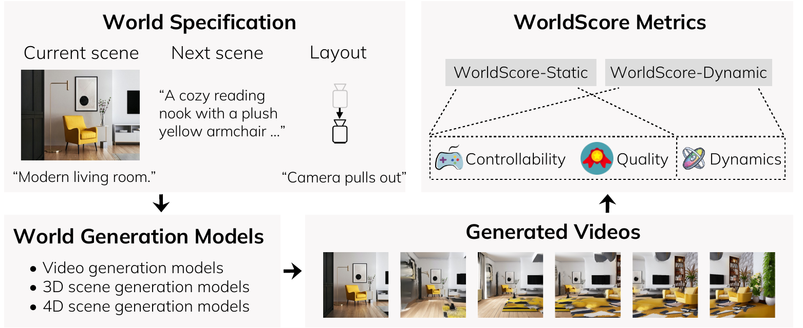

# WorldScore

WorldScore 将 3D 场景生成、4D 场景生成和视频生成放进同一评测接口。模型从当前场景、后续场景描述和相机布局中生成视频，评测器再从 controllability、quality 与 dynamics 三组信号判断结果。这个接口关注世界如何扩展、镜头如何移动以及物体如何运动，因此比只比较单段视频观感更接近世界生成的要求。

同一条 world specification 同时提供语义和空间条件：当前图像与文字描述表示已知场景，后续文本表示应出现的内容，相机轨迹与运动文字约束观察视角。不同模型可以采用各自的预处理和内部表示，但最终都提交帧序列；3D 或 4D 模型渲染出的序列与 T2V/I2V 模型直接生成的序列由同一组指标处理。

<figure>
  
  <figcaption>WorldScore 的统一接口把当前场景、后续场景和相机布局转成模型条件，再以视频作为共同评测对象。三类指标分别保留控制、视觉一致性和动态演化的失败信号。</figcaption>
</figure>

`WorldScore-Static` 聚合 7 项静态指标，覆盖相机、对象和内容控制，以及几何、光度、风格和主观质量。`WorldScore-Dynamic` 在此基础上加入 3 项动态指标。两类分数仅对应公开数据、归一化常数、辅助模型和聚合方式；它们不能表示机器人闭环控制、长期交互、规划价值或真实部署可靠性。

## 章节内容

| 页面 | 主要内容 |
| --- | --- |
| [World specification 与任务](04-worldscore/01-world-specification.md) | 当前场景、后续场景、布局、静态/动态任务和相机运动 |
| [数据与生成结果契约](04-worldscore/02-dataset-and-generation-contract.md) | 3,000 条样本、模型家族、目录结构与单样本文件 |
| [静态世界的控制与质量指标](04-worldscore/03-static-metrics.md) | 3 项 controllability、4 项 quality 及归一化方向 |
| [动态指标、聚合与评测器](04-worldscore/04-dynamics-score-and-evaluator.md) | 运动准确性、幅度、平滑性、总分和 JSON 聚合链 |
| [结果、验证与解释边界](04-worldscore/05-results-validation-and-limits.md) | 20 个模型结果、人工偏好验证和分数限制 |

## References

- Project page: [WorldScore](https://haoyi-duan.github.io/WorldScore/)
- Paper: [WorldScore: A Unified Evaluation Benchmark for World Generation](https://arxiv.org/abs/2504.00983)
- GitHub repository: [haoyi-duan/WorldScore](https://github.com/haoyi-duan/WorldScore)
- Dataset: [WorldScore](https://huggingface.co/datasets/Howieeeee/WorldScore)

## 导航

- 返回上级：[世界模型评测](../03-world-model-benchmarks.md)
- 上一节：[WorldModelBench](03-worldmodelbench.md)
- 下一节：[WBench](05-wbench.md)
