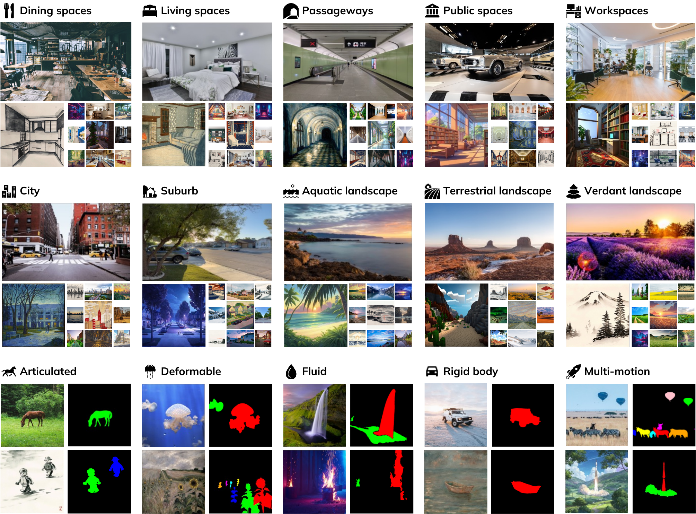

# 数据与生成结果契约

WorldScore 包含 3,000 条 world specifications。静态部分有 2,000 条：真实感和风格化各 1,000 条，每种风格各含室内、室外 10 个场景类别，每类 100 条。动态部分有 1,000 条：两种视觉风格各覆盖 articulated、deformable、fluid、rigid、multi-motion 五类运动，每类 100 条。静态集合检验扩展场景与相机控制；动态集合把运动区域和运动对象变成可计算的参照。

<figure>
  
  <figcaption>静态样本按室内/室外场景组织，动态样本按运动类型组织。动态 mask 标出应出现变化的区域，为目标运动和背景运动的区分提供参照。</figcaption>
</figure>

## 条件与标注的分工

当前图像来自整理后的场景图像，文本描述由 VLM 生成；静态任务的后续场景描述由 LLM 按已有场景自回归扩展。风格化样本在描述末尾追加风格文字，并由对应图像保持该条件。相机矩阵和相机文字共同构成布局；动态样本额外保存对象名和 mask。

| 数据字段或资源 | 作用 | 直接服务的评测 |
| --- | --- | --- |
| 当前图像与 `prompt_list` | 提供已知场景和连续场景描述 | 生成条件、风格与内容参照 |
| `camera_path` 与 `camera_data.json` | 规定相机移动并保存插值后的相机矩阵 | camera control |
| 后续场景文本与对象描述 | 指定新场景中应出现的对象及整体内容 | object control、content alignment |
| 动态 `masks` 与 `objects` | 标出应运动的对象区域 | motion accuracy |
| 有序生成帧 | 统一的模型输出 | 全部视觉、控制和动态指标 |

论文的数据构造说明了数据来源和类别覆盖；当前本地材料未包含下载后的实际 JSON 样本。因此本页只描述源码确定的字段职责，不将示意结构误写成某条公开样本的原始内容。

## 模型家族与统一接口

`type2model` 将参评模型注册为 `threedgen`、`fourdgen` 和 `videogen`。视频模型还通过各自配置声明 `generate_type: t2v` 或 `i2v`、帧数、帧率和分辨率；3D/4D 模型由专门的 adapter 或 generator 产生同样的帧目录。评测器不以分辨率、长度或模型名称推断能力，而是从注册类型决定是否运行 dynamic 集合：`threedgen` 只执行 static，其他类型执行 static 和 dynamic。

这使不同方法的最终评分具有相同的视频层级，但不代表它们收到完全相同的原始条件。3D/4D 适配器可能使用相机矩阵，T2V/I2V 适配器主要消费图像与文字；比较的共同部分是其对相同 world specification 所输出的帧序列。

## 单样本文件与目录

静态输出按风格、场景类型、类别和图像名分层；动态输出按风格、运动类型和图像名分层。两种目录最终都在实例目录写入 `evaluation.json`，但静态样本额外需要相机数据。

```text
worldscore_output/
├── static/<style>/<scene_type>/<category>/<instance>/
│   ├── input_image.png
│   ├── image_data.json
│   ├── camera_data.json
│   ├── frames/*.png
│   └── evaluation.json
└── dynamic/<style>/<motion_type>/<instance>/
    ├── input_image.png
    ├── image_data.json
    ├── frames/*.png
    └── evaluation.json
```

`DataLoader.data_exists()` 将上述文件视为完成条件，并检查帧数是否不少于任务所需的插值帧数。它没有把 MP4 视为必要输入，原因是各项指标直接遍历 `frames` 中按文件名排序的 PNG/JPG。`image_data.json` 提供 prompt、锚帧、总帧数和动态标注等样本元数据；`camera_data.json` 保存静态任务的焦距和相机矩阵；`evaluation.json` 保存每个 aspect 的原始值及归一化值。

```python
if self.visual_movement == "static":
    required = ["frames", "image_data.json", "camera_data.json", "input_image.png"]
else:
    required = ["frames", "image_data.json", "input_image.png"]
```

生成帧缺失、排序错误或把动态样本放入静态路径都会改变评测器所读的对象。目录约定不是附属的文件组织，而是数据选择、轨迹参照和最终样本平均的组成部分。

## 导航

- 返回上级：[WorldScore](../04-worldscore.md)
- 上一节：[World specification 与任务](01-world-specification.md)
- 下一节：[静态世界的控制与质量指标](03-static-metrics.md)
