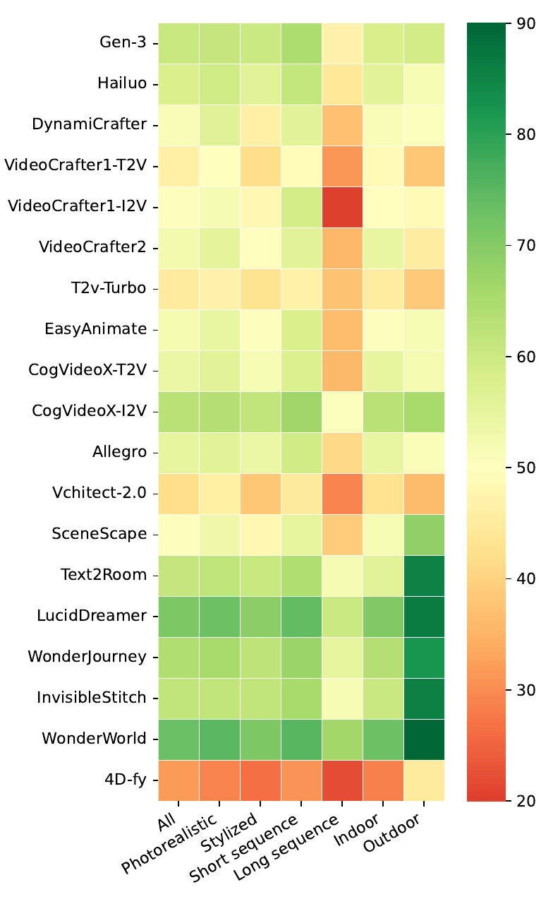

# 结果、验证与解释边界

论文以 20 个世界生成模型评估 WorldScore：13 个视频模型、6 个 3D 场景模型和 1 个 4D 模型。下表保留能说明模型家族差异的代表性分数；所有数值均来自论文发布版本的固定数据和指标实现，不应视为当前 leaderboard 的实时排名。

| 模型 | 家族 | Static | Dynamic | 可见的分项特征 |
| --- | --- | ---: | ---: | --- |
| WonderWorld | 3D | 72.69 | 50.88 | 相机控制 92.98，静态质量稳定；动态三项为 0 |
| LucidDreamer | 3D | 70.40 | 49.28 | 3D consistency 90.37，photometric consistency 90.20 |
| CogVideoX-I2V | 视频 | 62.15 | 59.12 | 视频模型中 Dynamic 最高，3D/光度/风格一致性较高 |
| Gen-3 | 视频 | 60.71 | 57.58 | object control 62.92，主观质量 63.85 |
| Hailuo | 视频 | 57.55 | 56.36 | object control 69.56，content alignment 73.53 |
| CogVideoX-T2V | 视频 | 54.18 | 48.79 | 相机控制 40.22，为视频模型中最高 |
| LTX-Video | 视频 | 55.44 | 56.54 | motion accuracy 76.22，motion smoothness 71.09 |
| 4D-fy | 4D | 27.98 | 32.10 | motion smoothness 80.06，但静态质量分项较低 |

## 结果中的模型差异

3D 模型在静态任务上整体占优。它们的显式场景表示和渲染路径更容易遵循相机轨迹，并保持几何与光度一致性；WonderWorld 的 Static 为 72.69，LucidDreamer 为 70.40。它们不生成动态世界，故论文的 Dynamic 聚合会将三个动态 aspect 作为 0 纳入，不能据此判断这些模型在运动生成上的实际失败形式。

视频模型的主要短板是相机控制。论文中视频模型最高的 camera control 来自 CogVideoX-T2V，仍为 40.22，低于各 3D 模型。I2V 模型往往倾向保留输入视角，因而质量可能较好，但对生成新场景和大幅镜头移动的响应较弱。CogVideoX-I2V 的两项总分分别为 62.15 与 59.12，超过论文所列 Gen-3 与 Hailuo 的总分，却在对象控制和内容对齐上不占优势；总分不能替代分项比较。

动态三项也呈现明显权衡。较大的 motion magnitude 不保证对象区域内的运动准确，可能来自错误的镜头或背景运动；大幅度运动还经常伴随较低平滑性。视频模型在大世界长序列和室外场景的 Static 表现较弱，说明单段观感稳定并不能保证持续扩展场景。

<figure>
  
  <figcaption>子域结果把总体 Static 分数拆回场景类型、风格和序列长度。视频模型在长序列及室外子域的下降比总体均值更明显。</figcaption>
</figure>

## 人工偏好与稳健性验证

论文招募 400 名参与者开展两选一（2AFC）视频偏好比较。对于一对视频，自动指标选择 A 时记入偏好 A 的比例，选择 B 时记入偏好 B 的比例，平分时记 0.5；各对的均值形成 agreement score。主观质量的候选组合中，CLIP-IQA+ 与 CLIP Aesthetic 的算术组合和人类总体质量偏好最一致，因此成为 `subjective_quality`。

其他指标的验证以不同分数桶的视频对比较，例如约 90 对 60、60 对 30，检查较高自动分是否对应较高的人类偏好。论文还将 EasyAnimate 的视频中心裁剪并缩放到较小分辨率，报告各项差异不超过 0.83。这些实验支持指标作为感知偏好和输入尺度变化下的代理，但并不把自动指标变成真实世界物理测量。

## 解释边界

- 自动指标通过视觉、语言和视频模型间接观察物理与控制，不能验证接触力、物体状态或因果机制。
- 3D consistency、photometric consistency、style consistency 与内容控制指向不同对象；其中一项高分不能抵消另一项的错误。
- 动态总分对没有动态输出的 3D 模型包含零项，适合展示统一接口下的能力覆盖，不适合当作纯静态方法的动态实验结果。
- WorldScore 的输出是生成视频质量与条件服从度，未评估 policy rollout、任务成功率、长期多轮交互或 sim-to-real 迁移。

## 导航

- 返回上级：[WorldScore](../04-worldscore.md)
- 上一节：[动态指标、聚合与评测器](04-dynamics-score-and-evaluator.md)
