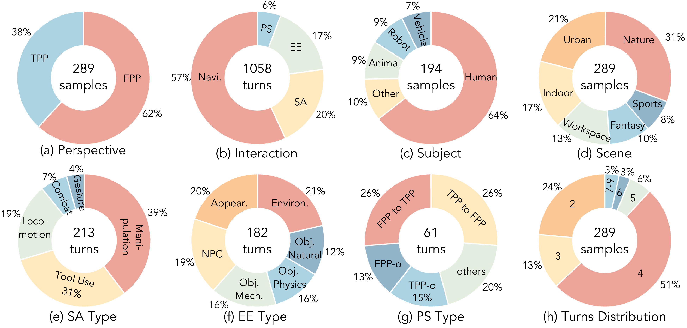

# 数据与多轮交互协议

WBench 用一个 case 表示从确定起点开始的一次连续世界演化。初始图像给出当前观测，world setting 补充图像中可见和暂不可见的世界信息，interaction sequence 指定每一轮施加的控制。模型生成的不是彼此独立的短片，而是必须能承接先前状态的多轮视频。

## World setting

每个 setting 由 scene、style、perspective 和 subject 四类属性组成。scene 描述环境类型、空间布局和应在后续视野出现的元素；style 约束真实、动画、CG、油画等渲染外观；perspective 为 first-person 或 third-person；subject 描述场景中的主要人、动物、机器人、车辆或物体。第一人称的纯环境场景可以没有 subject，持有工具或显示机器人手臂的第一人称场景则仍有主体。

环境提示由 scene 与 style 构成，主体提示由 perspective 与 subject 构成。它们与初始帧共同约束生成结果：初始帧中的地形、建筑或主体外观需要在后续保持；初始帧外但被 setting 指定的河流、道路或环境元素应在相机移动后以合理方式出现。初始帧来自图像生成、网页收集和人工拍摄，并经过人工质量检查。

## 四类交互

interaction sequence 可以在同一 case 中混合四种交互。

| 类型 | 控制内容 | 第一、第三人称中的含义 | 主要检验对象 |
| --- | --- | --- | --- |
| navigation | `W`、`S`、`A`、`D`、方向键及组合键 | 第一人称移动相机；第三人称移动主体并维持相机与主体的关系 | 轨迹、空间关系、跨轮定位 |
| subject action | 操作、行走、工具使用、战斗、手势 | 主体完成指定动作 | 动作事件、完成度、异常 |
| event editing | 天气、时间、物体、NPC 或状态变化 | 外部事件改变环境或对象 | 因果触发和目标状态 |
| perspective switching | 第一/第三人称、主体和观察范围切换 | 观察点与可见主体发生结构变化 | 过渡可见性与新视角结构 |

导航包含前后、横移和旋转控制，也允许 `W+left` 这类复合控制。相同的离散键在两种视角中对应不同几何过程：第一人称旋转改变相机朝向，第三人称旋转还要求相机围绕主体保持合理位置。该差异使第三人称 case 同时考验主体运动和相机几何，不能把键盘 token 直接视为相同的像素运动。

## 数据覆盖与交互深度

289 个 case 覆盖 1,058 个 turn，其中 62% 为第一人称、38% 为第三人称。navigation 占 turn 的 57%，subject action、event editing 和 perspective switching 分别占 20%、17% 和 6%。场景覆盖自然、城市、室内、工作、奇幻和体育，主体覆盖人、动物、机器人、车辆及其他对象；真实风格占 52%，其余 case 分布在动画、卡通、CG、油画、水墨、铅笔和抽象等风格中。

<figure>
  
  <figcaption>WBench 同时改变场景、主体、风格、视角和交互类型。四轮 case 占 51%，而包含主体动作与环境编辑交错的长序列可延伸至 5–9 轮。</figcaption>
</figure>

每个 case 有 2–9 轮，平均 3.7 轮。首轮的画面质量只能说明局部条件生成；当上一段的末帧被用作下一段的条件，镜头位姿偏移、主体身份漂移和物体状态遗忘会持续传入后续生成。navigation 的重复移动尤其容易累积位姿误差，动作与事件交错的长序列则暴露状态是否在对象改变后仍被保留。

## Case 契约

仓库中的 `src/utils/case_loader.py` 将 case JSON 解析为 setting、interaction、评测开关与评测问题。以下字段结构省略了具体文本和路径，只保留评测双方共享的契约：

```json
{
  "id": 0,
  "settings": {
    "scene": {"environment": "...", "attribute": "...", "name": "..."},
    "style": "realistic",
    "perspective": "first_person",
    "subject": {"type": "...", "desc": "...", "movement": "..."},
    "initial_image": "images/..."
  },
  "interactions": [
    {"turn": 0, "type": "navigation", "action": "W", "prompt": "..."}
  ],
  "eval_dimensions": {"consistency": {"enabled": true, "focus": ["..."]}},
  "eval_questions": [{"dimension": "...", "turn": 0, "question": "...", "expected": "..."}]
}
```

`eval_dimensions` 决定某个 case 启用哪些诊断，`eval_questions` 为需要语义判断的维度提供问题和预期结果。问题不是对所有视频使用同一套泛化提示：它们绑定当前 case 的场景、交互和轮次，使 VLM 能够判断指定事件是否出现，而不是只评估视频是否看起来连贯。

## 导航

- 返回上级：[WBench](../05-wbench.md)
- 下一节：[视频、设定与交互指标](02-video-setting-and-interaction-metrics.md)
