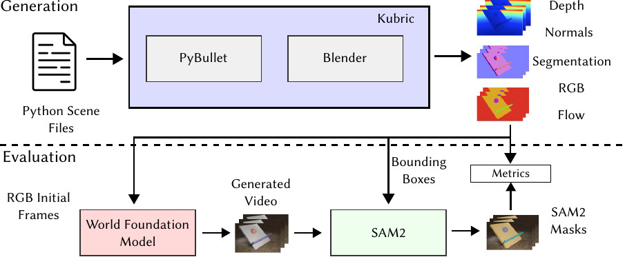

# WorldBench

WorldBench 把世界模型的物理评测收窄到可单独归因的概念和参数。模型接收场景开头的一小段视频，生成后续帧；评分不以画面是否具有电影感为中心，而是检查物体的运动、遮挡后的持续存在、支撑关系、透视尺度以及可测量的物理量是否与参考演化一致。该设置将视频生成模型的视觉连贯性与物理正确性置于同一段预测中比较。

许多物理视频包含碰撞、遮挡、相机视角和材料变化，单个失败很难归因于某条规律。WorldBench 为每个场景限制主要考察对象：直觉物理子集将场景归入四类物理概念；物理参数估计子集把重力加速度、动摩擦因数和流体黏度转化为数值目标。前者观察未来场景是否按正确关系演化，后者检查生成轨迹是否符合给定实验条件下的量化规律。

<figure>
  
  <figcaption>直觉物理子集的评测流程。合成场景由 Kubric 生成，模型续写视频后，SAM2 在首帧真值框的提示下追踪对象，得到的掩码与参考掩码用于计算前景 mIoU。</figcaption>
</figure>

WorldBench 的结论应限于受控视频预测。它能够诊断模型对特定物理概念和材料参数的保持程度，却不直接评估动作条件响应、闭环规划或真实机器人任务成功率。合成视频提供精确的几何和运动参照，真实视频检验同一流程是否只适用于渲染域；两者都不是对开放世界全部物理现象的覆盖。

## 章节内容

| 页面 | 主要内容 |
| --- | --- |
| [直觉物理数据与场景](06-worldbench/01-intuitive-physics-data-and-scenes.md) | 四类概念、13 个受控场景、合成与真实视频及标注 |
| [视频预测评测协议](06-worldbench/02-video-prediction-protocol.md) | 续写任务、SAM2 追踪、前景 mIoU 与背景 RMSE |
| [物理参数估计](06-worldbench/03-physical-parameter-estimation.md) | 重力、摩擦、黏度实验，标定与轨迹拟合 |
| [结果、VLM 扩展与限制](06-worldbench/04-results-vlm-and-limits.md) | 模型失效模式、文本增强子集和结论边界 |

## References

- Project page: [WorldBench](https://world-bench.github.io/)
- Paper: [WorldBench: Disambiguating Physics for Diagnostic Evaluation of World Models](https://arxiv.org/abs/2601.21282)
- Dataset: [worldbenchmark/IntuitivePhysics](https://huggingface.co/datasets/worldbenchmark/IntuitivePhysics)
- Dataset: [worldbenchmark/PerfectPhysics](https://huggingface.co/datasets/worldbenchmark/PerfectPhysics)

## 导航

- 返回上级：[世界模型评测](../03-world-model-benchmarks.md)
- 上一节：[WBench](05-wbench.md)
- 下一节：[WoW-World-Eval](07-wow-world-eval.md)
