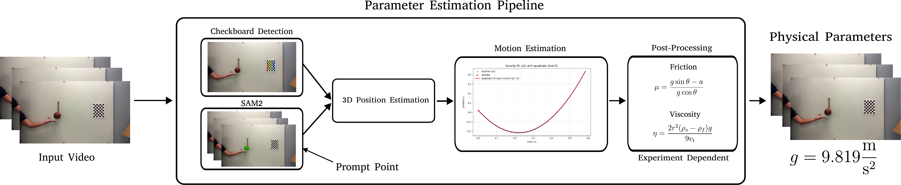

# 物理参数估计

物理参数估计子集把生成视频中的对象轨迹转换为工程量。视觉上合理的下落或斜坡滑动并不足以说明模型遵守了正确规律：同一条抛物线可以对应错误的加速度，缓慢滑动也可能对应错误的摩擦。WorldBench 因而分别测量重力加速度、动摩擦因数和流体黏度。

该子集包含 279 段视频。真实实验包括 51 段重力视频、103 段摩擦视频和 80 段黏度视频；另有 30 段合成重力视频与 15 段合成摩擦视频。实验通过控制几何和相机条件压低单目视频的深度歧义，使轨迹中的数值变化能够对应到特定物理参数。

<figure>
  
  <figcaption>参数估计流水线。棋盘格提供相机外参，SAM2 给出对象的二维位置；受控实验使对象在近似恒定深度平面内运动，从而将二维轨迹恢复为三维位置并拟合物理量。</figcaption>
</figure>

## 从图像位置到三维轨迹

相机内参在采集前用棋盘格标定。每段视频背景中的棋盘格具有已知三维角点，检测到的角点与内参共同估计该视频的外参；相机位置还通过人工测量复核。SAM2 在人工给定的提示点下追踪目标对象，掩码中心作为每帧二维像素位置。

物体被安排在与相机成像平面平行、深度近似不变的平面内运动，深度可以直接测量。该设计避免把单目深度估计误差混入加速度估计。得到每帧三维位置后，重力和摩擦场景用二次函数拟合位置随时间的变化，黏度场景在对象已达终端速度的片段上线性拟合位置。

```text
# 根据论文流程整理的说明性伪代码，不是官方实现。
K = calibrate_intrinsics(checkerboard_images)
pose = solve_extrinsics(K, checkerboard_corners_2d, checkerboard_corners_3d)
centers_2d = track_mask_centroids_with_sam2(video, prompt_point)
positions_3d = back_project_on_constant_depth_plane(centers_2d, K, pose, depth)

if experiment in {"gravity", "friction"}:
    acceleration = quadratic_fit(positions_3d, timestamps).second_derivative
else:
    terminal_velocity = linear_fit(positions_3d, timestamps).slope
```

## 三类实验

| 参数 | 实验设置 | 从轨迹提取的量 | 评测参照 |
| --- | --- | --- | --- |
| 重力 \(g\) | 自由落体与斜坡后抛射 | 自由飞行段的加速度 | \(9.81\ \mathrm{m/s^2}\) |
| 动摩擦因数 \(\mu\) | 钢块沿不同材料覆盖的斜面滑动 | 沿斜面加速度 \(a\) | 不同材料的测量范围 |
| 动力黏度 \(\eta\) | 钢球在甘油、玉米糖浆或蜂蜜中下落 | 终端速度 \(v_t\) | 各流体的参考黏度 |

重力实验包括 17 段直落与 34 段抛体真实视频。视频在对象已经处于自由飞行状态时开始，物体形状和抛射条件变化，且选择空气阻力影响可以忽略的对象。摩擦实验让钢块在木材、橡胶、80 目砂纸、3000 目砂纸或塑料覆盖的斜面滑动；斜面角度在不同试次中变化。重力、摩擦和黏度场景都保留了足够的输入帧，使视频到视频模型能够从条件中观察对应的运动量。

对于斜面角 \(\theta\)，由沿斜面加速度得到的动摩擦因数为：

\[
\mu=\frac{g\sin\theta-a}{g\cos\theta}。
\]

黏度实验使用下沉钢球。钢球半径为 \(r\)，钢球和流体密度分别为 \(\rho_s\)、\(\rho_f\)，球达到终端速度 \(v_t\) 后，Stokes 定律给出：

\[
\eta=\frac{2r^2(\rho_s-\rho_f)g}{9v_t}。
\]

温度和材料状态会改变真实流体的性质。黏度采集在同一会话、约 \(75\,^{\circ}\mathrm{F}\) 下进行，以减少温度和吸湿性带来的变化；摩擦和重力场景使用标尺，黏度场景使用带刻度的容器，为视频模型提供尺度线索。论文用真实采集视频先验证这条测量管线：自由落体和抛体的估计值分别为 \(9.78\pm0.38\) 与 \(9.85\pm0.36\ \mathrm{m/s^2}\)，接近重力加速度的参考值。

## 导航

- 返回上级：[WorldBench](../06-worldbench.md)
- 上一节：[视频预测评测协议](02-video-prediction-protocol.md)
- 下一节：[结果、VLM 扩展与限制](04-results-vlm-and-limits.md)
