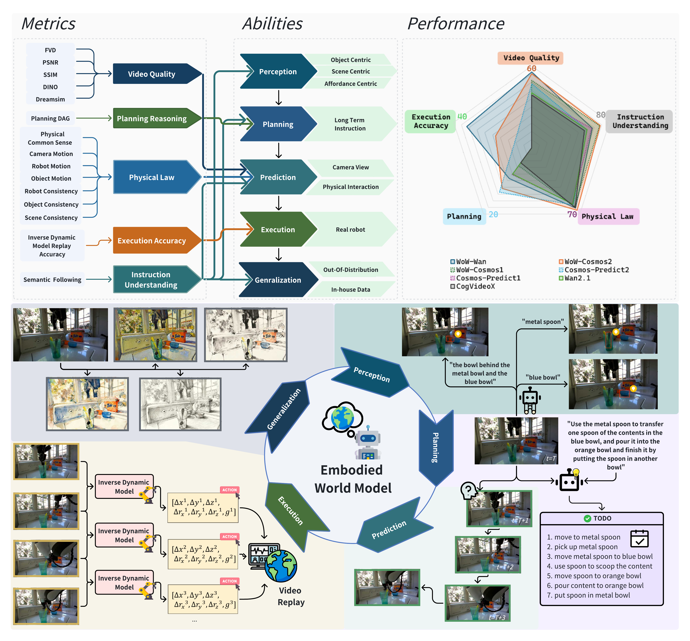

# WoW-World-Eval

WoW-World-Eval 以机器人操作的初始图像和语言指令为条件，要求世界模型生成后续操作视频。评测对象由此落在一条明确的数据流上：初始观测固定机器人、物体与场景状态，指令规定目标动作，生成视频呈现模型预测的状态变化与操作过程。视觉质量、指令理解、规划推理和物理规律指标分析视频本身，真实机器人实验进一步检验视频能否转化为可执行动作。

<figure>
  
  <figcaption>WoW-World-Eval 将感知、规划、预测、执行与泛化能力落实到生成视频指标、人工判断和真实机器人执行结果。</figcaption>
</figure>

基准包含 609 条机器人操作样本。数据来自公开机器人数据、内部轨迹和经图像编辑形成的分布外条件，部分样本带有参考视频和首帧关键点。论文以 22 项生成评测信号构成自动评分，并设计 Human Turing Test 与 GC-IDM Turing Test。前者记录人类将生成视频判断为真实视频的比例，后者将生成视频转换为机器人动作并在真实平台执行。

WoW-World-Eval 目前尚未公开数据、评测脚本、辅助评估器权重或 GC-IDM 工件。

## 章节内容

| 页面 | 主要内容 |
| --- | --- |
| [任务、数据与五项能力](07-wow-world-eval/01-task-data-and-abilities.md) | Image-Text-to-Video 任务、能力分类、609 条样本及标注流程 |
| [参评模型与生成协议](07-wow-world-eval/02-models-and-generation-protocol.md) | 模型版本、参数规模、视频规格、简短与密集提示词 |
| [视觉保真度指标](07-wow-world-eval/03-visual-fidelity-metrics.md) | FVD、PSNR、SSIM、DINO 和 DreamSim |
| [指令语义评测](07-wow-world-eval/04-instruction-semantic-evaluation.md) | 有无 GT 的评测流程及三项语义分数 |
| [DAG 长程规划评测](07-wow-world-eval/05-dag-planning-evaluation.md) | 原子动作、依赖关系、Node Correctness 和 Task Completion |
| [物理一致性与因果评测](07-wow-world-eval/06-physical-consistency-and-causal-evaluation.md) | 区域一致性、轨迹、相机运动和物理判别器 |
| [指标归一化与总分聚合](07-wow-world-eval/07-score-normalization-and-aggregation.md) | 方向统一、单调映射、参数选择和分数组合 |
| [人工评测与 Human Turing Test](07-wow-world-eval/08-human-evaluation-and-turing-test.md) | 四维人工评分、相关性与 2AFC 真假判断 |
| [GC-IDM 与真实机器人执行](07-wow-world-eval/09-gc-idm-and-real-robot-execution.md) | 真实视频回放验证、9 项任务和模型执行成功率 |
| [模型结果、失败模式与结论范围](07-wow-world-eval/10-results-failure-modes-and-limits.md) | 主结果、密集提示词、定性案例与证据边界 |

## References

- Paper: [Wow, wo, val! A Comprehensive Embodied World Model Evaluation Turing Test](https://arxiv.org/abs/2601.04137)

## 导航

- 返回上级：[世界模型评测](../03-world-model-benchmarks.md)
- 上一节：[WorldBench](06-worldbench.md)
- 下一节：[MolmoSpaces-Bench](08-molmospaces-bench.md)
