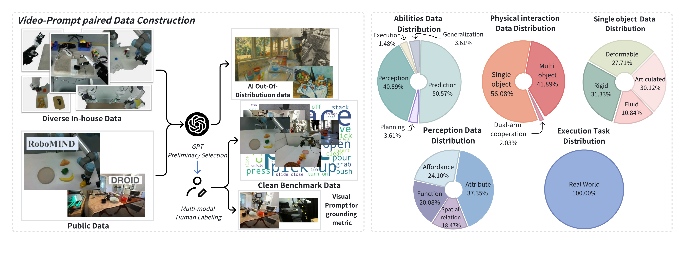

# 任务、数据与五项能力

WoW-World-Eval 将具身世界模型统一为 Image-Text-to-Video 生成器。初始图像 \(I_0\) 提供当前机器人、物体和场景状态，语言指令 \(p\) 规定目标操作，模型 \(g\) 输出未来视频 \(\hat V\)：

\[
\hat V=g(I_0,p).
\]

基准记录的参考视频 \(V\) 表示真实操作轨迹，Prediction 样本的首帧关键点 \(K\) 标出夹爪、机械臂关节和被操作物体。单条记录可以表示为

\[
\mathcal D_i=(I_0,p,V,K),
\]

其中 \(K\) 只在需要轨迹和区域跟踪的样本上提供。参考视频支持像素、特征和轨迹比较，关键点支持局部区域与运动路径测量；指令和生成视频自身则支持语义、规划与物理常识判断。开放式操作可能存在多个合理未来，因此参考视频是一条可观察参照，并非唯一有效结果。

## 五项能力的测量对象

| 能力 | 条件或任务 | 生成视频中的测量对象 |
| --- | --- | --- |
| Perception | 颜色、形状、数量、尺寸、功能、空间关系和 affordance | 目标对象是否被正确识别并在操作中保持属性与相对位置 |
| Planning | 含多个子目标和前置依赖的长程指令 | 原子动作是否完整，依赖顺序是否允许任务继续推进 |
| Prediction | 遮挡、碰撞、接触和状态变化 | 机械臂、物体、背景与相机是否形成连续且合理的未来 |
| Execution | 可由真实机器人完成的内部任务 | 生成视频经 GC-IDM 解释后能否形成成功的真实动作 |
| Generalization | 经风格迁移、图像编辑或艺术作品构成的分布外初始状态 | 外观或场景分布变化后，生成结果是否仍遵循指令 |

Perception 是后续测量的状态基础：对象身份或空间关系一旦错误，动作对象、轨迹和终态都会随之偏离。Planning 关注子目标及其因果依赖，论文为此收集 25 条长程样本，并将指令调整为适合视频模型生成的描述。Prediction 将世界模型视为未来模拟器，覆盖物体持续性、碰撞动力学和轨迹合理性。Execution 把视频预测连接到真实控制。Generalization 则改变模型接收的视觉条件，检查能力能否超出常规机器人数据外观。

这五项能力与论文最终报告的四组自动分数不构成一一映射。Video Quality、Instruction Understanding、Planning Reasoning 和 Physical Law 是对生成结果的测量分组；Execution 由真实机器人实验提供，Generalization 则改变测试样本的分布和可用参照。

## 数据来源与筛选

候选数据由三类来源构成：

| 来源 | 提供的内容 | 在基准中的作用 |
| --- | --- | --- |
| RoboMIND、DROID 等公开机器人数据 | 多平台真实机器人操作视频和指令 | 扩大常规操作、场景与 embodiment 覆盖 |
| 内部采集轨迹 | 与真实机器人实验兼容的操作序列 | 支持 Execution 和 GC-IDM 测试 |
| AI 生成的 OOD 条件 | 对内部机器人图像进行风格迁移或图像编辑，并加入艺术作品 | 构造 Generalization 初始状态 |

GPT-4o 根据五项能力及其子类评估候选视频—指令对的匹配程度，完成大规模筛选和粗分类。人工专家随后核验类别、清理不匹配样本并处理边界情况。五名额外标注者从每个操作中选择机器人与被操作物体同时清晰可见的首帧；Prediction 样本还在首帧标出夹爪、关节和物体关键点。

<figure>
  
  <figcaption>数据构建将自动筛选与人工核验连接到首帧、指令、参考视频和关键点，使不同指标能够作用于同一操作条件。</figcaption>
</figure>

## 609 条样本的组成

最终数据包含 609 条样本。Prediction 占 50.57%，Perception 占 40.89%，两者构成主要部分。Perception 的 249 条样本覆盖对象属性、affordance、对象功能和空间关系；属性进一步涉及颜色、数量、形状、尺寸和类别。

物理交互按照参与对象和机械臂数量划分。单物体操作占 56.08%，多物体交互占 41.89%，双臂协作占 2.03%。这些类别用于区分单体运动、对象间碰撞或接触，以及多机械臂共同作用时的预测难度。可见性设置包含 107 个无遮挡首帧和 54 个半遮挡首帧，用于检查对象信息不完整时的状态保持。

Execution 从内部数据中选择 9 项由易到难的真实机器人任务。该数量指真实执行任务集合，不表示所有 609 条生成样本都进入真实机器人测试。论文未给出可下载清单，也未说明各能力类别之间是否存在交叠，因而无法从逐条数据核对百分比、计数及类别交叠关系。

## 字段与评测参照

| 字段 | 固定的信息 | 主要测量用途 |
| --- | --- | --- |
| 初始图像 \(I_0\) | 生成起点、对象布局与可见状态 | 所有模型的视觉条件，区域与轨迹初始化 |
| 语言指令 \(p\) | 目标动作、对象及必要顺序 | 指令理解和规划评测 |
| 参考视频 \(V\) | 一条真实操作过程与终态 | 视觉保真、轨迹、相机运动及有 GT 的语义评测 |
| 关键点 \(K\) | 夹爪、关节和对象的首帧位置 | 掩码生成、跨帧跟踪和轨迹比较 |
| 能力与子类标签 | 样本对应的诊断目标 | 分组统计与结果解释 |

同一字段可以服务多个指标，但各指标使用的参照不同。PSNR 和轨迹距离直接比较生成结果与参考视频；Sequence Match 从生成视频与指令之间建立关系；区域一致性检查生成视频内部的跨帧稳定；真实执行则以任务是否成功为最终结果。分数只能在其参照范围内解释。

## 导航

- 返回上级：[WoW-World-Eval](../07-wow-world-eval.md)
- 下一节：[参评模型与生成协议](02-models-and-generation-protocol.md)
