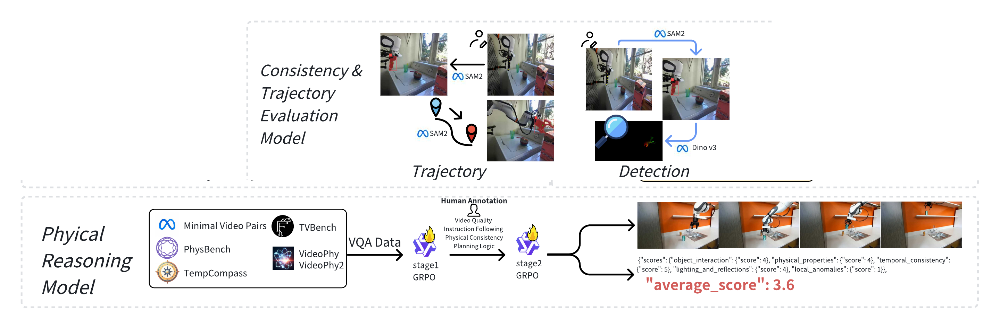

# 物理一致性与因果评测

物理规律组从区域外观、对象与机械臂轨迹、相机运动和物理常识四个方面分析生成视频。区域一致性检查局部身份与纹理是否跨帧保持，轨迹指标比较运动路径，相机指标分离视角漂移，物理判别器则观察接触、状态变化和因果关系。它们共同测量可见视频中的物理证据，不直接恢复三维状态或真实动力学参数。

<figure>
  
  <figcaption>物理测量由局部区域与二维运动指标、两阶段物理推理评估器共同构成。</figcaption>
</figure>

## Mask-guided Regional Consistency

全局视觉特征会把机器人、被操作物体和背景混合在一起。Mask-guided Regional Consistency（MRC）先分离三个区域，再分别计算跨帧特征相似度：

\[
r\in\{\mathrm{obj},\mathrm{arm},\mathrm{bg}\}.
\]

正文采用 GroundedSAM2，附录采用 GroundingSAM-2。具体代码工件目前尚未公开，无法进一步核对两处名称所指组件的版本。

### 首帧标注与掩码跟踪

标注者选择机器人夹爪和被操作物体都清晰可见的首帧，并沿每个区域的可见轮廓标注 3–5 个边界点。这些点作为分割提示，组件输出首帧掩码并跟踪后续帧。每帧保存对象掩码 \(M_t^{\mathrm{obj}}\) 和机械臂掩码 \(M_t^{\mathrm{arm}}\)，背景定义为二者并集的补集：

\[
M_t^{\mathrm{bg}}
=\mathbf 1-
\left(
M_t^{\mathrm{obj}}\lor M_t^{\mathrm{arm}}
\right).
\]

掩码使用 Run-length Encoding（RLE）保存。区域因遮挡或运动模糊而无法跟踪时，该帧记录全零 RLE 掩码。这个处理会把跟踪失败转化为零一致性，而不是从平均值中忽略，因此分数同时受到生成稳定性和分割跟踪可靠性的影响。

### 区域特征

DINOv3-Large 将第 \(t\) 帧编码为 patch 特征网格：

\[
F_t\in\mathbb R^{H_p\times W_p\times d}.
\]

RLE 掩码解码后下采样到 \((H_p,W_p)\)，并在每个区域内归一化：

\[
w_t^r(i,j)=
\frac{M_t^r(i,j)}
{\sum_{i',j'}M_t^r(i',j')+\epsilon}.
\]

区域特征是 patch 特征的掩码加权平均：

\[
\mathbf f_t^r
=\sum_{i,j}w_t^r(i,j)F_t(i,j,:).
\]

非零特征随后进行 \(\ell_2\) 归一化。全零掩码产生全零区域特征，避免把缺失区域误作正常外观。

### 长期与短期一致性

两个有效区域特征之间使用余弦相似度；任一特征为零时，一致性记为 0：

\[
\mathrm{Consist}^r(a,b)=
\begin{cases}
\tilde{\mathbf f}_a^r\cdot\tilde{\mathbf f}_b^r,
&\|\tilde{\mathbf f}_a^r\|_2>0,\quad
\|\tilde{\mathbf f}_b^r\|_2>0,\\
0,&\text{otherwise}.
\end{cases}
\]

第 \(t\) 帧同时与首帧和前一帧比较：

\[
s_t^r=
\frac12\mathrm{Consist}^r(1,t)
+\frac12\mathrm{Consist}^r(t-1,t).
\]

视频级区域分数为

\[
\mathrm{MRC}^r=
\frac{1}{T-1}\sum_{t=2}^{T}s_t^r.
\]

首帧—当前帧项检查长期身份和外观漂移，相邻帧项检查局部闪烁与突变。论文分别报告 Robot Consistency、Object Consistency 和 Scene Consistency；较高分表示相应区域在 DINOv3 表征中更稳定。稳定并不必然表示动作正确：完全静止的视频可以保持很高的区域一致性。

## 对象与机械臂轨迹

轨迹指标比较生成视频与 GT 视频中的二维运动路径。首帧人工关键点作为 SAM2 的正点提示，SAM2 为机械臂末端或对象生成逐帧二值掩码：

\[
M^{(t)}\in\{0,1\}^{H\times W}.
\]

设前景像素集合为

\[
\Omega^{(t)}
=\{(x,y)\mid M^{(t)}(x,y)=1\},
\]

则该帧的轨迹点取掩码质心：

\[
\mathbf p_t=(x_t,y_t)
=\frac{1}{|\Omega^{(t)}|}
\sum_{(x,y)\in\Omega^{(t)}}(x,y).
\]

坐标再按视频宽高归一化：

\[
\hat{\mathbf p}_t
=\left(\frac{x_t}{W},\frac{y_t}{H}\right)
\in[0,1]^2.
\]

质心轨迹消除了分辨率量纲，但压缩了区域形状、旋转和关节姿态。对象发生形变或掩码只覆盖局部时，质心变化可能来自分割边界变化，而非真实平移。

## 相机运动估计与轨迹校正

生成视频中的相机漂移会与机械臂的图像平面运动叠加。论文在首帧边界区域检测 Shi–Tomasi 稀疏特征，假设这些区域主要属于静态背景，再使用 pyramidal Lucas–Kanade 光流跟踪到后续帧。对应点经过 RANSAC 估计二维旋转、尺度和平移仿射变换：

\[
A_t=
\begin{bmatrix}
a_{11}&a_{12}&t_x\\
a_{21}&a_{22}&t_y
\end{bmatrix}.
\]

静态背景在图像中的平移为 \((t_x,t_y)\)，相机位移取相反方向：

\[
\Delta\mathbf c_t=(-t_x,-t_y).
\]

从 \(\mathbf c_1=(0,0)\) 开始累加，并对相邻帧的异常大跳变执行 drift clipping：

\[
\mathbf c_t=\mathbf c_{t-1}+\Delta\mathbf c_t.
\]

机械臂观测轨迹通过减去相机轨迹得到校正结果：

\[
\mathbf p_t^{\mathrm{true}}
=\hat{\mathbf p}_t-\mathbf c_t.
\]

边界区域包含运动物体、纹理不足或生成伪影时，背景假设可能不成立；错误的相机估计会进一步污染校正后的机械臂轨迹。

## 时间对齐

GT 与生成视频可能具有不同帧数。设二者长度为 \(T_{\mathrm{gt}}\) 和 \(T_{\mathrm{gen}}\)，目标长度取较短者：

\[
T=\min(T_{\mathrm{gt}},T_{\mathrm{gen}}).
\]

较长轨迹通过均匀采样缩短到 \(T\) 帧，得到对齐序列 \(\mathbf q_t^{\mathrm{gt}}\) 和 \(\mathbf q_t^{\mathrm{gen}}\)。该步骤保留首尾范围并统一比较长度，但不会恢复不同帧率或动作速度下的精确时间对应。

## 三种轨迹距离

L2Norm 比较相同采样位置上的平均偏差：

\[
\mathrm{L2norm}
=\sqrt{
\frac1T\sum_{t=1}^{T}
\left\|
\mathbf q_t^{\mathrm{gen}}
-\mathbf q_t^{\mathrm{gt}}
\right\|_2^2
}.
\]

它对时间对齐敏感。两条路径几何形状相同但速度不同，仍可能产生较大误差。

Dynamic Time Warping（DTW）允许非线性时间对齐：

\[
\mathrm{DTW}
\left(\mathbf q^{\mathrm{gen}},\mathbf q^{\mathrm{gt}}\right)
=\min_{\pi}
\sum_{(t,s)\in\pi}
\left\|
\mathbf q_t^{\mathrm{gen}}
-\mathbf q_s^{\mathrm{gt}}
\right\|_2.
\]

\(\pi\) 是保持顺序的 warping path。DTW 能容纳局部速度差异，但累计代价也受轨迹长度和路径选择影响。

Fréchet Distance（FD）要求两条曲线同步向前推进，并记录最小可能的最大间距：

\[
\mathrm{FD}
\left(\mathbf q^{\mathrm{gen}},\mathbf q^{\mathrm{gt}}\right)
=\inf_{\alpha,\beta}
\max_{t\in[0,1]}
\left\|
\mathbf q_{\alpha(t)}^{\mathrm{gen}}
-\mathbf q_{\beta(t)}^{\mathrm{gt}}
\right\|_2.
\]

FD 对路径中的大幅偏离更敏感。三项均为距离，原始值越低越好；论文分别对 Robot 和 Object 报告 L2Norm、DTW 与 FD，共形成六个轨迹信号。

## Camera ATE 与 RPE

Absolute Trajectory Error（ATE）比较完整相机轨迹的绝对位置：

\[
\mathrm{ATE}
=\sqrt{
\frac1T\sum_{t=1}^{T}
\left\|
\hat{\mathbf c}_t^{\mathrm{gen}}
-\hat{\mathbf c}_t^{\mathrm{gt}}
\right\|_2^2
}.
\]

Relative Pose Error（RPE）比较相邻帧的局部相机运动，评测设置取 \(\Delta=1\)：

\[
\mathbf v_t^{\mathrm{gt}}
=\hat{\mathbf c}_{t+\Delta}^{\mathrm{gt}}
-\hat{\mathbf c}_t^{\mathrm{gt}},
\qquad
\mathbf v_t^{\mathrm{gen}}
=\hat{\mathbf c}_{t+\Delta}^{\mathrm{gen}}
-\hat{\mathbf c}_t^{\mathrm{gen}},
\]

\[
\mathrm{RPE}
=\sqrt{
\frac{1}{T-\Delta}
\sum_{t=1}^{T-\Delta}
\left\|
\mathbf v_t^{\mathrm{gen}}
-\mathbf v_t^{\mathrm{gt}}
\right\|_2^2
}.
\]

ATE 反映全局视角路径偏差，RPE 反映局部速度与方向变化。两项原始误差越低越好。主结果中的映射分数接近饱和，表示参评视频大多保持固定或接近 GT 的相机，而不表示相机估计完全准确。

## 物理常识判别器

区域和轨迹指标难以直接识别穿透、无施力运动、物体消失或流体行为。WoW-World-Eval 以 Qwen-2.5-VL 7B 为基础，使用 Group Relative Policy Optimization（GRPO）进行两阶段微调，形成自动物理评分器。

### 第一阶段：视频与因果理解

第一阶段使用六个视频理解 benchmark 中约 50,000 条多项选择 VideoQA 样本。每个问题采样 \(G=8\) 个输出，答案与正确选项一致时奖励为 1，否则为 0。组内奖励经过标准化形成 advantage：

\[
\hat A_i=
\frac{r_i-\mathrm{mean}(r_1,\ldots,r_G)}
{\mathrm{std}(r_1,\ldots,r_G)+\epsilon}.
\]

该阶段使模型在留出测试集上的平均准确率从基础 Qwen-2.5-VL 7B 的 60.83% 提升到 71.51%。这个结果验证通用视频理解训练的变化，不是最终物理评分准确率。

### 第二阶段：人工评分对齐

第二阶段使用 1,297 条内部人工标注数据，将输出约束为包含 `video_quality`、`instruction_following`、`physical_consistency` 和 `planning_logic` 的 JSON。每个有效字段的 1–5 分先裁剪到合法范围，归一化绝对误差为

\[
e_k=
\frac{|s_k^{\mathrm{gt}}-s_k^{\mathrm{out}}|}{4}.
\]

匹配字段的平均误差为 \(\bar e\)，最终奖励为

\[
R=\mathrm{clip}(1-\bar e,0,1).
\]

JSON 无法解析或没有匹配字段时，奖励为 0。该阶段对齐结构化输出和人工量表，随后最终推理提示词只要求模型判断物理合理性。

### 六类物理判断

论文材料将最终物理判断细化为六类现象：

| 类别 | 观察对象 |
| --- | --- |
| 对象交互与状态变化 | 接触、碰撞、施力、形变及属性保持 |
| 基本物理属性 | 重力、惯性、摩擦、质量与材料行为 |
| 时间与因果一致性 | 原因与结果的先后、延迟和连续演化 |
| 光照、阴影与反射 | 光源方向、表面照明与反射关系 |
| 流体与粒子行为 | 水、烟、火、尘埃及其与固体的交互 |
| 局部异常 | 瞬移、消失、悬浮、穿透和无因运动 |

判别器输出 1–5 分的 Physical Score。它从可见视频判断物理现象，没有访问对象质量、接触力、机器人状态或三维几何真值。训练数据覆盖、生成视频清晰度、推理提示词和 VLM 偏差都会进入结果。

## 信号之间的关系

| 信号 | 能定位的错误 | 不能单独确认的内容 |
| --- | --- | --- |
| Robot/Object/Scene Consistency | 区域身份、纹理和局部跨帧漂移 | 动作目标与因果正确性 |
| Robot/Object Trajectory | 二维路径偏移、时序错位和大幅偏离 | 三维接触力与姿态 |
| Camera ATE/RPE | 全局和局部视角运动偏差 | 相机估计器自身是否无误 |
| Physical Score | 可见的物理与因果异常 | 真实状态方程和执行成功 |

稳定视频可能获得较高一致性和相机分数，却因没有执行指令而在语义和规划组失败。轨迹接近参考也可能伴随对象穿透或错误抓取。物理规律组保留多个信号，正是为了避免用单一视觉代理概括所有物理错误。

## 导航

- 返回上级：[WoW-World-Eval](../07-wow-world-eval.md)
- 上一节：[DAG 长程规划评测](05-dag-planning-evaluation.md)
- 下一节：[指标归一化与总分聚合](07-score-normalization-and-aggregation.md)
