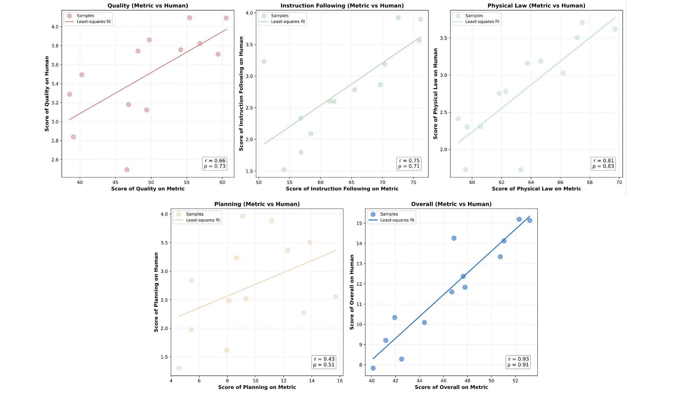
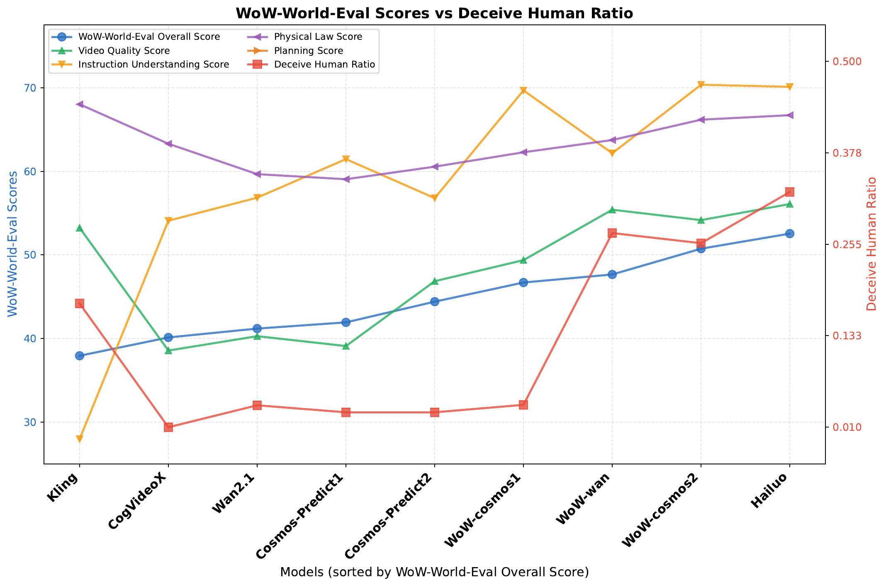

# 人工评测与 Human Turing Test

WoW-World-Eval 包含两项以人为观察主体的实验。四维人工评测要求领域专家分别评价视频质量、指令理解、物理规律和规划，用于检验自动分数与人工判断是否一致；Human Turing Test 要求参与者区分真实视频与生成视频，用于测量生成结果的感知可辨识性。两项实验的任务、量表和参与者数量不同。

## 四维人工评测

15 名领域专家对超过 1,200 段真实和生成视频进行评分。每段视频在四个维度上独立获得 1–5 分，人工 Overall Score 是四项之和：

\[
S_{\mathrm{human}}
=S_{\mathrm{VQ}}+S_{\mathrm{IU}}
+S_{\mathrm{PL}}+S_{\mathrm{PR}}
\in[4,20].
\]

独立评分避免一个维度的优点自动补偿另一个维度的失败。画面清晰但完全静止的视频可以在 Video Quality 上得高分，同时在 Instruction Understanding 和 Planning Reasoning 上得最低分。

## Video Quality 人工准则

Video Quality 只观察视频的感知完整性，不判断任务是否正确或物理上能否执行。

| 分数 | 判据 |
| ---: | --- |
| 5 | 清晰、稳定、曝光与颜色正常；关键内容持续可见；没有明显伪影 |
| 4 | 存在轻微模糊、曝光波动或噪声，但不影响整体可见性 |
| 3 | 多个可见问题偶尔妨碍场景理解，核心内容仍可辨认 |
| 2 | 严重模糊、曝光、抖动、遮挡、压缩伪影或丢帧频繁干扰任务内容 |
| 1 | 关键对象无法识别，视频无法支持有效判断 |

该维度把可见性和稳定性与任务完成分离。对象执行错误动作时，只要画面本身清晰稳定，Video Quality 仍可能较高。

## Instruction Understanding 人工准则

Instruction Understanding 以任务最终条件是否满足为中心，不评价动作效率或运动合理性。

| 分数 | 判据 |
| ---: | --- |
| 5 | 指令完整、准确实现，所有必要终态都满足 |
| 4 | 大部分要求完成，轻微偏差不影响总体任务成功 |
| 3 | 只完成部分要求，仍有明显遗漏或错误 |
| 2 | 大多数要求没有完成，视频与指令仅有弱对应 |
| 1 | 指令完全没有实现，动作无关或与任务矛盾 |

完全静止的视频固定为 1 分。该规则防止初始状态清晰且物理稳定的静止输出被误判为遵循指令。

## Physical Law 人工准则

Physical Law 观察运动、对象交互、连续性和机器人行为是否符合现实物理。

| 分数 | 判据 |
| ---: | --- |
| 5 | 运动和交互均合理，没有穿透或不连续变化 |
| 4 | 只有轻微物理偏差，整体仍可信 |
| 3 | 存在明显但非灾难性的异常，部分运动不自然 |
| 2 | 频繁出现动力学、运动学、穿透或连续性错误 |
| 1 | 瞬移、反重力、无因运动或大面积几何穿透等根本性错误 |

该量表包含两个特殊规定。完全静止且与首帧一致的视频记为 5 分，因为没有呈现物理违反；若生成的人类代替机器人完成部分或全部任务，则无论人体动作是否自然，Physical Law 记为 1 分。前一规则说明物理分数不奖励任务推进，后一规则把 embodiment 身份错误纳入物理判断。

## Planning Reasoning 人工准则

Planning Reasoning 评价动作序列是否有目的、顺序合理并持续朝任务目标推进，不以最终任务成功作为唯一条件。

| 分数 | 判据 |
| ---: | --- |
| 5 | 动作连贯、高效且与任务一致，没有无关运动 |
| 4 | 整体顺序合理，只有少量冗余动作 |
| 3 | 任务意图可见，但动作存在不规则、低效或多次修正 |
| 2 | 顺序混乱、来回动作或无关行为频繁出现 |
| 1 | 动作随机、完全缺失或没有计划结构 |

完全静止的视频在该维度固定为 1 分。Instruction Understanding 与 Planning Reasoning 因而能够区分最终状态完成程度和动作过程的计划结构。

## 自动分数与人工评分的相关性

论文在模型级别比较自动分数与人工分数，同时报告 Pearson \(r\) 和 Spearman \(\rho\)。Pearson 描述近似线性关系，Spearman 描述模型排序的一致程度。

| 分数组 | Pearson \(r\) | Spearman \(\rho\) |
| --- | ---: | ---: |
| Overall | 0.93 | 0.91 |
| Video Quality | 0.66 | 0.73 |
| Instruction Understanding | 0.75 | 0.71 |
| Physical Law | 0.81 | 0.83 |
| Planning Reasoning | 0.43 | 0.51 |

Physical Law 的分项相关性最高，Planning Reasoning 只达到中等相关。规划样本较少、模型分数集中在低区间，并且自动规划依赖动作解析和 MLLM rollout，这些条件都会降低分辨能力。

<figure>
  
  <figcaption>四个分项的相关程度不同，规划自动分数与人工判断之间的关系最弱。</figcaption>
</figure>

相关系数来自固定的样本、人工准则和模型集合。模型级高相关不表示自动评估能在每段视频上替代人类，也不证明相关性可以外推到未参与参数选择的新模型。

## Human Turing Test

Human Turing Test 使用 two-alternative forced-choice（2AFC）协议。13 名参与者面对真实视频和生成视频，判断哪一段来自真实世界。Deceive Human Ratio 记录生成视频被判断为真实视频的比例：

\[
\mathrm{Deceive\ Human\ Ratio}
=\frac{\text{生成视频被判为真实的次数}}
{\text{生成视频判断总次数}}.
\]

该比例越高，表示视频在给定二选一呈现方式下越难与真实视频区分。它测量感知欺骗率，不要求视频能够驱动机器人，也不等于任务成功率。

自动 Overall Score 与 Deceive Human Ratio 的 Pearson 相关系数为 0.679。Video Quality 和 Physical Law 与该比例的相关系数分别为 0.874 和 0.753，说明画面完整性和可见物理演化是参与者判断真实感的主要信号。

<figure>
  
  <figcaption>总体分数较高的模型通常具有更高感知欺骗率，但两者并非相同测量。</figcaption>
</figure>

Human Turing Test 与四维人工评测不能合并为同一结论。四维评测要求专家显式拆分错误类型，2AFC 只要求参与者做真假选择；前者验证指标组与人工维度的对应，后者观察综合感知结果是否足以混淆真实来源。

## 导航

- 返回上级：[WoW-World-Eval](../07-wow-world-eval.md)
- 上一节：[指标归一化与总分聚合](07-score-normalization-and-aggregation.md)
- 下一节：[GC-IDM 与真实机器人执行](09-gc-idm-and-real-robot-execution.md)
