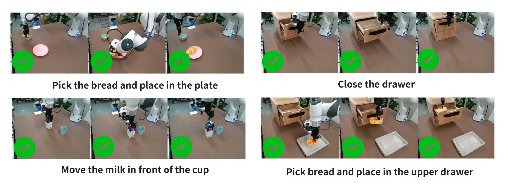

# GC-IDM 与真实机器人执行

GC-IDM Turing Test 将生成视频从观察结果转为真实动作。世界模型先根据初始图像和语言指令生成操作视频，Gripper-Centric Inverse Dynamics Model（GC-IDM）再从视频预测动作序列，真实机器人执行这些动作并记录任务结果：

\[
(I_0,p)
\xrightarrow{g}
\hat V
\xrightarrow{\mathrm{GC\text{-}IDM}}
\hat a_{1:T}
\xrightarrow{\mathrm{real\ robot}}
\mathrm{task\ outcome}.
\]

这条链路测量视频是否包含特定 GC-IDM 能够解释的运动与状态变化。它比视觉或语义指标更接近真实控制，同时也引入 IDM、机器人本体、控制器和任务环境的误差。

## 九项真实操作

Execution 集合包含 9 项由易到难的操作：

| 难度 | 任务 |
| --- | --- |
| Easy | 拾取面包并放到盘子上 |
| Easy | 关闭抽屉 |
| Easy | 将牛奶移动到杯子前方 |
| Medium | 拾取面包并放入上层抽屉 |
| Medium | 从杯架取下杯子 |
| Medium | 打开抽屉 |
| Hard | 将按钮拨到正确位置 |
| Hard | 将杯子挂到杯架上 |
| Hard | 将筷子插入竹筒 |

简单任务主要包含单次移动或单个关节操作，中等任务增加容器、狭窄目标或更长动作过程，困难任务要求精确姿态、接触和末端对齐。任务成功判据、控制频率、机器人型号、失败重试规则和逐任务生成次数目前均未公开，成功率的适用范围限于已报告的实验设置。

## 真实视频回放验证

GC-IDM 自身可能产生动作误差。若未经验证便直接处理生成视频，真实执行失败无法区分是视频不具可执行性，还是 IDM 不能从正常视频恢复动作。论文先将真实执行视频输入 GC-IDM，再把推断动作回放到真实机器人，以 Replay Execution Accuracy 检查逆动力学链路。

论文说明 9 项任务各有 10 段 GT 执行视频，但公开表格只展示其中 4 项任务：

| 模型 | 面包到盘子 | 关闭抽屉 | 移动牛奶 | 面包入抽屉 | 展示项合计 |
| --- | ---: | ---: | ---: | ---: | ---: |
| ResNet-MLPs | 6/10 | 7/10 | 5/10 | 4/10 | 22/40 |
| AVDC | 3/10 | 4/10 | 4/10 | 2/10 | 13/40 |
| GC-IDM | 10/10 | 9/10 | 9/10 | 8/10 | 36/40 |

GC-IDM 在展示的四项任务上达到 \(36/40=90\%\)，高于两个对照模型。论文正文同时把 90% 写为 overall replay accuracy，但未给出其余五项任务的回放表。现有证据能够确认展示项的 90%，不能独立确认全部 9 项任务合计仍为 90%。

<figure>
  
  <figcaption>真实视频回放先验证 GC-IDM 能否从正常观察恢复可执行动作，再将其用于生成视频测试。</figcaption>
</figure>

## 生成视频的真实执行结果

| 模型 | 真实任务成功率 |
| --- | ---: |
| Kling | 9.88% |
| Hailuo | 2.47% |
| CogVideoX | 0.00% |
| Cosmos-Predict1 | 0.00% |
| Wan2.1 | 0.00% |
| Cosmos-Predict2 | 8.64% |
| WoW-wan | 40.74% |
| WoW-cosmos2 | 18.52% |

通用开源视频模型 CogVideoX、Cosmos-Predict1 和 Wan2.1 在该设置中没有成功执行。商业模型即使具有较强视觉质量，Kling 和 Hailuo 也只达到 9.88% 和 2.47%。使用机器人操作数据的 WoW-wan 和 WoW-cosmos2 明显更高，其中 WoW-wan 达到 40.74%。

这组差异说明感知真实感不足以保证动作可恢复。GC-IDM 需要从视频中识别与真实机器人训练分布兼容的夹爪运动、对象关系和状态变化；人类手臂幻觉、夹爪身份漂移、对象穿透或错误相机运动都会破坏动作推断。

## 成功率中的误差来源

真实结果由多个环节共同决定：

| 环节 | 可能导致的失败 |
| --- | --- |
| 世界模型 | 目标对象错误、轨迹不连续、动作缺失、物理异常 |
| 视频到 GC-IDM 的输入处理 | 帧率、裁剪、相机视角或外观与训练分布不一致 |
| GC-IDM | 从生成观察恢复的动作存在位置、姿态或时间误差 |
| 控制器与机器人 | 动作跟踪误差、夹爪接触和安全约束 |
| 任务环境 | 初始状态变化、摩擦、对象形变或容差不同 |

真实视频回放表明 GC-IDM 能够从正常视频恢复大部分展示任务的动作，但没有消除生成视频域偏移。40.74% 表示 WoW-wan 在论文规定的机器人、GC-IDM 和任务集合中的相对优势，不是任意机器人平台上的部署成功率。

## 与其他分数的关系

Human Turing Test 判断视频是否看起来真实，GC-IDM Turing Test 判断视频是否能经特定逆动力学模型转为成功动作。前者的观察主体是人，后者的最终参照是真实任务结果。Hailuo 的 Overall Score 最高且能够较好混淆人类，但真实执行率只有 2.47%；该差异直接表明感知真实、指标高分和动作可执行属于不同层级。

论文只报告聚合成功率，未给出逐任务、逐试次的视频、动作或失败日志。当前结果可以证明参评模型距离稳定真实执行仍有明显差距，不能定位每次失败发生在世界模型、GC-IDM 还是控制器。

## 导航

- 返回上级：[WoW-World-Eval](../07-wow-world-eval.md)
- 上一节：[人工评测与 Human Turing Test](08-human-evaluation-and-turing-test.md)
- 下一节：[模型结果、失败模式与结论范围](10-results-failure-modes-and-limits.md)
