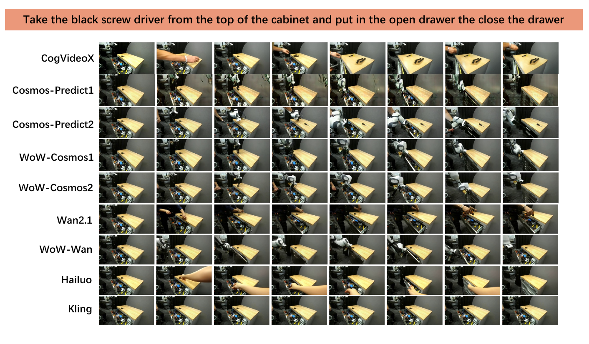
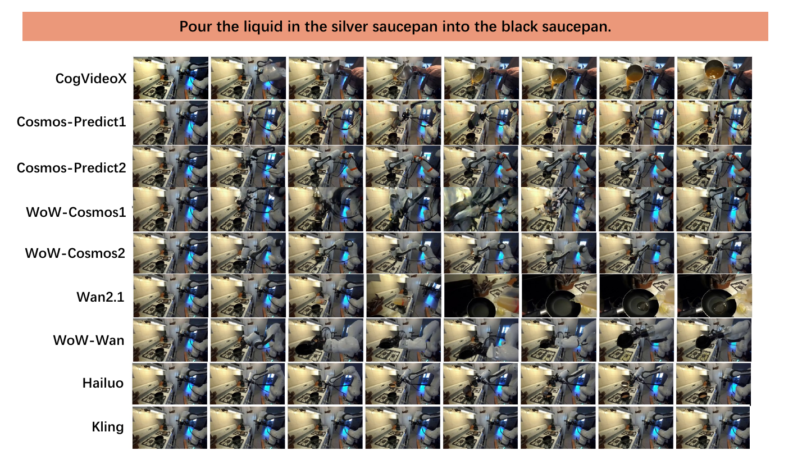
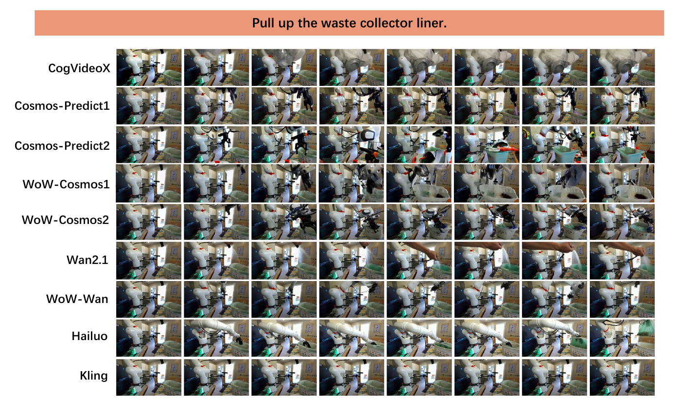
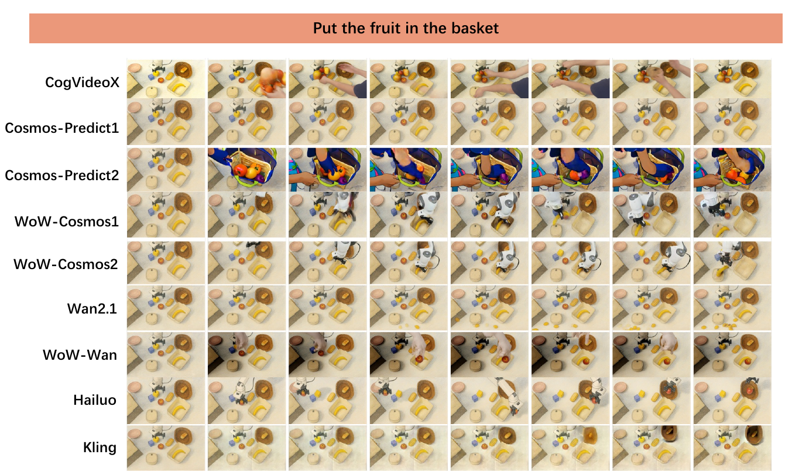

# 模型结果、失败模式与结论范围

主实验分别报告 Video Quality（VQ）、Instruction Understanding（IU）、Planning Reasoning（PR）和 Physical Law（PL），再对四组分取平均得到 Overall Score。结果显示，同一模型在视觉、语义、规划和物理方面的排序并不一致；总体分数较高表示四组信号较为平衡，不代表每项能力均已达到可执行水平。

## 主结果

| 模型 | VQ | IU | PR | PL | Overall |
| --- | ---: | ---: | ---: | ---: | ---: |
| Kling | 53.24 | 27.97 | 2.50 | 68.02 | 37.93 |
| Hailuo | 56.09 | 70.11 | 17.27 | 66.72 | 52.55 |
| CogVideoX | 38.52 | 54.09 | 4.55 | 63.30 | 40.12 |
| Cosmos-Predict1 | 39.06 | 61.46 | 8.10 | 59.05 | 41.93 |
| Wan2.1 | 40.23 | 56.85 | 7.95 | 59.66 | 41.18 |
| Cosmos-Predict2 | 46.81 | 56.80 | 13.41 | 60.56 | 44.40 |
| WoW-cosmos1 | 49.35 | 69.68 | 5.45 | 62.28 | 46.70 |
| WoW-wan | 55.38 | 62.16 | 9.32 | 63.75 | 47.66 |
| WoW-cosmos2 | 54.12 | 70.36 | 12.27 | 66.18 | 50.74 |

Hailuo 以 52.55 获得最高 Overall，WoW-cosmos2 以 50.74 位居开源模型首位。Kling 的 PL 为全表最高 68.02，VQ 也达到 53.24，但 IU 只有 27.97、PR 只有 2.50，最终 Overall 为 37.93。单个物理组分无法概括任务语义与长程规划。

## 视觉质量

Hailuo 的 VQ 为 56.09，是商业模型中最高值；WoW-wan 以 55.38 接近这一结果。分项中，WoW-cosmos2 的映射后 FVD 为 85.71、DreamSim 为 64.42，分别是相应列的最高值。Hailuo 在 PSNR 和 SSIM 上更强，表示其低层像素与结构保真更均衡。

这些分项来自不同层级。WoW-cosmos2 的 FVD 与 DreamSim 优势支持其视频分布和感知表征较接近真实数据，不能直接证明每条操作轨迹都正确。Hailuo 的组内平衡也没有转化为较高真实执行率。

## 指令理解

WoW-cosmos2 的 IU 为 70.36，略高于 Hailuo 的 70.11。Hailuo 的 Caption Score 为 88.78、Execution Quality 为 70.48；WoW-cosmos1 的 Sequence Match 为 63.33，是该分项最高值。模型可以分别在状态描述、动作顺序和执行程度上形成不同优势。

IU 较高的 WoW-cosmos2 同时取得较高 Overall 和一定真实执行成功率，但这种关系不是确定映射。Hailuo 的 IU 接近相同水平，真实成功率却只有 2.47%，说明视频中呈现正确动作—对象关系仍不足以保证 GC-IDM 能恢复控制动作。

## 物理规律

Kling、Hailuo 和 WoW-cosmos2 的 PL 分别为 68.02、66.72 和 66.18。WoW-cosmos2 在 Robot Trajectory L2Norm、DTW 和 FD 的映射分数上领先，并在 Camera ATE/RPE 上达到 98.64/99.87。Hailuo 在对象轨迹的三个分项上最高。

Scene Consistency 和相机分数在多数模型间处于高位，区分度小于 Robot/Object Consistency。固定视角和大面积背景会使这类信号容易接近上限。Wan2.1 的 Physical Score 为 74.98，是物理判别器分项最高值，但其 PL 只有 59.66；区域、轨迹和相机信号保留了判别器单项没有覆盖的错误。

## 长程规划

所有模型的 PR 均明显低于其他组。Hailuo 的 17.27 是最高值，Cosmos-Predict2 以 13.41 领先开源基础模型，WoW-cosmos2 为 12.27。CogVideoX 和 Kling 分别只有 4.55 和 2.50。

低而集中的分数说明当前视频模型很少同时生成完整原子动作和满足前置关系的序列。该结论只覆盖 25 条长程样本，并且分数经过视频动作解析和 MLLM 轻量模拟；规划是当前协议下的主要短板，但分数不支持对模型内部规划机制做直接判断。

## 密集提示词

密集提示词补充环境、对象、子目标和物理约束。论文只报告部分模型的密集提示词结果：

| 模型 | VQ | IU | PL | PR | Overall |
| --- | ---: | ---: | ---: | ---: | ---: |
| Cosmos-Predict1 | 35.48 | 61.07 | 53.78 | 7.50 | 39.46 |
| Cosmos-Predict2 | 49.75 | 75.96 | 64.66 | 13.86 | 51.06 |
| WoW-cosmos1 | 59.41 | 72.54 | 69.71 | 11.14 | 53.20 |
| WoW-wan | 60.55 | 50.83 | 67.48 | 8.64 | 46.88 |
| WoW-cosmos2 | 56.86 | 76.16 | 67.15 | 9.09 | 52.32 |

Cosmos-Predict2 的 Overall 从简短提示词下的 44.40 提升到 51.06，WoW-cosmos1 的 PL 从 62.28 提升到 69.71。WoW-wan 的 VQ 达到 60.55。多数模型在 VQ、IU 和 PL 上获得改善，PR 的变化较小且并非全部上升；WoW-cosmos2 的 PR 反而从 12.27 降至 9.09。

密集提示词实验说明显式场景和物理信息能够改变生成结果，但没有形成稳定的规划提升。结果也不能只解释为模型能力变化，因为 InternVL3-78B 的扩写内容本身成为新的输入变量，逐条扩写文本目前尚未公开。

## 定性失败模式

论文的代表性案例包含一条多步机器人操作。CogVideoX、Cosmos-Predict1 和 Wan2.1 出现视觉伪影或非预期相机运动，部分模型生成了人类手臂，反映通用视频数据中的动作先验。Cosmos-Predict2 和 WoW-wan 出现对象复制或抽屉在没有施力时移动。Kling 的画面稳定但基本静止，没有执行任务。Cosmos-Predict1、WoW-cosmos1 和 WoW-cosmos2 在该案例中完成了更多正确步骤。

<figure>
  
  <figcaption>同一案例中的画面、语义、物理和规划错误并不总是同时出现。</figcaption>
</figure>

更多案例分别覆盖感知、预测和泛化条件。感知案例检查对象属性与空间关系是否在生成中保持；预测案例暴露遮挡、接触和状态变化错误；泛化案例检查非常规视觉外观下的指令执行。

<figure>
  
  <figcaption>Perception 案例显示对象识别和属性保持错误会进入后续动作过程。</figcaption>
</figure>

<figure>
  
  <figcaption>Prediction 案例集中呈现轨迹、接触和对象持续性差异。</figcaption>
</figure>

<figure>
  
  <figcaption>Generalization 案例改变初始视觉分布，并保留语言指令作为任务条件。</figcaption>
</figure>

定性图能够定位典型现象，但只展示选定样本。模型整体能力仍应依据完整样本上的分项统计；单个成功或失败案例不能替代聚合结果。

## 证据范围

WoW-World-Eval 的结果受以下条件限制：

- 609 条样本以 Prediction 和 Perception 为主，五项能力的样本量不均衡；Planning 只有 25 条长程样本。
- 商业模型、开源通用模型和具身模型的参数量、分辨率、训练域与服务实现不同，主表不是单因素消融。
- GPT-4o、DINOv2/DINOv3、GroundedSAM2、SAM2、Qwen-2.5-VL 物理判别器、相机估计器和 MLLM rollout 都会引入代理误差。
- 指标映射参数由人工评分监督选择，完整开发集、锚点和交叉验证设置目前尚未公开。
- Human Turing Test、四维人工评分和自动分数都来自固定模型集合，相关性不能直接外推到新模型。
- GC-IDM 真实执行只覆盖特定机器人、9 项任务和内部控制链，聚合成功率缺少逐试次日志。
- 数据、评测脚本、辅助模型权重、提示词和 GC-IDM 工件目前均未公开。

这些限制不否定模型间的相对结果，但缩小了数值能够支持的结论。在数据、脚本、提示词和辅助模型工件尚未公开的情况下，独立复算及兼容 leaderboard 扩展无法完成。

## 导航

- 返回上级：[WoW-World-Eval](../07-wow-world-eval.md)
- 上一节：[GC-IDM 与真实机器人执行](09-gc-idm-and-real-robot-execution.md)
