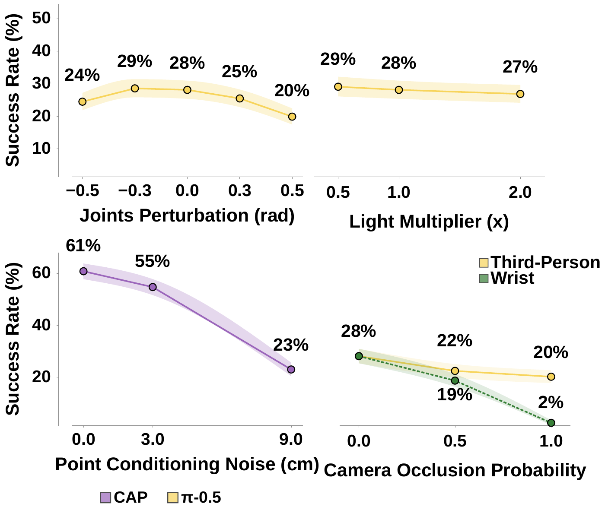

# 策略比较与受控变化

零样本设置将已发布策略直接放入 benchmark episode，不使用该 benchmark 数据进行任务特定微调。零样本对照覆盖 `π_0`、`π_0-FAST`、`π_0.5`、CAP、RING 和 DualVLN 等策略；结果不合并为跨任务、跨 embodiment 的单一排名。操作策略、导航策略和 contact-action 模型的观测、夹爪、控制与训练目标并不一致，这些差异使成功率的比较单位限定在具体任务与配置。

## 比较成立的条件

公开 episode 在标准 DROID 配置下经过可解性筛选。操作对照使用 Franka FR3 作为统一机械臂，并允许因不同夹爪几何产生固定的机器人基座偏移。该偏移必须跨 episode 恒定，不能利用某条任务或目标物体的特权信息。这个约束允许适配不同末端执行器，同时阻止为单个 episode 调整初始位置来提高分数。

统一机械臂不能完全抵消策略间的差异。DROID 配置为 `π` 策略提供两个相机视角；CAP 的浮动设置使用单腕部相机和不同的运动学约束，并在初始步骤依赖外部 3D 接触点。RING 与 DualVLN 的导航指令分布也不同。某项策略在某一任务上的高分因此说明它在该接口与评测条件下的表现，不能单独归因于模型规模或世界模型能力。

## 终止口径改变成功率含义

固定 horizon 在最后一步读取环境成功状态。操作策略可能在中途成功后继续抓取、移动或松开，最终破坏已经满足的状态；因此固定 horizon 衡量结束时是否仍成功。oracle termination 在第一次满足 success predicate 时结束，衡量 rollout 是否曾到达成功状态。两者的差值反映任务完成信号缺失、重复动作或重试机制的影响，因此两种终止口径对应不同的 rollout 结果含义。

`π` 策略的 task horizon 为 300 steps，CAP 为 50 steps。两种成功率对应不同的 rollout 预算，直接比较时无法排除预算差异。`π_0.5` 在成功 `pick` episode 中平均出现 2.65 次 grasp-ungrasp transition，表明成功前后的额外动作会影响末尾判定。success rate 的含义取决于终止规则、horizon、是否允许重试和 episode 计数。

## 用受控变化定位分布敏感性

大规模资产允许在不改变任务语义的情况下单独改变条件。`pick` 受控实验分别改变提示中动词短语的训练频率、初始关节姿态、光照强度和相机遮挡。它们分别作用于语言条件、机器人本体起点、视觉外观和视觉可观测性，不能归为单一噪声变量。

<figure>
  
  <figcaption>受控变化将总体成功率分解到具体条件。`π_0.5` 的 `pick` 实验中，遮挡腕部相机会将成功率降至 2%，遮挡第三人称相机则降至 20%；光照变化的影响较小。结果对应所测 `pick` 设置，不外推为所有策略的传感器结论。</figcaption>
</figure>

较常见的 DROID 动词短语使 `π_0` 与 `π_0.5` 的成功率差距缩小到 1 个百分点；在其他措辞下，差距为 14 个百分点。初始关节位置偏离 DROID 默认位姿也会降低 `π_0.5` 成功率。这些现象说明训练分布与语言、姿态条件的匹配会改变策略表现，却不能只凭代理数据集频率确定任何封闭模型的实际训练数据组成。

## 导航

- 返回上级：[MolmoSpaces-Bench](../08-molmospaces-bench.md)
- 上一节：[Episode 契约与评测流水线](03-episode-contract-and-evaluation-pipeline.md)
- 下一节：[结果、sim-to-real 与版本演进](05-results-sim-to-real-and-versioning.md)
