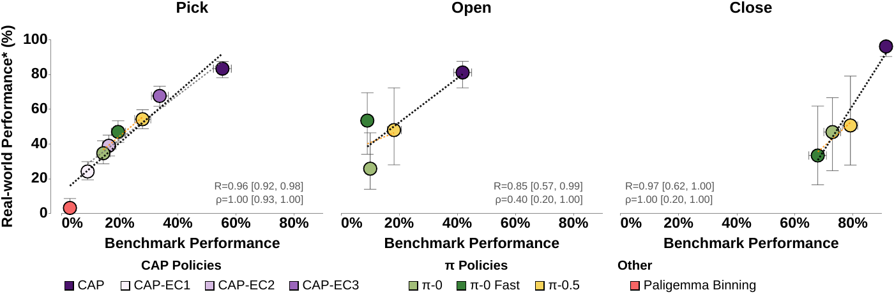

# 结果、sim-to-real 与版本演进

MolmoSpaces-Bench 的零样本评测不使用 benchmark 数据进行任务特定微调。操作实验覆盖 DROID joint-position 版本的 `π_0`、`π_0-FAST`、`π_0.5` 与 CAP；导航实验比较 RING 和 DualVLN。较新的 `π` 策略在所测操作任务上通常优于较早版本，但策略的相机、夹爪、接触点和控制配置不同，图中的柱状值不构成跨任务或跨接口的通用总排名。

`navigate-to` 实验包含 2,000 条轨迹、679 所房屋和 568 个 WordNet synset 类别。RING 的语义对象目标训练形式与该任务较贴近，DualVLN 面向含中间步骤的指令，两者的差距同时包含任务格式匹配的影响。基准能够记录这种输入分布匹配，但不能将它与纯粹的导航规划能力完全分离。

## 模拟成绩与真实执行的对应

sim-to-real 对照覆盖 `pick`、`open` 和 `close`，分别比较模拟成功率与真实评测结果。`pick` 使用 752 个 RoboArena pick 任务作真实参照，模拟与真实成功率的 Pearson 相关系数为 \(R=0.96\)，Spearman 秩相关系数为 \(\rho=0.98\)。`open` 与 `close` 也呈正相关，但可用真实 episode 较少，误差条更大。

<figure>
  
  <figcaption>三个任务的模拟成功率分别与真实成功率对照。`pick` 的点集支持较强的线性和排序对应；`open`、`close` 的真实测量更少，相关性估计的不确定性更高。</figcaption>
</figure>

相关系数衡量所测 policy 在相应任务上的排序和线性对应，不能证明模拟器对未测机器人、物体、控制器或长时程组合任务同样可靠。真实参照采用 RoboArena 与 CAP 的相关评测口径，其成功定义和 episode 分布与 `MolmoSpaces-Bench` 的 JSON episode 并非逐项对应。模拟成功率适合用作这些设置内的预测信号，而非真实部署成功率的替代数字。

## 基准版本与评测条件

MolmoSpaces-Bench 的发布资源分为 `molmospaces_bench_v1` / MS-Bench v1 和 `molmospaces_bench_v2` / MS-Bench v2。v1 是原子任务的基础 benchmark，v2 扩展了原子任务资源。benchmark 资源的 v2 后缀与 `arXiv:2602.11337v2` 的文档版本相互独立，相同版本数字不表示两者采用相同 episode 或产生同一组结果。

`MS-` 前缀标识 MolmoSpaces 原子任务结果集合，公开运行路径包括 Close、Open、Pick 与 Pick-and-Place。`MB-` 前缀标识后续的困难任务集合，路径位于 `molmospaces-bench-v2`，覆盖 `pick`、`pick-and-place`、颜色和相邻关系任务，以及 Classic、Filament 和随机相机设置。两组 benchmark 复用 JSON episode、policy config 和 runner，但 episode 集合、渲染器或相机条件不同，分数不能直接并列。

## 适用范围

MolmoSpaces-Bench 直接测量策略在固定模拟 episode 中达成状态谓词的能力。它对环境、对象、语言、初始姿态和传感器变化具有较强的诊断价值；在已测 `pick`、`open` 和 `close` 任务中，模拟成功率还能为真实执行中的策略排序提供证据。它不评测视频世界模型的画面质量、开放世界中的全部物理现象或任意真实机器人的长期可靠性，也不能证明不同 simulator 的评测结果等价。任务定义、embodiment、评测版本、终止规则和真实参照来源共同决定跨 benchmark 比较是否成立。

## 导航

- 返回上级：[MolmoSpaces-Bench](../08-molmospaces-bench.md)
- 上一节：[策略比较与受控变化](04-policy-comparison-and-controlled-variation.md)
