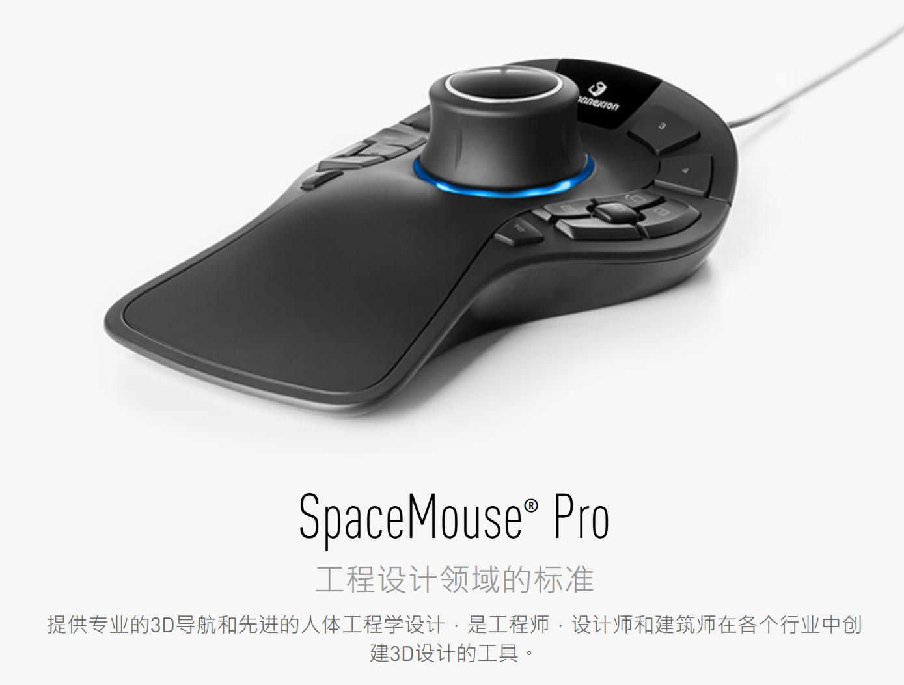

# SpaceMouse 单臂机器人遥操作示教采集系统搭建章节

## 系统控制核心原理

以 3Dconnexion SpaceMouse 六自由度旋钮作为遥操作输入源，整套控制链路围绕四个核心环节展开。首先，系统读取 SpaceMouse 实时输入信号，输出六轴速度信号，经缩放换算得到机械臂末端笛卡尔位姿增量 `delta pose`。随后进入笛卡尔运动解算与机器人通信控制阶段，将末端位姿增量送入笛卡尔控制器，求解各关节目标位置并下发机械臂执行。与此同时，SpaceMouse 的实体按键被绑定用于夹爪开合控制，实现抓取动作的实时触发。在整个遥操作过程中，系统同步录制三类核心数据用于模仿学习——视觉观测 Observation、机器人本体状态 State 以及遥操作动作 Action，并自动归档为结构化数据集。



## 论文中完整硬件清单
| 硬件分类       | 设备规格/型号                       | 功能说明                                                     |
| -------------- | ----------------------------------- | ------------------------------------------------------------ |
| 机械臂本体     | Franka Emika Panda 7DoF 协作机械臂  | 执行遥操作运动，支持笛卡尔阻抗控制，配套 panda-py 驱动库     |
| 末端执行器     | Panda 原厂平行气动/电动夹爪         | 由 SpaceMouse 侧边按键控制开闭，完成物体抓取交互             |
| 遥操作输入设备 | 3Dconnexion SpaceMouse Compact      | 6DoF 速度型输入旋钮，输出平移+旋转六轴速度，生成末端 delta pose |
| 视觉观测相机   | USB 全局快门工业相机/高清摄像头     | 采集场景 RGB 图像，作为模仿学习视觉观测输入                  |
| 上位控制电脑   | 台式/笔记本（i7/Ryzen7，≥16G 内存） | 1. 读取 SpaceMouse 实时输入信号<br>2. 笛卡尔运动解算、机器人通信控制<br>3. 同步录制图像、机器人状态、动作序列<br>4. 本地存储、格式化示教数据集 |
| 辅助配件       | 桌面固定支架、电源、USB 拓展坞      | 固定机械臂与相机，拓展外设 USB 接口                          |

## 驱动安装教程
这里给出linux系统下的SpaceMouse驱动安装教程。

1.安装spacenavd
安装必要的依赖库

```bash
sudo apt install libxext-dev libxrender-dev libxmu-dev libxmuu-dev
sudo apt-get install libxtst*
sudo apt-get install libx11*
sudo apt-get install libxi-dev
```

下载源码并安装

```bash
git clone https://github.com/FreeSpacenav/spacenavd.git
cd spacenavd
./configure
make
sudo make install
```

将驱动设置为开机自启动

```bash
sudo ./setup_init
sudo /etc/init.d/spacenavd start
```

2.安装libspnav

```bash
git clone https://github.com/FreeSpacenav/libspnav.git
cd libspnav
./configure
make
sudo make install
```

3.验证驱动安装
将spacemouse通过附带的USB线连接到电脑USB。libspnav程序包中给了几个测试用例，执行以下命令进行测试

```bash
cd libspnav/examples/simple
make
./simple_af_unix
```

此时移动spacemouse的摇杆，应该能看到以下输出：

```bash
spacenav AF_UNIX protocol version: 1
Device: 3Dconnexion SpaceMouse Wireless
Path: /dev/input/event6
Buttons: 2
Axes: 6

got motion event: t(0, 0, 0) r(-15, 0, 0)
got motion event: t(0, -5, 0) r(-32, 0, 0)
got motion event: t(-2, -21, 0) r(-58, 0, 0)
got motion event: t(-6, -17, 0) r(-60, 0, 0)
got motion event: t(-3, 0, 0) r(-60, 0, 0)
got motion event: t(0, 0, 0) r(-8, 0, 0)
got motion event: t(0, 0, 0) r(-16, 0, 0)
got motion event: t(0, 0, 0) r(0, 0, 0)
got motion event: t(0, 0, 9) r(-19, 0, 0)
got motion event: t(-45, 0, 56) r(-78, 0, -38)
got motion event: t(-92, 0, 78) r(-99, 0, -78)
got motion event: t(-122, 0, 80) r(-105, 0, -104)
got motion event: t(-123, 0, 75) r(-103, 0, -105)
got motion event: t(-128, 0, 86) r(-123, -10, -115)
got motion event: t(-143, 0, 105) r(-142, -31, -131)
```

表明驱动安装完成。

4.在python/robosuite中使用spacemouse

读取spacemouse设备id
连接设备后，在终端输入lsusb查看哪一行后面有spacemouse字样的就是连接的设备；没有的话，连接设备前后分别运行lsusb看多了哪一个设备信息。示例信息如下：

```bash
Bus 001 Device 010: ID 256f:c62e
```

其中冒号前面的256f为Vendor_id，后面的c62e为Product_id，后面会用到。

配置hid
python的hid库(pip install hidapi)可以用来读取usb设备信号，但设备的默认权限仅允许root用户访问，一种方法是执行python程序时前面加sudo，但sudo python默认执行的是ubuntu原装的py2。如果想用任意的python的hid库读取信号，需要提高spacemouse设备的权限，步骤如下：

```bash
cd /etc/udev/rules.d
sudo touch 99-spacemouse.rules
sudo gedit 99-spacemouse.rules
```

在新建的99-spacemouse.rules中添加以下内容

```bash
SUBSYSTEM=="usb", ATTRS{idVendor}=="256f",  ATTR{idProduct}=="c62e", MODE="0666"
```

将其中的256f和c62e替换为自己使用的spacemouse的Vendor_id和Product_id。

下载robosuite

```bash
git clone https://github.com/ARISE-Initiative/robosuite.git
```

修改robosuite/demos/demo_device_control.py中的下面两行，主要是修改设备为spacemouse,以及修改vendor_id和product_id。

```python
parser.add_argument("--device", type=str, default="spacemouse", choices=['spacemouse', 'keyboard'])
device = SpaceMouse(vendor_id=0x256f,product_id=0xc62e, pos_sensitivity=args.pos_sensitivity, rot_sensitivity=args.rot_sensitivity)
```

之后运行demo_device_control.py即可使用spacemouse控制仿真环境中的机械臂。

## 示教数据录制完整流程

示教数据的录制从系统前置校准与初始化开始。机械臂上电启动后，首先加载笛卡尔阻抗控制器，配置安全速度与碰撞自保护阈值，为后续操作提供安全保障。上位机识别 SpaceMouse 设备后执行零点校准：松开旋钮静置，记录静止基准速度以消除硬件漂移。完成零点校准后，配置速度缩放系数，使桌面旋钮操作空间与机械臂实际工作空间相互匹配。最后，相机开启图像预缓存，并统一机器人、相机与输入设备三者的时钟戳，确保观测与动作的时序对齐。

进入实时遥操作控制阶段后，系统高频读取 SpaceMouse 六轴原始速度输出，乘以缩放系数换算为末端位姿增量 `delta pose`，将其送入笛卡尔控制器以求解各关节目标位置，随后下发机械臂执行。在此过程中，系统实时监听设备按键信号——按下按键触发夹爪闭合，松开按键则夹爪打开。全流程持续缓存三类数据：相机实时 RGB 图像帧作为 Observation；机械臂各关节角度、关节力矩及末端六自由度位姿作为 State；SpaceMouse 六轴输入速度与夹爪开闭布尔指令作为 Action。

对于单条轨迹的录制，操作员首先将 SpaceMouse 侧键绑定为录制开关——短按启动录制，再次短按停止录制。操作员操控旋钮完成机器人操作（静态堆叠、插取任务适配最优，动态连续任务表现较差）。单次任务结束后，系统自动打包当前轨迹，按时间戳独立文件夹存储。单任务最多支持五次重复尝试录制，并可手动标注成功或失败的轨迹标签。录制完成后，机械臂释放阻抗控制，等待下一轮示教采集。

在数据标准化处理阶段，系统首先基于统一时间戳对齐图像、机器人状态与遥操作动作序列，随后自动过滤超限速及触发自碰撞保护的无效轨迹片段，最终输出通用数据集格式，兼容 ALOHA、Roboturk 等主流机器人模仿学习框架。

## SpaceMouse 方案优缺点

从核心优势来看，SpaceMouse 方案在多个维度上适合作为新手入门首选。硬件成本方面，SpaceMouse Compact 单价远低于整套 VR 头显与手柄设备，且无需配套显示设备，大幅降低了真机机器人示教平台的入门预算。安装部署极为简便，仅需单根 USB 直连上位机，无需空间定位、VR 手部漂移校准或基准位重设等复杂流程，开机零点校准仅需约十秒，桌面即插即用。在桌面单臂场景中，设备体积小巧，适配实验室桌面小型单臂操作，在堆叠、插取、定点搬运等静态离散任务中表现良好。论文实验证明静态任务下成功率与 VR 无显著差距，且长期操作对操作员负荷更低（相比于 VR，NASA-TLX 不会使操作员产生眩晕）。控制代码方面，速度型输入逻辑简单，无需手部位姿跟踪、旋转对数映射等复杂矩阵运算，新手可快速修改缩放参数并自定义控制逻辑。此外，仅需轻推旋钮即可输出运动指令，无需全程悬空握持手柄，长时间批量录制时手部不易疲劳。

然而，论文实验也量化揭示了该方案的若干固有短板。最为突出的是输入与机器人运动之间缺乏同构性，由此带来极高的认知负荷——SpaceMouse 输出速度指令，而 VR 手柄为直观的位姿增量映射，旋钮的推拉旋转与机械臂末端运动之间不存在天然的一一对应关系，旋转操作预判难度大，SUS 可用性得分仅为 40.5，远低于 VR 方案的 79.1。其次，系统无原生力反馈通道，操作者仅依靠纯视觉反馈判断接触状态，无法感知机械臂与物体之间的接触力矩，精细夹持与贴合类操作容错率较低，极易触发机器人自碰撞保护。在动态操作能力方面，设备内置的平滑滤波机制使其无法输出瞬时脉冲式加速度动作。论文动态翻转任务中 SpaceMouse 成功率为零，抽纸任务成功率显著低于 VR，因此该方案仅适配离散、分段静态操作。此外，单台设备仅能控制单臂，双臂系统需要两套外设；从数据质量角度衡量，动态任务下轨迹平滑度与动作精准度不足，使用此类数据训练模仿学习算法的效果显著弱于 VR 位姿控制采集的样本。

## 适用场景定位：新手第一版真机采集系统

综合上述分析，SpaceMouse 方案在特定场景下具有明确的适用价值。推荐使用的人群与场景包括：机器人模仿学习入门学生与零基础开发者，预算有限且仅需搭建单臂桌面静态任务示教原型，研究方向仅覆盖堆叠、插取、定点搬运等准静态离散操作，以及需要快速搭建采集原型、验证数据录制流程而暂不涉及高速动态交互任务的团队。但是以下场景不推荐采用该方案：核心研究目标为翻炒、抛掷、滑动抽拉等依赖动量的动态操作任务；需要大批量高质量动态示教数据集用于模仿学习模型训练；涉及双臂协同灵巧操作或高精度力控接触交互研究；追求低学习成本与直观自然的人机遥操作交互体验。在这些场景下，建议将采集系统升级至 VR 遥操作或主从同构方案。

## SpaceMouse 与 VR 遥操作方案选型对比
| 对比维度             | SpaceMouse 旋钮方案          | VR 手柄遥操作方案                    |
| -------------------- | ---------------------------- | ------------------------------------ |
| 输入底层逻辑         | 六轴速度指令输出             | 手部6DoF位姿增量映射                 |
| 静态任务综合表现     | 良好，成功率与VR无统计学差异 | 优秀                                 |
| 动态动量任务表现     | 极差，无法实现瞬时脉冲动作   | 显著领先，动量动作还原度高           |
| 上手学习成本         | 高，旋转映射逻辑难以理解     | 极低，人手空间映射直观               |
| 硬件采购成本         | 低，仅单台旋钮外设           | 高，头显+手柄整套设备                |
| 部署调试复杂度       | 极简，单USB即插即用          | 复杂，需定位、漂移校准、手部基准重置 |
| 长期操作体力消耗     | 低，无需悬空握持             | 略高，全程手持手柄                   |
| 动态任务数据集质量   | 较差，轨迹平滑度不足         | 更高，适配模仿学习训练               |
| SUS 系统可用性平均分 | 40.5                         | 79.1                                 |
| 项目定位             | 新手入门静态采集原型         | 专业全场景示教采集平台               |

参考文献：Zhou Y, Hou M, Baraka K. Static is not enough: A comparative study of vr and spacemouse in static and dynamic teleoperation tasks[C]//Companion Proceedings of the 21st ACM/IEEE International Conference on Human-Robot Interaction. 2026: 307-311.
